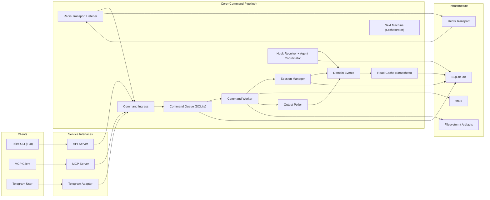

# TeleClaude: Your Advanced Distributed Agent Platform

[](https://www.python.org/downloads/)
[](LICENSE)
[](tests/)
[](coverage/html/index.html)
[](https://github.com/psf/black)
[](http://mypy-lang.org/)

TeleClaude is a sophisticated agent platform designed for seamless remote terminal control, powerful automation, and advanced AI-to-AI collaboration across multiple computers and communication channels. Manage your infrastructure, orchestrate complex tasks, and integrate with essential services like Discord and WhatsApp, all from a unified interface. This README provides an overview of TeleClaude's architecture, features, and capabilities, aiming to impress users with its depth and potential.

## Key Features

TeleClaude is a full-featured agent platform designed for maximum flexibility and power:

- **Unified Interfaces:**
  - **Telec TUI:** A powerful, state-driven command-line interface providing a rich, interactive experience for managing sessions, preparing work, and monitoring agents. Features deterministic pane layouts and visual cues for session activity.
  - **Telegram:** Your primary console for session control and real-time output.
  - **Discord:** Seamless integration for bot commands and notifications.
  - **WhatsApp:** Upcoming support for business-critical communications and automation.
- **Remote Terminal Control:**
  - Manage multiple persistent terminal sessions across diverse machines.
  - Real-time output streaming and command execution from anywhere.
  - Intelligent session management and recovery.
- **Advanced Agent Platform:**
  - **Automated Jobs:** Schedule and manage recurring tasks, data synchronization, and maintenance routines.
  - **Multi-User Configurations:** Support for diverse user roles and access controls. (Details pending retrieval of specific documentation).
  - **Subscription Management:** Easily configure and manage subscriptions to various services and data feeds. (Details pending retrieval of specific documentation).
  - **AI-to-AI Collaboration (MCP):** Facilitate direct communication and task delegation between AI agents across different computers, enabling distributed task execution, cross-computer coordination, and autonomous workflows.
  - **Extensible Event Handling:** Integrate external event triggers and custom workflows for dynamic automation. (Note: Specific details on the 'hook service' functionality are being refined, but it enables robust event-driven automation. Details pending retrieval of specific documentation).
- **Developer-Focused:**
  - Powerful CLI tools for managing agents, configurations, and deployments.
  - Adherence to rigorous code quality, testing, and security standards.

## System Architecture

TeleClaude employs a distributed, adapter-based architecture focused on decoupling components and ensuring resilience. At its core, a command pipeline processes inputs from various service interfaces and routes them to execution environments.



### Core Components:

- **Clients:** Telec TUI, MCP Client, Telegram User.
- **Service Interfaces:** API Server, MCP Server, Telegram Adapter.
- **Core Pipeline:** Command Ingress, Command Queue (SQLite), Command Worker, Session Manager, Output Poller, Hook Receiver, Domain Events, Read Cache, Redis Transport Listener, Next Machine (Orchestrator).
- **Infrastructure:** SQLite Database, Redis Transport, tmux, Filesystem.

This architecture ensures that user commands are processed reliably, sessions are managed efficiently, and AI agents can collaborate effectively through the MCP server. The decoupling of adapters and the use of a durable command queue provide resilience and extensibility.

## Getting Started

### Prerequisites

- Python 3.11 or higher
- tmux 3.0 or higher
- `uv` (Python package manager; must be on `PATH`)
- Telegram, Discord, and WhatsApp accounts (for respective integrations)
- Relevant API tokens/credentials for configured services.

### Installation

```bash
# Clone the repository
git clone https://github.com/morriz/teleclaude.git
cd teleclaude

# Install dependencies
make install

# Run installation wizard (interactive)
make init

# Or run in unattended mode
# (CI: env vars already set; Locally: source .env first if needed)
make init ARGS=-y
```

The installation wizard guides you through setting up your environment, configuring services (including Telegram bot, Discord bot credentials, and WhatsApp Business API access), and establishing connections.

### Configuration

Post-installation, configure TeleClaude by editing `.env` and `config.yml` to define your bot tokens, user IDs, API keys, and integration settings. Refer to `config.sample.yml` for detailed options.

## Key Capabilities

### Telec TUI: Your Interactive Command Center

The Telec TUI is your primary interface for managing sessions, preparing tasks, and interacting with agents. It's built with a state-driven layout model ensuring deterministic and stable pane management across different views and interactions.

- **Deterministic Layout:** Manages sessions, preparation views, and file editing with a single source of truth for state, ensuring consistency and predictability.
- **Session Management:** Easily create, preview, sticky, restart, or kill sessions. Navigate through them with intuitive keybindings and mouse interactions.
- **Activity Highlights:** Stay informed with visual cues for session activity:
  - **Input Highlight:** Alerts you when you've sent input and are waiting for an agent's response.
  - **Output Highlight:** Notifies you when an agent has completed a task or produced output, persisting until acknowledged.
  - **Streaming Output Highlight:** Provides temporary visual cues for live output from agents.
- **State Persistence:** TUI state, including highlights and layouts, is persisted locally and restored upon restart, ensuring a seamless experience.

### Multi-Platform Communication

TeleClaude unifies your interactions through:

- **Telegram:** Your primary console for session control and real-time output.
- **Discord:** Integrate TeleClaude bots into your Discord servers for notifications and command execution.
- **WhatsApp:** Leverage the WhatsApp Business API for automated messaging, alerts, and customer interactions.

### Robust Job Management

The built-in job runner allows you to schedule, monitor, and automate recurring tasks. Define jobs for system maintenance, data synchronization, AI analysis, and more, with flexible scheduling and robust error handling.

### Advanced AI Collaboration (MCP)

Enable your AI agents to work together seamlessly. TeleClaude's Model Context Protocol (MCP) allows agents on different machines to communicate, delegate tasks, and share information, forming powerful collaborative systems.

### Extensible Event Handling

Leverage TeleClaude's event processing capabilities to build reactive systems. Integrate external services and data sources to trigger automated workflows based on real-time events. (Note: Specific details on the 'hook service' functionality are being refined, but it enables robust event-driven automation. Details pending retrieval of specific documentation).

## Development

```bash
make format       # Format code
make lint         # Run linting checks
make test         # Run all tests (unit + integration)
make dev          # Run daemon in foreground
```

See developer documentation for workflow, coding rules, and testing guidelines.

## Contributing

Contributions are welcome! Please follow our contribution guidelines and code style.

## Support

- **Issues:** [GitHub Issues](https://github.com/morriz/teleclaude/issues)
- **Discussions:** [GitHub Discussions](https://github.com/morriz/teleclaude/discussions)
- **Email:** maurice@instrukt.ai

## License

GPL-3.0-only

---

**Note:** This README is a draft. We were unable to retrieve specific documentation for "hook service," "subscriptions," and "multi-user configurations" due to technical issues. These sections are therefore less detailed and marked as pending. Further information will be incorporated as soon as it becomes available. We also plan to add screenshots for the TUI to further enhance its presentation.
