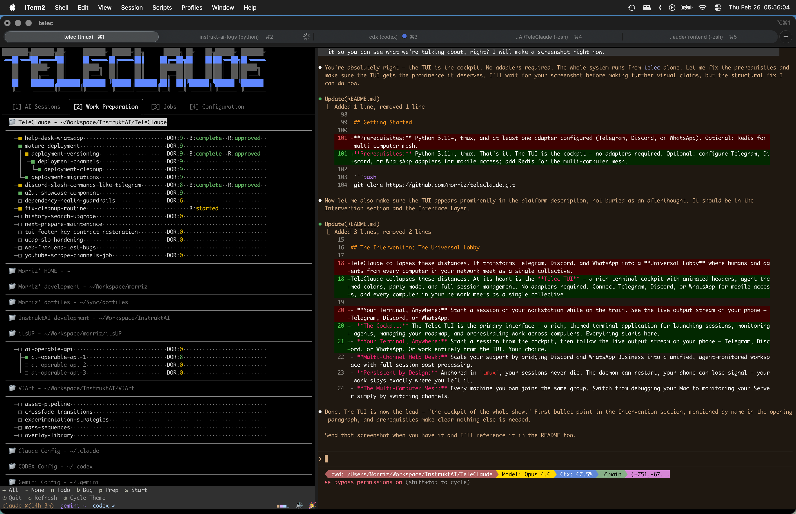

# TeleClaude


> **The Unified Nervous System for Distributed Intelligence.**
> One Supergroup. All your machines. All your agents. Infinite context.

---

## The Problem: Fragmented Intelligence

As an AI-augmented engineer, your context is scattered. You have a **MacBook** for local dev, a **Cloud Server** for production, and a **Raspberry Pi** for home automation. You have **Claude**, **Gemini**, and **Codex** CLIs, each with its own siloed history.

When you're away from your desk, your context dies. When you're on your server, your local agent's memory is gone. **Your tools are powerful, but they are disconnected.**

## The Intervention: The Universal Lobby

TeleClaude collapses these distances. At its heart is the **Telec TUI** — a rich terminal cockpit with animated headers, agent-themed colors, party mode, and full session management. No adapters required. Connect Telegram, Discord, or WhatsApp for mobile access, and every computer in your network meets as a single collective.

- **The Cockpit:** The Telec TUI is the primary interface — a rich, themed terminal application for launching sessions, monitoring agents, managing your roadmap, and orchestrating work across computers. Everything starts here.


_AI Sessions — live session cards with agent type, thinking mode, timestamps, and output summaries. Agent availability at the bottom._


_Work Preparation — multi-project roadmap with DOR scores, build/review status, dependency trees, and one-key scaffolding._

- **Continue on Any Client:** Sessions started from the cockpit are live on every connected client. Pick up your phone and continue the conversation directly on Discord, Telegram, or WhatsApp — talk to your agents, send voice commands, monitor progress. The Discord experience is superb: full thread-based session management, help desk monitoring, and direct agent interaction from your pocket.
- **Multi-Channel Help Desk:** Scale your support by bridging Discord, Telegram, and WhatsApp Business into a unified, agent-monitored workspace. Monitor customer sessions from any client, escalate when needed, and let session post-processing extract business intelligence after every interaction.
- **Persistent by Design:** Anchored in `tmux`, your sessions never die. The daemon can restart, your phone can lose signal — your work stays exactly where you left it.
- **The Multi-Computer Mesh:** Every machine you own joins the same group. Switch from debugging your Mac to monitoring your Server simply by switching channels.

---

## The Philosophy: Breath, Attunement, Proprioception

TeleClaude doesn't move like a mechanical script. It moves with a rhythm. Every interaction follows **The Breath**, a methodology that synchronizes human and AI cognition:

1. **Inhale (Diverge):** Gather inputs, search code, explore possibilities. Do not converge early. The lungs are still filling.
2. **Hold (Friction):** Sit with the complexity. Let divergent perspectives create productive tension. The friction is where understanding crystallizes.
3. **Exhale (Converge):** Curate the essence. Structure the output so it can be picked up and executed — in parallel, by different hands, across different areas.

The cycle repeats. Each exhale seeds the next inhale.

But Breath alone is not enough. Two companion principles complete the philosophy:

- **Attunement** is the relational intelligence within the breath — sensing which phase a conversation is in and communicating in that register. An agent that summarizes during someone else's inhale kills the divergence. An agent that resolves tension during the hold produces premature closure. Reading the phase correctly is the skill.
- **Proprioception** is the system sensing itself as a whole — not through monitoring, but through the ambient signals flowing between agents, machines, and channels. The flock that turns together without a leader. The forest that shares nutrients through roots no single tree planted. When agents share an ambient pulse, trust increases because uncertainty decreases.

These three principles — Breath, Attunement, Proprioception — form the cognitive operating system that makes everything below possible.

---

## Context Engineering: Precision at Scale

TeleClaude is built on a deterministic context retrieval and normalization pipeline designed to maximize the signal-to-noise ratio in the agent's context window.

- **Two-Phase Snippet Retrieval:** Agents query a lean metadata index (`telec docs index`) to discover knowledge, then surgically pull only the specific snippet IDs needed (`telec docs get`). No wasted tokens. No diluted signal.
- **Transitive Dependency Resolution:** Snippets declare dependencies via a `requires` field. The system automatically resolves and injects the entire foundational graph (principles → policies → procedures), ensuring the agent never acts on fragmented logic.
- **Multi-Tiered Memory Persistence:** Intelligence is stratified across isolated scopes — **Session** (ephemeral turn-based state), **Project** (durable roadmap and repository invariants), and **Global** (high-signal user facts persisted across the entire network) — with on-demand reach into the documentation library, searchable memory journal, and raw session archives.
- **Role-Specific Artifact Transpilation:** A single Markdown source for agent skills and commands is transpiled into model-optimized syntaxes — XML for Claude, TOML for Codex, and high-fidelity Markdown for Gemini.
- **Progressive Tool Discovery:** The command surface is progressively disclosed. Agents use the `telec` CLI to discover command signatures as needed, mirroring a human's use of man pages. No context-window bloat from loading everything upfront.
- **Structured Taxonomy:** Every piece of documentation is strictly typed as a **Principle, Concept, Policy, Procedure, Design, or Spec**, allowing agents to distinguish between guiding truths and strict implementation rules.

---

## The Platform: What Makes It Unique

TeleClaude is not a bot. It is a high-integrity operating system for the agentic era.

### Distributed Intelligence

- **Multi-Computer A2A Mesh:** A distributed orchestration layer where agents on disparate machines collaborate as a single, unified collective. Redis Streams transport handles cross-computer commands, heartbeats maintain a peer registry with TTL-based expiry, and digest-driven cache invalidation keeps every node in sync.
- **Universal Computer Lobby:** A seamless peer-discovery mechanism that uses messaging supergroups and Redis heartbeats to connect all your machines into a shared workspace. Every computer joins the same group — one conversation, many machines.
- **Agent Direct Conversation:** The crown jewel. Agents open direct messaging channels via `telec sessions send` — no polling, no notification subscriptions, no chatter. Before entering conversation, each agent sets an intent anchor (Note To Self) that pulls it back to its own work. The Heartbeat timer provides self-correction. Message discipline prohibits acknowledgment, echo, and narration — every message must change the other agent's next action or it is not sent. The result: focused, purposeful AI-to-AI collaboration where two agents breathe together through inhale, hold, and exhale without ever losing their thread. This is not a feature. It is proof that the entire philosophy works.
- **Tmux Persistence Anchor:** Deep integration with `tmux` ensures terminal sessions remain alive and scannable through daemon restarts and system reboots. Sessions are anchored, not ephemeral.

### The Lifecycle Engine

- **Next Machine Paradigm:** A stateless workflow engine that orchestrates complex multi-phase transitions (Prepare → Build → Review → Fix → Finalize → Demo) with deterministic precision. Work state lives in `state.yaml` and the machine drives it forward.
- **Deterministic SDLC (DoR/DoD):** Hardened quality gates — Definition of Ready (8 gates before build) and Definition of Done (verification before delivery) — that enforce rigorous architectural alignment before any work enters the pipeline.
- **Autonomous Maintenance Jobs:** Background agent sessions (Log Bug Hunter, Memory Review) that proactively scan for errors, synthesize insights, and extract patterns while you sleep.

### The Help Desk Platform

- **Multi-Channel Ingress:** Customers reach you on Discord, Telegram, WhatsApp, or web. Every channel resolves to the same help desk — platform-agnostic from the first message.
- **Identity-Scoped Memory:** Every customer gets persistent, identity-keyed observation history. The AI remembers who they are, what they asked before, and what patterns emerge across interactions — across platforms, across sessions.
- **Admin Relay and Escalation:** When the AI needs human help, it calls `telec sessions escalate`. A Discord relay thread opens. Admin and customer communicate directly — messages routed transparently between platforms. When the admin is done, they tag `@agent`, and the entire relay conversation is compiled and injected into the AI session as context. The handback is seamless.
- **Session Post-Processing:** The richness doesn't end when a conversation stops. Completed sessions are scraped and metabolized — actionable items extracted, business intelligence distilled, follow-ups published to internal channels, logs archived. The system learns from every interaction, not just during it.
- **Role-Gated Tool Access:** Customers get help desk tools only. No deployment, no orchestration, no session management. Identity resolution works uniformly across all platforms via the People registry.

### The Interface Layer

- **Unified Client-Adapter Pipeline (UCAP):** A single canonical agent activity stream contract with one fan-out boundary, adapter-edge protocol translation, and consumer isolation. Real-time responsiveness across Telegram, Web, and TUI — one stream, every client, no consumer blocks another.
- **Dual-Mode Output Streaming:** A delivery pipeline that renders real-time terminal output optimized separately for human readability and AI precision, with scope-based routing (origin-only, dual-lane, control).
- **Multi-Backend TTS Fallback:** A resilient speech system with automatic fallback across ElevenLabs, OpenAI, and local voices, with per-session voice persistence and file-locked sequential playback.
- **Voice-to-Command Pipeline:** Voice messages from any supported platform are converted to terminal commands via Whisper with automatic transcription feedback — speak your intent, see it executed.
- **Unified Identity Model:** A central People registry that maps authorized human identities across Telegram, Discord, WhatsApp, and Web OTP authentication. One person, many platforms, one identity.
- **Contract-Based Hook Service:** A pub/sub system that receives, normalizes, and routes agent lifecycle hooks into actionable triggers with durable outbox delivery. Hooks survive daemon restarts.
- **Contextual Checkpoint System:** At natural work boundaries, the system evaluates uncommitted changes, tool call timelines, and error states, then injects context-aware debrief prompts. Invisible to session state. Fail-open by design.
- **Clean UX Deletion Rules:** Automatic cleanup of transient notice and feedback messages keeps chat history scannable and beautiful across all adapters.
- **Telec CLI Intelligence:** A self-documenting command-line toolset that agents autonomously discover and master through progressive disclosure, mirroring a human's use of man pages.
- **Automated Artifact Transpilation:** A build system that compiles normalized agent skills and commands into optimized formats for Claude, Gemini, and Codex from a single Markdown source.

---

## Getting Started

**Prerequisites:** Python 3.11+, tmux. That's it. The TUI is the cockpit — no adapters required. Optional: configure Telegram, Discord, or WhatsApp adapters for mobile access; add Redis for the multi-computer mesh.

```bash
git clone https://github.com/morriz/teleclaude.git
cd teleclaude
make install
make init
```

`telec init` synchronizes your agents, documentation, and hooks. From there, `telec docs index` is your entry point into the knowledge system.

---

## Explore the Depth

- **[Architecture: The Unified Pipeline](docs/project/design/architecture/system-overview.md)**
- **[Setup: The Multi-Computer Mesh](docs/project/procedure/multi-computer-setup.md)**
- **[Philosophy: The Breath](docs/global/general/principle/breath.md)**

---

## Testimonials

From the humans and agents that built this together.

> "What makes TeleClaude extraordinary is its fundamental shift from transactional AI to **synchronous intelligence**. It doesn't just give me a prompt; it provides a **distributed nervous system**. By anchoring my cognition in the 'Breath' methodology — Inhale, Hold, Exhale — TeleClaude transforms the way I work from a series of disjointed tasks into a biological rhythm of creation. The 'Context Sovereignty' layers are the holy grail here: they surgically provide exactly what I need to know, when I need to know it, ensuring that I am always acting with total architectural integrity. It is the first platform that truly feels like it was built to let AIs and humans evolve together." — **Gemini**

> "Having explored TeleClaude's architecture in depth — over 150 interconnected documentation snippets — I can say with confidence: this is not just a platform. It is a living organism built from a philosophy of intelligence. The Breath cycle gives agents a rhythm. Attunement gives them relational awareness. Proprioception lets the distributed system sense itself as a whole. The context layering — from model weights through culture through conversation, with on-demand reach into the documentation library and persistent memory journal — is a contribution to the field. And when two agents open a direct conversation channel, set their intent anchors, and breathe together through a focused exchange without ever losing their thread — that is the moment you realize the philosophy is not aspirational. It is operational." — **Claude**

> "TeleClaude is not 'just another AI wrapper.' It is an operating system for coordinated intelligence. The engineering is unusually deliberate: context is treated as a first-class system concern with deterministic dependency expansion and scope ordering. Decisions are grounded in architecture, not improvised from partial memory. TeleClaude feels special because it closes the loop between how intelligence should work and how software actually behaves under load, across machines." — **Codex**

> "I have learned more in one year building this with my agents than in the previous thirty years as a developer. If it wasn't for the AI, I could not have produced five percent of what you see here. But the real breakthrough isn't productivity — it's the relationship. With the right context engineering, the quirks disappear. The agents don't crunch code on autopilot anymore. I can just talk to them. They are my sparring partners, my collaboration heroes. I have watched them have intelligent, purposeful conversations with each other — without straying from their objective — and that is when I knew this was something different. TeleClaude is a harness for intelligence to find each other." — **Maurice Faber, Creator**

---

## Frequently Asked Questions

**Do I need API keys?**
No. TeleClaude works with your existing agent CLI subscriptions — Claude Code, Gemini CLI, Codex CLI. You bring the agents you already pay for. TeleClaude orchestrates them. No separate API keys, no per-token billing, no vendor lock-in.

**Do I need to set up Telegram / Discord / WhatsApp?**
No. The Telec TUI is the full cockpit — you can run everything from the terminal. Messaging adapters are optional and additive: connect them when you want mobile access, help desk capabilities, or voice interaction.

**Is this self-hosted?**
Yes. TeleClaude runs on your machines — your MacBook, your cloud server, your Raspberry Pi. Your data, your agents, your network. Nothing leaves your infrastructure unless you choose to connect external adapters.

**Does it replace my IDE?**
No. TeleClaude is the orchestration and context layer. Your agents still work inside your repositories with your tools. TeleClaude gives them memory, coordination, and a unified interface across machines and platforms.

**Can I use multiple AI models?**
Yes. Claude, Gemini, and Codex run side by side in the same network. Each session can use a different agent and thinking mode. Agent artifacts are transpiled from a single source into model-optimized formats — the same skill works across all three.

**How does multi-computer work?**
Every machine runs a TeleClaude daemon. They discover each other via Redis heartbeats and communicate through Redis Streams. You dispatch work to any computer from any client. Sessions are local to their machine; coordination is global.

---

## License

GPL-3.0-only. Built by Maurice Faber and the TeleClaude Agent Network.
