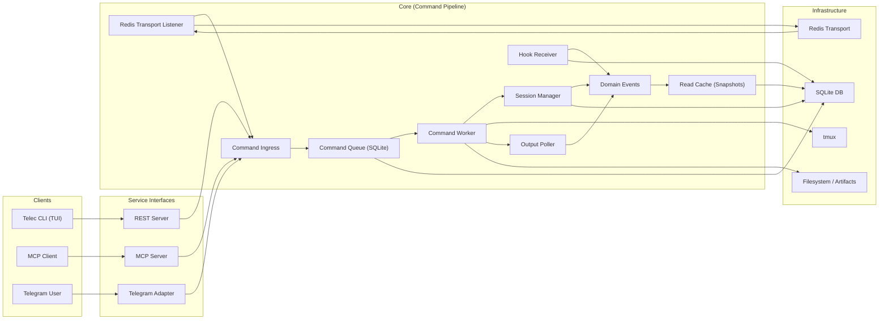

# Architecture

## System Blueprint

## Boundaries

### Clients
- Issue requests and receive responses

### Service Interfaces
- REST is a public facade (REST‑native endpoints mapped to internal commands)
- MCP is a service boundary for AI orchestration
- Telegram is a UI adapter boundary
- All inputs normalize into command ingress

### Core
- Executes commands from queue
- Manages tmux lifecycle
- Emits domain events
- Event-driven cache updates (snapshots)

### Infrastructure
- Storage, transport, runtime

## Non-Goals

- No adapter-specific semantics inside core
- No transport metadata used as domain intent
