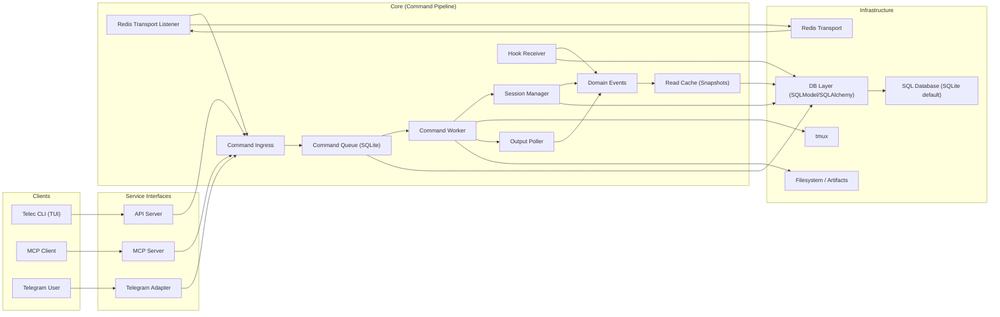

# Architecture

## System Blueprint

## Boundaries

### Clients

- Issue requests and receive responses

### Service Interfaces

- API is a public facade (HTTP endpoints mapped to internal commands)
- MCP is a service boundary for AI orchestration
- Telegram is a UI adapter boundary
- All inputs normalize into command ingress

### Core

- Executes commands from queue
- Manages tmux lifecycle
- Emits domain events
- Event-driven cache updates (snapshots)

### Infrastructure

- Storage, transport, runtime
- DB access is isolated behind a SQLModel/SQLAlchemy layer with Alembic migrations.
- Swapping databases is a configuration change (engine URL) plus migrations.

## Non-Goals

- No adapter-specific semantics inside core
- No transport metadata used as domain intent
