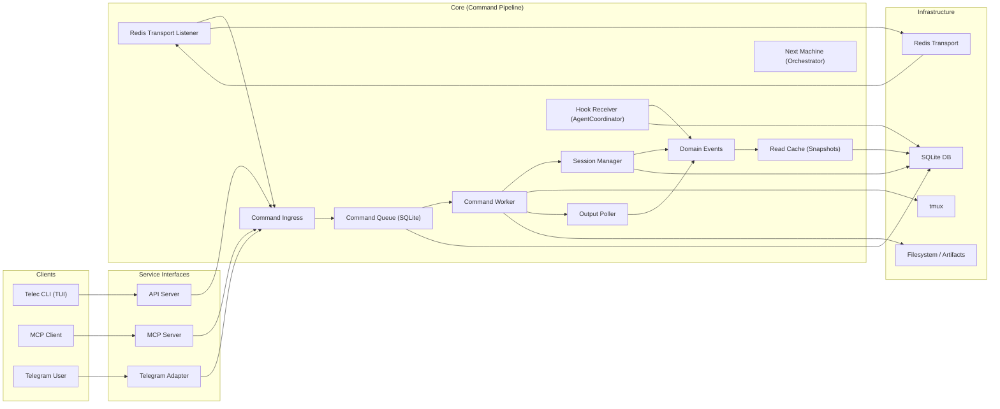

# Architecture

## System Blueprint

## Protocol-Based Capabilities

TeleClaude uses Python Protocols (`teleclaude/core/protocols.py`) to decouple the core from adapter implementations. This allows for a clean separation between UI platforms and transport layers.

### Transport Adapters

Adapters that implement `RemoteExecutionProtocol` are responsible for cross-computer orchestration.

- **RedisTransport**: Uses Redis Streams for command transport and heartbeat discovery.
- (Future) **PostgresAdapter**: Uses PostgreSQL LISTEN/NOTIFY.

### UI Adapters

Adapters that implement `UiAdapter` (via `teleclaude/adapters/ui_adapter.py`) manage human-facing interactions.

- **TelegramAdapter**: Normalizes chat interactions.
- **APIServer**: Provides a resource-first API for TUIs and web clients.
- **MCPServer**: Specialized adapter for AI agent integration.

## Durable Execution (Outbox Pattern)

The system uses an Outbox pattern in SQLite to ensure reliable event delivery and command processing across restarts.

- **rest_outbox**: Stores commands originating from durable local clients (like the `telec` CLI). Ensures that commands are delivered to the daemon exactly once and responses are captured.
- **hook_outbox**: Captures agent lifecycle events (from `mcp-wrapper` hooks) and ensures they are processed by the daemon even if it was offline during the event emission.

## Boundaries

### Clients

- Issue requests and receive responses. TUIs (Telec) use the HTTP/WS interface.

### Service Interfaces

- API and MCP are first-class service boundaries.
- Telegram is a UI adapter boundary.
- All inputs normalize into explicit command objects and flow through `CommandService` (commands do **not** use `AdapterClient.handle_event`).

### Core

- Executes commands from queue/outbox.
- **Next Machine**: A stateless state machine (`next_machine.py`) that orchestrates complex workflows (Phase A: Prepare, Phase B: Build/Review/Fix). It derives state from project artifacts (roadmap, requirements, plans).
- **Agent Coordinator**: Handles agent lifecycle hooks and routes events between local listeners, remote initiators via Redis, and UI adapters.
- Manages tmux lifecycle via `tmux_bridge`.
- Emits domain events via `AdapterClient`.
- Event-driven cache updates (snapshots) via `DaemonCache`.

### Infrastructure

- **SQLite**: Local state, command queue, and outbox durability.
- **Redis**: Optional transport for multi-computer coordination.
- **tmux**: The execution runtime for all sessions.
- **Filesystem**: Logs, transcripts, and artifacts.

## Non-Goals

- No adapter-specific semantics inside core.
- No transport metadata used as domain intent.
