# TeleClaude Architecture Reference

**Last Updated:** 2025-01-08

> **📘 New to Protocol-based architecture?** See [Protocol Architecture Guide](./protocol-architecture.md) for a deep dive into cross-computer orchestration patterns.

---

## Table of Contents

1. [Project Overview](#project-overview)
2. [Core Architecture Patterns](#core-architecture-patterns)
3. [Component Layers](#component-layers)
4. [Message Flow Architecture](#message-flow-architecture)
5. [Adapter Pattern & Broadcasting](#adapter-pattern--broadcasting)
6. [Output Polling & Streaming](#output-polling--streaming)
7. [Session Management](#session-management)
8. [File Management](#file-management)
9. [Configuration & Deployment](#configuration--deployment)
10. [Key Files Reference](#key-files-reference)

---

## Project Overview

TeleClaude is a multi-platform terminal bridge daemon enabling remote terminal access via Telegram, Redis, and future adapters.

**Core Technical Stack:**

- Python 3.11+ async daemon (asyncio-based)
- python-telegram-bot library for Telegram Bot API
- Redis Streams for AI-to-AI communication
- tmux for persistent terminal sessions
- aiosqlite for async session persistence
- FastAPI for REST API endpoints
- Multi-adapter pattern for platform abstraction

**Key Capabilities:**

- Remote terminal access via Telegram topics
- AI-to-AI collaboration (local or cross-computer)
- Multi-computer Telegram (each bot polls independently, no routing)
- Optional Redis for AI-to-AI MCP tools across computers
- Session persistence across daemon restarts
- Real-time output streaming
- Multi-adapter broadcasting (origin + observers)

---

## Core Architecture Patterns

### 1. Observer Pattern (Event-Driven)

**AdapterClient has NO daemon reference.** Daemon subscribes to events via observer pattern.


**Implementation:**

```python
# Daemon subscribes to events (NO AdapterClient → Daemon reference)
self.client = AdapterClient()  # ✅ NO daemon parameter
self.client.on(TeleClaudeEvents.MESSAGE, self._handle_message)
self.client.on(TeleClaudeEvents.NEW_SESSION, self._handle_new_session)

# Adapters handle events
await self.client.handle_event(
    event=TeleClaudeEvents.MESSAGE,
    payload={"session_id": sid, "text": text},
    metadata={"adapter_type": "telegram"}
)
```

### 2. Module-Level Singleton (SessionManager)

**SessionManager accessed via module import**, not passed as parameters.

```python
# teleclaude/core/db.py
_db: SessionManager = None

def init_db(db_path: str):
    global _db
    _db = SessionManager(db_path)

# Anywhere in codebase
from teleclaude.core.db import db
session = await db.get_session(session_id)
```

**Why:** Reduces parameter pollution, makes db available everywhere without threading it through 20+ function calls.

### 3. Origin/Observer Broadcasting

**Sessions have ONE origin adapter** (interactive). All other adapters are observers (read-only broadcasts).

```mermaid
sequenceDiagram
    participant User
    participant TG as TelegramAdapter<br/>(origin)
    participant Client as AdapterClient
    participant Redis as RedisAdapter<br/>(observer, has_ui=False)
    participant Daemon

    Note over User,Daemon: User sends message
    User->>TG: "ls -la"
    TG->>Client: handle_event(MESSAGE)
    Client->>Daemon: handle_message()

    Note over Daemon: Execute in terminal
    Daemon->>Client: send_message(output)

    Note over Client: Send to origin (CRITICAL)
    Client->>TG: send_message()
    TG-->>User: Shows output

    Note over Client: Broadcast to observers with has_ui=True
    Client->>Redis: ❌ SKIPPED (has_ui=False)
```



**Key Points:**

- Origin adapter: Interactive (send/receive, can edit messages)
- Observer adapters: Read-only broadcasts (best-effort, failures logged)
- `has_ui` flag: Only observers with `has_ui=True` receive broadcasts
- RedisAdapter has `has_ui=False` (pure transport, no UI)

### 4. AdapterClient as Central Hub

**ALL adapter operations flow through AdapterClient.** No direct adapter access.


### 5. Unified Adapter Architecture

**All adapters use the same patterns - no special cases for AI-to-AI sessions.**

**Core Principle:** Every adapter inherits from BaseAdapter and provides:

- `send_message()` - Send message to origin adapter
- `edit_message()` - Edit message (in-place updates)
- `get_session_data()` - Read session data from `claude_session_file`

**No Streaming for AI Sessions:** MCP clients use request/response pattern:

1. `teleclaude__start_session()` - Create session, returns session_id
2. `teleclaude__send_message()` - Send command, returns acknowledgment
3. `teleclaude__get_session_data()` - Pull current output (not streaming)

**Observer Pattern:** Telegram observers watch ALL sessions (human and AI-to-AI):

- Single message per session (edited in-place for live updates)
- Polling coordinator broadcasts to all adapters via `send_output_update()`
- Same UX for all session types

---

## Component Layers

### Core Layer (`teleclaude/core/`)

**Business logic and domain models**

- `adapter_client.py` - **Central hub for ALL adapter operations**
- `command_handlers.py` - Command routing logic (uses AdapterClient)
- `computer_registry.py` - Multi-computer discovery via heartbeat
- `db.py` - Session persistence, module-level singleton
- `events.py` - Event type definitions (MESSAGE, NEW_SESSION, UiCommands, etc.)
- `file_handler.py` - File upload handling
- `models.py` - Data classes (Session, Recording) with origin_adapter field
- `output_poller.py` - tmux output polling
- `polling_coordinator.py` - Coordinates output polling and broadcasting
- `protocols.py` - Protocol definitions (RemoteExecutionProtocol)
- `schema.sql` - Database schema with session table
- `session_cleanup.py` - Session lifecycle cleanup
- `session_listeners.py` - PUB-SUB listeners for cross-computer events
- `session_utils.py` - Session utility functions
- `terminal_bridge.py` - tmux interaction (create, send keys, capture output)
- `ux_state.py` - UX state management (idle notifications, etc.)
- `voice_message_handler.py` - Voice transcription with Whisper

### Adapter Layer (`teleclaude/adapters/`)

**Platform-specific transport implementations**

- `base_adapter.py` - Abstract interface with `has_ui` flag
- `telegram_adapter.py` - Telegram Bot API (has_ui=True, UI platform)
- `redis_adapter.py` - Redis Streams (has_ui=False, transport + RemoteExecutionProtocol)
- `ui_adapter.py` - Shared UI adapter base class (common Telegram/future UI patterns)

**Adapter Responsibilities:**

- Platform-specific message send/receive
- Channel/topic creation
- Platform event loops (polling or webhooks)
- Emit events to AdapterClient when messages arrive

**Adapters do NOT:**

- Access daemon directly
- Access db directly
- Contain business logic (MCP, registry, etc.)
- Know about other adapters

### MCP Layer (`teleclaude/mcp_server.py`)

**AI-to-AI communication via unified adapter architecture**

- Exposes MCP tools for Claude Code integration:
  - `teleclaude__list_computers` - List online computers
  - `teleclaude__list_projects` - List project directories
  - `teleclaude__list_sessions` - List active sessions
  - `teleclaude__start_session` - Start AI-to-AI session
  - `teleclaude__send_message` - Send message to session
  - `teleclaude__get_session_data` - Get session transcript
  - `teleclaude__stop_notifications` - Unsubscribe from session events
  - `teleclaude__end_session` - Gracefully terminate session
  - `teleclaude__deploy` - Deploy code to remote computers (optional list; default all remotes)
  - `teleclaude__send_file` - Send file to session
- Uses request/response pattern (not streaming) - client pulls data via `get_session_data()`
- Uses AdapterClient for cross-computer messaging (no direct adapter references)
- All adapters use same patterns - no special cases for AI-to-AI sessions
- Session data stored in `claude_session_file` (same source of truth for all interfaces)

### Main Daemon (`teleclaude/daemon.py`)

**Coordination and lifecycle management**

- PID file locking
- Initializes AdapterClient (which loads adapters from config)
- Subscribes to AdapterClient events
- Manages terminal output polling
- Coordinates session lifecycle

---

## Message Flow Architecture

### Incoming Message Flow

```mermaid
sequenceDiagram
    participant User
    participant TG as TelegramAdapter
    participant Client as AdapterClient
    participant SM as db<br/>(module-level)
    participant Daemon
    participant Terminal as tmux

    User->>TG: Types "ls -la" in topic

    Note over TG: Platform event loop receives
    TG->>Client: handle_event(MESSAGE,<br/>session_id, text)

    Note over Client: Route to subscribers
    Client->>Daemon: _handle_message(payload)

    Note over Daemon: Get session
    Daemon->>SM: get_session(session_id)
    SM-->>Daemon: Session

    Note over Daemon: Send to terminal
    Daemon->>Terminal: send_keys("ls -la")
    Terminal-->>Daemon: Output appears

    Note over Daemon: Send output
    Daemon->>Client: send_message(session_id, output)

    Note over Client: Broadcast
    Client->>TG: send_message() [origin]
    Client->>TG: ✅ Success

    TG-->>User: Shows output
```



### Outgoing Message Flow (Broadcasting)


**Error Handling:**

- Origin failure → raise exception (CRITICAL)
- Observer failure → log warning, continue (best-effort)

---

## Adapter Pattern & Broadcasting

### BaseAdapter Interface

```python
class BaseAdapter(ABC):
    """Base adapter interface."""

    # Platform identification
    has_ui: bool = True  # Override: RedisAdapter sets False

    # === Lifecycle ===
    @abstractmethod
    async def start(self) -> None:
        """Start adapter (connect, start event loop)."""

    @abstractmethod
    async def stop(self) -> None:
        """Stop adapter (disconnect, cleanup)."""

    # === Messaging ===
    @abstractmethod
    async def send_message(
        self,
        session_id: str,
        text: str,
        metadata: Optional[Dict[str, Any]] = None,
    ) -> str:
        """Send message to channel. Returns message_id."""

    @abstractmethod
    async def edit_message(
        self,
        session_id: str,
        message_id: str,
        text: str,
    ) -> bool:
        """Edit existing message (if platform supports)."""

    @abstractmethod
    async def delete_message(
        self,
        session_id: str,
        message_id: str,
    ) -> bool:
        """Delete message."""

    # === Channel Management ===
    @abstractmethod
    async def create_channel(
        self,
        session_id: str,
        title: str,
        metadata: Dict[str, Any],
    ) -> str:
        """Create channel/topic. Returns channel_id."""

    @abstractmethod
    async def update_channel_title(
        self,
        session_id: str,
        title: str,
    ) -> bool:
        """Update channel title."""

    @abstractmethod
    async def delete_channel(
        self,
        session_id: str,
    ) -> bool:
        """Delete channel/topic."""
```

### Adapter Polling Architecture

**Each adapter manages its own event loop.** Daemon does NOT poll adapters.

```
Platform Events                  Daemon Polling
══════════════                   ══════════════

┌─────────────────┐
│ TelegramAdapter │──┐  Push: immediate callbacks
│  (own loop)     │  │
└─────────────────┘  │
                     ├──> on_message()  ──> client.handle_event()
┌─────────────────┐  │   on_command()  ──> client.handle_event()
│  RedisAdapter   │──┘
│  (own loop)     │    Pull: XREAD every 1s
└─────────────────┘

                         ┌─────────────────┐
                         │     Daemon      │
                         │  OutputPoller   │──> Polls tmux every 1s
                         │  (own loop)     │──> client.send_message()
                         └─────────────────┘
```

**Key Points:**

- ✅ Adapters start independent event loops (`start()` method)
- ✅ Push platforms (Telegram): library manages polling
- ✅ Pull platforms (Redis): adapter creates background task
- ✅ Daemon polls terminal output (separate concern)
- ❌ Daemon does NOT poll adapters for messages

### Master Bot Pattern (Multi-Computer)

**In multi-computer setups**, only ONE computer's bot registers Telegram commands to avoid duplicates.

**Configuration:**

```yaml
# Master computer (config.yml)
telegram:
  is_master: true  # Registers commands

# Non-master computers (config.yml)
telegram:
  is_master: false  # Clears command lists
```

**Implementation Details:**

```python
# telegram_adapter.py start() method
if self.is_master:
    # Register commands with TRAILING SPACES
    commands = [
        BotCommand("new_session ", "Create a new terminal session"),  # Note space!
        BotCommand("list_sessions ", "List all active sessions"),
    ]
    await self.app.bot.set_my_commands(commands, scope=scope)
else:
    # Clear commands to prevent duplicates
    await self.app.bot.set_my_commands([])
```

**Why trailing spaces?**

- Without space: Telegram appends `@botname` → `/new_session@masterbot`
- With space: Commands distributed to ALL bots → `/new_session ` (universal)
- Prevents duplicate entries from multiple bots in same group
- Users can type commands without specifying bot

**Important:** All bots handle commands regardless of `is_master`. This only affects UI command registration.

---

## Output Polling & Updates

### Polling Behavior

**Unified polling for ALL sessions** (polling_coordinator.py `poll_and_send_output`):

1. **Initial delay**: Wait 2 seconds before first poll
2. **Poll interval**: Poll tmux output every 1 second
3. **Unified output handling**: ALL sessions use `send_output_update()` - no special cases
4. **Observer pattern**: Telegram adapter receives updates via `send_output_update()`, edits single message
5. **Shell-return detection** (PRIMARY stop condition):
   - Check tmux `pane_current_command` against the user's shell
   - Stop when the foreground command returns to the shell
   - **PRIMARY condition that stops polling**
6. **Idle notification** (informational only):
   - After 60s of no output change
   - Send ephemeral notification (auto-deleted when output resumes)
   - **Does NOT stop polling** - continues until exit code
7. **Session death detection**: Stop if tmux session no longer exists
8. **Max duration**: Stop after 600 polls (10 minutes)

### Output Message Format

````
┌──────────────────────────────────────────┐
│ ```.                                     │
│ Terminal output here                     │
│ (truncated to last ~3400 chars if large) │
│ ```                                      │
│                                          │
│ ⏱️ Running 2m 34s | 📊 145KB | (truncated)│
│ [📎 Download full output]                │
└──────────────────────────────────────────┘
````

**Components:**

1. Code block with `sh` syntax highlighting
2. Status line: running time, size, truncation indicator
3. Download button (inline keyboard) when output > 3800 chars

### Output Buffer Management


**Lifecycle:**

- **Created**: When polling starts
- **Updated**: Every poll (1s interval)
- **Persists**: Survives daemon restarts
- **Deleted**: When process exits OR session terminated with `/exit`

---

## Session Management

### Session Model

```python
@dataclass
class Session:
    session_id: str
    computer_name: str
    tmux_session_name: str
    origin_adapter: str  # ✅ Single string (not array)
    adapter_metadata: dict  # Platform-specific data
    title: str
    description: Optional[str]
    created_at: datetime
    last_activity: datetime
```

**Key Points:**

- `origin_adapter: str` - Single origin adapter (telegram, redis, etc.)
- `adapter_metadata: dict` - Stores channel_id, topic_id, etc.
- Sessions survive daemon restarts (SQLite + tmux)
- Module-level singleton: `from teleclaude.core.db import db`

### Session Creation Flow


---

## File Management

### Session Output Files

**Philosophy:** One persistent file per session, cleaned up on session end.

```
session_output/
├── abc12345.txt  (active session)
├── def67890.txt  (active session)
└── (cleaned up when sessions end)
```

**Lifecycle:**

1. **Created**: When output polling starts
2. **Updated**: Every poll (1s interval)
3. **Read**: When user clicks download button
4. **Deleted**: When process exits OR `/exit` command

**Benefits:**

- Survives daemon restarts (enables downloads after crash)
- No orphaned files (cleanup in `finally` blocks)
- DRY helper: `daemon._get_output_file_path(session_id)`

### Temporary Files

**Only created for downloads** - immediately cleaned up:

```python
async def send_file_download():
    temp_file = None
    try:
        # Create temp file
        temp_file = Path(f"/tmp/output_{session_id}.txt")
        temp_file.write_text(full_output)

        # Send to user
        await adapter.send_document(session_id, temp_file)
    finally:
        # ALWAYS cleanup
        if temp_file:
            temp_file.unlink(missing_ok=True)
```

**Zero persistent temp files** - all cleaned in `finally` blocks.

---

## Configuration & Deployment

### Configuration Structure

```yaml
# config.yml
computer:
  name: macbook # Unique identifier

telegram:
  enabled: true
  bot_token: ${TELEGRAM_BOT_TOKEN} # From .env

redis:
  enabled: true
  url: rediss://redis.example.com:6379
  password: ${REDIS_PASSWORD}

mcp:
  enabled: true
  transport: stdio

terminal:
  shell: /bin/zsh
  width: 120
  height: 40

polling:
  idle_notification_seconds: 60
```

### Daemon Management

**Three-tier system:**

1. **launchd/systemd** (production): Auto-restart on crash
2. **make commands** (development): `make restart`, `make status`
3. **Direct Python** (debugging): `make dev` (foreground)

**Commands:**

```bash
make start      # Enable service
make stop       # Disable service
make restart    # Kill PID → auto-restart (~1 sec)
make status     # Check health
make dev        # Run in foreground (Ctrl+C to stop)
```

**Service lifecycle:**


### Plist Template System (macOS)

Generated from `config/ai.instrukt.teleclaude.daemon.plist.template`:

- `{{PYTHON_PATH}}`: Path to venv Python
- `{{WORKING_DIR}}`: Project root
- `{{PATH}}`: System PATH with Homebrew

**CRITICAL:** Redirects stdout/stderr to `/dev/null` to prevent launchd issues. Avoid `stdout=PIPE` in subprocess calls (can leak to child processes).

---

## Key Files Reference

### Documentation

- `README.md` - User-facing (installation, usage)
- `docs/architecture.md` - This file (architecture reference)
- `docs/troubleshooting.md` - Debugging guide
- `docs/multi-computer-setup.md` - Multi-computer deployment

### Core Code

- `teleclaude/daemon.py` - Main entry point, event subscribers
- `teleclaude/mcp_server.py` - MCP tools for AI-to-AI communication
- `teleclaude/core/adapter_client.py` - **Central hub** for ALL adapter ops
- `teleclaude/core/db.py` - Module-level singleton
- `teleclaude/core/terminal_bridge.py` - tmux wrapper
- `teleclaude/core/command_handlers.py` - Command routing
- `teleclaude/core/polling_coordinator.py` - Output polling and broadcasting
- `teleclaude/core/events.py` - Event type definitions and UiCommands

### Adapters

- `teleclaude/adapters/base_adapter.py` - Abstract interface
- `teleclaude/adapters/ui_adapter.py` - Shared UI adapter base class
- `teleclaude/adapters/telegram_adapter.py` - Telegram implementation
- `teleclaude/adapters/redis_adapter.py` - Redis implementation

### Configuration

- `config.sample.yml` - Configuration template
- `.env.sample` - Environment variables template

---

## Architecture Principles

1. **AdapterClient = Central Hub** - ALL adapter operations flow through it (no direct adapter references)
2. **Protocol-Based Capabilities** - Use Protocol pattern for transport capabilities (RemoteExecutionProtocol)
3. **Observer Pattern** - Daemon subscribes to events, no AdapterClient → Daemon reference
4. **Module-Level Singleton** - db accessed via import
5. **Origin/Observer Broadcasting** - One interactive adapter, others read-only
6. **Event-Driven** - Adapters handle events, daemon reacts
7. **Separation of Concerns** - Message broadcasting vs cross-computer orchestration
8. **Fail Fast** - No defensive programming, let errors propagate
9. **Explicit Over Implicit** - Config is explicit, no magic defaults
10. **Type Safety** - Full type hints, strict mypy checking
11. **Async First** - All I/O is async
12. **Persistence** - Sessions survive daemon restarts

---

## Future Enhancements

### High Priority

- REST API ingress for public HTTPS links
- AI-generated session titles
- Live config reload

### Medium Priority

- Terminal recording (text + video)
- Multi-device terminal sizing
- WhatsApp adapter
- Slack adapter

### Nice to Have

- Session templates
- Command aliases
- Multi-hop AI communication

---

**End of Architecture Reference**
