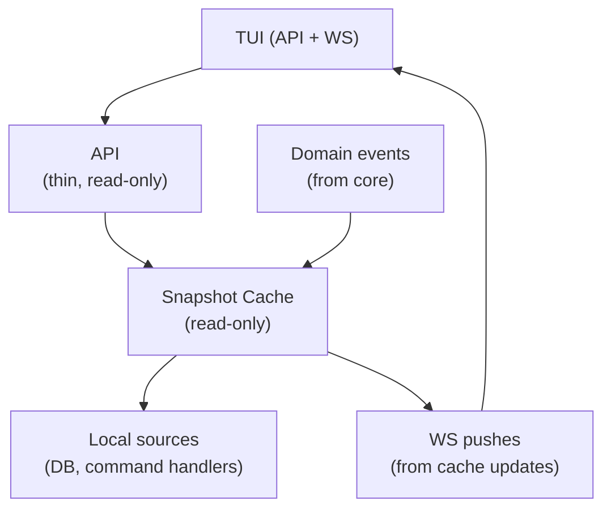

# Cache Architecture

## Purpose

Provides sub-millisecond read access to system state (computers, sessions, projects, todos) for TUIs and high-frequency callers.

## Inputs/Outputs

- Inputs: domain events and local data sources (DB, command handlers).
- Outputs: snapshot reads and WebSocket update notifications.

## Primary flows

1. **Snapshots**: The cache stores JSON snapshots of domain objects in a dedicated `cache` table.
2. **Read-Only**: The cache is NOT a source of truth; it is a materialized view of the database and runtime state.
3. **Event-Driven**: Updates are triggered by domain events (e.g., `SessionCreated`, `ComputerHeartbeat`).
4. **Warmup**: The cache is fully populated on daemon startup.

## Invariants

- Clients (TUI, API) SHOULD read from the cache and write via commands.
- Cache handlers MUST NOT perform complex I/O; they merely transform events into snapshots.

## Failure modes

- Stale snapshots may be served until refresh completes.
