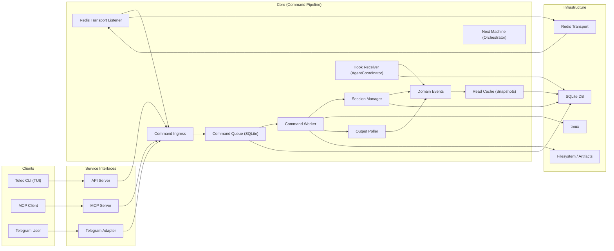

---
description:
  High-level architectural blueprint of TeleClaude components and data
  flow.
id: architecture/system-overview
scope: global
type: architecture
---

# System Overview — Architecture

## Purpose

TeleClaude acts as a "dumb pipe" terminal bridge between UI adapters (Telegram, TUI, MCP) and tmux execution environments.

## Inputs/Outputs

- Inputs: user commands from adapters, transport events, and API requests.
- Outputs: tmux execution, adapter feedback, and cached API responses.

## Component Layers

1. **Service Interfaces**:
   - **Telegram Adapter**: Normalizes chat interactions.
   - **MCP Server**: Stdio-based interface for AI agents.
   - **API Server**: Resource-first REST/WS interface for TUIs.
2. **Core Pipeline**:
   - **Command Ingress**: Normalizes all inputs into Command objects.
   - **Command Queue**: SQLite-backed durable execution.
   - **Session Manager**: Manages tmux lifecycles and process mapping.
3. **Execution Layer**:
   - **tmux**: The runtime for all terminal sessions.
   - **Output Poller**: Streams real-time updates from tmux to domain events.
4. **Orchestration**:
   - **Next Machine**: Stateless state machine for complex project-based workflows.
   - **Agent Coordinator**: Single source of truth for routing agent lifecycle hooks.

## Invariants

- Core is decoupled from adapter specifics via Python Protocols.
- All state changes are event-driven.
- Durable execution via Outbox pattern (hook_outbox, rest_outbox).

## Primary flows

- Adapters normalize input into command objects.
- Commands are queued, executed, and persisted.
- Output polling emits events routed back to adapters and cache.

## Failure modes

- Adapter startup failures prevent end-to-end command flow.
