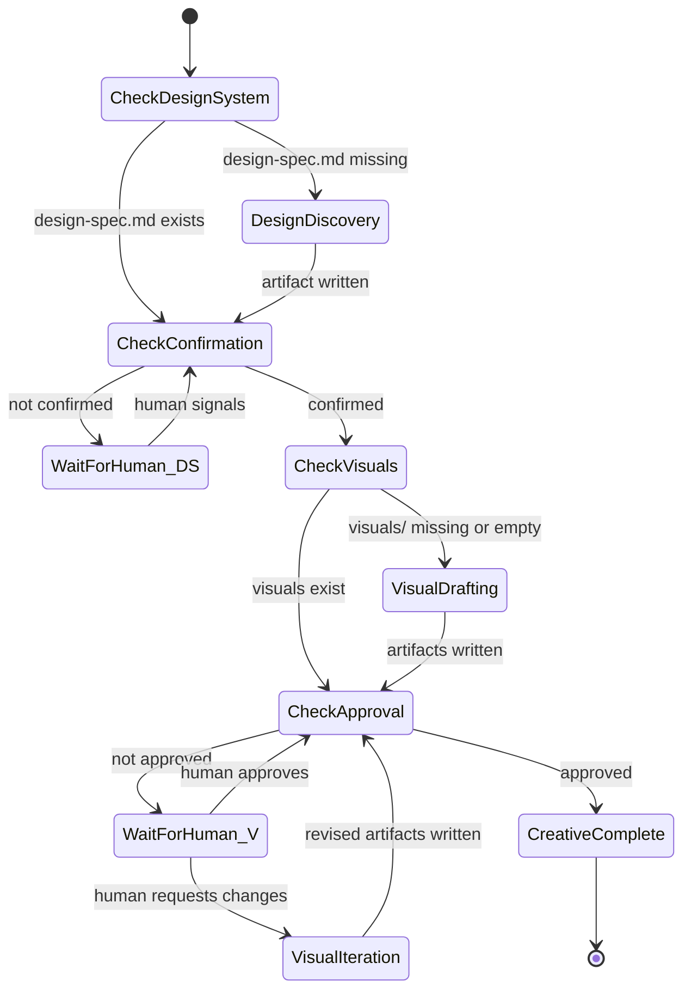

# Creative Machine — Design

## Purpose

The creative machine orchestrates the creative lifecycle — from human visual intent
to approved visual artifacts — as a stateless state machine. It is separate from the
prepare machine (Phase A) and runs before it. Its output (`design-spec.md` and
approved `visuals/`) becomes a precondition for requirements discovery.

The creative machine handles a fundamentally different interaction pattern than
prepare. Prepare dispatches agents and waits for artifacts. The creative machine
has two human-in-the-loop gates where the machine parks and waits for the human
to signal convergence. Between those gates, it dispatches creative agents
autonomously.

Like the next-machine, the creative machine is stateless — it derives all state
from filesystem artifacts and `state.yaml`.

## Inputs/Outputs

**Inputs:**

- `todos/{slug}/input.md` — human thinking and project context.
- `todos/{slug}/state.yaml` — creative phase tracking.
- `todos/{slug}/design-spec.md` — produced during the design discovery phase.
- `todos/{slug}/visuals/` — produced during the visual drafting phase.
- Reference images, screenshots, URLs provided by the human.

**Outputs:**

- Confirmed `todos/{slug}/design-spec.md`.
- Approved visual artifacts in `todos/{slug}/visuals/`.
- Updated `state.yaml` with creative phase completion markers.
- The todo is ready to enter the prepare machine.

## Invariants

- **Stateless derivation**: all state derived from filesystem artifacts. The machine
  checks what exists and what is confirmed, then returns the next instruction.
- **Human gates are blocking**: the machine cannot advance past design spec
  confirmation or visual approval without explicit human signal.
- **Design system precedes visuals**: visual drafting cannot begin until the design
  system is confirmed. The design spec is the hard constraint for all visual output.
- **Artifact immutability**: the machine never modifies artifacts directly. It
  dispatches workers or returns instructions for the orchestrator.
- **Creative phase is optional**: not every todo requires creative work. The machine
  activates only when the todo's input indicates visual work (explicitly stated or
  flagged in `roadmap.yaml`).

## Primary flows

### State diagram



### States and instructions

#### CHECK_DESIGN_SYSTEM

Check whether `todos/{slug}/design-spec.md` exists.

- Exists → transition to CHECK_CONFIRMATION.
- Missing → return `DESIGN_DISCOVERY_REQUIRED` instruction.

#### DESIGN_DISCOVERY_REQUIRED

Dispatch an interactive session running the design discovery procedure.
This session requires the human in the loop — it is a dialogue, not a
background worker. The orchestrator opens a session and the human
participates directly.

After `design-spec.md` is written, call the machine again.

#### CHECK_CONFIRMATION

Check `state.yaml` for design spec confirmation:

```yaml
creative:
  design_system:
    confirmed: true
    confirmed_at: "<ISO8601>"
    confirmed_by: "human"
```

- Confirmed → transition to CHECK_VISUALS.
- Not confirmed → return `DESIGN_SYSTEM_PENDING_CONFIRMATION`.

#### DESIGN_SYSTEM_PENDING_CONFIRMATION

The design spec exists but the human has not confirmed it. The machine
parks. The orchestrator presents the design spec to the human and waits
for their signal. When the human confirms:

- Set `creative.design_system.confirmed: true` in `state.yaml`.
- Call the machine again.

When the human requests changes:

- The orchestrator updates `design-spec.md` based on feedback (or
  dispatches a discovery session for substantial rework).
- Call the machine again (loops back to CHECK_CONFIRMATION).

#### CHECK_VISUALS

Check whether `todos/{slug}/visuals/` contains HTML files.

- Contains `.html` files → transition to CHECK_APPROVAL.
- Empty or missing → return `VISUAL_DRAFTS_REQUIRED`.

#### VISUAL_DRAFTS_REQUIRED

Dispatch one or more creative agents running the visual drafting procedure.
Each agent receives `design-spec.md` as the constraint document.

**Single agent**: dispatch one creative agent. Output goes to
`todos/{slug}/visuals/`.

**Multi-agent bake-off**: dispatch N agents (potentially different AI models).
Each agent's output goes to `todos/{slug}/visuals/{agent-name}/`. The human
reviews all versions and selects.

After artifacts are written, call the machine again.

#### CHECK_APPROVAL

Check `state.yaml` for visual approval:

```yaml
creative:
  visuals:
    approved: true
    approved_at: "<ISO8601>"
    approved_by: "human"
    selected_version: "gemini"  # only set for bake-off
```

- Approved → transition to CREATIVE_COMPLETE.
- Not approved → return `VISUALS_PENDING_APPROVAL`.

#### VISUALS_PENDING_APPROVAL

Visual artifacts exist but the human has not approved them. The machine
parks. The orchestrator tells the human to open the HTML files in a browser
and review.

When the human approves:

- Set `creative.visuals.approved: true` in `state.yaml`.
- For bake-offs: promote the selected version's files to `todos/{slug}/visuals/`
  (top level) and remove the agent subfolders.
- Call the machine again.

When the human requests changes:

- Return `VISUAL_ITERATION_REQUIRED` with the human's feedback.

#### VISUAL_ITERATION_REQUIRED

The human reviewed the visuals and wants changes. Dispatch a creative agent
with the feedback as additional context. The agent reads the existing artifacts,
applies the requested changes, and writes updated files.

After revision, call the machine again (loops back to CHECK_APPROVAL).

#### CREATIVE_COMPLETE

Terminal state. All creative artifacts are confirmed and approved.

- `design-spec.md` is confirmed.
- `visuals/` contains approved HTML+CSS artifacts.
- The todo is ready for the prepare machine (requirements discovery can
  reference both the design spec and the visual artifacts).

The orchestrator ends all creative worker sessions and reports completion.

### State tracking in state.yaml

The creative machine reads and writes to the `creative` section of `state.yaml`:

```yaml
creative:
  phase: "creative_complete"  # current phase
  design_system:
    confirmed: true
    confirmed_at: "2026-03-12T14:30:00Z"
    confirmed_by: "human"
  visuals:
    approved: true
    approved_at: "2026-03-12T16:00:00Z"
    approved_by: "human"
    selected_version: null  # or agent name for bake-off
    iteration_count: 2  # number of revision rounds
  started_at: "2026-03-12T10:00:00Z"
  completed_at: "2026-03-12T16:00:00Z"
```

## Failure modes

- **No input.md**: cannot start creative work. Return error instructing the
  human to write input first.
- **Design discovery stalls**: the human cannot articulate their vision after
  multiple dialogue rounds. The recovery path in the design discovery procedure
  applies (reference-driven triangulation). If still stuck, the machine parks
  with a `NEEDS_DECISION` blocker.
- **Creative agent produces invalid artifacts**: artifacts violating the visual
  constraints policy (JavaScript present, design spec values not matching,
  external dependencies). The orchestrator rejects the artifacts and re-dispatches
  with explicit constraint reminders.
- **Human never signals**: the machine parks indefinitely at a human gate. The
  orchestrator's heartbeat timer catches this — after a configured timeout, it
  surfaces a reminder. The machine does not auto-advance.
- **Bake-off disagreement**: the human likes different parts of different agents'
  output. The orchestrator facilitates cherry-picking: the human specifies which
  sections from which agent, and a final creative agent merges them into a
  cohesive set.
- **Design system changes after visual approval**: if the human updates
  `design-spec.md` after visuals are approved, the visuals may be stale.
  The machine should re-check design spec fidelity and return
  `VISUAL_ITERATION_REQUIRED` if tokens have diverged.
