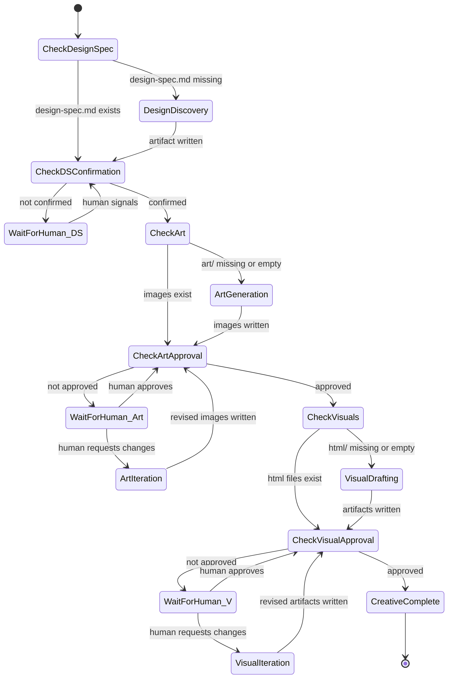

# Creative Machine — Design

## Purpose

The creative machine orchestrates the creative lifecycle — from human visual intent
to approved visual artifacts — as a stateless state machine. It is separate from the
prepare machine (Phase A) and runs before it. Its output (`design-spec.md`, approved
`art/`, and approved `html/`) becomes a precondition for requirements discovery.

The creative machine handles a fundamentally different interaction pattern than
prepare. Prepare dispatches agents and waits for artifacts. The creative machine
has three human-in-the-loop gates where the machine parks and waits for the human
to signal convergence. Between those gates, it dispatches creative agents
autonomously.

Like the next-machine, the creative machine is stateless — it derives all state
from filesystem artifacts and `state.yaml`.

Three roles participate: the **Creator** (rich orchestrator — captures input,
drives the machine, dispatches workers, manages human gates), the **Artist**
(image generation worker — generates mood board images from the design spec
using the `image-generator` meta-skill, stays in session for iteration), and
the **Frontender** (HTML+CSS worker — produces self-contained visual artifacts
from approved art and design spec, multimodal — reads images and translates
compositional intent into code).

## Inputs/Outputs

**Inputs:**

- `todos/{slug}/input.md` — human thinking and project context.
- `todos/{slug}/state.yaml` — creative phase tracking.
- `todos/{slug}/input/` — user-provided reference images, screenshots, visual input.
- `todos/{slug}/design-spec.md` — produced during the design discovery phase.
- `todos/{slug}/art/` — produced during the art generation phase.
- `todos/{slug}/html/` — produced during the visual drafting phase.

**Outputs:**

- Confirmed `todos/{slug}/design-spec.md`.
- Approved images in `todos/{slug}/art/`.
- Approved visual artifacts in `todos/{slug}/html/`.
- Updated `state.yaml` with creative phase completion markers.
- The todo is ready to enter the prepare machine.

## Invariants

- **Stateless derivation**: all state derived from filesystem artifacts. The machine
  checks what exists and what is confirmed, then returns the next instruction.
- **Human gates are blocking**: the machine cannot advance past design spec
  confirmation, art approval, or visual approval without explicit human signal.
- **Design spec precedes art**: art generation cannot begin until the design
  spec is confirmed. The design spec constrains the artist's output.
- **Art precedes visuals**: visual drafting cannot begin until art is approved.
  The frontender reads the approved art for compositional intent.
- **Visual input is optional**: the `input/` folder may be empty. If the human
  says "figure it out," the artist uses only the design spec.
- **Artifact immutability**: the machine never modifies artifacts directly. It
  dispatches workers or returns instructions for the orchestrator.
- **Creative phase is optional**: not every todo requires creative work. The machine
  activates only when the todo's input indicates visual work (explicitly stated or
  flagged in `roadmap.yaml`).

## Primary flows

### State diagram



### States and instructions

#### CHECK_DESIGN_SPEC

Check whether `todos/{slug}/design-spec.md` exists.

- Exists → transition to CHECK_DS_CONFIRMATION.
- Missing → return `DESIGN_DISCOVERY_REQUIRED` instruction.

#### DESIGN_DISCOVERY_REQUIRED

Dispatch an interactive session running the design discovery procedure.
This session requires the human in the loop — it is a dialogue, not a
background worker. The orchestrator (creator) opens a session and the human
participates directly.

The creator presents reference sites, collects images the human drags in
(saved to `todos/{slug}/input/`), and facilitates the dialogue that produces
`design-spec.md`.

After `design-spec.md` is written, call the machine again.

#### CHECK_DS_CONFIRMATION

Check `state.yaml` for design spec confirmation:

```yaml
creative:
  design_spec:
    confirmed: true
    confirmed_at: '<ISO8601>'
    confirmed_by: 'human'
```

- Confirmed → transition to CHECK_ART.
- Not confirmed → return `DESIGN_SPEC_PENDING_CONFIRMATION`.

#### DESIGN_SPEC_PENDING_CONFIRMATION

The design spec exists but the human has not confirmed it. The machine
parks. The orchestrator presents the design spec to the human and waits
for their signal. When the human confirms:

- Set `creative.design_spec.confirmed: true` in `state.yaml`.
- Call the machine again.

When the human requests changes:

- The orchestrator updates `design-spec.md` based on feedback (or
  dispatches a discovery session for substantial rework).
- Call the machine again (loops back to CHECK_DS_CONFIRMATION).

#### CHECK_ART

Check whether `todos/{slug}/art/` contains image files.

- Contains image files (`.png`, `.jpg`, `.webp`, `.svg`) → transition to
  CHECK_ART_APPROVAL.
- Empty or missing → return `ART_GENERATION_REQUIRED`.

#### ART_GENERATION_REQUIRED

Design spec is confirmed. No art exists yet. Dispatch an artist agent
to generate mood board images.

The artist receives:

- `todos/{slug}/design-spec.md` as the constraint document.
- `todos/{slug}/input.md` for context and content direction.
- `todos/{slug}/input/` for any reference images the human provided.

The artist uses the `image-generator` meta-skill to select the appropriate
engine based on the design spec's visual style. Output goes to
`todos/{slug}/art/`.

The artist session stays open for iteration — it is not a fire-and-forget
dispatch.

After images are written, call the machine again.

#### CHECK_ART_APPROVAL

Check `state.yaml` for art approval:

```yaml
creative:
  art:
    approved: true
    approved_at: '<ISO8601>'
    approved_by: 'human'
    iteration_count: 1
```

- Approved → transition to CHECK_VISUALS.
- Not approved → return `ART_PENDING_APPROVAL`.

#### ART_PENDING_APPROVAL

Art images exist but the human has not approved them. The machine parks.
The orchestrator presents the images to the human — file paths, or sends
them via messaging (Discord/Telegram) if the human requests it.

When the human approves:

- Set `creative.art.approved: true` in `state.yaml`.
- Call the machine again.

When the human requests changes:

- Return `ART_ITERATION_REQUIRED` with the human's feedback.

#### ART_ITERATION_REQUIRED

The human reviewed the art and wants changes. The artist agent (still in
session) receives the feedback and generates revised images. The artist may
switch engines via the `image-generator` meta-skill if the feedback implies
a different style direction.

After revision, call the machine again (loops back to CHECK_ART_APPROVAL).

Track iteration count in `state.yaml` (`creative.art.iteration_count`).

#### CHECK_VISUALS

Check whether `todos/{slug}/html/` contains HTML files.

- Contains `.html` files → transition to CHECK_VISUAL_APPROVAL.
- Empty or missing → return `VISUAL_DRAFTS_REQUIRED`.

#### VISUAL_DRAFTS_REQUIRED

Art is approved. Visual artifacts do not exist yet. Dispatch frontender
agent(s) to produce HTML+CSS visual artifacts following the visual drafting
procedure.

The frontender receives:

- `todos/{slug}/design-spec.md` for exact values (colors, fonts, spacing).
- `todos/{slug}/art/` for compositional intent (layout, mood, spatial rhythm).
- `todos/{slug}/input.md` for content structure and storytelling arc.

The frontender is multimodal — it reads the approved art images to extract
compositional intent and translates it into HTML+CSS using exact values
from the design spec. No intermediate artifact is needed between images
and code.

**Single agent**: dispatch one frontender. Output goes to
`todos/{slug}/html/`.

**Multi-agent bake-off**: dispatch N agents (potentially different AI models).
Each agent's output goes to `todos/{slug}/html/{agent-name}/`. The human
reviews all versions and selects.

After artifacts are written, call the machine again.

#### CHECK_VISUAL_APPROVAL

Check `state.yaml` for visual approval:

```yaml
creative:
  visuals:
    approved: true
    approved_at: '<ISO8601>'
    approved_by: 'human'
    selected_version: 'gemini' # only set for bake-off
```

- Approved → transition to CREATIVE_COMPLETE.
- Not approved → return `VISUALS_PENDING_APPROVAL`.

#### VISUALS_PENDING_APPROVAL

Visual artifacts exist but the human has not approved them. The machine
parks. The orchestrator tells the human to open the HTML files in a browser
and review.

When the human approves:

- Set `creative.visuals.approved: true` in `state.yaml`.
- For bake-offs: promote the selected version's files to `todos/{slug}/html/`
  (top level) and remove the agent subfolders.
- Call the machine again.

When the human requests changes:

- Return `VISUAL_ITERATION_REQUIRED` with the human's feedback.

#### VISUAL_ITERATION_REQUIRED

The human reviewed the visuals and wants changes. Dispatch a frontender
with the feedback as additional context. The agent reads the existing
artifacts, applies the requested changes, and writes updated files.

After revision, call the machine again (loops back to CHECK_VISUAL_APPROVAL).

Track iteration count in `state.yaml` (`creative.visuals.iteration_count`).
If iterations exceed 3 without convergence, surface this to the human —
the design spec or art may need refinement rather than the visuals.

#### CREATIVE_COMPLETE

Terminal state. All creative artifacts are confirmed and approved.

- `design-spec.md` is confirmed.
- `art/` contains approved mood board images.
- `html/` contains approved HTML+CSS artifacts.
- The todo is ready for the prepare machine (requirements discovery can
  reference the design spec, art, and visual artifacts).

The orchestrator ends all creative worker sessions and reports completion.

### State tracking in state.yaml

The creative machine reads and writes to the `creative` section of `state.yaml`:

```yaml
creative:
  phase: 'creative_complete' # current phase
  design_spec:
    confirmed: true
    confirmed_at: '2026-03-12T14:30:00Z'
    confirmed_by: 'human'
  art:
    approved: true
    approved_at: '2026-03-12T15:00:00Z'
    approved_by: 'human'
    iteration_count: 2
    engine_used: 'gemini' # or "flux", "gpt-image", etc.
  visuals:
    approved: true
    approved_at: '2026-03-12T16:00:00Z'
    approved_by: 'human'
    selected_version: null # or agent name for bake-off
    iteration_count: 1
  started_at: '2026-03-12T10:00:00Z'
  completed_at: '2026-03-12T16:00:00Z'
```

## Failure modes

- **No input.md**: cannot start creative work. Return error instructing the
  human to write input first.
- **Design discovery stalls**: the human cannot articulate their vision after
  multiple dialogue rounds. The recovery path in the design discovery procedure
  applies (reference-driven triangulation). If still stuck, the machine parks
  with a `NEEDS_DECISION` blocker.
- **Image generation fails**: the artist's engine call returns an error or
  produces unusable output. The artist retries with a different engine via the
  meta-skill. If all engines fail, the machine parks with a blocker. The
  `art/` folder contains whatever was produced for diagnosis.
- **Art style mismatch**: the generated images do not match the design spec's
  emotional register. The human requests iteration. If iterations exceed 3,
  the design spec may need refinement (wrong palette, wrong mood descriptors).
  Surface this to the human.
- **Creative agent produces invalid visual artifacts**: artifacts violating the
  visual constraints policy (JavaScript present, design spec values not matching,
  external dependencies). The orchestrator rejects the artifacts and re-dispatches
  with explicit constraint reminders.
- **Human never signals**: the machine parks indefinitely at a human gate. The
  orchestrator's heartbeat timer catches this — after a configured timeout, it
  surfaces a reminder. The machine does not auto-advance.
- **Bake-off disagreement**: the human likes different parts of different agents'
  output. The orchestrator facilitates cherry-picking: the human specifies which
  sections from which agent, and a final creative agent merges them into a
  cohesive set.
- **Design spec changes after art or visual approval**: if the human updates
  `design-spec.md` after downstream artifacts are approved, they may be stale.
  The machine should re-check design spec fidelity. If tokens have diverged,
  mark the affected phase as unapproved and re-enter the appropriate loop.
