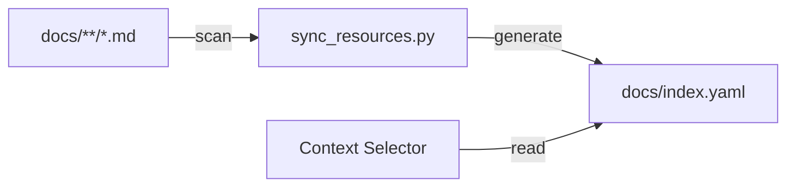
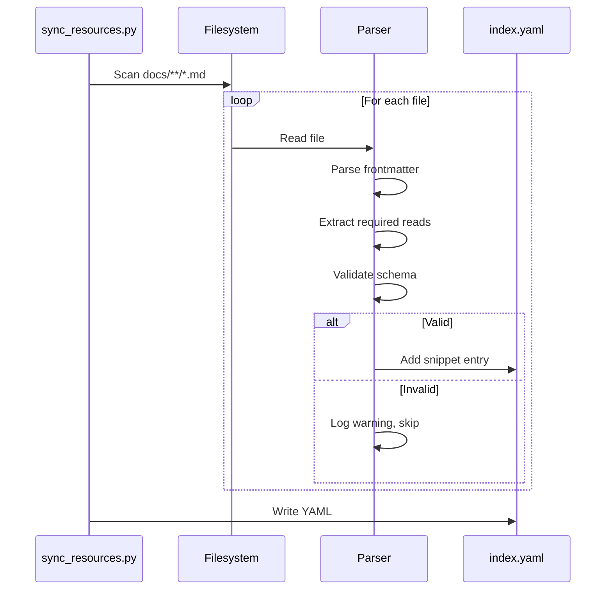

# Context Index — Architecture

## Purpose

- Provide a deterministic index of available docs for context selection.

- Snippet IDs must be unique.
- requires entries are resolved relative to the snippet file path.

- Scan snippet files, parse frontmatter, and collect metadata.
- Resolve `requires` against snippet IDs and paths.
- Write the consolidated index to `docs/index.yaml`.



## Inputs/Outputs

**Inputs:**

- Markdown files in `docs/global/` and `docs/project/`
- Snippet frontmatter (id, type, scope, description)
- `## Required reads` sections with `@` references

**Outputs:**

- `docs/index.yaml` with snippet metadata array
- Portable paths using `~/.teleclaude` for global docs
- Resolved requires as snippet IDs (not file paths)

## Invariants

- **Unique IDs**: Each snippet has globally unique ID; collisions detected and rejected.
- **Stable Paths**: Global docs use `~/.teleclaude/docs`, project docs use absolute or tilde-expanded paths.
- **Path Normalization**: The `teleclaude-docs` git filter smudges portable `@~/.teleclaude` references into local absolute paths and cleans them back on commit.
- **Type Validation**: Snippet types must match canonical taxonomy from `teleclaude/constants.py:TAXONOMY_TYPES`.
- **Schema Compliance**: All snippets validated against `scripts/snippet_schema.yaml` required sections.

## Primary flows

### 1. Index Generation



### 2. Requires Resolution

1. **Extract**: Parse `## Required reads` section
2. **Normalize**: Convert `@./relative.md` to absolute path
3. **Resolve**: Look up snippet ID from file path mapping
4. **Fallback**: If no ID found, use relative path as-is
5. **Store**: Save resolved requires array in snippet entry

### 3. Cycle Detection

```
Build dependency graph: snippet_id -> [required_snippet_ids]
For each snippet:
    Traverse requires recursively
    If snippet appears in own dependency chain:
        Log warning (does not block index generation)
```

### 4. Global vs Project Distinction

| Location        | Path in Index            | Usage                     |
| --------------- | ------------------------ | ------------------------- |
| `docs/global/`  | `~/.teleclaude/docs/...` | Baseline, shared policies |
| `docs/project/` | `~/path/to/project/...`  | Project-specific docs     |

## Failure modes

- **Missing Frontmatter**: Snippet skipped with warning. Does not block index generation.
- **Duplicate IDs**: Script exits with error listing collisions. Requires manual resolution before daemon can use index.
- **Invalid Type**: Snippet skipped. Logged with file path for manual correction.
- **File Read Error**: Snippet skipped. Logged with exception details.
- **YAML Write Failure**: Index generation fails. Daemon cannot start without valid index.
- **Schema Validation Failure**: Missing required sections logged as warnings. Index still generated but snippets may be incomplete.
