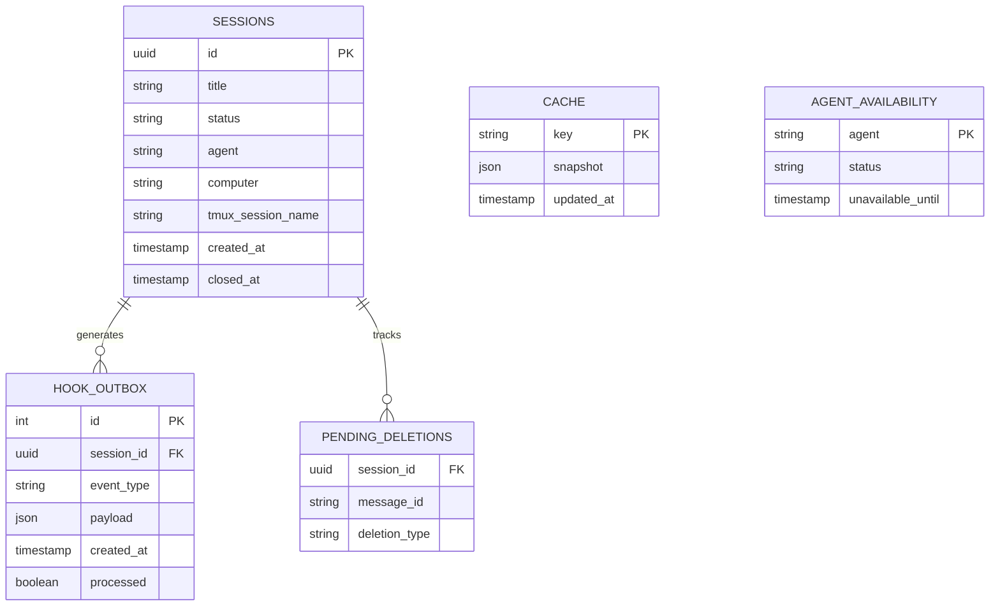
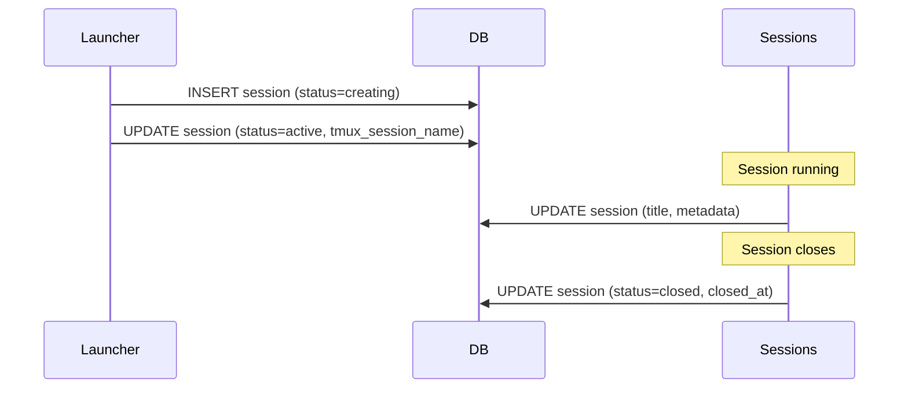
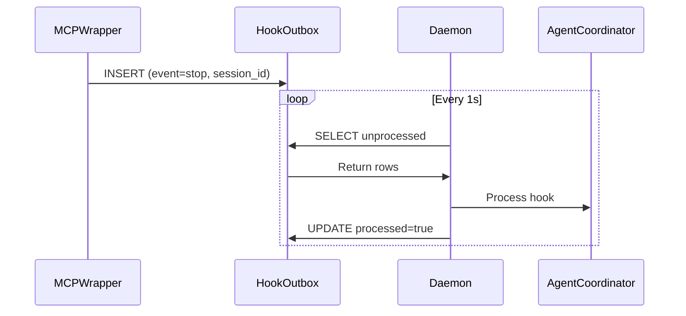

# Database — Architecture

## Purpose

- Persist daemon state for sessions, command durability, and UX continuity.

- Write sessions and command metadata on creation and updates.
- Append hook outbox events for durable delivery.
- Persist UX cleanup state for message deletion.

- Sessions and their metadata (title, status, agent info, tmux name).
- Hook outbox rows for agent events.
- UX state for message cleanup and registry message IDs.
- Agent assignments and voice mappings.

- The daemon uses a single SQLite file at teleclaude.db in the project root.
- Schema migrations run on startup to keep tables current.

## Inputs/Outputs

**Inputs:**

- Session lifecycle events (creation, updates, closure)
- Command queue entries for durable execution
- Hook outbox entries from mcp-wrapper
- UX state changes (message tracking for deletion)
- Cache snapshots from event-driven updates
- Agent availability status changes

**Outputs:**

- Session persistence for recovery after restarts
- Hook delivery queue for agent coordination
- Message cleanup registry for UX hygiene
- Cache reads for API/TUI fast path
- Agent fallback selection data

## Invariants

- **Single Database File**: Exactly one `teleclaude.db` per repository root; no sharding or replication.
- **Schema Versioning**: Alembic migrations run on startup; schema always current before operations begin.
- **Exclusive Lock**: Only one daemon process can hold write lock; prevents concurrent access corruption.
- **Referential Integrity**: Foreign keys enforced; orphaned records prevented.
- **Idempotent Writes**: Session updates are upserts; safe to replay without duplication.

## Primary flows

### 1. Session Lifecycle Persistence

### 2. Hook Outbox Processing

### 3. UX Message Cleanup Tracking

1. **Pre-Input Hook**: Query `pending_deletions` where `deletion_type='user_input'`
2. **Delete Messages**: Adapter deletes tracked message IDs
3. **Clear Registry**: Delete processed rows
4. **Post-Input Hook**: Insert new user message_id into `pending_deletions`

### 4. Cache Snapshot Read/Write

- **Write**: Event handlers update `cache` table with JSON snapshot + timestamp
- **Read**: API queries cache by key (`data_type:scope_id`)
- **TTL Check**: Compare `updated_at` against policy matrix
- **Refresh**: Background task updates stale entries

## Failure modes

- **Database Corruption**: Daemon fails to start. Requires manual recovery or restore from backup. No automatic repair.
- **Migration Failure**: Incompatible schema change. Daemon refuses to start. Manual rollback or fix migration.
- **Lock Contention**: Multiple processes attempt write. Second process waits, then fails with "database is locked". Indicates misconfiguration.
- **Disk Full**: Writes fail. Daemon may crash or enter degraded mode. Sessions lost until disk space freed.
- **Orphaned Hooks**: Hook outbox grows without processing. Indicates worker crash. Manual cleanup or daemon restart required.
- **Pending Deletions Accumulation**: Messages not cleaned up. UX degrades with clutter. Does not affect session functionality.
- **Cache Inconsistency**: Snapshot out of sync with source data. Resolved by next TTL refresh or digest change. Temporary staleness acceptable.
- **Foreign Key Violation**: Attempted insert of hook with non-existent session_id. Logged and skipped. Indicates timing issue or race condition.
