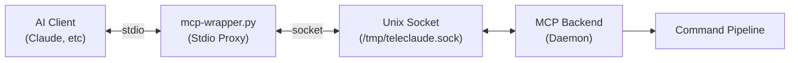
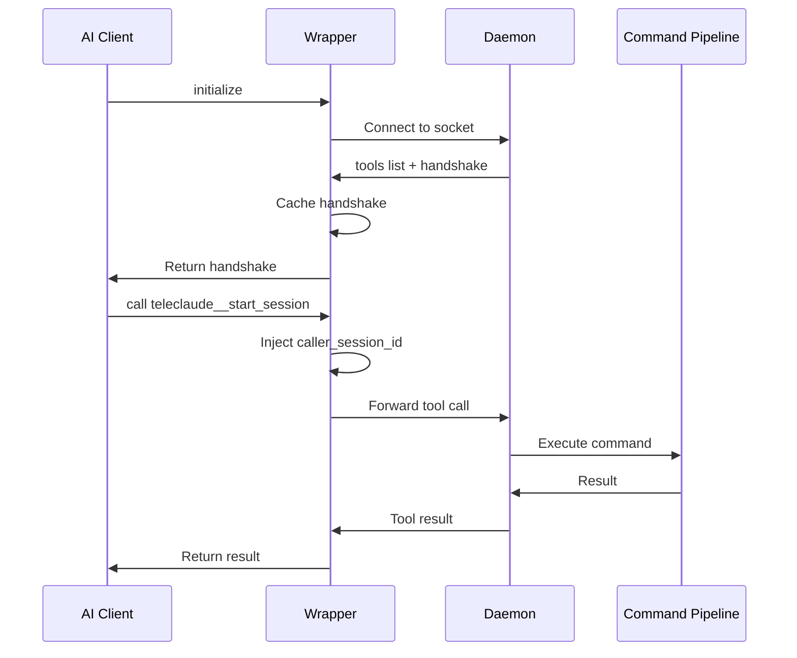
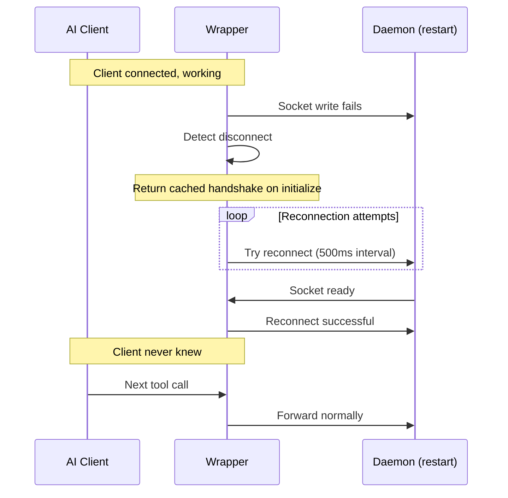
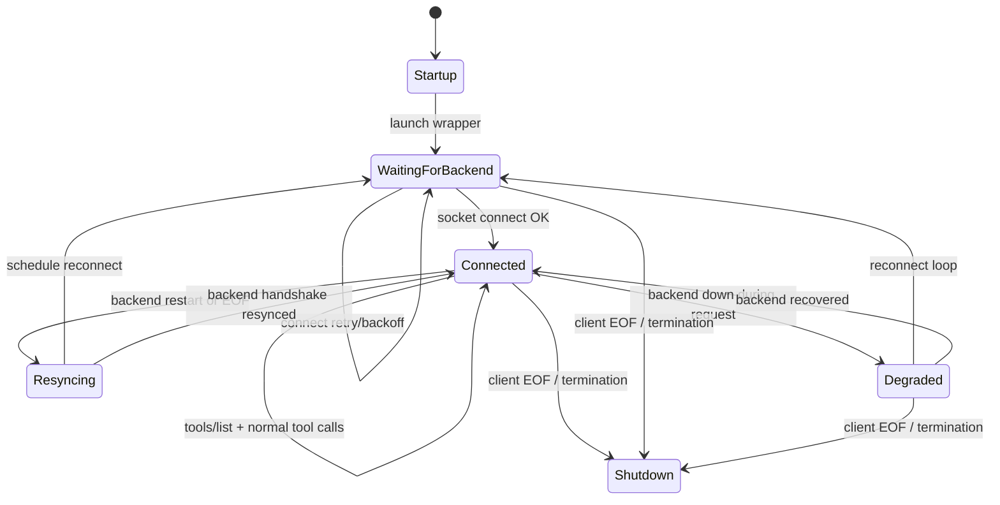

# Mcp Layer — Architecture

## Purpose

- Provide a resilient MCP interface for AI-to-AI communication.
- Preserve tool contract stability across daemon restarts.

- Clients connect via `bin/mcp-wrapper.py` (stdio entrypoint).
- Wrapper connects to the daemon via Unix socket and injects `caller_session_id`.
- Handshake responses are cached to avoid client restarts during daemon reconnects.

- MCP Client ↔ Stdio Wrapper ↔ Unix Socket ↔ Daemon Backend ↔ Command Pipeline.
- Wrapper returns cached handshake responses while backend reconnects.

## Inputs/Outputs

**Inputs:**

- MCP protocol messages from AI client (via stdio)
- Tool call requests with parameters
- Session ID injection from environment (`TMPDIR/teleclaude_session_id`)
- Backend reconnection events

**Outputs:**

- Tool results and errors to AI client
- Cached handshake responses (tools, prompts, resources)
- Background reconnection attempts to daemon
- Logging to stderr (throttled, non-blocking)

## Invariants

- **Zero-Downtime Reconnection**: Client never restarts due to backend unavailability; wrapper handles reconnection transparently.
- **Cached Handshake**: `initialize` response cached and replayed during backend reconnection without refetching.
- **Session ID Injection**: Every tool call includes `caller_session_id` from environment; enables AI-to-AI coordination.
- **Stdio Isolation**: Wrapper logs only to stderr; stdout reserved for MCP protocol.
- **Graceful Degradation**: If backend is down, wrapper returns error responses but remains connected to client.

## Primary flows

### 1. Normal Tool Call (Backend Available)

### 2. Backend Restart (Client Stays Connected)

### 3. Slow Backend Response

- Wrapper blocks on socket read until response arrives
- AI client sees normal latency
- No timeout imposed by wrapper; daemon is responsible for command timeouts

### Wrapper State Transitions

### Notes

- Wrapper stays alive even when backend is unavailable; it retries and preserves client connection.
- Handshake caching allows the client to continue without restarting during reconnects.
- Tool call flow only proceeds in `Connected`; in other states the wrapper returns errors or cached responses.

## Failure modes

- **Socket File Missing**: Wrapper logs error and retries connection. Returns error to client if call attempted during downtime.
- **Daemon Crash During Call**: Socket closes mid-request. Wrapper returns error to client, begins reconnection loop.
- **Handshake Cache Stale**: If daemon schema changes drastically, cached handshake may be outdated. Mitigated by clearing cache on major version bump.
- **Session ID Not Injected**: AI-to-AI coordination fails. Tool calls succeed but lack context. Indicates environment setup issue.
- **Stderr Log Overflow**: Throttled logging prevents runaway log spam. Silent drop of excess logs during high error rates.
- **Reconnection Storm**: Multiple wrappers reconnect simultaneously after daemon restart. Socket connection queue may saturate. Daemon handles FIFO.
