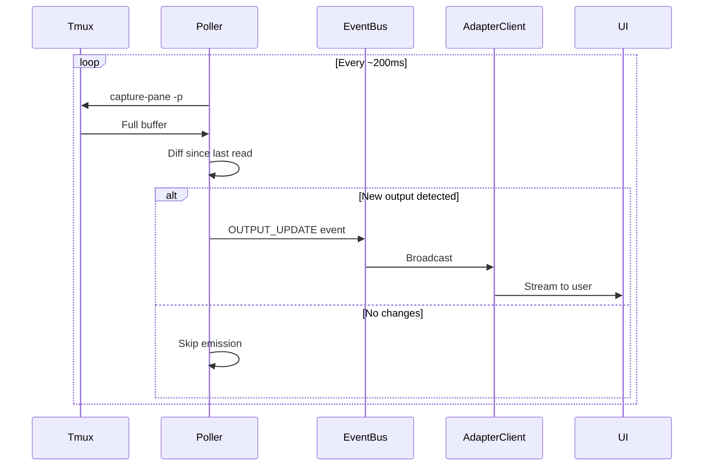
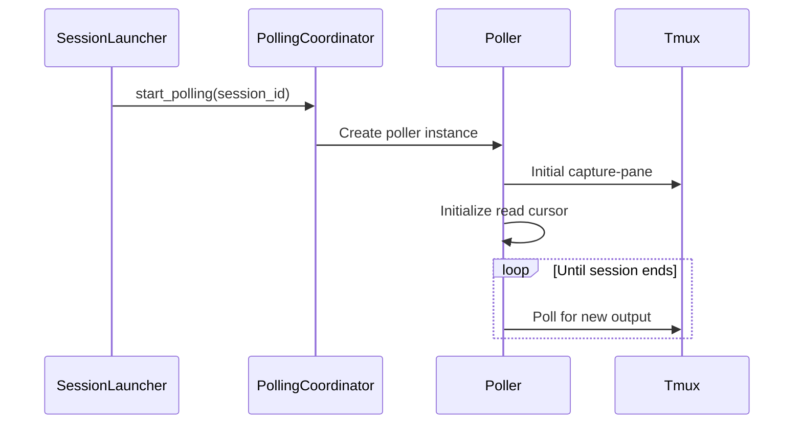
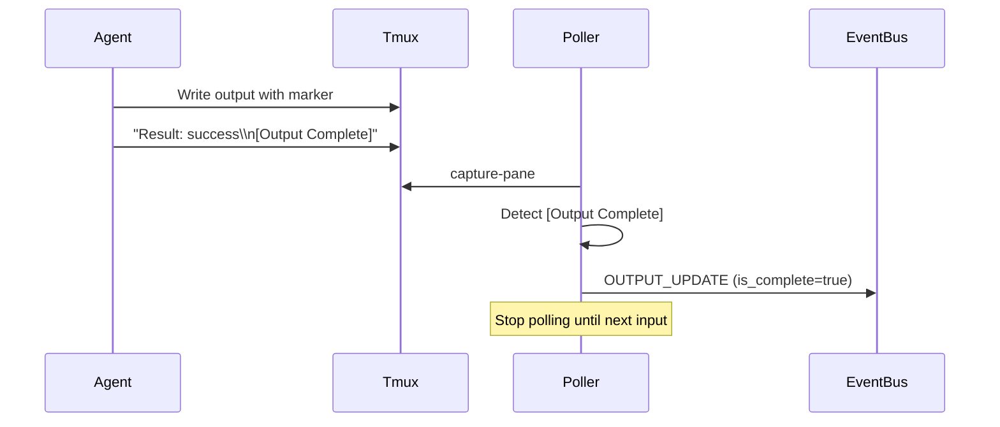

# Output Polling — Architecture

## Purpose

- Capture and stream real-time output from tmux panes to UI adapters without blocking the main event loop.

1. **OutputPoller**: A per-session worker that reads from the tmux output buffer.
2. **PollingCoordinator**: Manages the collection of pollers and ensures they start/stop with the session lifecycle.
3. **Dual Mode**:
   - **Human Mode**: Raw output streaming for manual sessions.
   - **AI Mode**: Smart output capture for agent-to-agent sessions, detecting turn completion.

4. **Read**: Poller executes `tmux capture-pane`.
5. **Diff**: Only new lines since the last read are captured.
6. **Emit**: `OutputEvent` is sent to the `EventBus`.
7. **Broadcast**: `AdapterClient` routes the event to all active observers (Telegram, WS, MCP).

## Inputs/Outputs

**Inputs:**

- Tmux pane output buffer via `tmux capture-pane -p`
- Session lifecycle events (start/stop triggers)
- Immediate poll requests from command injection

**Outputs:**

- `OutputEvent` emissions with session_id, chunk, is_complete marker
- Process exit detection and final status
- Turn completion signals for AI sessions

## Invariants

- **One Poller Per Session**: Each active session has exactly one poller instance; no duplicates.
- **Poller Lifecycle Matches Session**: Poller starts when session becomes active, stops when session closes.
- **Diff-Only Emission**: Only new lines since last poll are emitted; no duplicate output.
- **No Blocking**: Polling runs in async task; never blocks main event loop or command execution.
- **Graceful Stop**: Poller cleanup completes before session marked fully closed.

## Primary flows

### 1. Poller Startup

### 2. Output Detection and Streaming

1. **Capture**: Execute `tmux capture-pane -p -t tc_{session_id}`
2. **Diff**: Compare full buffer against last read position
3. **Extract**: Only new lines appended since last poll
4. **Emit**: Send `OUTPUT_UPDATE` event with new chunk
5. **Update Cursor**: Advance read position to end of buffer

### 3. Turn Completion Detection (AI Mode)

### 4. Process Exit Detection

- Poller runs `tmux has-session -t tc_{session_id}`
- If session missing → emit OUTPUT_UPDATE with process exit status
- Mark session as closed, stop polling

## Failure modes

- **Tmux Hangs on Capture**: Poller times out after 5s. Logs error, skips this poll cycle. Session appears frozen until next successful poll.
- **Diff Algorithm Drift**: Cursor position desync causes duplicate or missing output. Fixed by next full buffer capture or session restart.
- **Poller Task Crash**: Exception in async task. Poller stops, output streaming halts. Session remains active but frozen. Requires daemon restart.
- **Output Too Large**: Tmux buffer exceeds memory limits. Poller truncates to last N lines. Beginning of output lost.
- **Race Condition on Stop**: Poller emits output after session marked closed. Event ignored by adapters. Harmless.
- **Turn Marker Missing**: AI agent doesn't emit [Output Complete]. Poller continues streaming indefinitely. Summarization may be delayed or incomplete.
