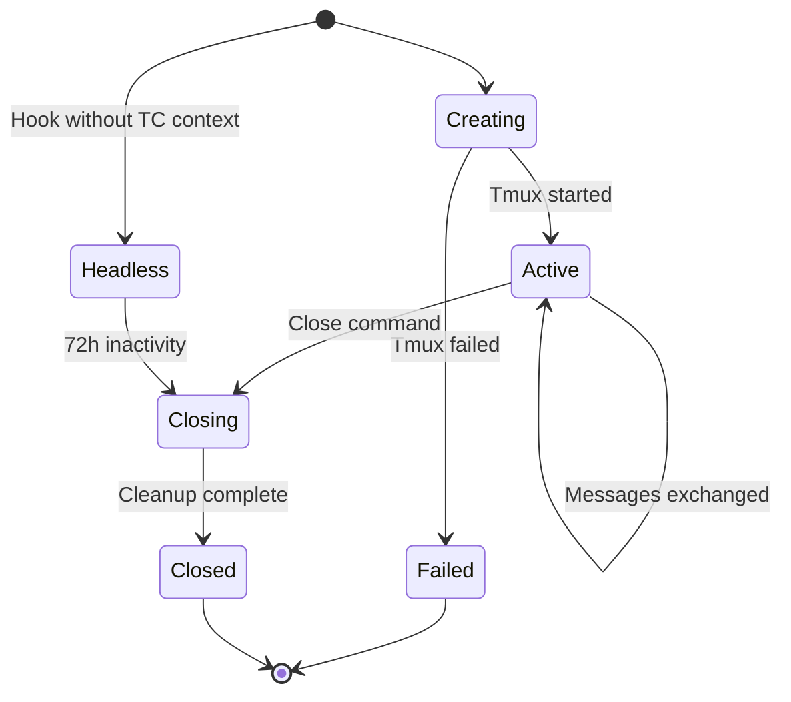
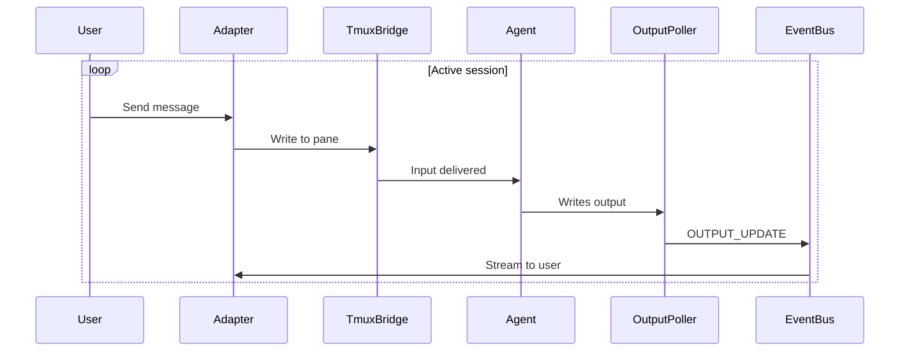

# Session Lifecycle — Architecture

## Purpose

- Describe the lifecycle of a session from creation to cleanup.

### 1. Creation

- **Ingress**: A `/new-session` command arrives via an adapter.
- **Queueing**: Command is persisted in the SQLite queue.
- **Execution**: The `SessionLauncher` starts a new `tmux` session.
- **Persistence**: Session metadata is saved in the `sessions` table.
- **Announcement**: The originating adapter announces the session (e.g., creates a Telegram topic). This is fire-and-forget; session creation does not block on channel readiness.

### 2. Active Operation

- **Input**: Commands are sent to the `tmux` pane via `tmux_io`.
- **Output**: The `OutputPoller` reads from `tmux` and emits `OutputEvent`s.
- **Summarization**: Periodic AI-summarization updates the Telegram topic.
- **Clutter Control**: User inputs and feedback are cleaned up based on session state.

### 3. Termination

- **Close Command**: User calls `/close-session` or AI calls `end_session`.
- **Cleanup**:
  - `tmux` process is killed.
  - SQLite record is marked as closed.
  - Final summary is posted.
  - Topic is archived or marked inactive.

### 4. Headless Sessions (Standalone TTS/Summarization)

- **Trigger**: An agent hook fires without a TeleClaude session context (no `teleclaude_session_id` in `$TMPDIR`).
- **Normalization**: The hook receiver only normalizes payloads and enqueues them in the outbox (no DB writes).
- **Creation (core-owned)**: The daemon creates a minimal session row with `lifecycle_status="headless"`, `tmux_session_name=NULL`, and `last_input_origin=InputOrigin.HOOK.value`.
- **Project path**: The daemon attempts to derive `project_path` (and `subdir`) from the native transcript file before persisting the headless session.
- **Persistence**: The new session UUID is written to `$TMPDIR/teleclaude_session_id` so subsequent hooks from the same agent process reuse it.
- **Pipeline**: Hook events flow through the normal outbox → daemon → summarization → TTS pipeline. Output polling is skipped (no tmux to poll).
- **Cleanup**: Headless sessions are cleaned up by the 72h inactivity sweep, same as regular sessions. They are excluded from stale-tmux detection (no tmux to check) but **are visible in UI listings** for observability.

## Inputs/Outputs

**Inputs:**

- Session creation command (computer, project_path, agent, title, message)
- User messages and commands during operation
- Agent output via tmux streams
- Close/end session command

**Outputs:**

- Tmux session with running agent
- Session metadata in SQLite (session_id, tmux_session_name, status, timestamps)
- Adapter channel creation (Telegram topic, TUI pane)
- Domain events (SESSION_STARTED, OUTPUT_UPDATE, SESSION_CLOSED)
- Final transcript and summary artifacts

## Invariants

- **Unique Session ID**: Each session has a globally unique UUID that never changes.
- **Stable Tmux Mapping**: Session ID maps to exactly one tmux session name `tc_{session_id[:8]}`.
- **Single Owner**: Each session is owned by the adapter that created it; ownership never transfers.
- **State Progression**: Sessions move forward through states only (no rollback from Closed to Active).
- **Cleanup Finality**: Once marked Closed, session metadata is immutable and tmux resources are released.

## Primary flows

### 1. Creation Flow

1. **Command Reception**: Adapter receives `/new-session` or MCP `start_session` call
2. **Validation**: Check project_path exists, agent is valid
3. **Persistence**: Create session record in SQLite with status=creating
4. **Tmux Launch**: `SessionLauncher` starts tmux with agent command
5. **Metadata Update**: Set tmux_session_name, status=active, started_at timestamp
6. **Channel Creation**: Adapter creates UI channel (fire-and-forget, non-blocking)
7. **Event Emission**: Broadcast SESSION_STARTED to EventBus
8. **Poller Start**: OutputPoller begins streaming tmux output

### 2. Active Operation Flow

### 3. Termination Flow

1. **Close Trigger**: User calls `/close-session` or AI calls `end_session`
2. **Status Update**: Mark session status=closing
3. **Tmux Kill**: Send SIGTERM to tmux session
4. **Poller Stop**: OutputPoller detects exit and stops
5. **Final Summary**: Generate and post session summary (if applicable)
6. **Channel Archive**: Adapter archives or marks channel inactive
7. **Metadata Finalize**: Set status=closed, closed_at timestamp
8. **Event Emission**: Broadcast SESSION_CLOSED
9. **Resource Cleanup**: Remove listeners, delete workspace directories if temporary

## Failure modes

- **Tmux Startup Failure**: Agent command invalid or environment broken. Session marked failed immediately. No cleanup needed.
- **Mid-Session Crash**: Tmux dies unexpectedly. OutputPoller detects exit code, marks session failed, emits event. Stale tmux zombie processes may remain.
- **Cleanup Timeout**: Channel archival or final summary hangs. Session marked closed anyway. Channel may show stale state.
- **Orphaned Tmux**: Daemon crash during active session leaves tmux running. Next startup detects orphan via process scan, marks session as recovered or failed.
- **Double Close**: Second close command is idempotent and returns success without action.
- **Hook Delivery Delay**: Session closes before agent hook processes. Hook delivered late causes out-of-order notification.
