---
description:
  Telegram UI adapter that maps topics to sessions and enforces UX cleanup
  rules.
id: teleclaude/architecture/telegram-adapter
scope: project
type: architecture
---

# Telegram Adapter — Architecture

## Required reads

- @docs/project/policy/ux-message-cleanup.md
- @docs/project/architecture/session-lifecycle.md

## Purpose

- Provide the human-facing Telegram interface for sessions, commands, and streaming output.

- Commands, voice inputs, and file uploads map to explicit command objects and dispatch via CommandService.
- Session topics are created per session and named with the computer prefix.
- Output is streamed by editing a single persistent message per session.
- Heartbeats update a shared registry topic for peer discovery.

- Command registration is performed only by the master bot.
- BotCommand names include trailing spaces when published.
- Feedback and user input messages are deleted via pending_deletions rules.
- Unauthorized users are ignored based on whitelist.

- Missing topic threads trigger recovery and metadata repair before retry.
- Telegram API errors are logged and surfaced as adapter failures.
- Outbound methods gracefully skip if channel not ready; polling retries ensure eventual delivery.

## Inputs/Outputs

**Inputs:**

- Telegram bot commands from users (/start, /cancel, /kill, /clear, etc.)
- Text messages in session topics (user input to AI)
- Voice messages (transcribed via external TTS service)
- File uploads (documents, images, audio)
- Callback queries (inline button clicks)
- Telegram API webhooks (updates)

**Outputs:**

- Forum topics created per session (one topic = one session)
- Output messages edited in-place with streaming AI responses
- Temporary feedback messages (auto-deleted per UX cleanup rules)
- Topic title updates with session status emoji
- Registry heartbeats published to discovery topic
- Command registrations to Telegram bot scope

## Invariants

- **One Topic Per Session**: Each AI session maps to exactly one Telegram forum topic; topic_id stored in session metadata.
- **Master Bot Registration**: Only master bot publishes BotCommand list; slave bots skip registration.
- **Trailing Space in Commands**: Published BotCommand names include trailing space for Telegram client formatting.
- **Single Output Message**: One persistent output message per session, edited repeatedly; message_id stored in session metadata.
- **UX Cleanup Rules**: User input and feedback messages deleted per pending_deletions policy; output messages persist until session closes.
- **Unauthorized User Blocking**: Messages from users not in whitelist ignored silently; no error response sent.

## Primary flows

### 1. Session Topic Creation

### 2. Streaming Output Render

### 3. UX Message Cleanup

```mermaid
sequenceDiagram
    participant User
    participant TG as Telegram
    participant Adapter
    participant DB

    User->>TG: Text message in topic
    TG->>Adapter: Update (message)
    Adapter->>Adapter: Extract session from topic
    Adapter->>DB: Store message_id in pending_deletions
    Adapter->>Daemon: SendMessageCommand
    Daemon->>Adapter: MESSAGE_SENT event
    Adapter->>TG: Send feedback "✅ Sent to AI"
    TG->>Adapter: feedback_message_id
    Adapter->>DB: Store feedback_message_id in pending_deletions

    Note over Daemon: AI completes turn

    Daemon->>Adapter: TURN_COMPLETE event
    Adapter->>DB: get_pending_deletions(session_id)
    DB->>Adapter: [user_message_id, feedback_message_id]
    loop For each message_id
        Adapter->>TG: deleteMessage(message_id)
    end
    Adapter->>DB: clear_pending_deletions(session_id)
```

### 4. Command Registration (Master Bot Only)

### 5. Voice Message Handling

```mermaid
sequenceDiagram
    participant User
    participant TG as Telegram
    participant Adapter
    participant TTS as Voice Service
    participant Daemon

    User->>TG: Send voice message
    TG->>Adapter: Update (voice)
    Adapter->>Adapter: Extract session from topic
    Adapter->>TG: getFile(file_id)
    TG->>Adapter: file_path
    Adapter->>TG: Download voice file
    Adapter->>TTS: Transcribe audio
    TTS->>Adapter: Transcribed text
    Adapter->>DB: Store voice_message_id in pending_deletions
    Adapter->>Daemon: SendMessageCommand(transcribed_text)
    Adapter->>TG: Send feedback "🎤 Transcribed: {text}"
```

### 6. Topic Title Status Updates

| Status  | Emoji | Trigger                              |
| ------- | ----- | ------------------------------------ |
| active  | 🟢    | AI responding, output streaming      |
| waiting | 🟡    | Waiting for user input               |
| slow    | 🟠    | Turn exceeds 30s                     |
| stalled | 🔴    | Turn exceeds 120s                    |
| idle    | ⏸️    | Session paused or no recent activity |
| dead    | ❌    | Session ended or crashed             |

### 7. Registry Heartbeat Publishing

### 8. File Upload Flow

| File Type | Processing                                     | Output                               |
| --------- | ---------------------------------------------- | ------------------------------------ |
| Document  | Download → save to /tmp → send file_path to AI | AI receives file path for processing |
| Image     | Download → send to AI with caption             | AI analyzes image content            |
| Audio     | Download → transcribe → send text to AI        | AI receives transcribed text         |

## Failure modes

- **Topic Creation Race**: Two events try to create topic simultaneously. Lock prevents duplicate creation; second attempt skips.
- **Missing Topic Metadata**: Session has no topic_id. Recovery flow creates new topic and updates metadata.
- **Telegram API Timeout**: Edit or send fails due to network. Logged; next polling cycle retries. Message may be stale.
- **Rate Limit Exceeded**: Too many edits in 1s window. Adapter skips edit, accumulates diff, retries next cycle.
- **Unauthorized User**: Message from non-whitelisted user. Silently ignored; no response or error sent.
- **Voice Transcription Failure**: TTS service down or returns error. User sees error feedback; voice message not deleted.
- **Master Bot Conflict**: Multiple bots claim master role. Last one wins; command list overwritten. Coordinated config required.
- **Output Message Deleted**: User manually deletes output message. Next edit fails; adapter creates new output message.
- **Cleanup Failure**: pending_deletions row exists but message already deleted. Logged; row cleared on next cleanup.
- **Topic Thread Closed**: User closes topic. Bot can still post but user doesn't see. Status tracking unaffected.
