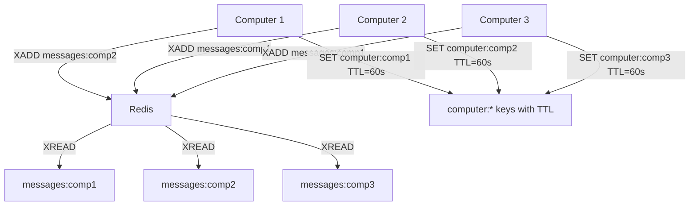
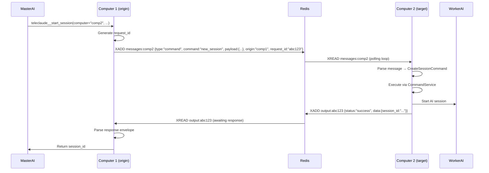
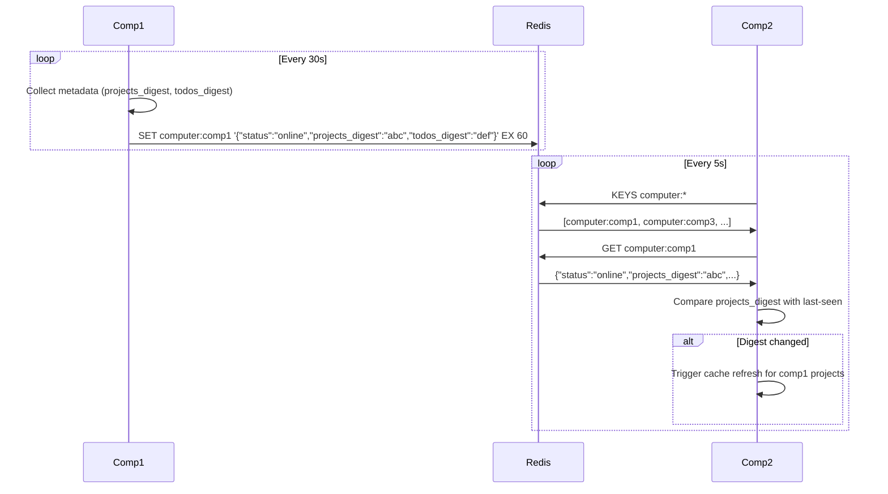
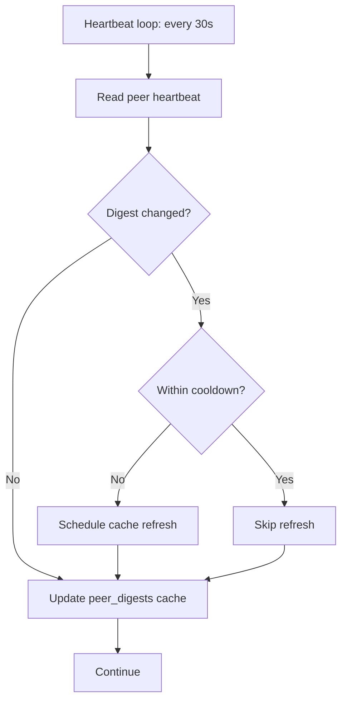
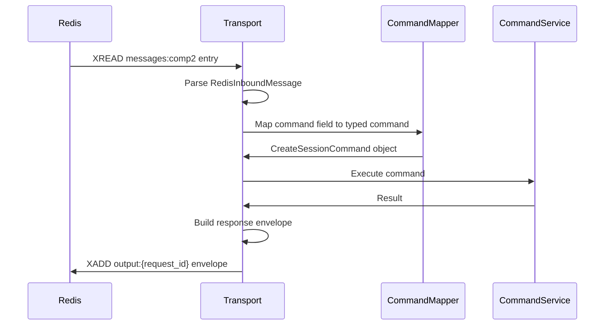
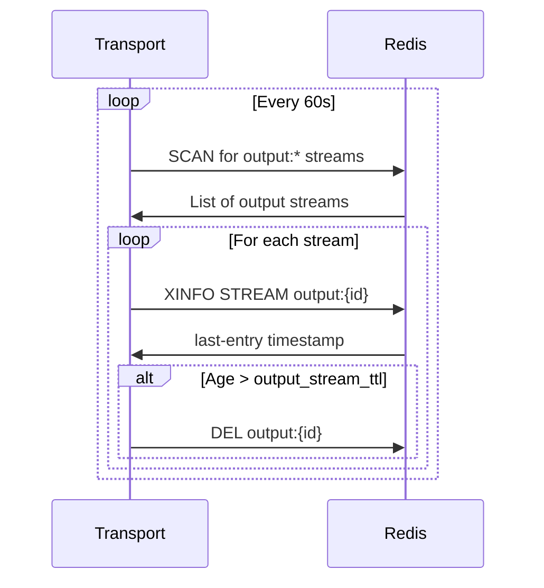

# Transport Adapter — Architecture

## Required reads

- @docs/project/concept/adapter-types.md

## Purpose

Responsibilities

- Deliver remote requests to target computers.
- Support one-shot responses for remote requests.
- Maintain peer discovery and heartbeat data.
- Preserve request/response correlation across the transport boundary.

Boundaries

- No human-facing message rendering or UX cleanup.
- No domain decisions; transport is purely delivery.

Invariants

- Transport only moves structured commands and results.
- Failures must be reported explicitly to the caller.

## Inputs/Outputs

**Inputs:**

- Remote command requests via Redis streams (messages:{computer})
- Response payloads from remote computers (output:{message_id})
- Heartbeat data from peer computers (computer:{name} keys with TTL)
- Digest updates (projects_digest, todos_digest)
- Session event notifications (session start, stop, update)

**Outputs:**

- Command messages sent to target computer's stream
- Response payloads sent to origin computer's output stream
- Heartbeat keys published with computer metadata and digests
- Cache refresh triggers when peer digests change
- Session event propagation to remote initiators

## Invariants

- **No UX Rendering**: Transport never sends UI messages; only structured commands and responses.
- **Correlation Preservation**: Request-response correlation via request_id; responses routed to correct caller.
- **Explicit Failure Reporting**: Errors always returned as {status: "error", error: "..."} envelopes; no silent failures.
- **Stream FIFO Order**: Messages processed in order sent (XREAD guarantees ordering within stream).
- **TTL-Based Discovery**: Computer registry uses Redis key expiration; dead computers auto-removed after heartbeat_ttl.

## Primary flows

### 1. Transport Architecture

### 2. Remote Command Execution

### 3. Heartbeat & Discovery

### 4. Digest-Based Cache Invalidation

### 5. Request-Response Correlation

| Component    | Field         | Value                          | Purpose                        |
| ------------ | ------------- | ------------------------------ | ------------------------------ |
| Origin       | request_id    | Generated UUID                 | Correlation key                |
| Origin       | origin        | "comp1"                        | Return address                 |
| Redis Stream | message_id    | "1234567890-0"                 | Redis-assigned stream entry ID |
| Target       | request_id    | From message (preserved)       | Response routing               |
| Target       | output stream | output:{request_id}            | Dedicated response channel     |
| Origin       | XREAD         | output:{request_id} BLOCK 5000 | Awaits response with timeout   |

### 6. Command Translation

### 7. Session Event Propagation

| Event              | Local Action                     | Remote Action                            |
| ------------------ | -------------------------------- | ---------------------------------------- |
| SESSION_STARTED    | Emit to local adapters           | Send to origin computer if remote        |
| SESSION_CLOSED     | Emit to local adapters           | Send to origin computer if remote        |
| SESSION_UPDATED    | Emit to local adapters           | Send to origin if title/status changed   |
| AGENT_NOTIFICATION | Inject to listener tmux sessions | Send to caller computer if remote caller |

### 8. Stream Cleanup

## Failure modes

- **Redis Connection Lost**: Transport reconnects with exponential backoff. Pending requests timeout after 60s. Heartbeat stops; peer computers mark as offline after TTL expires.
- **Message Stream Full**: XADD with MAXLEN drops oldest messages. Logged; messages lost if not processed in time.
- **Response Timeout**: Origin computer waits 60s for response on output:{request_id}. Returns error to caller if timeout.
- **Target Computer Offline**: Message appended to messages:{target} but never consumed. No acknowledgment; caller timeout after 60s.
- **Corrupted Message Payload**: Parse error on XREAD. Logged and skipped; message remains in stream (not ACKed).
- **Duplicate Request ID**: Origin generates UUID collision (extremely rare). Response may route to wrong caller.
- **Output Stream Leak**: Response stream not cleaned up due to crash. Cleanup worker prunes after TTL (default 300s).
- **Digest Collision**: Two states hash to same value. Cache refresh skipped until next TTL. Rare; eventual consistency via TTL.
- **Heartbeat Storm**: Many computers send heartbeats simultaneously. Redis handles writes serially; no corruption but increased latency.
- **XREAD Blocking Timeout**: BLOCK expires with no messages. Normal operation; loop retries immediately.
