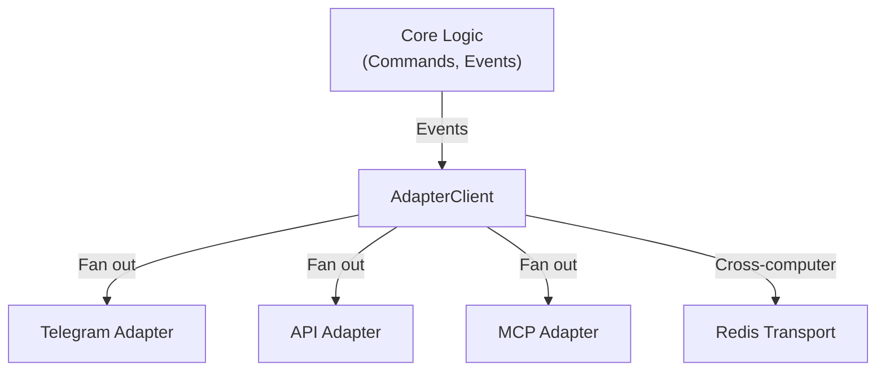
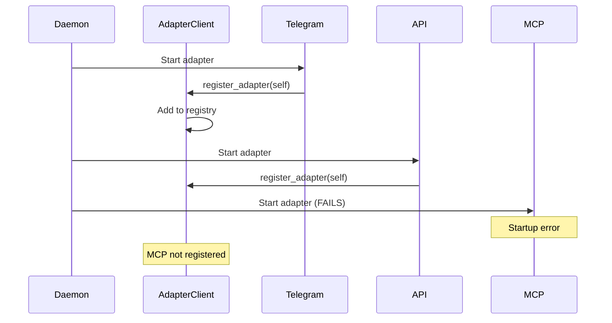
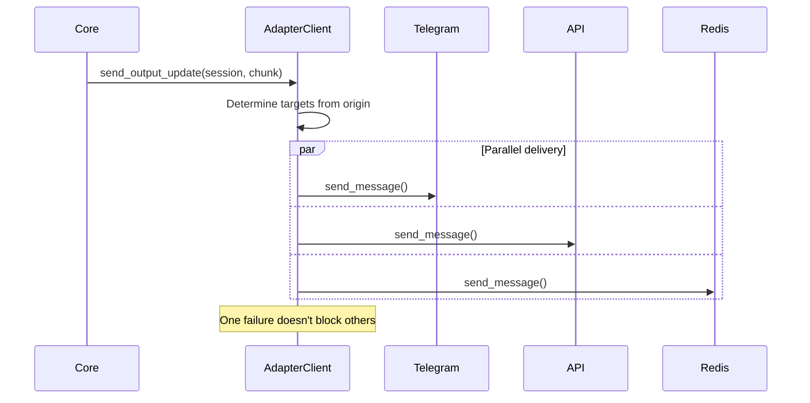
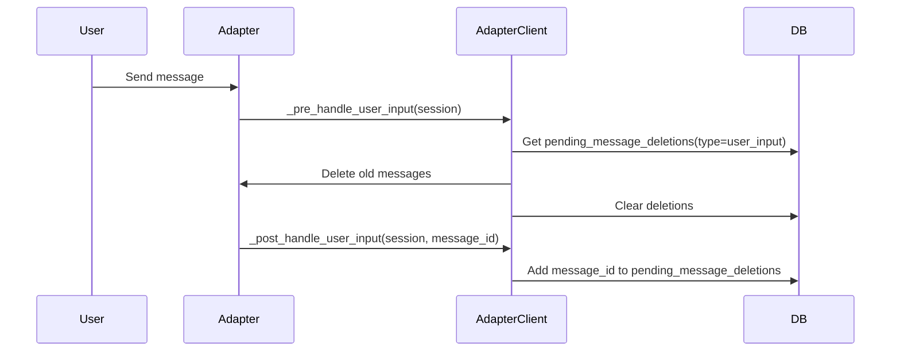
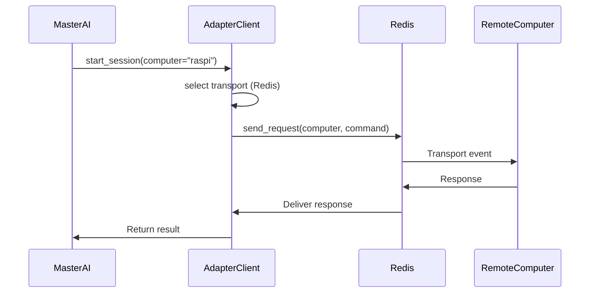

# Adapter Client — Design

## Purpose

- Own adapter lifecycle and fan-out delivery to adapters.
- Fans out output updates to the correct adapters based on last input origin and configuration.
- Ensures UI channel metadata before first delivery to a non-origin adapter.
- Applies UI cleanup hooks and observer notifications around user input and AI output.

## Inputs/Outputs

**Inputs:**

- Domain events from core (SESSION_STARTED, OUTPUT_UPDATE, SESSION_CLOSED, etc.)
- Commands and events from core logic that need delivery to adapters
- Adapter registration calls during startup
- UI protocol queries and transport routing (discover peers)
- Deletion requests (pending user input, feedback messages)

**Outputs:**

- Parallel delivery to all registered adapters
- Fan-out delivery to adapters
- UI channel creation requests (fire-and-forget)
- Deletion operations for message cleanup
- Cross-computer command routing via Redis transport

## Invariants

- **Adapter Independence**: One adapter failure never blocks others; each runs in isolated async task.
- **Registration Before Use**: Only adapters that successfully start are registered; failed adapters invisible to core.
- **Origin Tracking**: Last user input origin is tracked per session; subsequent output targets that origin.
- **UI Metadata Requirement**: Before sending to a non-origin adapter, ensure UI channel metadata exists.
- **Pre/Post Hooks**: User input cleanup (pre-hook) and message tracking (post-hook) run atomically.

## Primary flows

### 1. Adapter Registration (Startup)

### 2. Event Fan-Out (Output Update)

### 3. UI Cleanup Hooks (Pre/Post User Input)

### 4. Cross-Computer Routing

## Failure modes

- **Adapter Crash During Delivery**: Adapter raises exception. AC logs error and continues to other adapters. Failed adapter skipped on future events until daemon restart.
- **Channel Metadata Missing**: Attempting to send to non-origin adapter without channel fails. AC creates channel (fire-and-forget) and queues message for retry.
- **Transport Unavailable**: Cross-computer command fails immediately. Returns error to caller. Local operations unaffected.
- **Cleanup Hook Failure**: Pre/post hooks fail to delete messages or track IDs. Stale messages accumulate in UI. Does not block message delivery.
- **Parallel Delivery Timeout**: One adapter blocks indefinitely. Other adapters complete normally. Stuck adapter logged and skipped.
- **Discovery Failure**: No remote computers found. Commands targeting specific computer fail with "not found" error. Local sessions continue.
