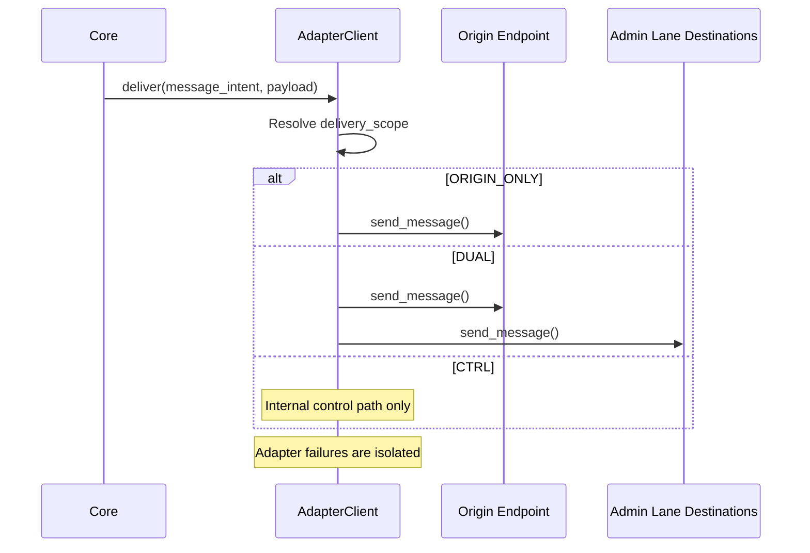

# Adapter Client — Design

## Purpose

- Own adapter lifecycle and message delivery across adapters.
- Resolve message intent into delivery scope (`ORIGIN_ONLY`, `DUAL`, `CTRL`).
- Preserve direct reply continuity to the origin endpoint.
- Apply UI cleanup hooks and observer notifications around user input and AI output.
- Leave rendering and placement strategy to adapters.

## Inputs/Outputs

**Inputs:**

- Domain events from core (SESSION_STARTED, OUTPUT_UPDATE, SESSION_CLOSED, etc.)
- Commands and events from core logic that need delivery to adapters
- Adapter registration calls during startup
- UI protocol queries and transport routing (discover peers)
- Deletion requests (pending user input, feedback messages)

**Outputs:**

- Scope-based delivery to UI adapters
- Origin-only delivery for notices and user-facing feedback
- Dual-lane delivery for operational output stream traffic
- UI channel creation requests (fire-and-forget)
- Deletion operations for message cleanup
- Cross-computer command routing via Redis transport

## Invariants

- **Adapter Independence**: One adapter failure never blocks others; each runs in isolated async task.
- **Registration Before Use**: Only adapters that successfully start are registered; failed adapters invisible to core.
- **Scope-First Routing**: Recipient selection follows message intent and delivery scope.
- **Origin Endpoint Continuity**: Origin identifies direct reply endpoint; it does not define fan-out policy.
- **Lifecycle vs Recipients**: Cleanup/lifetime settings never decide recipients.
- **UI Metadata Requirement**: Before sending to a non-origin adapter, ensure UI channel metadata exists.
- **Pre/Post Hooks**: User input cleanup (pre-hook) and message tracking (post-hook) run atomically.

## Primary flows

### 1. Adapter Registration (Startup)

### 2. Scope-Based Delivery

### 3. UI Cleanup Hooks (Pre/Post User Input)

### 4. Cross-Computer Routing

## Failure modes

- **Adapter Crash During Delivery**: Adapter raises exception. AC logs error and continues other recipients in the same scope.
- **Channel Metadata Missing**: Attempting to send to non-origin adapter without channel fails. AC creates channel (fire-and-forget) and queues message for retry.
- **Transport Unavailable**: Cross-computer command fails immediately. Returns error to caller. Local operations unaffected.
- **Cleanup Hook Failure**: Pre/post hooks fail to delete messages or track IDs. Stale messages accumulate in UI. Does not block message delivery.
- **Parallel Delivery Timeout**: One adapter blocks indefinitely. Other adapters complete normally. Stuck adapter logged and skipped.
- **Discovery Failure**: No remote computers found. Commands targeting specific computer fail with "not found" error. Local sessions continue.
