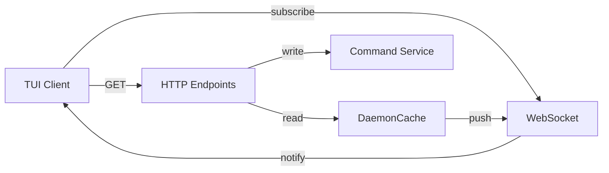
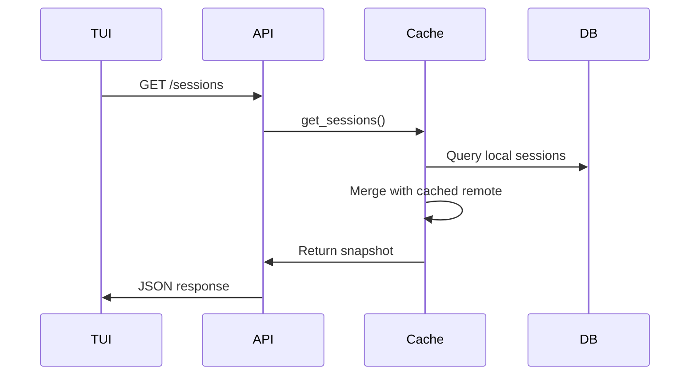
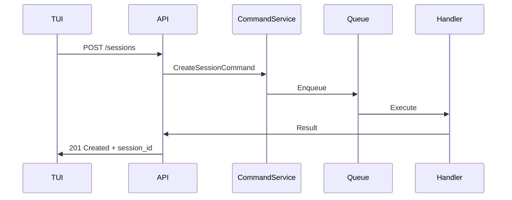
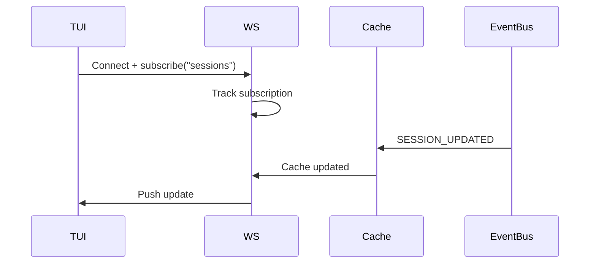

# Api Server — Design

## Required reads

- @docs/project/design/cache.md
- @docs/project/spec/event-types.md

## Purpose

Provide a resource-first API for TUI and CLI clients.

- Read endpoints return cached data immediately (local-only if cache is absent).
- Write endpoints map to explicit command objects via CommandService.
- WebSocket subscriptions drive cache interest tracking and refresh pushes.
- API handlers do not fetch remote data directly; cache owns refresh.
- Session updates are merged from local DB and cached remote summaries.

## Inputs/Outputs

**Inputs:**

- HTTP GET requests for resources (sessions, computers, projects, todos)
- HTTP POST requests for commands (create session, send message, end session)
- WebSocket subscription requests
- Cache update notifications
- HTTP requests and WebSocket subscriptions

**Outputs:**

- JSON responses with resource snapshots
- WebSocket push messages on cache updates
- HTTP 2xx/4xx/5xx status codes
- Command execution results
- Cached resource snapshots and event-driven updates

## Invariants

- **Read-Only Cache Access**: API never writes to cache; only reads snapshots.
- **Command Pipeline for Writes**: All mutations go through CommandService, never direct DB writes.
- **Immediate Response**: API returns cached data instantly; never blocks on refresh.
- **Subscription Cleanup**: WebSocket disconnect removes all subscriptions for that client.
- **No Remote Fetching**: API does not perform remote computer queries; cache owns that responsibility.

## Primary flows

### 1. Resource Read (Sessions Example)

### 2. Command Write (Create Session)

### 3. WebSocket Subscription & Push

### 4. Resource Endpoints

| Method | Endpoint           | Action         | Cache Key           |
| ------ | ------------------ | -------------- | ------------------- |
| GET    | /health            | Health check   | N/A                 |
| GET    | /sessions          | List sessions  | sessions:{computer} |
| POST   | /sessions          | Create session | Command             |
| POST   | /sessions/{id}/msg | Send message   | Command             |
| DELETE | /sessions/{id}     | End session    | Command             |
| GET    | /computers         | List computers | computers:all       |
| GET    | /projects          | List projects  | projects:{computer} |
| GET    | /todos             | List todos     | todos:{project}     |

## Failure modes

- **Cache Miss**: Returns empty array until cache refresh completes. Client sees "no data" briefly.
- **Command Execution Failure**: Returns 5xx with error message. Client must retry or investigate.
- **WebSocket Connection Drop**: Client reconnects, resubscribes. Misses push updates during downtime.
- **Stale Cache**: Client receives outdated data until TTL refresh. Acceptable for TUI; critical updates use events.
- **API Server Crash**: All HTTP/WS clients disconnected. Daemon restart restores service. In-flight commands may be lost.
- **Port Conflict**: API server fails to bind. Daemon logs error and continues without API. TUI clients cannot connect.
- **Request Timeout**: No timeout enforced by API; relies on client timeout. Long commands may appear hung.
