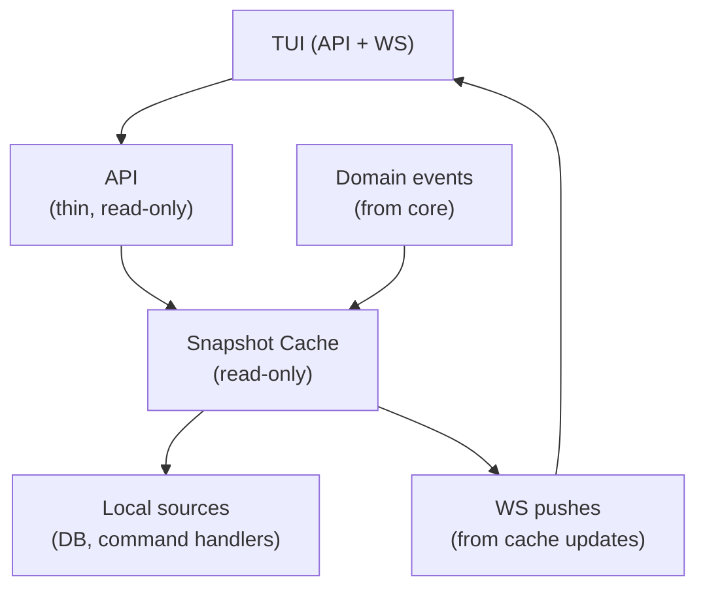
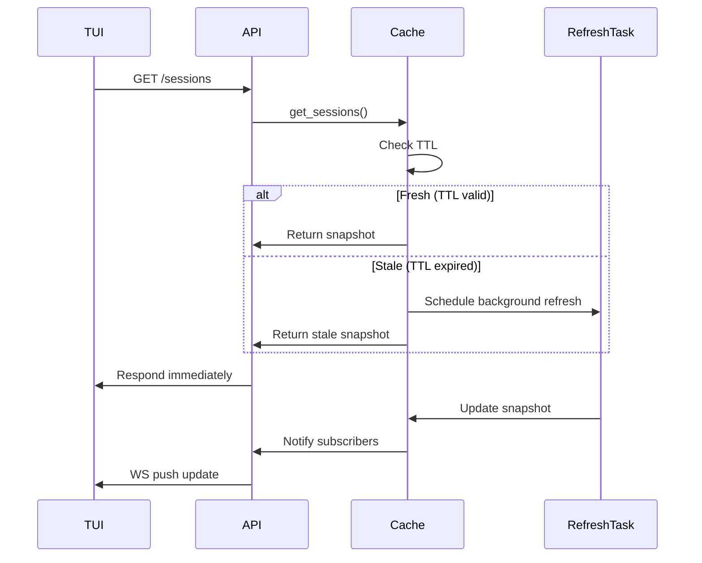
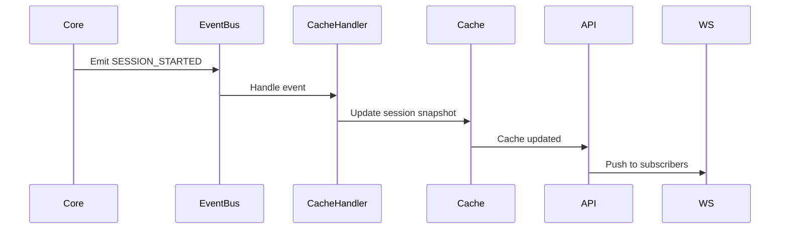
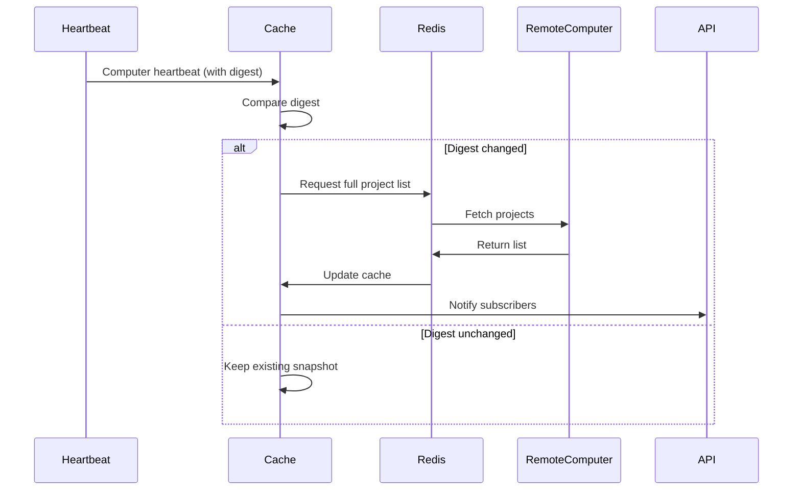

# Cache System — Design

## Purpose

Provides sub-millisecond read access to system state (computers, sessions, projects, todos) for TUIs and high-frequency callers.

1. **Snapshots**: The cache stores JSON snapshots of domain objects in a dedicated `cache` table.
2. **Read-Only**: The cache is NOT a source of truth; it is a materialized view of the database and runtime state.
3. **Event-Driven**: Updates are triggered by domain events (e.g., `SessionCreated`, `ComputerHeartbeat`).
4. **Warmup**: The cache is fully populated on daemon startup.

- Clients (TUI, API) SHOULD read from the cache and write via commands.
- Cache handlers MUST NOT perform complex I/O; they merely transform events into snapshots.

## Inputs/Outputs

**Inputs:**

- Domain events: SESSION_STARTED, SESSION_CLOSED, SESSION_UPDATED, COMPUTER_UPDATED, PROJECTS_UPDATED, TODOS_UPDATED
- Local data sources: SQLite sessions table, command handlers, project registry, computer registry
- Remote data triggers: Redis heartbeat digests

**Outputs:**

- JSON snapshots in cache table (keyed by data_type:scope)
- WebSocket push notifications to subscribed clients
- Cache hit/miss metrics for observability

## Invariants

- **Serve Stale Immediately**: API never blocks waiting for refresh; always returns cached value even if TTL expired.
- **Async Refresh**: Background refresh tasks triggered on TTL expiration; never block API calls.
- **Single Snapshot Per Scope**: Each cache key (data_type:scope_id) has exactly one snapshot entry.
- **Event-Driven Sessions**: Session updates bypass TTL; only domain events update session cache.
- **Digest Invalidation**: Projects and todos use heartbeat digest changes to override TTL and force refresh.
- **Warmup Completeness**: Cache fully populated during daemon startup before adapters start.

- **Refresh triggers**: allow refresh only on startup warmup, heartbeat digest change, first subscription interest, or TTL expiry on access.
- **Refresh constraints**: deny refresh requests outside those triggers, coalesce per peer + data type, enforce cooldowns, and never block API responses.
- **Emergency refresh**: requires explicit operator approval.

## Primary flows

### 1. Cache Read (Fast Path)

### 2. Event-Driven Update

### 3. Digest-Based Invalidation (Projects/Todos)

### 4. TTL-Based Refresh Policy

| Resource           | Scope        | TTL | Trigger         |
| ------------------ | ------------ | --- | --------------- |
| Computers          | Global       | 60s | TTL + Heartbeat |
| Projects           | Per-computer | 5m  | TTL + Digest    |
| Todos              | Per-project  | 5m  | TTL + Digest    |
| Sessions           | Per-computer | ∞   | Events only     |
| Agent availability | Global       | 30s | TTL only        |

## Failure modes

- **Cache Miss on Startup**: Cache not warmed up before API serves requests. Returns empty results until warmup completes. Mitigated by blocking adapter startup until cache ready.
- **Stale Data Window**: Clients see old data between TTL expiration and refresh completion (typically <1s). Acceptable for TUI; critical updates use event push.
- **Digest Collision**: Extremely rare. Two different project states hash to same digest. Next heartbeat or TTL refresh corrects it.
- **Refresh Task Accumulation**: If refresh tasks are slower than TTL, tasks queue up. Monitor task queue depth; indicates resource saturation.
- **WS Client Offline**: Client misses push notifications. On reconnect, client must refresh from cache. No automatic backfill.
- **SQLite Write Contention**: Concurrent cache updates block on SQLite write lock. Rare under normal load. High contention indicates too many cache writes.
