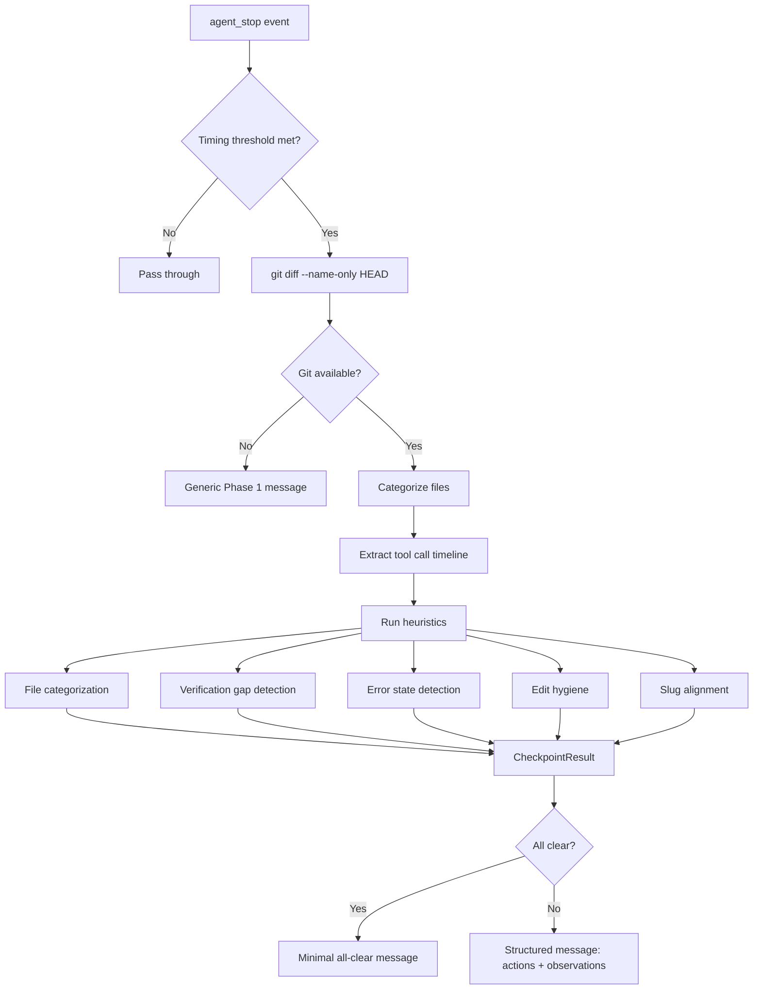
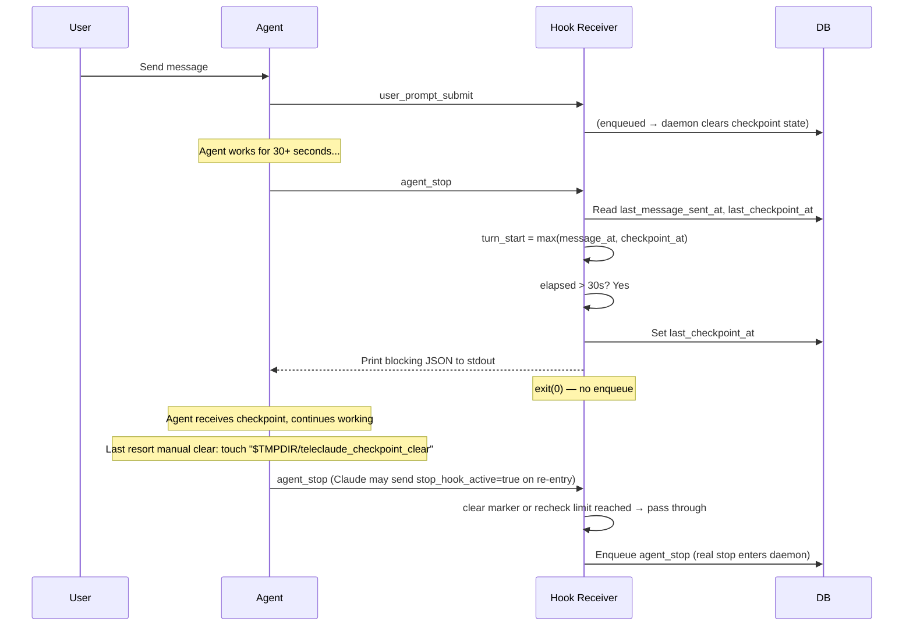
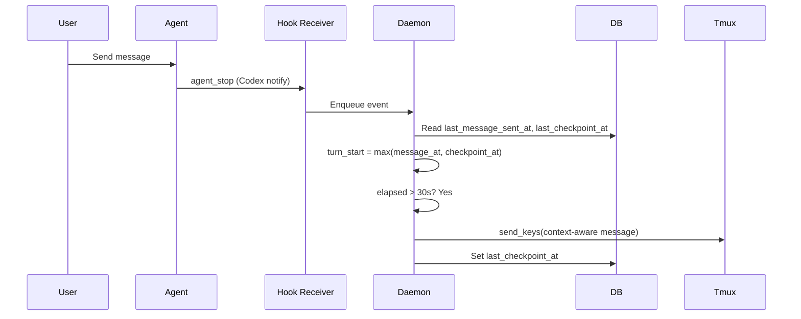
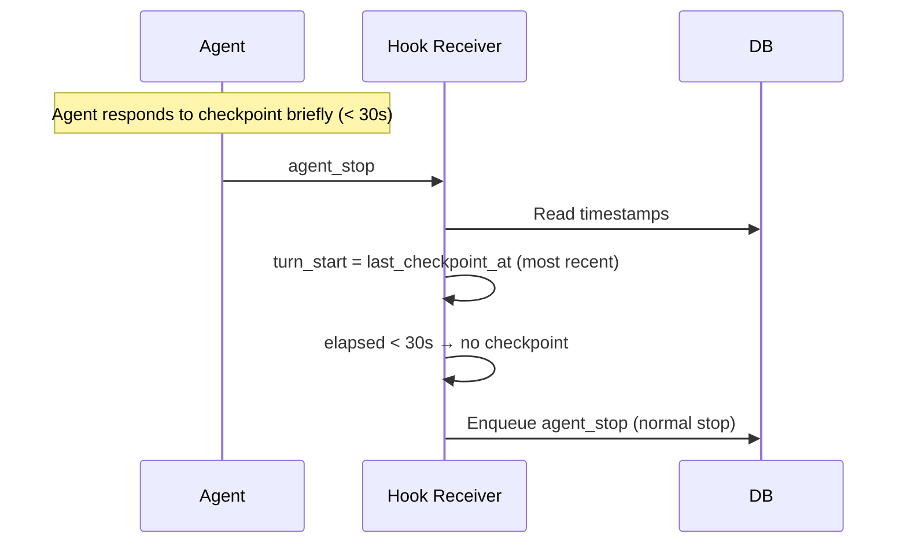
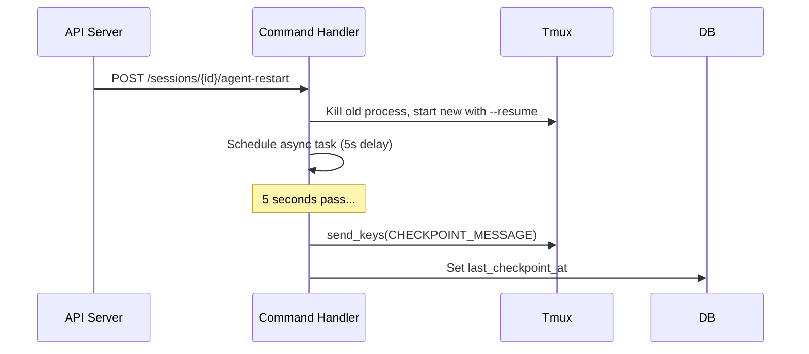

# Checkpoint System — Design

## Purpose

Deliver context-aware checkpoint messages to AI agents at natural work boundaries, prompting them to validate work and capture artifacts. The system uses a unified timer based on the most recent input event and keeps checkpoint messages invisible to session state.

All checkpoint payload variants use the canonical prefix `"[TeleClaude Checkpoint] - "` so runtime filtering can reliably distinguish system checkpoints from normal user prompts.

Two signal axes feed a shared checkpoint builder (`checkpoint.py`):

1. **File-based** — `git diff --name-only HEAD` maps changed files to file categories and action instructions (e.g., daemon code changed → "Run `make restart`").
2. **Transcript-based** — Tool call timeline from the current turn provides suppression evidence (action already taken), error state detection, and edit hygiene observations.

Two delivery paths exist:

- **Claude/Gemini**: Hook-based invisible checkpoint. The hook receiver (`receiver.py`) evaluates the checkpoint condition at the `agent_stop` boundary and returns blocking JSON to stdout. The CLI keeps the agent running without the checkpoint text appearing in the tmux pane.
- **Codex**: Tmux injection. The daemon's `AgentCoordinator` injects the checkpoint message into the tmux pane via `send_keys` (Codex has no hook output mechanism).

Both paths call the same `get_checkpoint_content()` entry point, ensuring parity.

## Inputs/Outputs

**Inputs:**

- `agent_stop` hook event — Agent's turn ended. Triggers checkpoint evaluation.
- `user_prompt_submit` hook event — New user input. Clears checkpoint state for the new turn.
- `tool_use` hook event — Agent finished reasoning. Tracked for other uses but not used in checkpoint decisions.
- Agent restart via API — Triggers unconditional checkpoint injection after a delay.
- `git diff --name-only HEAD` — Uncommitted files relative to HEAD, categorized into action instructions.
- `TurnTimeline` — Ordered tool calls from the current turn, extracted from the agent transcript via `extract_tool_calls_current_turn()`.
- `CheckpointContext` — Session context: project path, working slug, agent name.

**Outputs:**

- `CheckpointResult` — Structured heuristic output: matched file categories, required actions, observations, all-clear flag.
- **Claude/Gemini**: Blocking JSON printed to stdout by `receiver.py`. Claude: `{"decision": "block", "reason": <context-aware message>}`. Gemini: `{"decision": "deny", "reason": <context-aware message>}`. The `agent_stop` event is NOT enqueued (agent stays running). For Claude, the reason is injected as a `<system-reminder>`. For Gemini, the reason becomes a new prompt triggering a retry turn.
- **Codex**: Context-aware checkpoint message injected into the agent's tmux pane via `send_keys`.
- DB field updated: `last_checkpoint_at`.

## Invariants

1. **Unified turn timer**: `turn_start = max(last_message_sent_at, last_checkpoint_at)`. The most recent input event (real user message or previous checkpoint) marks when the agent's current work period began. If `now - turn_start < 30s`, the checkpoint is skipped. This works identically for all agent types and both delivery paths.

2. **Checkpoint messages are invisible to session state**: They never persist as user input. `handle_user_prompt_submit` returns early (before notification clearing or DB writes). `_extract_user_input_for_codex` filters them out before writing to `last_message_sent`. The native session transcript retains them as ground truth.

3. **Notification flag preservation**: Checkpoint injections do not clear the notification flag. Only real user input clears it. This prevents users from missing notifications about completed agent work.

4. **Per-turn clearing**: `handle_user_prompt_submit` clears `last_checkpoint_at` and `last_tool_use_at` on real user input so each turn starts fresh.

5. **Transcript-based dedup (Codex)**: For agents without `tool_use` support (e.g. Codex), an additional check reads the last user message from the session transcript via `extract_last_user_message`. If it matches the checkpoint constant, injection is skipped. This prevents checkpoint-response-stop loops specific to agents that fire `agent_stop` rapidly.

6. **TTS dedup**: Agent output extracted at `agent_stop` is compared against `last_feedback_received` in the session. If identical, summarization and TTS are skipped. This prevents double-speaking when a checkpoint-induced `agent_stop` re-extracts the same output.

7. **DB-persisted state**: Checkpoint state lives in the sessions table (`last_checkpoint_at`, `last_message_sent_at`). No in-memory state. Survives daemon restarts.

8. **Post-restart unconditional injection**: After an agent restart via the API, a checkpoint is injected after a 5-second delay regardless of the 30-second threshold.

9. **Session-scoped hook escape hatch (Claude/Gemini hook route)**: The receiver honors a per-session clear marker file (`teleclaude_checkpoint_clear`) in the session temp directory. If present, it is consumed and `agent_stop` passes through immediately. For Claude re-entry (`stop_hook_active=true`), the receiver allows at most one extra block by using a per-session `teleclaude_checkpoint_recheck` marker; subsequent re-entry passes through (consumed) to avoid infinite loops. State is reset on real `user_prompt_submit`.

10. **Hook stop suppression**: When `_maybe_checkpoint_output` fires for Claude/Gemini, the receiver prints blocking JSON and exits without enqueuing the `agent_stop` event. The daemon never sees the blocked stop, so no output extraction, TTS, or listener notifications fire for checkpoint turns.

11. **Suppressibility**: Every heuristic checks for positive evidence in the tool call timeline. If the expected action was already performed (e.g., `make restart` found in Bash commands), the instruction is suppressed. When all instructions are suppressed and no observations remain, the checkpoint is "all-clear".

12. **Two-layer error detection**: Layer 1 (structural gate) only fires for tool results with `is_error: true`. Layer 2 (content enrichment) pattern-matches the result snippet to produce targeted feedback. Successful commands with error-like output (e.g., log viewers showing tracebacks) never trigger observations.

13. **Fail-open design**: Git unavailable → generic Phase 1 message. Transcript unavailable → file-based instructions only (no suppression). Any exception in the builder → generic Phase 1 message. The checkpoint never blocks due to infrastructure failure.

14. **Delivery parity**: Both hook route (Claude/Gemini) and tmux route (Codex) call the same `get_checkpoint_content()` entry point with equivalent inputs, ensuring identical heuristic output regardless of delivery mechanism.

15. **Dynamic log-check window**: The required `instrukt-ai-logs teleclaude --since <window>` action is derived from elapsed time since the turn start (`max(last_message_sent_at, last_checkpoint_at)`), rounded up to minutes with a minimum of `2m`.

16. **Commit-neutral checkpoint policy**: Checkpoints are verification and safety prompts, not commit triggers. They must not require commits at `agent_stop`; commit decisions belong to task-completion flow.

17. **Silent housekeeping + short debrief policy**: Checkpoint payloads instruct agents to execute checkpoint-required housekeeping silently, then provide a short user-relevant debrief focused on task outcome, blocker, or decision request. Checkpoint chore details are omitted from user-facing messages.

## Primary flows

### 0. Context-aware checkpoint builder

### 1. Hook-based checkpoint (Claude/Gemini)

### 2. Tmux checkpoint (Codex only)

### 3. Checkpoint response cycle (no re-injection for quick responses)

### 4. Post-restart checkpoint (unconditional)

## Failure modes

| Scenario                                                      | Behavior                                                        | Recovery                                            |
| ------------------------------------------------------------- | --------------------------------------------------------------- | --------------------------------------------------- |
| Daemon restart during active turn                             | Timestamps persist in DB; next `agent_stop` evaluates correctly | No action needed                                    |
| DB field missing (migration not run)                          | `AttributeError` on session access                              | Run migration 004; daemon auto-runs on startup      |
| Agent silent after checkpoint                                 | Same output re-extracted at next `agent_stop`                   | TTS dedup skips speaking; DB still updates          |
| Rapid successive stops (< 30s)                                | Checkpoint skipped due to threshold                             | Correct behavior                                    |
| Codex checkpoint loop                                         | Transcript dedup detects own message                            | Correct behavior                                    |
| Both `last_message_sent_at` and `last_checkpoint_at` are None | No turn start → checkpoint skipped                              | First real user message sets `last_message_sent_at` |
| DB unavailable in receiver                                    | `_maybe_checkpoint_output` returns None (fail-open)             | Stop passes through normally                        |
| Hook output malformed                                         | CLI ignores non-JSON stdout; agent stops normally               | Next stop re-evaluates                              |
| Git not available in hook subprocess                          | `_get_uncommitted_files` returns None → generic Phase 1 message | Correct fail-open behavior                          |
| Transcript missing or corrupt                                 | `TurnTimeline(has_data=False)` → file-based instructions only   | No suppression; all actions listed                  |
| Large transcript (>512KB JSONL)                               | Extraction reads full file via `_get_entries_for_agent()`       | Performance acceptable for checkpoint frequency     |
| False suppression (evidence substring in unrelated command)   | Action incorrectly suppressed                                   | Acceptable: false suppression > false negative (R8) |

## See Also

- docs/project/spec/event-types.md — Canonical event type definitions including `tool_use`
