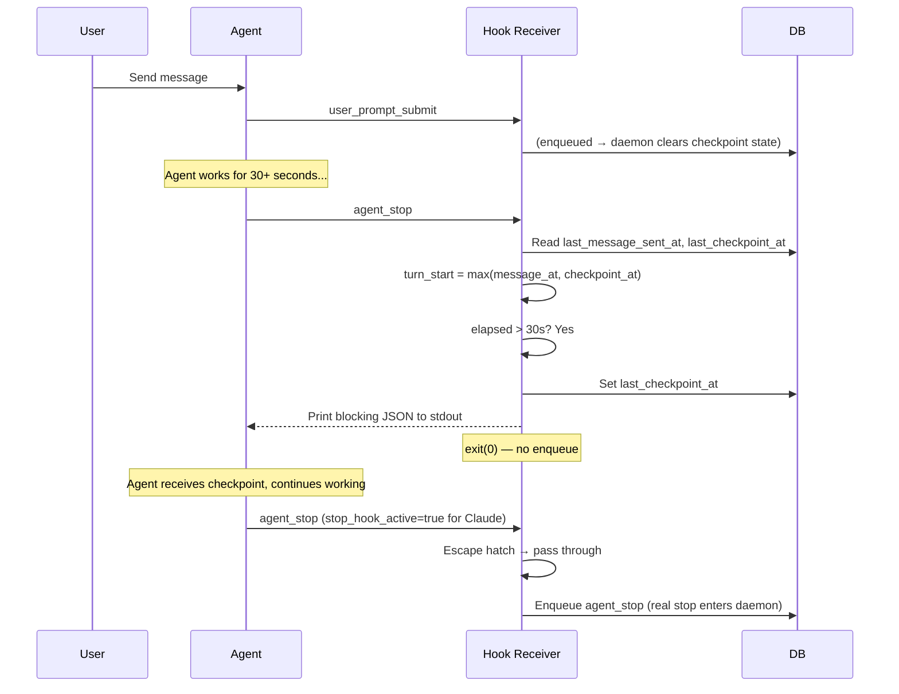
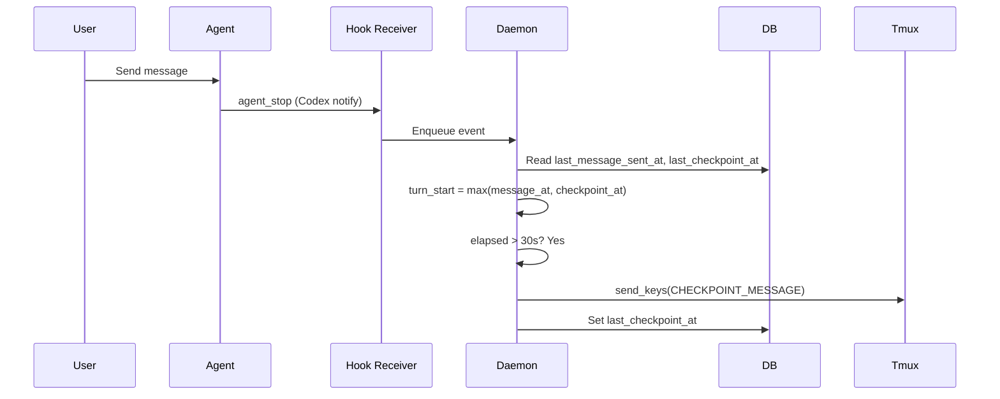
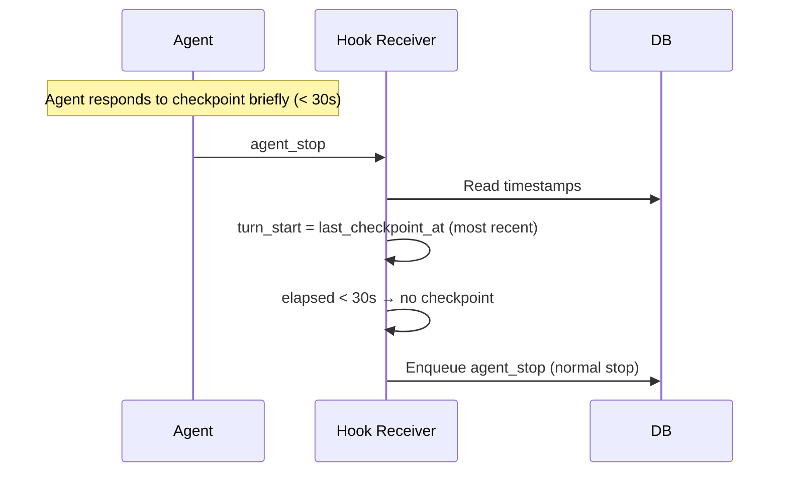
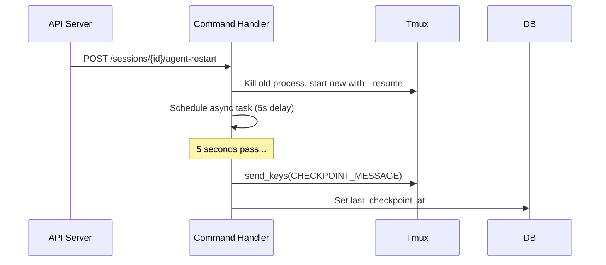

# Checkpoint System — Design

## Purpose

Deliver checkpoint messages to AI agents at natural work boundaries, prompting them to validate work and capture artifacts. The system uses a unified timer based on the most recent input event and keeps checkpoint messages invisible to session state.

Two delivery paths exist:

- **Claude/Gemini**: Hook-based invisible checkpoint. The hook receiver (`receiver.py`) evaluates the checkpoint condition at the `agent_stop` boundary and returns blocking JSON to stdout. The CLI keeps the agent running without the checkpoint text appearing in the tmux pane.
- **Codex**: Tmux injection. The daemon's `AgentCoordinator` injects the checkpoint message into the tmux pane via `send_keys` (Codex has no hook output mechanism).

## Inputs/Outputs

**Inputs:**

- `agent_stop` hook event — Agent's turn ended. Triggers checkpoint evaluation.
- `user_prompt_submit` hook event — New user input. Clears checkpoint state for the new turn.
- `after_model` hook event — Agent finished reasoning. Tracked for other uses but not used in checkpoint decisions.
- Agent restart via API — Triggers unconditional checkpoint injection after a delay.

**Outputs:**

- **Claude/Gemini**: Blocking JSON printed to stdout by `receiver.py`. Claude: `{"decision": "block", "reason": CHECKPOINT_MESSAGE}`. Gemini: `{"decision": "deny", "reason": CHECKPOINT_MESSAGE}`. The `agent_stop` event is NOT enqueued (agent stays running). For Claude, the reason is injected as a `<system-reminder>`. For Gemini, the reason becomes a new prompt triggering a retry turn.
- **Codex**: Checkpoint message injected into the agent's tmux pane via `send_keys`.
- DB field updated: `last_checkpoint_at`.

## Invariants

1. **Unified turn timer**: `turn_start = max(last_message_sent_at, last_checkpoint_at)`. The most recent input event (real user message or previous checkpoint) marks when the agent's current work period began. If `now - turn_start < 30s`, the checkpoint is skipped. This works identically for all agent types and both delivery paths.

2. **Checkpoint messages are invisible to session state**: They never persist as user input. `handle_user_prompt_submit` returns early (before notification clearing or DB writes). `_extract_user_input_for_codex` filters them out before writing to `last_message_sent`. The native session transcript retains them as ground truth.

3. **Notification flag preservation**: Checkpoint injections do not clear the notification flag. Only real user input clears it. This prevents users from missing notifications about completed agent work.

4. **Per-turn clearing**: `handle_user_prompt_submit` clears `last_checkpoint_at` and `last_after_model_at` on real user input so each turn starts fresh.

5. **Transcript-based dedup (Codex)**: For agents without `after_model` support (e.g. Codex), an additional check reads the last user message from the session transcript via `extract_last_user_message`. If it matches the checkpoint constant, injection is skipped. This prevents checkpoint-response-stop loops specific to agents that fire `agent_stop` rapidly.

6. **TTS dedup**: Agent output extracted at `agent_stop` is compared against `last_feedback_received` in the session. If identical, summarization and TTS are skipped. This prevents double-speaking when a checkpoint-induced `agent_stop` re-extracts the same output.

7. **DB-persisted state**: Checkpoint state lives in the sessions table (`last_checkpoint_at`, `last_message_sent_at`). No in-memory state. Survives daemon restarts.

8. **Post-restart unconditional injection**: After an agent restart via the API, a checkpoint is injected after a 5-second delay regardless of the 30-second threshold.

9. **Hook escape hatch (Claude)**: Claude's `stop_hook_active` field in the hook payload indicates the CLI already blocked a stop once this turn. When set, `_maybe_checkpoint_output` returns None, letting the real stop pass through to the daemon.

10. **Hook stop suppression**: When `_maybe_checkpoint_output` fires for Claude/Gemini, the receiver prints blocking JSON and exits without enqueuing the `agent_stop` event. The daemon never sees the blocked stop, so no output extraction, TTS, or listener notifications fire for checkpoint turns.

## Primary flows

### 1. Hook-based checkpoint (Claude/Gemini)

### 2. Tmux checkpoint (Codex only)

### 3. Checkpoint response cycle (no re-injection for quick responses)

### 4. Post-restart checkpoint (unconditional)

## Failure modes

| Scenario                                                      | Behavior                                                        | Recovery                                            |
| ------------------------------------------------------------- | --------------------------------------------------------------- | --------------------------------------------------- |
| Daemon restart during active turn                             | Timestamps persist in DB; next `agent_stop` evaluates correctly | No action needed                                    |
| DB field missing (migration not run)                          | `AttributeError` on session access                              | Run migration 004; daemon auto-runs on startup      |
| Agent silent after checkpoint                                 | Same output re-extracted at next `agent_stop`                   | TTS dedup skips speaking; DB still updates          |
| Rapid successive stops (< 30s)                                | Checkpoint skipped due to threshold                             | Correct behavior                                    |
| Codex checkpoint loop                                         | Transcript dedup detects own message                            | Correct behavior                                    |
| Both `last_message_sent_at` and `last_checkpoint_at` are None | No turn start → checkpoint skipped                              | First real user message sets `last_message_sent_at` |
| DB unavailable in receiver                                    | `_maybe_checkpoint_output` returns None (fail-open)             | Stop passes through normally                        |
| Hook output malformed                                         | CLI ignores non-JSON stdout; agent stops normally               | Next stop re-evaluates                              |

## See also

- general/policy/checkpoint — Behavioral policy for agents receiving checkpoints
- general/procedure/checkpoint — Step-by-step protocol for Validate → Capture
- project/spec/event-types — Canonical event type definitions including `after_model`
