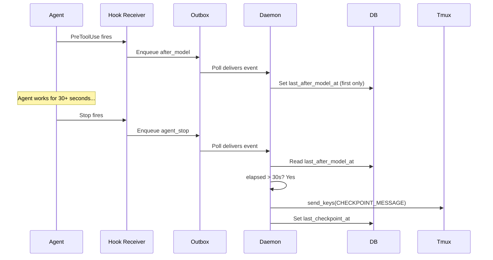
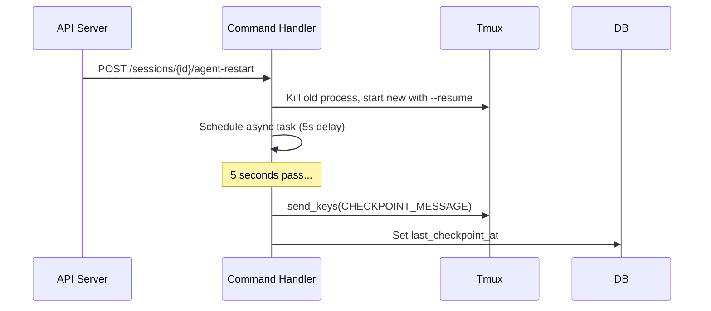
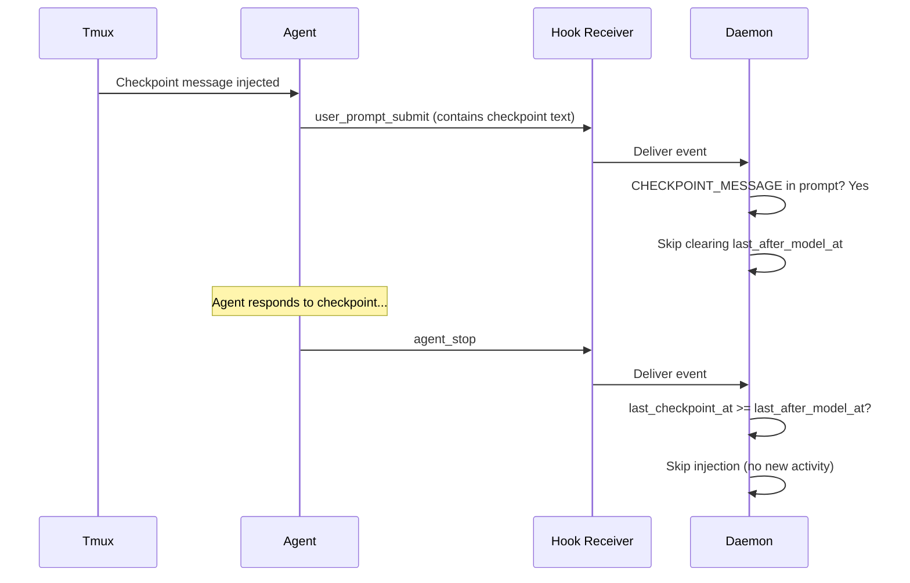

# Checkpoint System — Design

## Purpose

Inject checkpoint messages into AI agent tmux sessions at natural work boundaries, prompting agents to validate their work and capture artifacts. The system operates through the hook event pipeline with DB-persisted state that survives daemon restarts.

## Inputs/Outputs

**Inputs:**

- `after_model` hook event — Agent finished reasoning, tool call may follow. Recorded once per turn as the turn start timestamp.
- `agent_stop` hook event — Agent's turn ended. Triggers checkpoint evaluation.
- `user_prompt_submit` hook event — New user input. Clears checkpoint state for the new turn.
- Agent restart via API — Triggers unconditional checkpoint injection after a delay.

**Outputs:**

- Checkpoint message injected into the agent's tmux pane via `send_keys`.
- DB fields updated: `last_after_model_at`, `last_checkpoint_at`.

## Invariants

1. **30-second minimum threshold**: A checkpoint never fires unless the agent was actively working for at least 30 seconds, measured from the first `after_model` event to `agent_stop`.

2. **First-only recording**: `handle_after_model` records only the FIRST `after_model` per turn (when `last_after_model_at` is NULL). Subsequent tool calls in the same turn are skipped. This ensures elapsed time measures the full turn, not just the last tool call.

3. **Per-turn clearing**: `handle_user_prompt_submit` clears both `last_after_model_at` and `last_checkpoint_at` so each turn starts fresh — unless the prompt contains the checkpoint message itself (loop prevention).

4. **Loop prevention**: When an agent responds to a checkpoint, that response triggers `user_prompt_submit`. The handler detects the checkpoint message in the prompt text and skips clearing, preventing a re-injection cycle.

5. **DB-persisted state**: All checkpoint state lives in the sessions table (`last_after_model_at`, `last_checkpoint_at`). No in-memory state. Survives daemon restarts.

6. **Post-restart unconditional injection**: After an agent restart via the API, a checkpoint is injected after a 5-second delay regardless of the 30-second threshold. The agent is resuming with context and should debrief immediately.

## Primary flows

### 1. Normal turn checkpoint (30s threshold)

### 2. Post-restart checkpoint (unconditional)

### 3. Loop prevention

## Failure modes

| Scenario                                      | Behavior                                                                                            | Recovery                                                                        |
| --------------------------------------------- | --------------------------------------------------------------------------------------------------- | ------------------------------------------------------------------------------- |
| Stale hooks in running session                | PreToolUse sends wrong event type (`agent_output` instead of `after_model`)                         | Re-run `telec init` + restart session to load new hooks from settings.json      |
| Daemon restart during active turn             | Outbox event reordering may cause `user_prompt_submit` to clear state before `agent_stop` checks it | Next turn will work correctly; single missed checkpoint is acceptable           |
| DB field missing (migration not run)          | `AttributeError` on session access crashes hook dispatch                                            | Run migration 004; daemon auto-runs migrations on startup                       |
| Agent responds to checkpoint with no tool use | `after_model` never fires for text-only response, no re-injection                                   | Correct behavior — text-only checkpoint responses don't trigger new checkpoints |
| Rapid successive stops (< 30s)                | Checkpoint skipped due to threshold                                                                 | Correct behavior — short turns don't warrant checkpoints                        |

## See also

- general/policy/checkpoint — Behavioral policy for agents receiving checkpoints
- general/procedure/checkpoint — Step-by-step protocol for Validate → Capture
- project/spec/event-types — Canonical event type definitions including `after_model`
