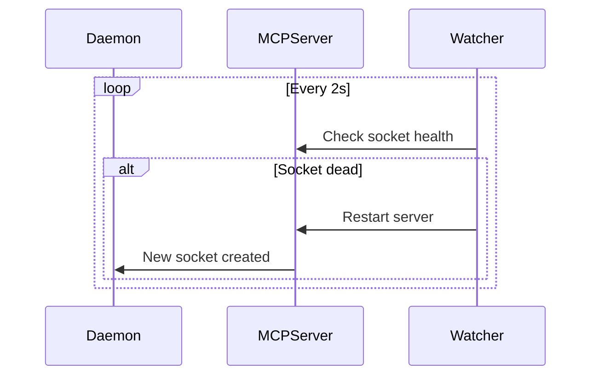

# Daemon — Design

## Required reads

- @docs/project/design/system-overview.md

## Purpose

- Coordinate adapters, command handling, tmux execution, and background tasks.
- Adapter interactions flow through `AdapterClient`.
- State is persisted in SQLite and surfaced via the cache.

## Inputs/Outputs

**Inputs:**

- Configuration file (`config.yml`, `teleclaude.yml`)
- Adapter events and inbound command objects
- SIGTERM/SIGINT for graceful shutdown
- Redis transport messages (if enabled)
- Adapter-specific inputs (Telegram bot API, MCP stdio, API HTTP requests)
- Filesystem artifacts (session transcripts, project registries)

**Outputs:**

- Adapter initialization and registration
- Command execution, tmux orchestration, and cache updates
- Command execution via CommandService
- Tmux session orchestration
- Cache population and updates
- Background task execution (hook processing, poller-watch, monitoring, WAL maintenance)
- Graceful shutdown signals to all subsystems

## Invariants

- **Single Instance**: Only one daemon process runs per repository root (enforced by SQLite exclusive lock).
- **Cache Before Adapters**: Cache must be fully warmed before adapters start serving requests.
- **Fail-Fast Startup**: Required interface startup failures abort daemon startup instead of degrading silently.
- **Outbox Recovery**: On restart, daemon processes undelivered hooks and pending commands from outbox tables.
- **Clean Shutdown**: SIGTERM triggers graceful adapter shutdown, command completion, and resource cleanup.

## Primary flows

### 1. Daemon Startup

### 2. Command Execution Cycle

### 3. Background Workers

| Worker             | Interval (default) | Purpose                                             |
| ------------------ | ------------------ | --------------------------------------------------- |
| Hook Outbox        | 1s                 | Process agent lifecycle hooks                       |
| MCP Socket Watcher | 2s                 | Monitor MCP socket health and trigger restart       |
| Poller Watch       | 5s                 | Keep per-session output pollers aligned with tmux   |
| Resource Monitor   | 60s                | Emit runtime resource snapshots                     |
| WAL Checkpoint     | 300s               | Prevent unbounded SQLite WAL growth                 |
| Launchd Watch      | 300s (optional)    | Log launchd state transitions on macOS              |
| Session Cleanup    | 1h                 | Periodic stale-session cleanup via maintenance loop |

### 4. MCP Server Auto-Restart

### 5. Graceful Shutdown

## Failure modes

- **Config Parse Error**: Daemon exits immediately with error. Systemd restarts with exponential backoff.
- **SQLite Lock Failure**: Another daemon instance is running. Refuses to start. Indicates configuration or deployment issue.
- **Migration Failure**: Database schema incompatible. Manual intervention required. No automatic rollback.
- **Interface Startup Failure (API/MCP/Adapter)**: Daemon fails startup (fail-fast) rather than running in partial mode.
- **Redis Unavailable**: Multi-computer features disabled. Local operations continue. Redis transport retries via a single reconnect loop; tasks wait on readiness.
- **Cache Warmup Timeout**: Daemon fails to start. Indicates database corruption or resource exhaustion.
- **Unclean Shutdown (SIGKILL)**: Hooks and commands may be partially processed. Next startup recovers from outbox.
- **Worker Task Crash**: Background worker stops. Dependent features stall (e.g., no output polling = frozen sessions). Daemon logs error but continues.
- **MCP Restart Storm**: MCP crashes repeatedly. Rate-limited to prevent infinite loop. Clients see connection errors.
- **Shutdown Timeout**: Cleanup takes too long; systemd may SIGKILL and leak resources.
