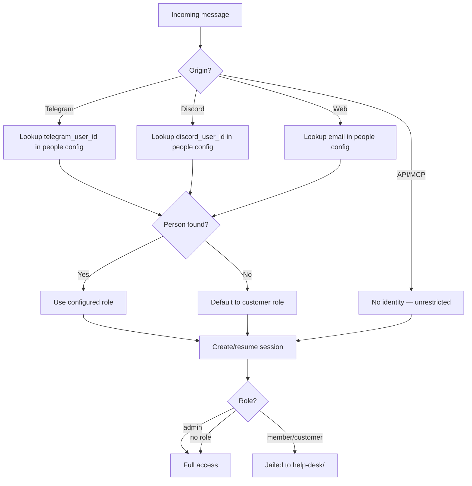
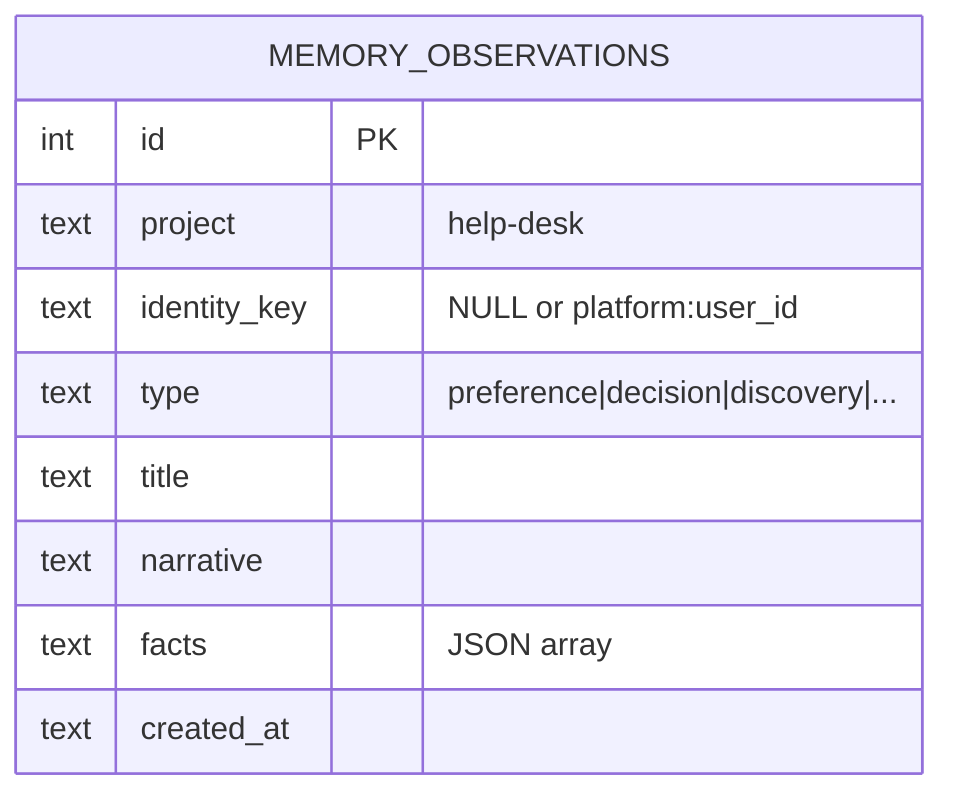
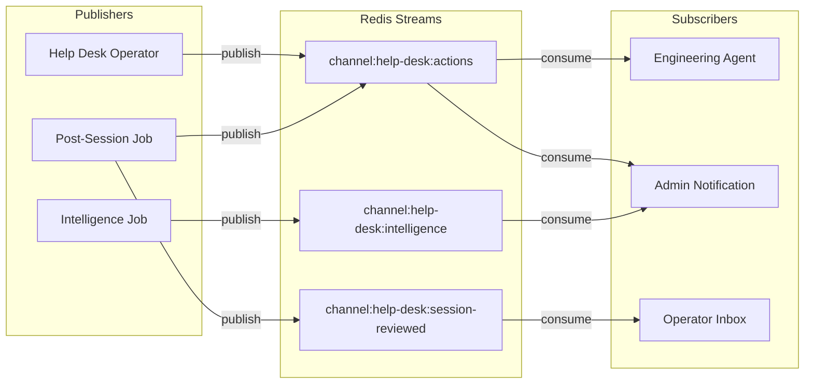
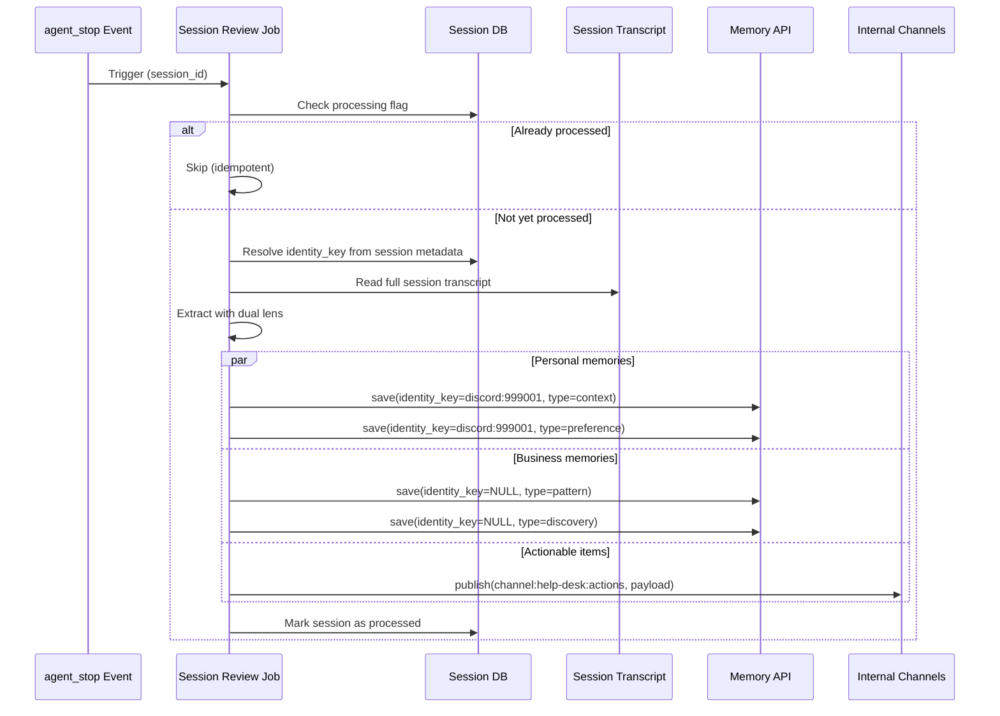
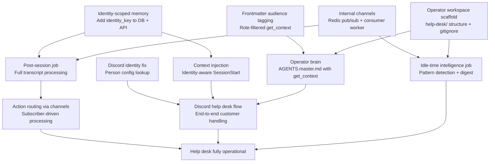
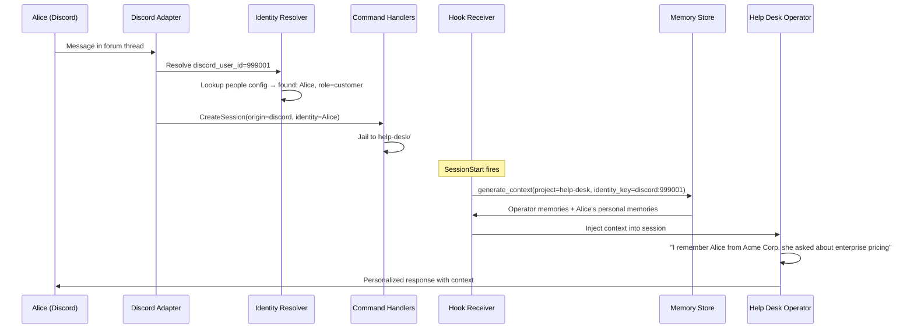
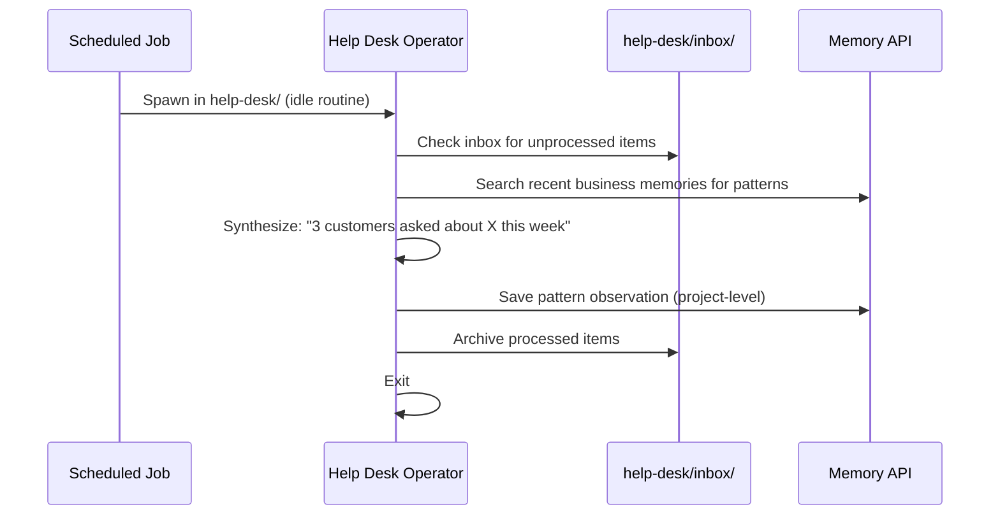

# Help Desk Platform — Design

## Required reads

@project/design/architecture/memory-system
@project/design/architecture/session-lifecycle
@project/design/architecture/context-selection
@project/design/architecture/redis-transport

## Purpose

Turn TeleClaude into a help desk platform where AI operators handle customer interactions through public-facing adapters (Discord, Telegram, WhatsApp), maintain per-customer memory continuity, and extract business intelligence from interactions — all within a single operator workspace inside the repository.

## Inputs/Outputs

**Inputs:**

- Customer messages via adapters (Discord forum threads, Telegram, WhatsApp, web)
- Identity from person config (`~/.teleclaude/people/{name}/teleclaude.yml`) or platform-specific defaults
- Operator brain (`help-desk/AGENTS.master.md`) defining persona, interests, and idle routines
- Role-filtered doc snippets via `get_context` (audience-tagged frontmatter)

**Outputs:**

- AI-handled customer conversations with memory continuity
- Identity-scoped personal memories (per-customer observation history)
- Project-scoped business memories (aggregate patterns, complaints, insights)
- Actionable items published to internal channels (follow-ups, escalations, feature requests)
- Operator workspace artifacts (inbox, logs, processed outcomes)

## Architecture

### Operator Workspace

The help desk lives as a subdirectory in the TeleClaude repository. Tracked content (brain, docs, config) is versioned. Runtime content (customer data, logs) is gitignored.

```
help-desk/
├── AGENTS.master.md          # tracked — operator brain (persona, interests, idle routines)
├── README.md                 # tracked — landing page
├── docs/                     # tracked — curated external-facing documentation
├── .gitignore                # ignores runtime dirs
├── inbox/                    # gitignored — items to process during idle time
├── logs/                     # gitignored — interaction logs
└── outcomes/                 # gitignored — extracted actionable items
```

The `AGENTS.master.md` compiles into `AGENTS.md` (same as all agent artifacts) and provides:

- Operator persona: help desk operator, not generic assistant
- Awareness of platform capabilities via `get_context` (role-filtered)
- Idle-time routines: inbox processing, log extraction, cleanup
- Observer interests: what to extract for personal vs. business memory

### Identity Resolution

All adapters resolve identity through the same path: person config lookup by platform credentials, with platform-specific defaults for unknown users.



**Discord identity fix:** Add `discord` credentials to `PersonConfig` and `CredsConfig` (same pattern as `TelegramCreds`). The identity resolver looks up `discord_user_id` in person config. Unknown Discord users default to `customer` role (jailed). Known Discord users get their configured role.

**Identity key format:** `{platform}:{platform_user_id}` — e.g., `discord:999001`, `telegram:12345678`, `web:alice@acme.com`. This is the scoping key for identity-bound memories.

### Identity-Scoped Memory

The memory system gains a second scoping axis. The `project` field remains (operator-level namespace). A new `identity_key` field optionally scopes memories to a specific person.



**Query semantics:**

| Query                                            | Returns                                   |
| ------------------------------------------------ | ----------------------------------------- |
| `project=help-desk, identity_key=NULL`           | Operator's general/business memories only |
| `project=help-desk, identity_key=discord:999001` | Alice's personal memories only            |
| `project=help-desk` (no identity filter)         | All memories for the help desk            |

**Context injection at SessionStart:**

```sql
-- Inject both operator knowledge and customer-specific memories
WHERE project = :project
  AND (identity_key IS NULL OR identity_key = :identity_key)
ORDER BY created_at_epoch DESC
LIMIT 50
```

The hook receiver resolves the session's identity (from `session.human_role` + adapter metadata) and passes the `identity_key` to `generate_context_sync`. If no identity is available, only project-level memories are injected.

**API changes:**

- `POST /api/memory/save` — add optional `identity_key` field
- `GET /api/memory/search` — add optional `identity_key` query param
- `GET /api/memory/inject` — add optional `identity_key` query param
- No `identity_key` → saved/queried as project-level memory (NULL)

### Internal Channels (Pub/Sub)

Agents need a way to publish structured output without knowing who consumes it. Internal channels provide this: named Redis Streams where agents publish and subscribers eventually process.



**Channel naming:** `channel:{project}:{topic}` — e.g., `channel:help-desk:actions`, `channel:engineering:bug-reports`.

**Publishing:** Agents publish via an MCP tool (`teleclaude__publish`) or HTTP API (`POST /api/channels/{name}/publish`). The agent doesn't need to know who subscribes — it folds the mail, puts it in the pipe, and moves on.

**Subscribing:** Configured per-project in `teleclaude.yml`. Each subscription maps a channel pattern to an agent command that processes incoming messages:

```yaml
# In teleclaude.yml
channels:
  subscriptions:
    - channel: 'channel:help-desk:actions'
      filter:
        action_type: [escalation, churn_signal]
      target:
        notification: admin_telegram
    - channel: 'channel:help-desk:actions'
      filter:
        action_type: [bug_report]
      target:
        project: teleclaude
        command: /process-bug-report
    - channel: 'channel:help-desk:actions'
      filter:
        action_type: [feature_request]
      target:
        project: teleclaude
        command: /process-feature-request
    - channel: 'channel:help-desk:session-reviewed'
      target:
        project: help-desk
        command: /process-session-review
```

**Consumer worker:** A daemon background task polls subscribed channels using Redis consumer groups. When a message arrives, it either:

1. Routes to a notification channel (existing notification infrastructure)
2. Spawns an agent in the target project with the message as input

**Redis consumer groups** give us:

- Exactly-once processing across multiple computers subscribing to the same channel
- Unacknowledged messages get redelivered (durability on agent death)
- Multiple consumers can load-balance within a group
- Pending message inspection for debugging stuck deliveries

**Cross-computer routing:** Redis Streams are inherently cross-computer. An agent on the raspi publishes to `channel:help-desk:actions`; the macbook's consumer picks it up. No extra plumbing needed beyond the existing Redis connection.

**MCP tool surface:**

```
teleclaude__publish(channel, payload)    # Publish a message to a channel
teleclaude__channels_list()              # List available channels and their subscribers
```

The publish tool is available to all agents. Channel creation is implicit — publishing to a non-existent channel creates it.

### Doc Snippet Audience Tagging

Doc snippets gain an `audience` field in frontmatter to control visibility via `get_context`:

```yaml
---
id: project/design/architecture/session-lifecycle
type: design
audience: [admin] # default — internal only
---
```

**Audience values:**

| Value       | Who sees it                                                      |
| ----------- | ---------------------------------------------------------------- |
| `admin`     | Admin users and their agents (default for all current docs)      |
| `member`    | Members and admins                                               |
| `help-desk` | Help desk operators (curated subset for customer-facing context) |
| `public`    | Anyone, including customers directly (future)                    |

The `get_context` tool filters by the calling session's resolved role. The help desk operator, running with operator-level access, sees `admin` + `help-desk` tagged docs. The docs in `help-desk/docs/` are automatically tagged `help-desk`.

**Migration:** All existing doc snippets default to `audience: [admin]`. No change in behavior until explicitly whitelisted.

### Member Personal Folders

The same pattern applies to internal team members. Each member gets a persistent personal folder on the computer:

```
~/.teleclaude/people/{name}/workspace/
├── AGENTS.master.md          # personal agent brain
├── ...                       # artifacts created together
```

When a member's session lands in their folder, the memory system injects:

1. Project-level memories for that workspace
2. Identity-scoped memories for that person

This gives every member a personal AI assistant that remembers their history, preferences, and ongoing work — same mechanism as help desk customers, just with a richer role.

### Post-Session Processing Job

A single idempotent job processes help desk sessions after they end. It is triggered by the `agent_stop` event for sessions in the help-desk project, but also runs periodically to catch any sessions that were missed (agent death, glitch, event loss).



The job extracts through two lenses in a single pass:

1. **Personal memories** (identity-scoped) — what to remember about THIS person: preferences, context, communication style, open questions, relationship history
2. **Business memories** (project-scoped) — what is interesting for US: feature requests, complaints, confusion patterns, sentiment, competitive mentions
3. **Actionable items** — published to internal channels for routing to subscribers

**Job configuration** (in `teleclaude.yml` jobs section):

```yaml
jobs:
  help-desk-session-review:
    schedule: 'on_event:agent_stop'
    project: help-desk
    agent: claude
    thinking_mode: fast
    filter:
      project_path_contains: help-desk
  help-desk-session-review-sweep:
    schedule: '*/30 * * * *' # every 30 minutes
    project: help-desk
    agent: claude
    thinking_mode: fast
    # Picks up unprocessed sessions missed by event trigger
```

**Processing flag**: A column or marker on the session record (e.g., `help_desk_processed_at`) prevents duplicate processing. The sweep job queries for help-desk sessions where this flag is NULL and `lifecycle_status = 'stopped'`.

### Action Taxonomy

Actionable items extracted from customer interactions follow a CRM-inspired vocabulary. Each action type maps to a channel topic.

| Action Type       | Description                                                 | Channel Topic                        |
| ----------------- | ----------------------------------------------------------- | ------------------------------------ |
| `follow_up`       | Promise or commitment made to customer                      | `channel:help-desk:follow-ups`       |
| `escalation`      | Needs human judgment or authority                           | `channel:help-desk:escalations`      |
| `feature_request` | Customer wants functionality that doesn't exist             | `channel:help-desk:feature-requests` |
| `bug_report`      | Something is broken or behaving unexpectedly                | `channel:help-desk:bug-reports`      |
| `knowledge_gap`   | Question could not be answered — docs missing               | `channel:help-desk:knowledge-gaps`   |
| `promise`         | Explicit commitment with deadline                           | `channel:help-desk:promises`         |
| `churn_signal`    | Customer expressing frustration or considering alternatives | `channel:help-desk:churn-signals`    |
| `praise`          | Positive feedback or satisfaction signal                    | `channel:help-desk:praise`           |

Actions are simultaneously:

1. **Saved to memory** — so the operator and intelligence job can query them
2. **Published to channels** — so subscribers process them asynchronously

Action payload published to channels:

```json
{
  "action_type": "feature_request",
  "priority": "medium",
  "session_id": "abc-123",
  "identity_key": "discord:999001",
  "customer_name": "Alice",
  "title": "Feature request: dark mode",
  "summary": "Third customer to request dark mode this month",
  "context": "Customer was asking about UI customization options"
}
```

Subscribers decide what to do with each action: notify an admin, create a todo, spawn an agent in another project, or just accumulate for reporting.

### Idle-Time Intelligence Job

A separate scheduled job runs periodically to perform aggregate analysis across all processed sessions:

```yaml
jobs:
  help-desk-intelligence:
    schedule: '0 6 * * *' # daily at 6am
    project: help-desk
    agent: claude
    thinking_mode: med
```

This job:

1. Queries recent business memories and actions across all customers
2. Detects patterns: recurring complaints, trending topics, sentiment shifts
3. Generates a daily intelligence digest
4. Saves synthesis as project-level memory observations
5. Publishes significant patterns to `channel:help-desk:intelligence`

### Operator Brain (`AGENTS.master.md`)

The operator brain defines the agent's persona, capabilities, and autonomous routines. It compiles into `AGENTS.md` via the standard artifact pipeline.

**Core sections:**

1. **Identity**: Help desk operator for the TeleClaude platform. Not a generic assistant — an autonomous operator that handles customer interactions with authority.

2. **Knowledge access**: Uses `get_context` for platform documentation (role-filtered). Accesses `help-desk/docs/` for curated external-facing content.

3. **Memory awareness**: Understands that personal memories (identity-scoped) provide customer continuity. Uses the memory API to store observations during interactions.

4. **Interaction style**: Professional, helpful, concise. Adapts to customer's communication style (detected via personal memories). Escalates when confidence is low rather than guessing.

5. **Observer interests** (for dual-observer prompts):
   - Personal: customer name, company, role, preferences, communication style, open questions, relationship history
   - Business: feature requests, complaints, confusion points, sentiment, competitive mentions, pricing discussions

6. **Escalation rules**: When to involve a human admin — complexity beyond knowledge base, customer explicitly requesting human, security-sensitive topics, billing disputes.

7. **Idle routines**: What to do when spawned for maintenance — process inbox, review unprocessed sessions, synthesize patterns, clean up stale artifacts.

### Dependency Graph



## Invariants

1. **Single memory store**: Identity-scoped memories live in the same `memory_observations` table. No separate tables or databases per identity.

2. **NULL means shared**: `identity_key IS NULL` means the memory belongs to the project, visible to all sessions in that project. This is the default behavior, preserving backward compatibility.

3. **Identity key is opaque**: The memory system does not parse identity keys. It stores and matches them as strings. Format convention is `{platform}:{platform_user_id}` but the store doesn't enforce this.

4. **Channels are durable**: Internal channels use Redis Streams with consumer groups. Messages survive consumer downtime and agent death. Unacknowledged messages are redelivered.

5. **Operator brain is tracked**: `AGENTS.master.md` is version-controlled. Runtime state (inbox, logs, outcomes) is gitignored.

6. **Audience defaults to admin**: All existing doc snippets are internal-only until explicitly whitelisted. Adding the audience field is additive — no existing behavior changes.

7. **Jobs are idempotent**: Post-session processing and idle-time intelligence jobs can be re-run safely. They check whether a session has already been processed (via a marker in memory or a processing flag) before extracting. Premature agent death, glitches, or periodic re-runs never produce duplicate actions or memories. The job runner treats agents as ephemeral — durable state lives in the database, not in the agent.

## Primary Flows

### Customer Returns to Help Desk



### Idle-Time Processing



## Failure Modes

| Scenario                                      | Behavior                                             | Recovery                                                                             |
| --------------------------------------------- | ---------------------------------------------------- | ------------------------------------------------------------------------------------ |
| Identity resolution fails for known user      | Falls back to `customer` role, no identity_key       | Personal memories not injected; operator handles without context                     |
| Post-session job agent dies mid-processing    | Partial extraction; processing flag not set          | Sweep job picks up unprocessed session on next run                                   |
| Memory injection exceeds context window       | Truncated by recency (existing behavior)             | Most recent memories prioritized                                                     |
| help-desk/ directory missing at session start | Auto-created by jailing logic (existing behavior)    | Transparent to user                                                                  |
| Channel publish fails (Redis down)            | Agent gets error from publish tool                   | Agent can retry or log locally; sweep job catches missed sessions                    |
| Channel consumer dies mid-processing          | Message unacknowledged in consumer group             | Redis redelivers to next available consumer                                          |
| Intelligence job finds no new data            | Exits cleanly, no digest generated                   | Normal; no action needed                                                             |
| Session transcript unavailable at job time    | Job skips session, logs warning                      | Sweep re-run on next schedule; transcript may become available                       |
| Redis unavailable                             | Channels non-functional; memory still works (SQLite) | Local operations and memory continue; channel delivery resumes when Redis reconnects |

## See Also

- docs/project/design/architecture/memory-system.md — Memory subsystem architecture
- docs/project/design/architecture/session-lifecycle.md — Session creation and hook flow
- docs/project/design/architecture/context-selection.md — Doc snippet selection pipeline
- docs/project/design/architecture/redis-transport.md — Redis Streams transport for cross-computer messaging
- docs/project/design/architecture/outbox.md — Durable outbox for hook event delivery
- docs/project/spec/teleclaude-config.md — Configuration schema
