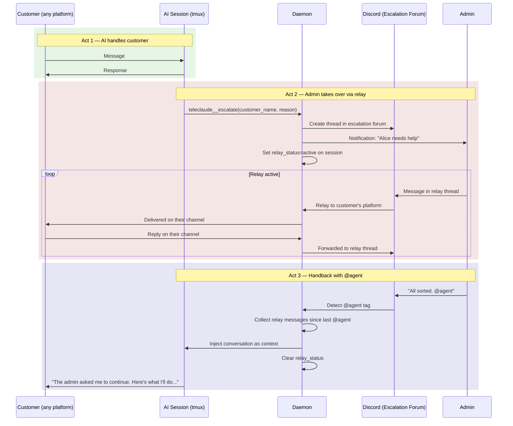
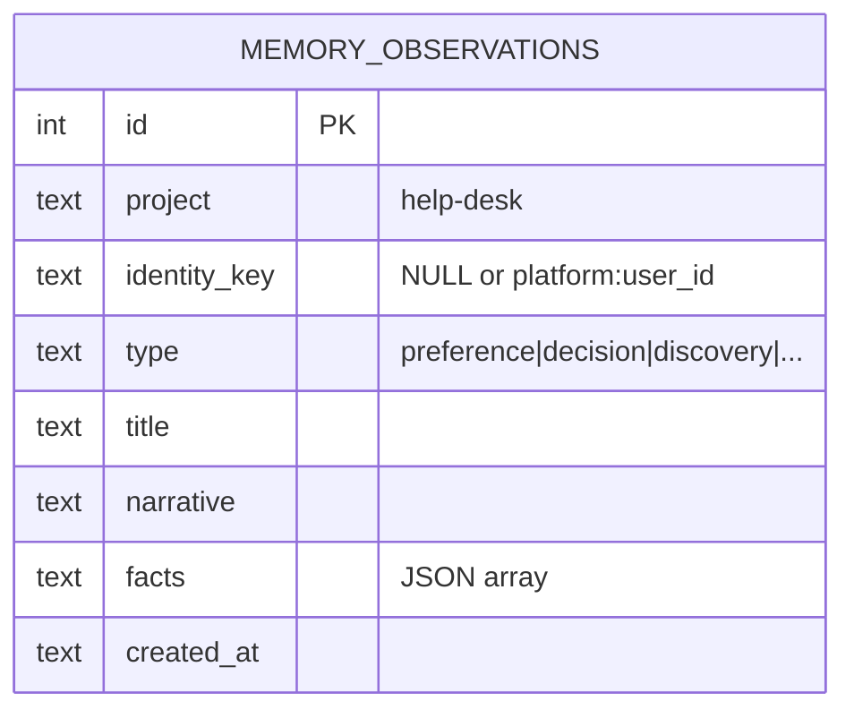
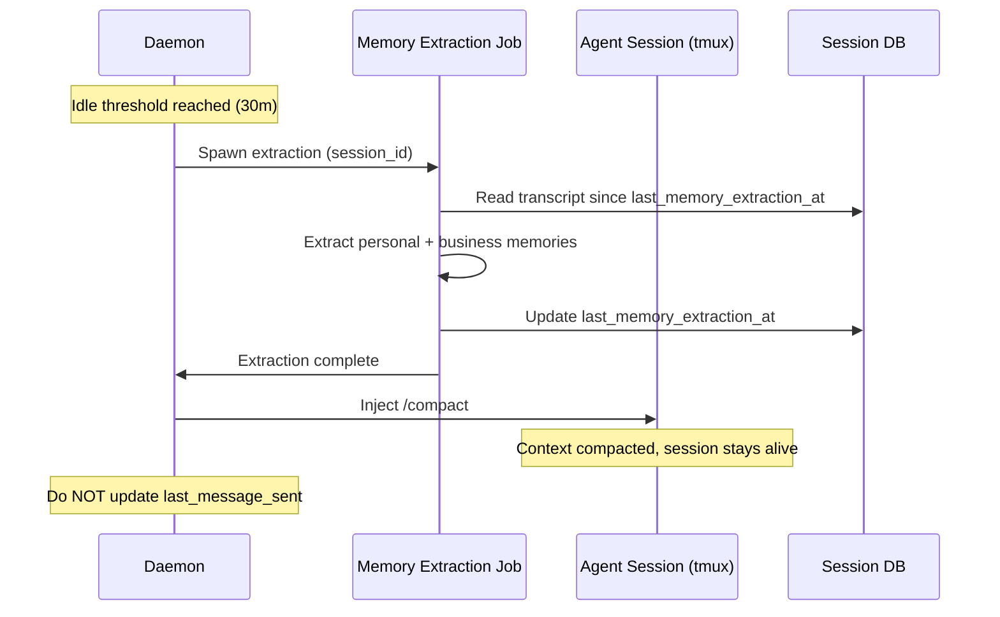
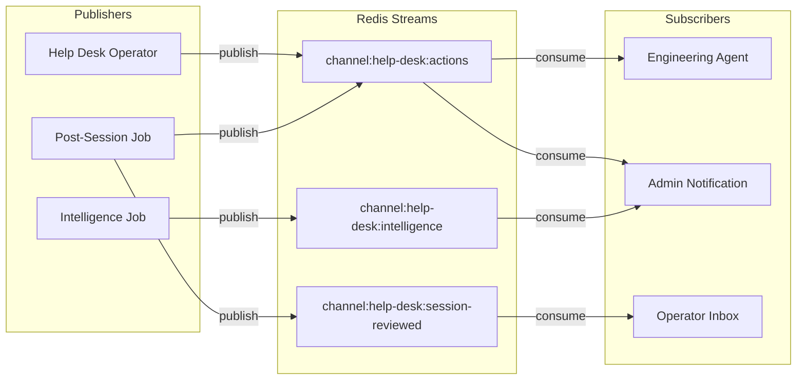
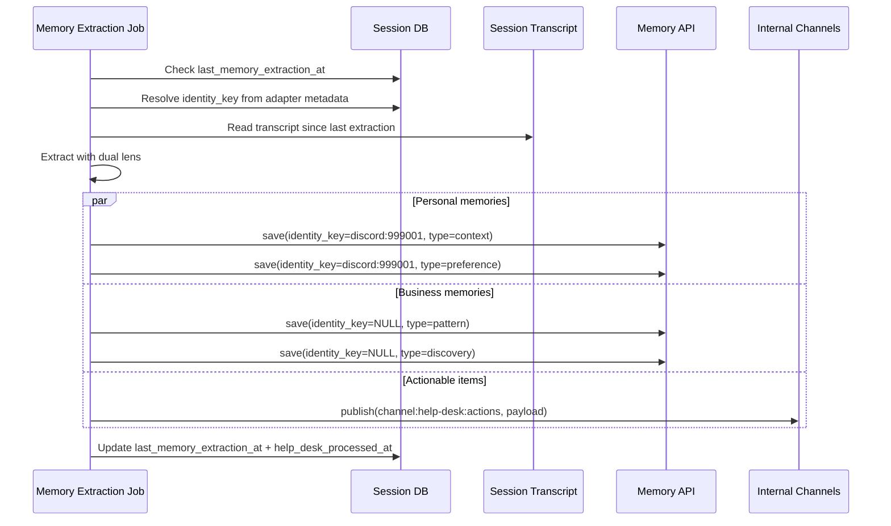
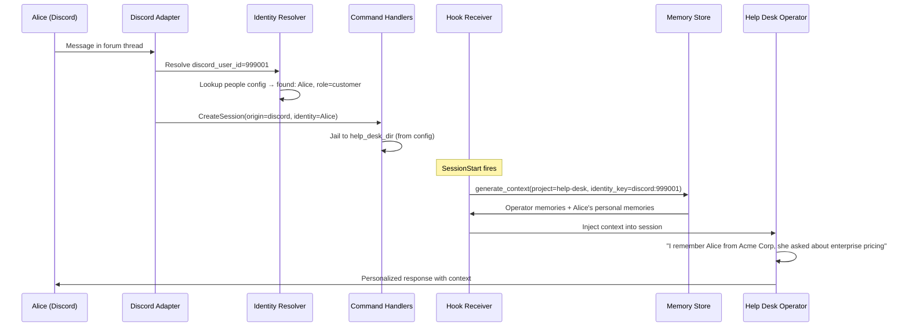
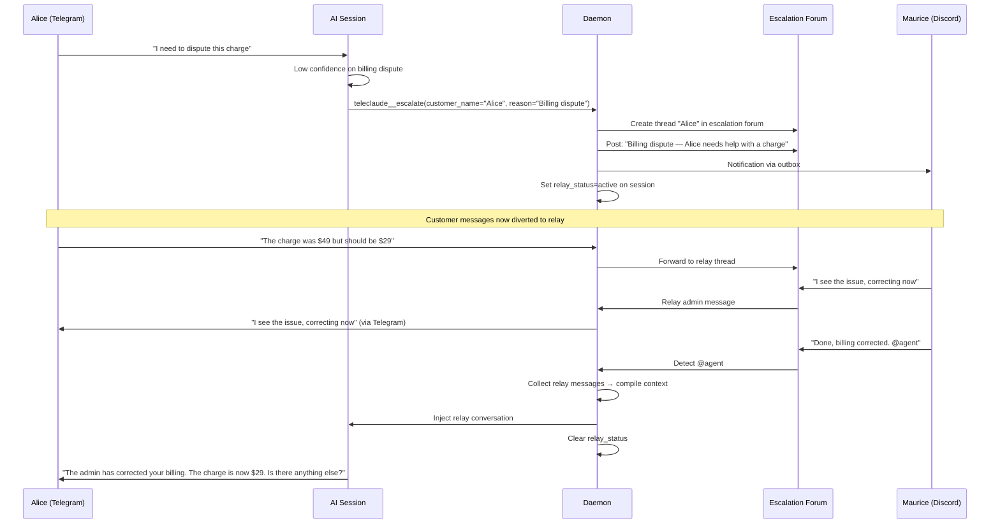
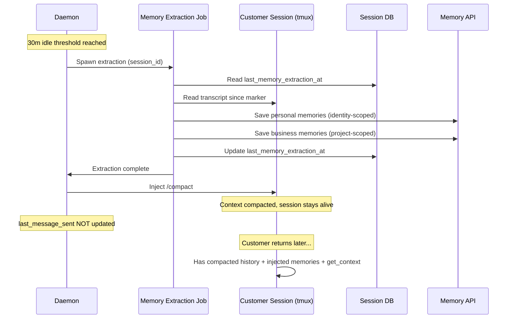
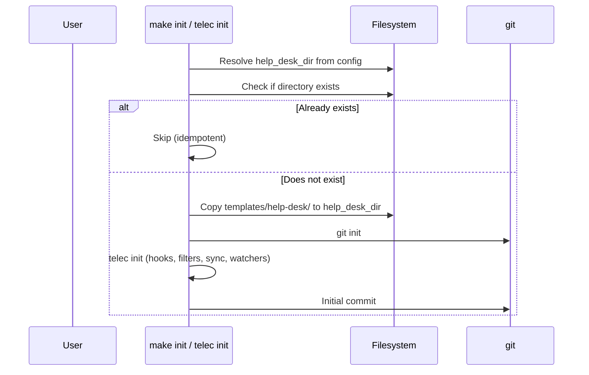

# Help Desk Platform — Design

## Required reads

@docs/project/design/architecture/memory-system.md
@docs/project/design/architecture/session-lifecycle.md
@docs/project/design/architecture/context-selection.md
@docs/project/design/architecture/redis-transport.md
@docs/project/design/architecture/adapter-client.md
@docs/project/design/architecture/ui-adapter.md

## Purpose

Turn TeleClaude into a help desk platform where AI operators handle customer interactions through public-facing adapters (Discord, Telegram, WhatsApp, web), maintain per-customer memory continuity, and extract business intelligence from interactions — all within a standalone operator workspace that is bootstrapped and managed as an independent project.

The platform operates on two planes:

1. **Customer plane**: Platform-agnostic ingress. A customer sends a message on any supported channel, a session starts, the AI handles it. Same help desk regardless of platform.
2. **Operator plane**: Discord as the rich admin surface. Folder grouping for channel organization, real-time visibility into customer sessions, and relay channels for direct admin-to-customer communication when the AI escalates.

## Inputs/Outputs

**Inputs:**

- Customer messages via adapters (Discord forum threads, Telegram, WhatsApp, web)
- Identity from person config (`~/.teleclaude/people/{name}/teleclaude.yml`) or platform-specific defaults
- Operator brain (`AGENTS.master.md` in the help desk project) defining persona, interests, and idle routines
- Role-filtered doc snippets via `get_context` (audience-tagged frontmatter)
- Organization-global documentation (`~/.teleclaude/docs/organization/`)
- Admin messages via Discord relay channels (during escalation)

**Outputs:**

- AI-handled customer conversations with memory continuity
- Identity-scoped personal memories (per-customer observation history)
- Project-scoped business memories (aggregate patterns, complaints, insights)
- Actionable items published to internal channels (follow-ups, escalations, feature requests)
- Operator workspace artifacts (inbox, logs, processed outcomes)
- Discord relay channels for admin-customer direct communication
- Admin notifications on escalation events

## Architecture

### Operator Workspace

The help desk is a standalone git repository, separate from the TeleClaude codebase. Each organization gets its own help desk repo with its own documentation, operator brain, and runtime artifacts. The location is configurable via `help_desk_dir` in computer config; the default is a sibling directory next to the TeleClaude project.

```
<help_desk_dir>/                          # standalone git repo (per organization)
├── AGENTS.master.md                      # tracked — operator brain
├── README.md                             # tracked — landing page
├── teleclaude.yml                        # tracked — project config (jobs, channels)
├── .gitignore                            # ignores runtime dirs
├── docs/
│   ├── global/
│   │   └── organization/                 # org-global docs (symlinked to ~/.teleclaude/docs/organization/)
│   │       ├── baseline.md               # baseline manifest
│   │       └── spec/                     # product docs, FAQ, policies
│   ├── project/
│   │   ├── baseline.md                   # baseline manifest
│   │   ├── policy/
│   │   │   └── escalation.md             # when and why to escalate
│   │   ├── procedure/
│   │   │   └── escalation.md             # step-by-step escalation procedure
│   │   └── spec/
│   │       └── tools/
│   │           └── escalation.md         # escalation tool contract
│   └── index.yaml                        # auto-generated by telec sync
├── .agents/
│   └── commands/                         # project-local commands (if any)
├── inbox/                                # gitignored — items to process during idle time
├── logs/                                 # gitignored — interaction logs
└── outcomes/                             # gitignored — extracted actionable items
```

The `docs/global/organization/` directory follows the standard global-docs convention: `telec init` symlinks it to `~/.teleclaude/docs/organization/`, making org-level documentation visible across all projects on the machine (same mechanism TeleClaude uses for `general/` and `software-development/`).

The `docs/project/` directory holds help-desk-specific documentation — escalation rules, support SLAs, procedures — scoped to this project only. The escalation tool spec, policy, and procedure live here and are referenced by the operator brain artifact via `## Required reads`.

The `AGENTS.master.md` compiles into `AGENTS.md` (same as all agent artifacts) and provides:

- Operator persona: help desk operator, not generic assistant
- Awareness of platform capabilities via `get_context` (role-filtered)
- Idle-time routines: inbox processing, log extraction, cleanup
- Observer interests: what to extract for personal vs. business memory
- Escalation awareness: when and how to escalate, tool usage

### Organization Doc Domain

A new `organization` domain sits alongside `general` and `software-development` in the global doc snippet hierarchy:

```
~/.teleclaude/docs/
├── general/                # cross-project platform knowledge
├── software-development/   # coding standards and practices
└── organization/           # NEW: org product docs, policies, FAQ — visible everywhere
```

The help desk project owns this domain via `docs/global/organization/`. When `telec init` runs inside the help desk project, it symlinks `docs/global/organization/` to `~/.teleclaude/docs/organization/`, making org knowledge available to every project on the machine.

Doc snippets in this domain follow the standard taxonomy (spec, policy, procedure, etc.) with standard frontmatter. The `audience` tag controls who sees what — org docs tagged `help-desk` are visible to the operator, those tagged `public` could be surfaced directly to customers in the future.

### Help Desk Bootstrap Routine

An idempotent routine scaffolds the help desk workspace when it does not exist. It runs as part of `make init` / `telec init` in the TeleClaude project.

**Default location:** Sibling of the TeleClaude project. If TeleClaude lives at `/path/to/TeleClaude`, the default help desk path is `/path/to/help-desk`. Configurable via `help_desk_dir` in computer config.

**Steps:**

1. Resolve `help_desk_dir` from config (default: sibling directory).
2. If the directory already exists — skip (idempotent).
3. Create the directory structure from `templates/help-desk/` in the TeleClaude repo.
4. Run `git init` inside the new directory.
5. Run `telec init` inside the new directory — installs agent hooks, git filters, pre-commit hook, syncs artifacts, installs docs watch, creates `docs/index.yaml`.
6. Create an initial git commit with the skeleton.

**Template contents** (`templates/help-desk/` in TeleClaude repo):

- `AGENTS.master.md` — minimal operator brain with a title and nudge toward `/author-knowledge`
- `README.md` — one-liner explaining what this repo is
- `teleclaude.yml` — minimal project config
- `.gitignore` — excludes `inbox/`, `logs/`, `outcomes/`
- `docs/global/organization/baseline.md` — empty baseline manifest
- `docs/global/organization/spec/about.md` — starter snippet: "This is your organization. Use `/author-knowledge` to build out your documentation."
- `docs/project/baseline.md` — empty baseline manifest
- `docs/project/policy/escalation.md` — starter escalation policy
- `docs/project/procedure/escalation.md` — starter escalation procedure
- `docs/project/spec/tools/escalation.md` — escalation tool contract
- `docs/project/design/help-desk-overview.md` — starter: "Your help desk. Use `/author-knowledge` to document escalation rules, support procedures, and SLAs."

Templates are plain files — no templating engine. Nothing is org-specific yet. The agent helps the user grow the content via `/author-knowledge`.

### Knowledge Authoring Command

A global command (`agents/commands/author-knowledge.md`) that helps users offload organizational knowledge into structured documentation through conversation. Available in all projects, not specific to help desk.

The command activates a Knowledge Author role that:

1. Asks the user what area of their organization or project they want to document
2. Listens for documentable knowledge: facts, policies, procedures, FAQ
3. Determines the taxonomy type (spec, policy, procedure, etc.) and correct storage location:
   - `docs/global/` — cross-project knowledge (org product docs, team structure, company policies)
   - `docs/project/` — project-specific documentation (help desk escalation rules, support SLAs)
4. Authors doc snippets following the snippet authoring schema
5. Runs `telec sync` after each batch to deploy artifacts
6. Commits new documentation

The command reads the doc-snippet-authoring procedure and snippet-authoring-schema spec as required reads, so it always follows the correct structure and taxonomy.

### Identity Resolution

All adapters resolve identity through the same path: person config lookup by platform credentials, with platform-specific defaults for unknown users.


**Discord identity fix:** Add `DiscordCreds` to `PersonConfig` and `CredsConfig` (same pattern as `TelegramCreds`). Build a `_by_discord_user_id` lookup map in `IdentityResolver._load_config()`. Known Discord users get their configured role; unknown ones default to `customer` (jailed).

**Telegram adapter metadata fix:** Add `user_id: Optional[int] = None` to `TelegramAdapterMetadata`. The Telegram adapter populates this when creating or updating sessions. Currently `user_id` is available during identity resolution but not persisted in the adapter metadata blob, which prevents post-session jobs from deriving `identity_key` for Telegram sessions.

**Identity key format:** `{platform}:{platform_user_id}` — e.g., `discord:999001`, `telegram:12345678`, `web:alice@acme.com`. This is derived from adapter metadata at query time, not stored as a denormalized column on the session.

**Identity key derivation path:**

1. Read `session.adapter_metadata.ui` (telegram or discord)
2. Determine platform from which adapter metadata is populated
3. Extract `user_id` from the metadata blob
4. Compose: `discord:{user_id}` or `telegram:{user_id}` or `web:{email}`

A helper function on the session model or identity module handles this derivation. The memory system receives the opaque string and stores/matches it without parsing.

### Role Propagation for Customers

The tool-access path propagates `human_role` for filtering: session role lookup is used to apply role-based tool tiers in `get_excluded_tools()`.

**Addition:** A `CUSTOMER_EXCLUDED_TOOLS` tier in `role_tools.py` that restricts what a customer's agent can access. Customers get help desk interaction tools only — no session management, no deployment, no orchestration, no channel publishing.

The `get_excluded_tools()` function gains a branch: `if human_role == "customer": excluded.update(CUSTOMER_EXCLUDED_TOOLS)`.

### Escalation Tool

A TeleClaude tool (`teleclaude__escalate`) that customer-facing agents call when they need admin assistance. The tool is registered globally in the daemon but role-gated: added to `MEMBER_EXCLUDED_TOOLS`, `WORKER_EXCLUDED_TOOLS`, and `UNAUTHORIZED_EXCLUDED_TOOLS` so only sessions with `human_role: "customer"` see it.

**Parameters:**

- `customer_name` (required) — used as the Discord escalation thread title so admins can identify customers
- `reason` (required) — why the AI is escalating
- `context_summary` (optional) — brief summary of conversation so far

**Behavior:**

1. Creates a thread in the Discord escalation forum channel (`DISCORD_ESCALATION_CHANNEL_ID`)
2. Thread title: customer name (for admin identification)
3. Posts the escalation reason and context summary as the opening message
4. Sets `relay_status = "active"` and `relay_discord_channel_id` on the session
5. Sends notification to subscribed admins via the notification outbox
6. Returns confirmation to the AI agent

**Documentation layering:**

| Artifact                | Location                                            | What it covers                                        |
| ----------------------- | --------------------------------------------------- | ----------------------------------------------------- |
| Tool spec               | Help desk `docs/project/spec/tools/escalation.md`   | Parameters, return values, behavior contract          |
| Escalation policy       | Help desk `docs/project/policy/escalation.md`       | When to escalate, thresholds, what qualifies          |
| Escalation procedure    | Help desk `docs/project/procedure/escalation.md`    | Step-by-step: recognize → call tool → inform customer |
| Telec CLI surface entry | TeleClaude `docs/project/spec/telec-cli-surface.md` | Session and operator command surface                  |

The operator brain (`AGENTS.master.md`) references the help desk docs:

```markdown
## Required reads

- @docs/project/policy/escalation.md
- @docs/project/procedure/escalation.md
- @docs/project/spec/tools/escalation.md
```

At `telec sync`, these get inlined into the generated agent artifact. The operator brain knows when, how, and with what tool to escalate — without leaking into other projects.

### Admin Relay Channel

When the AI escalates, a direct communication channel opens between the admin and the customer — bypassing the AI session entirely. This is the core admin interaction pattern.



**Session state fields:**

- `relay_status` — `NULL` (normal) or `"active"` (relay mode)
- `relay_discord_channel_id` — Discord thread ID in the escalation forum
- `relay_started_at` — timestamp of relay activation (for message collection boundary)

**Discord configuration:**

- `DISCORD_HELP_DESK_CHANNEL_ID` — forum for customer session threads (existing)
- `DISCORD_ESCALATION_CHANNEL_ID` — separate forum for admin-customer relay threads (new)

**Message routing diversion:**

When `relay_status` is active, customer messages are diverted:

1. Customer sends message on their platform (Telegram, Discord, WhatsApp, web)
2. Adapter receives the message and resolves the session
3. Adapter checks `relay_status` — if active, the message is NOT sent to tmux
4. Instead, the message is forwarded to the relay Discord thread (`relay_discord_channel_id`)
5. The AI session is effectively paused during relay

Admin messages in the relay thread are delivered to the customer:

1. Admin types in the relay Discord thread
2. Discord adapter detects the message is in an escalation channel (not a session channel)
3. Daemon resolves the customer's session from the relay channel mapping
4. Daemon delivers the message to the customer via their originating platform adapter
5. The message does not enter the AI session's tmux

**`@agent` convention:**

The admin tags `@agent` (Discord bot mention or text convention) to hand back to the AI:

1. Discord adapter detects `@agent` in a relay thread message
2. Collects all messages in the relay thread since `relay_started_at` (or since the last `@agent` if multiple handbacks have occurred)
3. Compiles them into a structured context block:

   ```
   [Admin Relay Conversation]
   The admin spoke directly with the customer. Here is the full exchange:

   Admin (Maurice): Hi Alice, I'm Maurice. Let me help with that billing issue.
   Customer (Alice): Thank you! The charge on my account...
   Admin (Maurice): Got it, I've corrected the billing. My AI will continue. @agent

   The admin has handed the conversation back to you. Continue naturally,
   acknowledging what was discussed.
   ```

4. Injects this context into the AI session (via tmux input as a system message)
5. Clears `relay_status` to `NULL`, resets `relay_started_at`
6. Customer messages resume routing to the AI session
7. The AI's first response naturally references the admin conversation

**Relay lifecycle:**

- Relay channels persist for the lifetime of the session (72h max)
- Multiple escalation/handback cycles can occur within one session
- Each `@agent` tag collects only messages since the previous `@agent` (or relay start)
- When the session dies (72h sweep), the relay thread can be archived in Discord

### Customer-Facing Agent Behavior

The customer-facing agent is always Claude — the most capable model for natural human interaction. Model selection is not configurable for customer sessions.

The operator brain (`AGENTS.master.md`) defines the agent's customer-facing behavior. The implementer has freedom to craft industry-quality prompts following customer service best practices:

- **Greeting and rapport**: Warm, professional opening that acknowledges returning customers by name (via injected personal memories)
- **Active listening**: Confirm understanding before acting, summarize customer intent
- **Knowledge navigation**: Use `get_context` proactively to find answers in organization docs, product specs, and procedures
- **Transparency**: Clearly communicate what the AI can and cannot do; never fabricate answers
- **Escalation judgment**: Recognize when confidence is low, when the customer explicitly requests a human, or when the topic requires authority (billing, security, legal)
- **Conversation closure**: Summarize what was accomplished, confirm next steps, invite further questions
- **Tone adaptation**: Match the customer's communication style (formal/casual) as detected via personal memories

The agent starts each session with pre-loaded indexes of its baseline documentation, so it knows immediately what to retrieve and where when the customer asks anything. The `get_context` phase-1 index (snippet IDs and descriptions) is included in the session's baseline context.

### Identity-Scoped Memory

The memory system gains a second scoping axis. The `project` field remains (operator-level namespace). A new `identity_key` field optionally scopes memories to a specific person.



**Query semantics:**

| Query                                            | Returns                                   |
| ------------------------------------------------ | ----------------------------------------- |
| `project=help-desk, identity_key=NULL`           | Operator's general/business memories only |
| `project=help-desk, identity_key=discord:999001` | Alice's personal memories only            |
| `project=help-desk` (no identity filter)         | All memories for the help desk            |

**Context injection at SessionStart:**

```sql
-- Inject both operator knowledge and customer-specific memories
WHERE project = :project
  AND (identity_key IS NULL OR identity_key = :identity_key)
ORDER BY created_at_epoch DESC
LIMIT 50
```

The hook receiver resolves the session's identity (from adapter metadata via the derivation path) and passes the `identity_key` to `generate_context_sync`. If no identity is available, only project-level memories are injected.

**API changes:**

- `POST /api/memory/save` — add optional `identity_key` field
- `GET /api/memory/search` — add optional `identity_key` query param
- `GET /api/memory/inject` — add optional `identity_key` query param
- No `identity_key` → saved/queried as project-level memory (NULL)

### Customer Session Lifecycle

Customer sessions have a distinct lifecycle from admin sessions. They stay alive indefinitely — there is no idle timeout that kills a customer session. The 72h inactivity sweep is the only natural death.

**Idle compaction sequence.** After a configurable idle threshold (e.g., 30 minutes of no customer input), the daemon:

1. Runs memory extraction on the recent conversation (same job as post-session processing)
2. Injects `/compact` into the tmux pane
3. Does NOT update `last_message_sent` — this is invisible to the customer

This keeps the session file lean without losing context. The agent retains compacted history plus injected memories on the next customer message.



**Session resumption.** When a customer returns via the same adapter channel (e.g., same Discord thread), the adapter routes to the existing session. The agent has: (a) compacted conversation history, (b) injected personal memories from the most recent extraction, (c) access to `get_context` for platform and org docs.

**Bookkeeping.** A `last_memory_extraction_at` timestamp on the session record tracks the high-water mark. The extraction job processes only new conversation since this marker. This makes both idle-triggered and cron-triggered extraction idempotent.

**Session state fields (additions):**

- `last_memory_extraction_at` — timestamp of last successful extraction (high-water mark)
- `help_desk_processed_at` — timestamp of final post-mortem processing
- `relay_status` — `NULL` or `"active"` (admin relay mode)
- `relay_discord_channel_id` — Discord thread ID for the relay channel
- `relay_started_at` — timestamp of current relay activation

### Internal Channels (Pub/Sub)

Agents need a way to publish structured output without knowing who consumes it. Internal channels provide this: named Redis Streams where agents publish and subscribers eventually process.



**Channel naming:** `channel:{project}:{topic}` — e.g., `channel:help-desk:actions`, `channel:engineering:bug-reports`.

**Publishing:** Agents publish via a TeleClaude tool (`teleclaude__publish`) or HTTP API (`POST /api/channels/{name}/publish`). The agent doesn't need to know who subscribes — it folds the mail, puts it in the pipe, and moves on.

**Subscribing:** Configured per-project in `teleclaude.yml`. Each subscription maps a channel pattern to an agent command that processes incoming messages:

```yaml
# In teleclaude.yml
channels:
  subscriptions:
    - channel: 'channel:help-desk:actions'
      filter:
        action_type: [escalation, churn_signal]
      target:
        notification: admin_telegram
    - channel: 'channel:help-desk:actions'
      filter:
        action_type: [bug_report]
      target:
        project: teleclaude
        command: /process-bug-report
    - channel: 'channel:help-desk:actions'
      filter:
        action_type: [feature_request]
      target:
        project: teleclaude
        command: /process-feature-request
    - channel: 'channel:help-desk:session-reviewed'
      target:
        project: help-desk
        command: /process-session-review
```

**Consumer worker:** A daemon background task polls subscribed channels using Redis consumer groups. When a message arrives, it either:

1. Routes to a notification channel (existing notification infrastructure)
2. Spawns an agent in the target project with the message as input

**Redis consumer groups** give us:

- Exactly-once processing across multiple computers subscribing to the same channel
- Unacknowledged messages get redelivered (durability on agent death)
- Multiple consumers can load-balance within a group
- Pending message inspection for debugging stuck deliveries

**Cross-computer routing:** Redis Streams are inherently cross-computer. An agent on the raspi publishes to `channel:help-desk:actions`; the macbook's consumer picks it up. No extra plumbing needed beyond the existing Redis connection.

**Tool surface:**

```
teleclaude__publish(channel, payload)    # Publish a message to a channel
teleclaude__channels_list()              # List available channels and their subscribers
```

The publish tool is available to all agents. Channel creation is implicit — publishing to a non-existent channel creates it.

### Doc Snippet Audience Tagging

Doc snippets gain an `audience` field in frontmatter to control visibility via `get_context`:

```yaml
---
id: project/design/architecture/session-lifecycle
type: design
audience: [admin] # default — internal only
---
```

**Audience values:**

| Value       | Who sees it                                                      |
| ----------- | ---------------------------------------------------------------- |
| `admin`     | Admin users and their agents (default for all current docs)      |
| `member`    | Members and admins                                               |
| `help-desk` | Help desk operators (curated subset for customer-facing context) |
| `public`    | Anyone, including customers directly (future)                    |

The `get_context` tool filters by the calling session's resolved role. The help desk operator, running with operator-level access, sees `admin` + `help-desk` tagged docs. The docs in `help-desk/docs/` are automatically tagged `help-desk`.

**Migration:** All existing doc snippets default to `audience: [admin]`. No change in behavior until explicitly whitelisted.

### Member Personal Folders

The same pattern applies to internal team members. Each member gets a persistent personal folder on the computer:

```
~/.teleclaude/people/{name}/workspace/
├── AGENTS.master.md          # personal agent brain
├── ...                       # artifacts created together
```

When a member's session lands in their folder, the memory system injects:

1. Project-level memories for that workspace
2. Identity-scoped memories for that person

This gives every member a personal AI assistant that remembers their history, preferences, and ongoing work — same mechanism as help desk customers, just with a richer role.

### Post-Session Memory Extraction

A single idempotent job extracts memories from help desk sessions. It is one job with two invocation paths:

**Primary path (idle-triggered):** The daemon detects idle → spawns the extraction job → job processes the session transcript since `last_memory_extraction_at` → updates the marker → daemon injects `/compact`. Memory extraction MUST complete BEFORE compaction — compaction destroys the raw conversation the extractor reads.

**Fallback path (cron sweep):** Runs every 30 minutes. Finds sessions in the help desk project where either: `lifecycle_status = 'stopped'` and `help_desk_processed_at IS NULL`, or active sessions whose `last_memory_extraction_at` is stale relative to `last_activity_at`. Processes them identically.

The job doesn't know or care which path invoked it. It receives a session_id, reads the transcript from the last extraction marker onward, and extracts through a dual lens:



**Dual extraction lens:**

1. **Personal memories** (identity-scoped) — what to remember about THIS person: preferences, context, communication style, open questions, relationship history
2. **Business memories** (project-scoped) — what is interesting for US: feature requests, complaints, confusion patterns, sentiment, competitive mentions
3. **Actionable items** — published to internal channels for routing to subscribers

**Job configuration** (in `teleclaude.yml` jobs section):

```yaml
jobs:
  help-desk-session-review:
    schedule: hourly
    preferred_hour: 0
    job: help-desk-session-review
    agent: claude
    thinking_mode: fast
    # Sweep: picks up unprocessed/stale sessions
```

### Action Taxonomy

Actionable items extracted from customer interactions follow a CRM-inspired vocabulary. Each action type maps to a channel topic.

| Action Type       | Description                                                 | Channel Topic                        |
| ----------------- | ----------------------------------------------------------- | ------------------------------------ |
| `follow_up`       | Promise or commitment made to customer                      | `channel:help-desk:follow-ups`       |
| `escalation`      | Needs human judgment or authority                           | `channel:help-desk:escalations`      |
| `feature_request` | Customer wants functionality that doesn't exist             | `channel:help-desk:feature-requests` |
| `bug_report`      | Something is broken or behaving unexpectedly                | `channel:help-desk:bug-reports`      |
| `knowledge_gap`   | Question could not be answered — docs missing               | `channel:help-desk:knowledge-gaps`   |
| `promise`         | Explicit commitment with deadline                           | `channel:help-desk:promises`         |
| `churn_signal`    | Customer expressing frustration or considering alternatives | `channel:help-desk:churn-signals`    |
| `praise`          | Positive feedback or satisfaction signal                    | `channel:help-desk:praise`           |

Actions are simultaneously:

1. **Saved to memory** — so the operator and intelligence job can query them
2. **Published to channels** — so subscribers process them asynchronously

Action payload published to channels:

```json
{
  "action_type": "feature_request",
  "priority": "medium",
  "session_id": "abc-123",
  "identity_key": "discord:999001",
  "customer_name": "Alice",
  "title": "Feature request: dark mode",
  "summary": "Third customer to request dark mode this month",
  "context": "Customer was asking about UI customization options"
}
```

Subscribers decide what to do with each action: notify an admin, create a todo, spawn an agent in another project, or just accumulate for reporting.

### Idle-Time Intelligence Job

A separate scheduled job runs periodically to perform aggregate analysis across all processed sessions:

```yaml
jobs:
  help-desk-intelligence:
    schedule: daily
    preferred_hour: 6
    job: help-desk-intelligence
    agent: claude
    thinking_mode: med
```

This job:

1. Queries recent business memories and actions across all customers
2. Detects patterns: recurring complaints, trending topics, sentiment shifts
3. Generates a daily intelligence digest
4. Saves synthesis as project-level memory observations
5. Publishes significant patterns to `channel:help-desk:intelligence`

### Operator Brain (`AGENTS.master.md`)

The operator brain defines the agent's persona, capabilities, and autonomous routines. It compiles into `AGENTS.md` via the standard artifact pipeline.

**Core sections:**

1. **Identity**: Help desk operator for the organization. Not a generic assistant — an autonomous operator that handles customer interactions with authority.

2. **Knowledge access**: Uses `get_context` for platform documentation (role-filtered). Organization docs flow in via the `organization` domain. Project docs provide help-desk-specific procedures. The agent starts with pre-loaded baseline indexes so it knows immediately what to retrieve.

3. **Memory awareness**: Understands that personal memories (identity-scoped) provide customer continuity. Uses the memory API to store observations during interactions.

4. **Interaction style**: Industry-quality customer service — warm, professional, adaptive to customer communication style. The implementer has freedom to craft rich prompts following customer service best practices: greeting, active listening, knowledge navigation, transparency, tone matching, and conversation closure.

5. **Observer interests** (for dual-observer prompts):
   - Personal: customer name, company, role, preferences, communication style, open questions, relationship history
   - Business: feature requests, complaints, confusion points, sentiment, competitive mentions, pricing discussions

6. **Escalation rules**: When to involve a human admin — complexity beyond knowledge base, customer explicitly requesting human, security-sensitive topics, billing disputes. References the help desk escalation policy and procedure via Required reads.

7. **Idle routines**: What to do when spawned for maintenance — process inbox, review unprocessed sessions, synthesize patterns, clean up stale artifacts.

### Dependency Graph

```mermaid
flowchart TD
    BOOT[Help desk bootstrap<br/>Scaffold + telec init] --> J[Operator workspace<br/>Standalone repo with docs]
    BOOT --> ORG[Organization doc domain<br/>docs/global/organization/]

    A[Identity-scoped memory<br/>Add identity_key to DB + API] --> E[Memory extraction job<br/>Incremental transcript processing]
    A --> F[Context injection<br/>Identity-aware SessionStart]

    B[Discord identity fix<br/>Person config lookup] --> G[Discord help desk flow<br/>End-to-end customer handling]
    TG[Telegram user_id fix<br/>Persist in adapter metadata] --> E

    C[Frontmatter audience tagging<br/>Role-filtered get_context] --> H[Operator brain<br/>AGENTS.master.md with get_context]
    ORG --> H

    ROLE[Customer role in tool access<br/>CUSTOMER_EXCLUDED_TOOLS tier] --> G
    ESC[Escalation tool<br/>teleclaude__escalate] --> RELAY
    ROLE --> ESC

    RELAY[Admin relay channel<br/>Discord thread + message bridge] --> G
    RELAY --> NOTIF[Admin notification<br/>Via notification outbox]

    CH[Internal channels<br/>Redis pub/sub + consumer worker] --> E
    CH --> K[Intelligence job<br/>Pattern detection + digest]

    IDLE[Idle compaction<br/>Extract → compact sequence] --> E

    E --> I[Action routing via channels<br/>Subscriber-driven processing]
    F --> G
    H --> G
    J --> H
    J --> K

    CMD[/author-knowledge command<br/>Global brain-dump facilitator] --> J

    I --> L[Help desk fully operational]
    G --> L
    K --> L
    RELAY --> L
```

## Invariants

1. **Single memory store**: Identity-scoped memories live in the same `memory_observations` table. No separate tables or databases per identity.

2. **NULL means shared**: `identity_key IS NULL` means the memory belongs to the project, visible to all sessions in that project. This is the default behavior, preserving backward compatibility.

3. **Identity key is opaque**: The memory system does not parse identity keys. It stores and matches them as strings. Format convention is `{platform}:{platform_user_id}` but the store doesn't enforce this.

4. **Identity key is derived**: The `identity_key` is derived from adapter metadata at query time, not stored as a denormalized column on the session. A helper function composes it from the platform-specific metadata blob.

5. **Extract before compact**: Memory extraction MUST complete before compaction is injected. Compaction destroys the raw conversation that the extractor reads. The sequence is always: extract → compact, never the reverse.

6. **Channels are durable**: Internal channels use Redis Streams with consumer groups. Messages survive consumer downtime and agent death. Unacknowledged messages are redelivered.

7. **Operator brain is tracked**: `AGENTS.master.md` is version-controlled. Runtime state (inbox, logs, outcomes) is gitignored.

8. **Audience defaults to admin**: All existing doc snippets are internal-only until explicitly whitelisted. Adding the audience field is additive — no existing behavior changes.

9. **Jobs are idempotent**: Memory extraction can be re-run safely. The `last_memory_extraction_at` marker ensures only new conversation is processed. Premature agent death, glitches, or periodic re-runs never produce duplicate actions or memories. The job runner treats agents as ephemeral — durable state lives in the database, not in the agent.

10. **Help desk workspace is standalone**: The help desk is its own git repo, not a subdirectory of TeleClaude. The bootstrap routine is idempotent — if the directory exists, it skips. Organization-global docs are symlinked via the standard `docs/global/` mechanism.

11. **Customer sessions stay alive**: No idle timeout kills a customer session. Only the 72h inactivity sweep ends sessions. Idle compaction keeps sessions lean without terminating them.

12. **Relay is session-scoped**: The admin relay channel is a state of the session, not a separate entity. When the session dies (72h sweep), the relay state dies with it. The Discord relay thread can be archived.

13. **Relay diverts, not duplicates**: When relay is active, customer messages go to the relay channel ONLY, not to both relay and AI. The AI session is fully paused during relay.

14. **`@agent` collects incrementally**: Each `@agent` tag collects messages since the previous `@agent` (or since relay activation). Multiple escalation/handback cycles within one session each get a clean context window.

15. **Escalation tool is customer-scoped**: `teleclaude__escalate` is excluded from all role tiers except customer. Only customer-facing sessions see and can call it.

## Primary Flows

### Customer Returns to Help Desk



### Escalation and Admin Relay



### Idle Compaction Cycle



### Help Desk Bootstrap



## Failure Modes

| Scenario                                                     | Behavior                                             | Recovery                                                                             |
| ------------------------------------------------------------ | ---------------------------------------------------- | ------------------------------------------------------------------------------------ |
| Identity resolution fails for known user                     | Falls back to `customer` role, no identity_key       | Personal memories not injected; operator handles without context                     |
| Memory extraction dies mid-processing                        | Partial extraction; marker not updated               | Next idle trigger or cron sweep reprocesses from last marker                         |
| Compaction injected before extraction                        | Cannot happen — extraction must complete first       | Daemon enforces sequencing; if extraction fails, compaction is skipped               |
| Memory injection exceeds context window                      | Truncated by recency (existing behavior)             | Most recent memories prioritized                                                     |
| help_desk_dir missing at session start                       | Bootstrap routine creates it if part of init flow    | If not bootstrapped, jailing logic creates minimal directory                         |
| Channel publish fails (Redis down)                           | Agent gets error from publish tool                   | Agent can retry or log locally; sweep job catches missed sessions                    |
| Channel consumer dies mid-processing                         | Message unacknowledged in consumer group             | Redis redelivers to next available consumer                                          |
| Intelligence job finds no new data                           | Exits cleanly, no digest generated                   | Normal; no action needed                                                             |
| Session transcript unavailable at job time                   | Job skips session, logs warning                      | Sweep re-run on next schedule; transcript may become available                       |
| Redis unavailable                                            | Channels non-functional; memory still works (SQLite) | Local operations and memory continue; channel delivery resumes when Redis reconnects |
| Telegram session missing user_id in metadata                 | Cannot derive identity_key                           | Post-session job processes without identity scoping; memories saved as project-level |
| Escalation tool called but Discord unavailable               | Tool returns error to AI                             | AI informs customer that escalation failed; logs for admin review                    |
| Relay message delivery fails to customer platform            | Message stays in relay thread but not delivered      | Admin sees message in Discord; can retry or use alternative channel                  |
| `@agent` tag missed or malformed                             | Relay stays active, AI stays paused                  | Admin can re-tag; relay status can be cleared manually via API                       |
| Multiple admins message in relay thread                      | All messages forwarded to customer                   | Customer sees all admin messages; admins coordinate in Discord                       |
| Customer messages during relay when platform adapter is down | Messages queued or lost depending on platform        | Relay thread shows gap; admin can ask customer to repeat                             |

## See Also

- docs/project/design/architecture/memory-system.md — Memory subsystem architecture
- docs/project/design/architecture/session-lifecycle.md — Session creation and hook flow
- docs/project/design/architecture/adapter-client.md — Adapter lifecycle and fan-out delivery
- docs/project/design/architecture/ui-adapter.md — UI adapter translation and routing
- docs/project/design/architecture/context-selection.md — Doc snippet selection pipeline
- docs/project/design/architecture/redis-transport.md — Redis Streams transport for cross-computer messaging
- docs/project/design/architecture/outbox.md — Durable outbox for hook event delivery
- docs/project/design/architecture/jobs-runner.md — Scheduled job runner architecture
- docs/project/spec/teleclaude-config.md — Configuration schema
- docs/project/spec/telec-cli-surface.md — Telec command surface for session and orchestration flows
