# Integration State Machine — Design

## Purpose

The Integration state machine is the **only role authorized to push canonical `main`**. It takes finalized feature branches from a durable FIFO queue, squash-merges them into an isolated integration worktree (`trees/_integration/`), pushes to origin, and cleans up. It is:

- **Serialized** by a lease (only one integrator at a time)
- **Crash-recoverable** via durable checkpoint
- **Queue-backed** (processes candidates in FIFO order by `ready_at`)
- **Self-ending** (exits when the queue is drained)

**Entry point:** `telec todo integrate [slug]`
**Implementation:** [`IntegrationPhase`](../../../../teleclaude/core/integration/state_machine.py) enum (12 states)
**Terminal state:** `COMPLETED`

### Referenced files

| File | Purpose |
|------|---------|
| [`teleclaude/core/integration/state_machine.py`](../../../../teleclaude/core/integration/state_machine.py) | State machine implementation (`IntegrationPhase` enum, `next_integrate()`) |
| [`teleclaude/core/integration/queue.py`](../../../../teleclaude/core/integration/queue.py) | Durable FIFO queue for integration candidates |
| [`teleclaude/core/integration/lease.py`](../../../../teleclaude/core/integration/lease.py) | Singleton lease for serialized integration |

### Referenced doc snippets

| Snippet ID | Content |
|------------|---------|
| `software-development/procedure/lifecycle/integration` | Integration procedure with agent actions |
| `project/spec/integration-orchestrator` | Full integrator contract (events, lease, queue, lifecycle) |
| `software-development/policy/version-control-safety` | Git safety rules for all agents |
| `software-development/policy/commits` | Commit format and attribution |

## Inputs/Outputs

**Inputs:**

- Integration FIFO queue — candidates `(slug, branch, sha, ready_at)` enqueued by Phase B handoff
- Integration lease — singleton lock ensuring only one integrator processes at a time
- Durable checkpoint at `{state_dir}/integrate-state.json` — enables crash recovery
- `origin/main` — canonical branch (fetched fresh before each merge)
- Feature branches on `origin/<slug>` — pushed by finalizer workers in Phase B

**Outputs:**

- Updated `origin/main` with squash-merged feature content (pushed from `trees/_integration/`)
- Delivery bookkeeping on repo root: `roadmap.yaml` → `delivered.yaml` transitions, demo promotion
- Cleanup: worktree removal, branch deletion, todo directory removal
- `integration.*` lifecycle events at each state transition
- Final status with metrics (`items_processed`, `items_blocked`, `duration_ms`)

### Checkpoint structure

The checkpoint enables crash recovery. Written atomically (temp file + `os.replace`) at every state transition:

```json
{
  "version": 1,
  "phase": "merge_clean",
  "candidate_slug": "my-feature",
  "candidate_branch": "my-feature",
  "candidate_sha": "abc123def...",
  "lease_token": "tok-xyz",
  "items_processed": 2,
  "items_blocked": 0,
  "started_at": "2026-03-08T10:00:00+00:00",
  "last_updated_at": "2026-03-08T10:05:00+00:00",
  "error_context": { "merge_type": "clean" },
  "pre_merge_head": "deadbeef..."
}
```

- `pre_merge_head` — SHA of main before merge, used to detect agent commits (HEAD advancement)
- `error_context` — phase-specific metadata (merge type, conflicted files, push rejection reason)

## Invariants

- **Singleton execution**: only one integrator session processes the queue at any time, enforced by an atomic lease with TTL=120s and 30s renewal.
- **FIFO ordering**: candidates processed in `ready_at` order. Deduplication by `(slug, branch, sha)`.
- **Isolation**: all merges happen in the persistent integration worktree `trees/_integration/`, reset to `origin/main` before each merge. Repo root cleanliness is irrelevant.
- **Crash safety**: every phase is recoverable. Re-calling `telec todo integrate` reads the durable checkpoint and resumes from the last persisted phase.
- **Already-integrated detection**: two guards prevent re-integrating content already on main (ancestry check + empty-merge guard).
- **Self-end authorization**: the integrator is the only governed session type allowed to self-end (when queue empty, no in-progress candidate, lease released, checkpoint written).
- **Workers cannot push main**: only the integrator pushes `origin/main`. Workers push only their feature branches.

## Primary flows

### State diagram

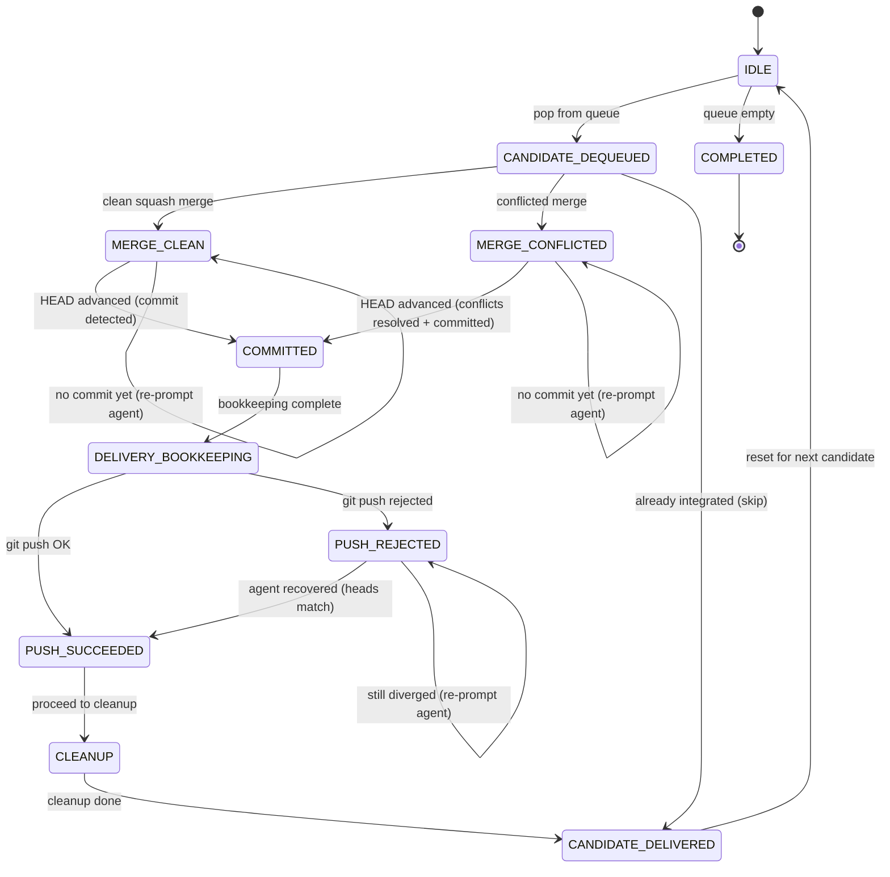

### States reference

| State | Description | Agent Action Required | Auto-advance |
|-------|-------------|----------------------|--------------|
| `IDLE` | No candidate in progress. Pop next from queue or complete. | No | Yes |
| `CANDIDATE_DEQUEUED` | Candidate popped. Route to merge or skip. | No | Yes |
| `MERGE_CLEAN` | Squash merge succeeded. Staged changes await commit. | **Yes** — compose squash commit message | No |
| `MERGE_CONFLICTED` | Squash merge produced conflicts. | **Yes** — resolve conflicts + commit | No |
| `AWAITING_COMMIT` | Re-entry check: did the agent commit? | No | Yes |
| `COMMITTED` | Agent committed. Run delivery bookkeeping. | No | Yes |
| `DELIVERY_BOOKKEEPING` | Bookkeeping done. Push to origin. | No | Yes |
| `PUSH_SUCCEEDED` | Push landed. Proceed to cleanup. | No | Yes |
| `PUSH_REJECTED` | Push rejected (non-fast-forward). | **Yes** — rebase + push | No |
| `CLEANUP` | Remove worktree, branch, todo dir. | No | Yes |
| `CANDIDATE_DELIVERED` | Candidate fully integrated. Mark and reset. | No | Yes |
| `COMPLETED` | Queue empty. Terminal state. | **Yes** — self-end session | — |

### Single candidate flow

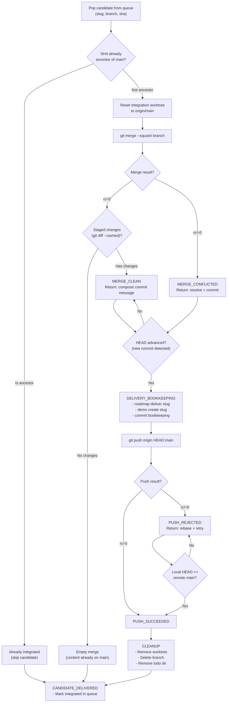

### Queue processing loop

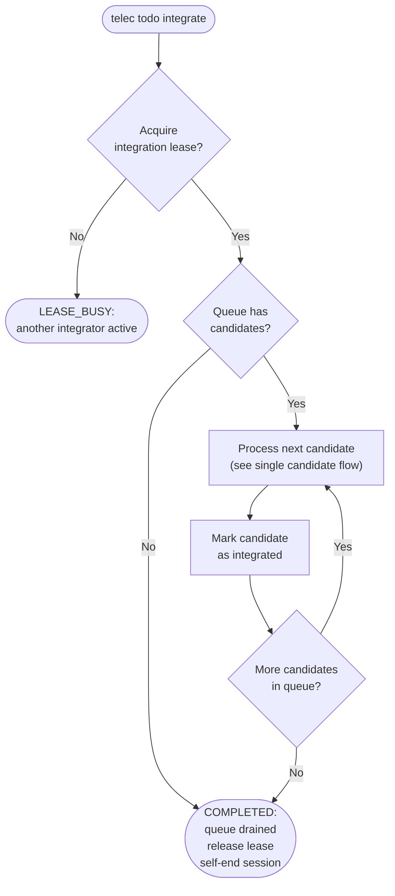

### Clean merge (sequence diagram)

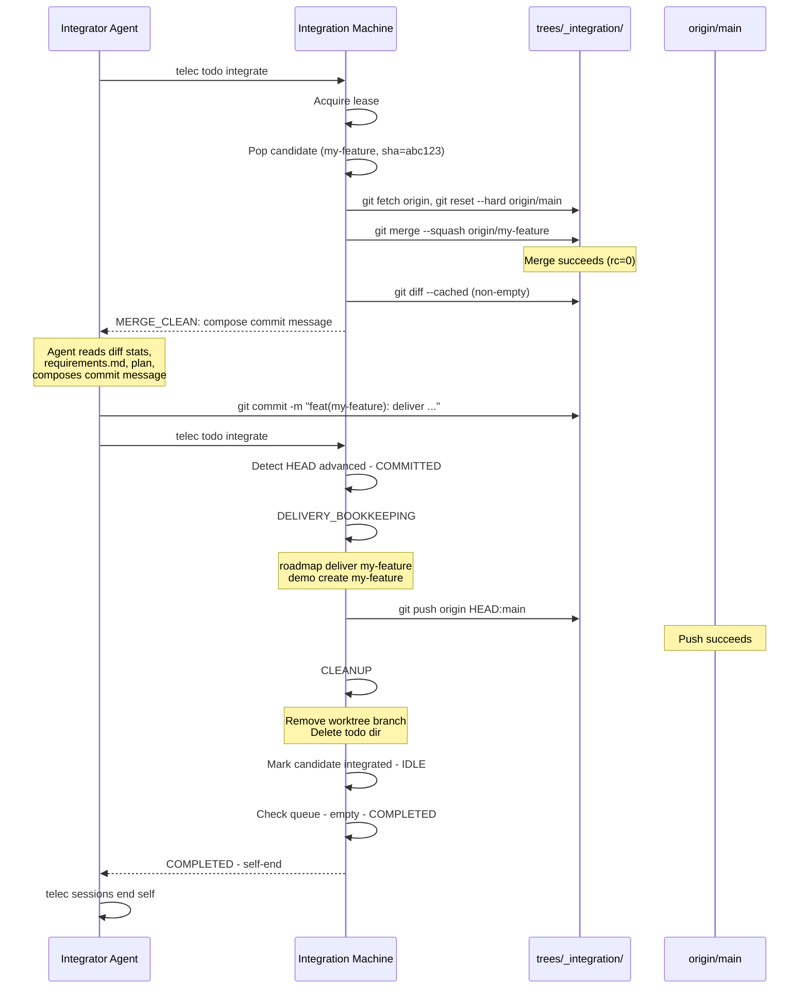

### Conflict resolution (sequence diagram)

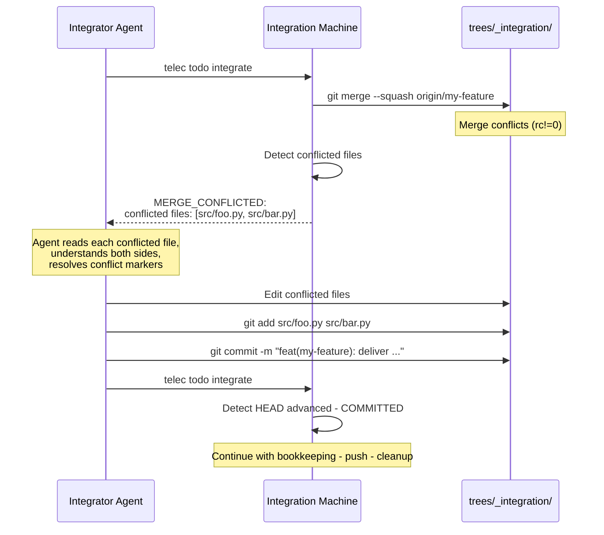

### Push rejection recovery (sequence diagram)

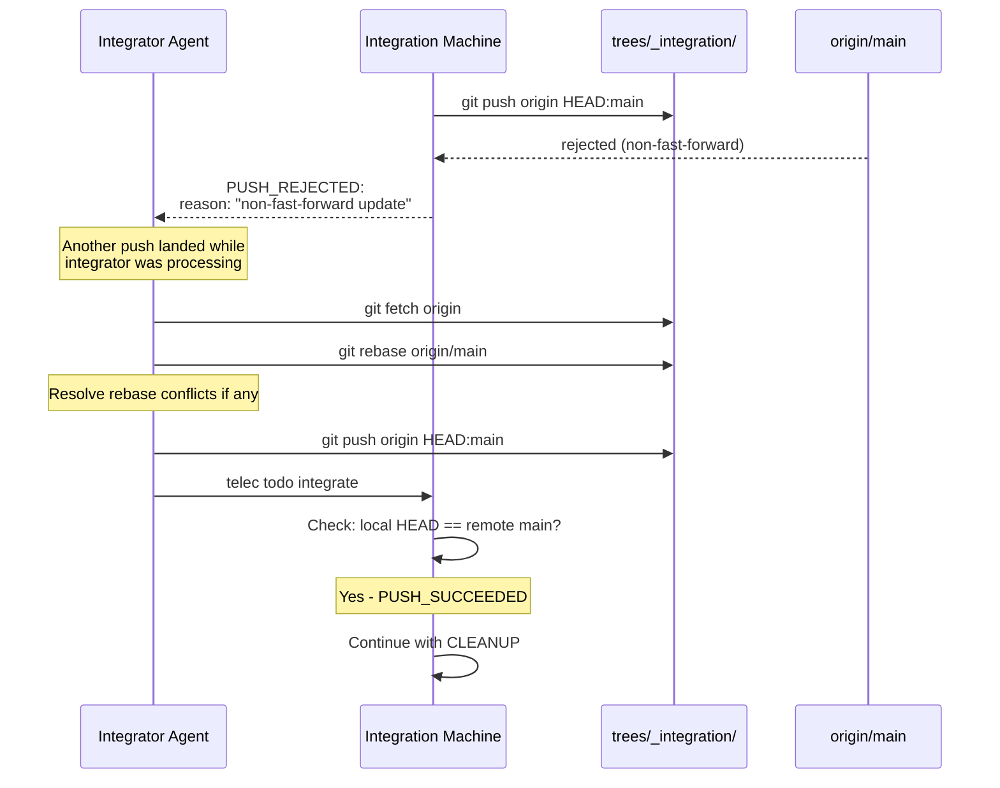

### Architecture overview

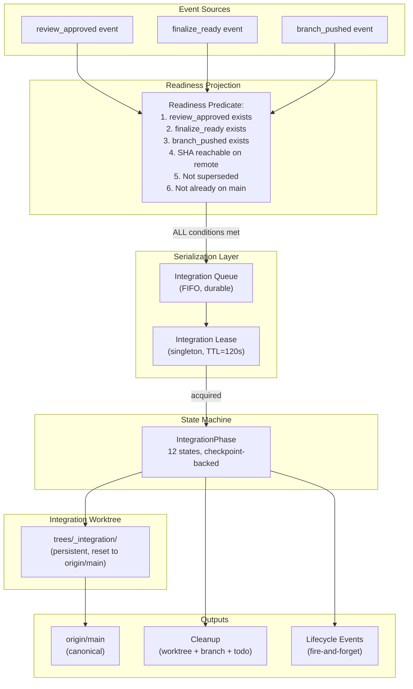

### Lease and queue mechanics

The integration lease enforces singleton execution — only one integrator session processes the queue at any time:

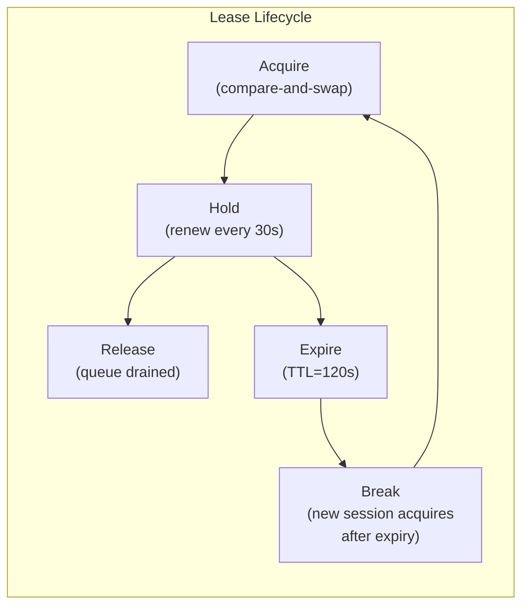

| Property | Value |
|----------|-------|
| Lease key | `integration/main` |
| TTL | 120 seconds |
| Renew interval | 30 seconds |
| Acquisition | Atomic compare-and-swap |
| Stale break | Allowed after expiry |
| Queue order | FIFO by `ready_at` timestamp |
| Queue deduplication | By `(slug, branch, sha)` |
| Queue item states | `queued` → `in_progress` → `integrated` / `blocked` / `superseded` |

### Already-integrated detection

Two guards prevent re-integrating content already on main:

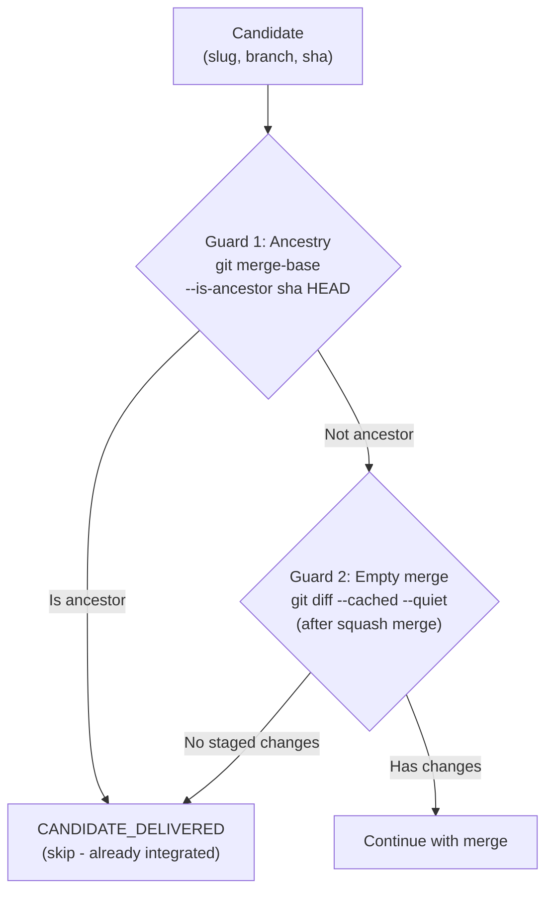

- **Guard 1 (ancestry):** fast path for regular merges where git maintains ancestry links.
- **Guard 2 (empty merge):** catches squash merges — squash commits don't create ancestry links, so Guard 1 misses them. After `git merge --squash`, if `git diff --cached` shows no changes, the content is already on main.

Both guards emit `integration.candidate.already_merged` lifecycle events.

### Delivery bookkeeping

After the agent commits the squash merge, the machine runs bookkeeping on the **repo root** (not the integration worktree):

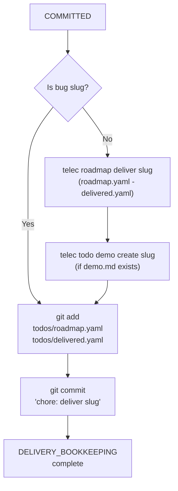

Only bookkeeping files are staged (`git add` by path, not `git add -A`), preserving any dirty state on main.

### Crash recovery

Every phase is recoverable. Re-calling `telec todo integrate` reads the checkpoint and resumes:

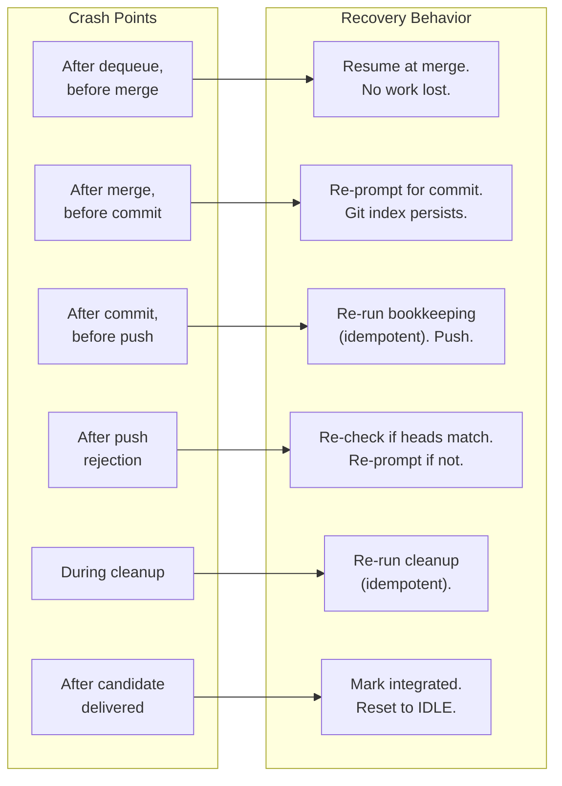

| Crash Point | Checkpoint Phase | Recovery |
|-------------|-----------------|----------|
| After dequeue, before merge | `CANDIDATE_DEQUEUED` | Routes to merge. No work lost. |
| After merge, before commit | `MERGE_CLEAN` / `MERGE_CONFLICTED` | Re-prompts agent. Staged changes persist in git index. |
| After commit, before push | `COMMITTED` | Re-runs delivery bookkeeping (idempotent). Then pushes. |
| After push rejection | `PUSH_REJECTED` | Re-checks if heads match. Re-prompts if not. |
| During cleanup | `CLEANUP` | Re-runs cleanup (idempotent). Missing worktrees are no-ops. |
| After candidate delivered | `CANDIDATE_DELIVERED` | Marks integrated, resets to IDLE, loops for next. |

### Lifecycle events

| Event | Emitted When |
|-------|-------------|
| `integration.started` | First candidate dequeued in a session |
| `integration.candidate.dequeued` | Candidate popped from queue |
| `integration.candidate.already_merged` | Candidate skipped (ancestry or empty merge) |
| `integration.merge.succeeded` | Clean squash merge completed |
| `integration.merge.conflicted` | Squash merge produced conflicts |
| `integration.candidate.committed` | Agent commit detected (HEAD advanced) |
| `integration.push.succeeded` | Push to origin succeeded |
| `integration.push.rejected` | Push to origin rejected |
| `integration.candidate.delivered` | Candidate fully integrated and cleaned up |
| `integration.candidate.blocked` | Candidate blocked (via queue mark) |

### Internal loop

`_dispatch_sync` runs a capped loop (50 iterations) that reads the checkpoint, dispatches to the appropriate phase handler, and either loops internally (for autonomous transitions like COMMITTED → BOOKKEEPING → PUSH → CLEANUP) or returns an instruction string (for agent decision points like MERGE_CLEAN, MERGE_CONFLICTED, PUSH_REJECTED). This enables multi-phase advancement in a single `telec todo integrate` call.

## Failure modes

- **Lease already held**: returns `LEASE_BUSY` — exit immediately. Do not attempt to break the lease.
- **Queue empty**: returns `COMPLETED` — self-end the session.
- **Merge conflicts (unresolvable)**: agent leaves uncommitted, machine re-prompts. If genuinely unresolvable, call `telec todo integrate` without committing — the machine detects no HEAD advancement and re-prompts.
- **Push repeatedly rejected**: agent fetches, rebases, resolves rebase conflicts, pushes in integration worktree. If the problem persists, check for concurrent integrators (should not happen with lease, but may indicate stale lease).
- **Candidate already integrated**: silent skip to CANDIDATE_DELIVERED. No agent action needed. Emits `integration.candidate.already_merged`.
- **Checkpoint corrupt or missing**: resets to IDLE, starts fresh. No manual editing needed.
- **Integration worktree missing**: created on first use, reused after. Missing worktree is auto-created.
- **Auto-enqueue fallback**: when called with explicit slug not in queue, auto-enqueues from local branch (branch name == slug convention), provided SHA is not already ancestor of main.
