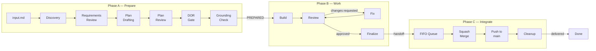
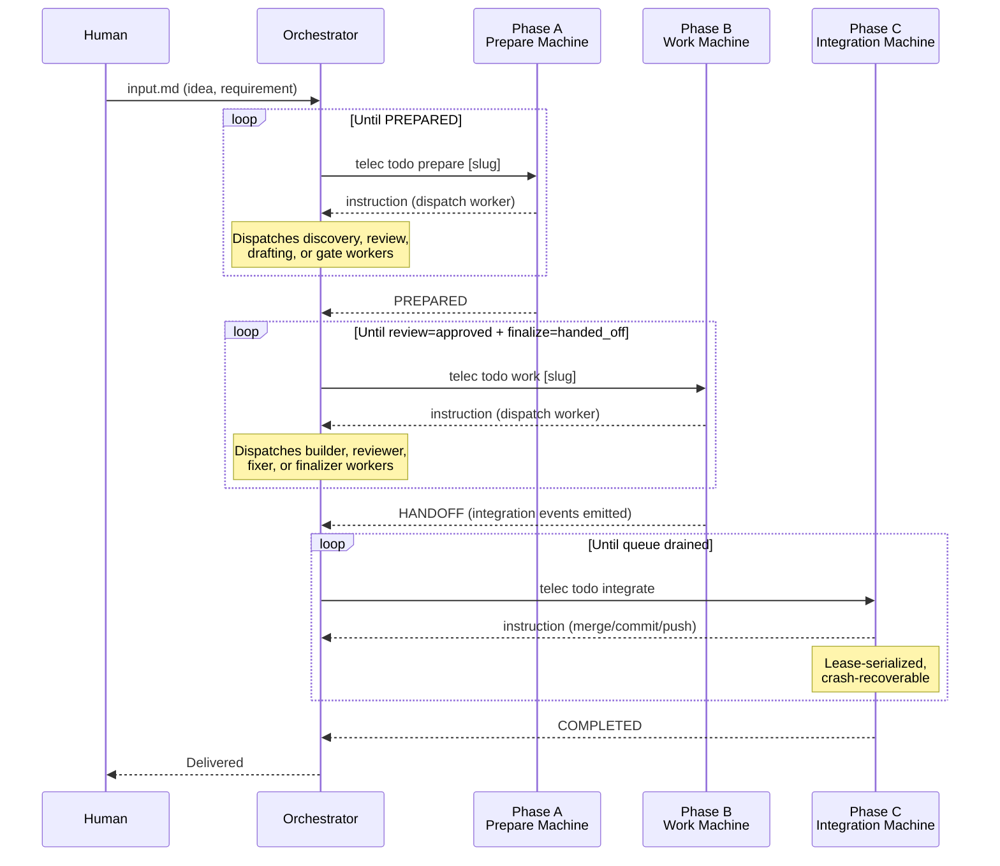
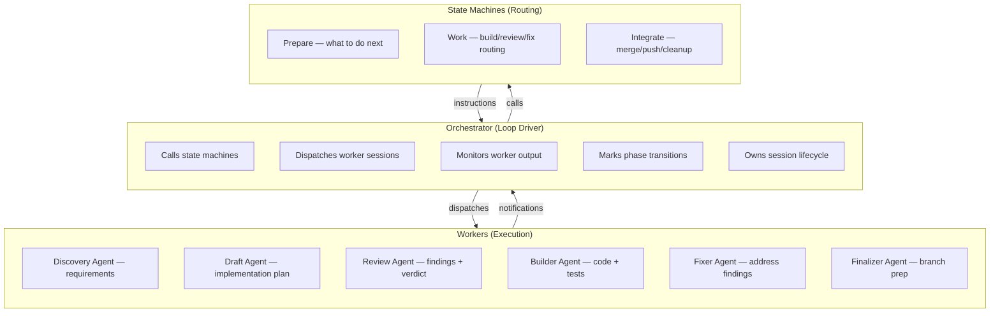

# Lifecycle State Machines — Design

## Purpose

TeleClaude's software development lifecycle is driven by three deterministic state machines, each governing a distinct phase of delivery. The orchestrator calls a machine, executes the returned instruction (typically dispatching a worker session), then calls again. This loop continues until a terminal state.

| Phase | Name | State Machine | Entry Point | Purpose |
|-------|------|---------------|-------------|---------|
| **A** | [Prepare](prepare-state-machine.md) | `PreparePhase` (10 states) | `telec todo prepare [slug]` | Define scope, requirements, and implementation plan |
| **B** | [Work](work-state-machine.md) | Build/Review/Fix routing | `telec todo work [slug]` | Build, review, fix, and finalize the implementation |
| **C** | [Integrate](integration-state-machine.md) | `IntegrationPhase` (12 states) | `telec todo integrate [slug]` | Merge to main, push, deliver |

### Referenced files

| File | Purpose |
|------|---------|
| [`teleclaude/core/next_machine/core.py`](../../../../teleclaude/core/next_machine/core.py) | Prepare + Work state machine implementation |
| [`teleclaude/core/integration/state_machine.py`](../../../../teleclaude/core/integration/state_machine.py) | Integration state machine implementation |
| [`teleclaude/core/integration/queue.py`](../../../../teleclaude/core/integration/queue.py) | Integration FIFO queue |
| [`teleclaude/core/integration/lease.py`](../../../../teleclaude/core/integration/lease.py) | Singleton lease for integration serialization |

### Referenced doc snippets

| Snippet ID | Content |
|------------|---------|
| `software-development/procedure/lifecycle-overview` | Full lifecycle phases and handoffs |
| `general/procedure/orchestration` | Orchestration loop and dispatch rules |
| `project/spec/integration-orchestrator` | Integration contract (events, lease, queue) |

## Inputs/Outputs

**Inputs:**

- `todos/roadmap.yaml` — work item registry with priorities and dependency graph
- `todos/{slug}/input.md` — human idea or requirement (Phase A entry)
- `todos/{slug}/requirements.md` — feature requirements (Phase A output, Phase B input)
- `todos/{slug}/implementation-plan.md` — technical design (Phase A output, Phase B input)
- `todos/{slug}/state.yaml` — phase tracking, review verdicts, grounding metadata, finalize state
- `config.yml` (via `app_config.agents`) — agent availability and strengths

**Outputs:**

- Instruction blocks for the orchestrator to execute (dispatch worker, mark phase, handoff)
- Lifecycle events at each phase transition (consumed by automation and notifications)
- Delivered code on canonical `main` (Phase C pushes from integration worktree)
- Delivery bookkeeping (roadmap updates, demo promotion, cleanup)

## Invariants

- **Deterministic routing**: given the same artifact state on disk, the same instruction is produced.
- **Sequential phases**: Prepare → Work → Integrate. No phase skipping.
- **Artifact immutability**: machines never modify artifacts directly; they delegate to workers.
- **Dependency blocking**: cannot claim a work item until all its dependencies are complete.
- **Integration serialization**: only one integrator pushes `main` at a time, enforced by a singleton lease.
- **Crash recovery**: all three machines are re-entrant. Re-calling after a crash resumes from durable state.

## Primary flows

### End-to-end flow

### How the machines connect

The orchestrator drives each machine in a loop. Phase boundaries are event-driven handoffs — Phase B emits integration readiness events that Phase C consumes via a durable queue.

### Roles and responsibilities

The orchestrator never makes routing decisions — the machines own sequencing. The orchestrator dispatches what is requested.

### Worker dispatch pattern

All workers are dispatched via `telec sessions run`. The machine specifies the command; the orchestrator specifies agent and thinking mode.

| Phase | Worker Role | Command | Thinking Mode |
|-------|-------------|---------|---------------|
| Prepare | Architect | `/next-prepare-discovery`, `/next-prepare-draft` | `slow` |
| Prepare | Reviewer | `/next-review-requirements`, `/next-review-plan` | `slow` |
| Prepare | Assessor | `/next-prepare-gate` | `slow` |
| Build | Builder | `/next-build` (or `/next-bugs-fix`) | `med` |
| Review | Reviewer | `/next-review-build` | `slow` (mandatory) |
| Fix | Fixer | `/next-fix-review` | `med` |
| Finalize | Finalizer | `/next-finalize` | `med` |

### Detailed documentation

Each state machine has its own design document with full state diagrams, sequence diagrams, flow diagrams, and command cross-references:

1. **[Prepare State Machine](prepare-state-machine.md)** — Phase A: 10 states, from idea to implementation-ready artifacts
2. **[Work State Machine](work-state-machine.md)** — Phase B: Build/review/fix/finalize routing with quality gates
3. **[Integration State Machine](integration-state-machine.md)** — Phase C: 12 states, lease-serialized merge-to-main delivery

## Failure modes

- **No roadmap**: cannot discover work items. Returns error instructing user to create roadmap.
- **Dependency cycle**: circular dependencies detected. Logs error, refuses to dispatch.
- **All agents unavailable**: hard error. If some are degraded, notes in guidance and lets orchestrator decide.
- **Worker crash**: orchestrator retries once, then escalates.
- **Phase mark failure**: worker must commit before marking phase.
- **Integration contention**: serialized by lease; concurrent candidates are queued in FIFO order.
- **Stale artifacts**: requirements updated but plan not regenerated. Grounding check catches and triggers re-grounding.
