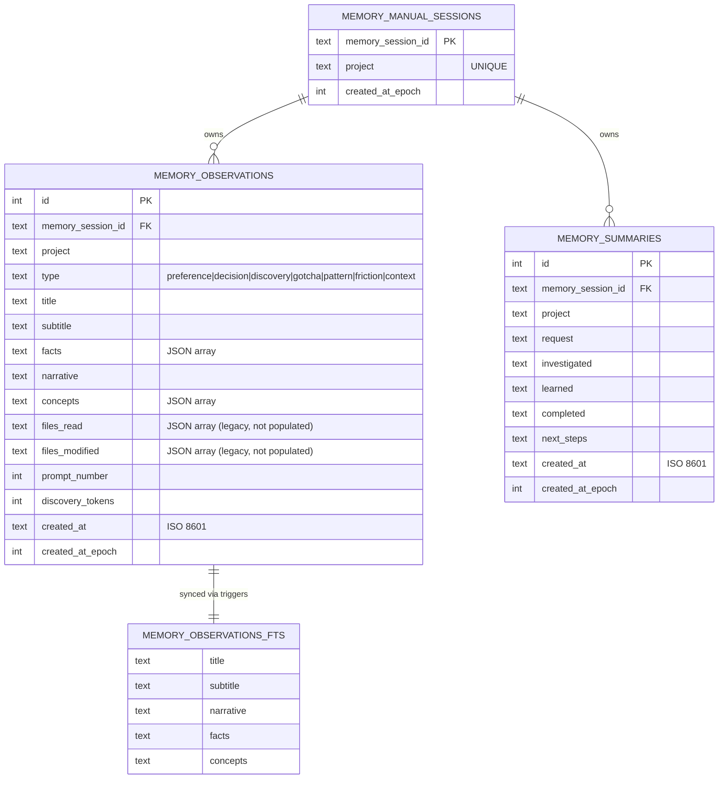
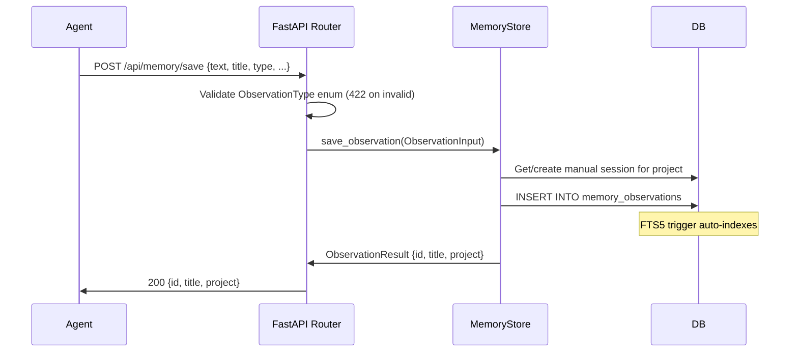
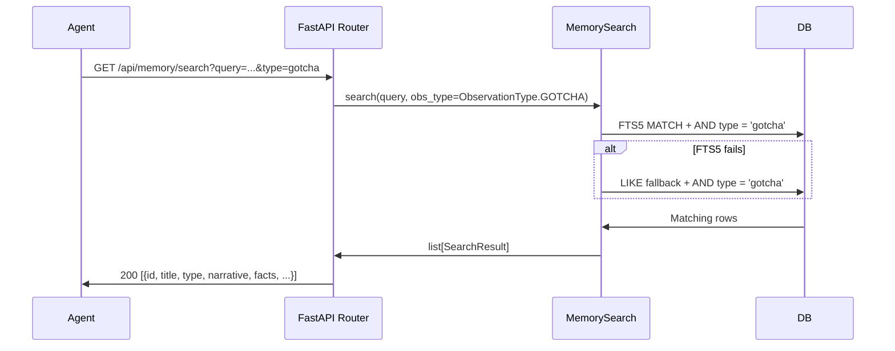
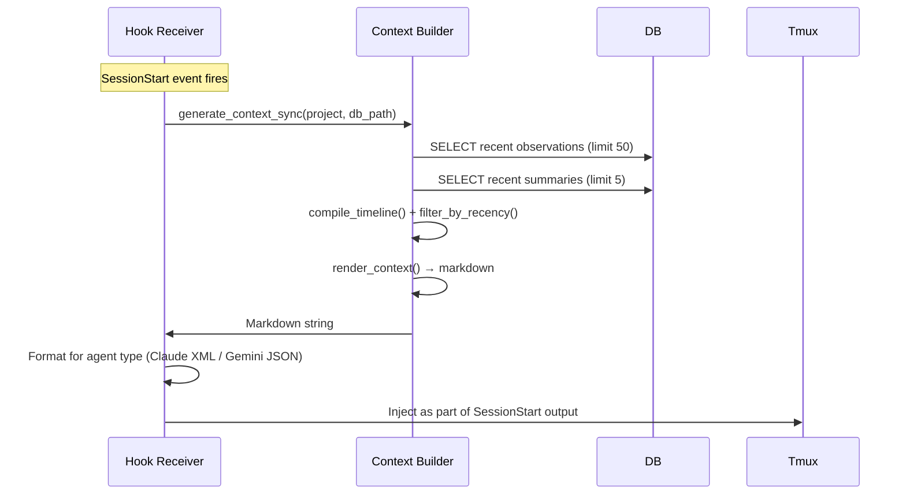

# Memory System — Design

## Purpose

Give AI agents persistent memory across sessions by storing relationship-centric observations in the daemon's SQLite database. Observations are typed, searchable via FTS5, and injected into agent sessions at startup via the hook receiver.

Replaces the external `memory-management-api` dependency (TypeScript/Bun on port 37777) with a fully integrated Python implementation: single database, single package, full ownership.

## Inputs/Outputs

**Inputs:**

- HTTP API requests from agents (`POST /api/memory/save`, `GET /api/memory/search`)
- Hook receiver `SessionStart` event (triggers context injection)
- Migration script for one-time import from legacy `memory-management-api` database

**Outputs:**

- Persisted observations in `memory_observations` table with FTS5 index
- Markdown context block injected into agent sessions at startup
- Search results via HTTP API for on-demand recall

## Module Layout

```
teleclaude/memory/
├── __init__.py          # Public API: MemoryStore, MemorySearch, ObservationType, ObservationConcept
├── types.py             # Enums (ObservationType, ObservationConcept) and dataclasses
├── store.py             # MemoryStore: save/retrieve observations (async + sync)
├── search.py            # MemorySearch: FTS5/LIKE search, timeline, batch fetch
├── api_routes.py        # FastAPI router: /api/memory/* endpoints
├── migrate_from_claude_mem.py  # One-time migration from legacy memory-management-api DB
└── context/
    ├── __init__.py      # Exports: generate_context, generate_context_sync
    ├── builder.py       # Entry points: fetch observations + summaries, compile, render
    ├── compiler.py      # Merge observations + summaries into unified timeline
    └── renderer.py      # Render timeline entries to markdown
```

## Data Model



## Observation Types

Types are validated at the application layer via `ObservationType` enum (not a SQL CHECK constraint). All API boundaries enforce strict enum typing — invalid types receive a 422 response with allowed values.

| Type         | Purpose                                                       |
| ------------ | ------------------------------------------------------------- |
| `preference` | User likes/dislikes, working style, communication preferences |
| `decision`   | Architectural or design choices with rationale                |
| `discovery`  | Something learned about a system, codebase, or domain         |
| `gotcha`     | Pitfalls, traps, surprising behavior                          |
| `pattern`    | Recurring approaches that work well                           |
| `friction`   | What causes slowdowns, miscommunication, or frustration       |
| `context`    | Project/team/domain background knowledge                      |

The `files_read` and `files_modified` columns are retained in the schema for backward compatibility with migrated data but are not populated by the current API.

## Access Patterns

### 1. HTTP API (agent-facing)

Agents discover the memory API through `telec docs index` + `telec docs get` (retrieving the `memory-management-api` spec doc) and then call the daemon API over the local unix socket.

| Endpoint               | Method | Purpose                                    |
| ---------------------- | ------ | ------------------------------------------ |
| `/api/memory/save`     | POST   | Store a new observation                    |
| `/api/memory/search`   | GET    | Full-text search with optional type filter |
| `/api/memory/timeline` | GET    | Observations around an anchor ID           |
| `/api/memory/batch`    | POST   | Bulk fetch by IDs                          |
| `/api/memory/inject`   | GET    | Generate context markdown for a project    |

The router is registered in `api_server.py` via `include_router(memory_router)`.

### 2. Hook Receiver (context injection)

The hook receiver calls `generate_context_sync()` directly against the database — no HTTP round-trip. This runs in the synchronous hook process, so it uses SQLAlchemy's sync engine with a separate connection.

### 3. Search (FTS5 with LIKE fallback)

FTS5 is the primary search path. If unavailable (rare), falls back to `LIKE` queries on title, narrative, and facts columns. The `type` parameter enables progressive disclosure — agents can filter to specific observation categories.

## Primary Flows

### 1. Save Observation



### 2. Search with Progressive Disclosure



### 3. Context Injection at Session Start



## Invariants

1. **Single database**: All memory tables live in `teleclaude.db` alongside session and hook tables. No separate database files.

2. **Strict enum validation**: `ObservationType` is enforced at every API boundary. The SQL schema has no CHECK constraint — validation happens in Python. Invalid types are rejected with 422 before reaching the database.

3. **FTS5 sync via triggers**: INSERT/DELETE/UPDATE triggers on `memory_observations` keep the `memory_observations_fts` virtual table in sync. No manual FTS management needed.

4. **Dual access paths**: Async (SQLAlchemy async engine via `db._session()`) for daemon/API code. Sync (SQLAlchemy sync engine) for hook receiver, which runs as a separate process and cannot use the daemon's async runtime.

5. **One manual session per project**: The `memory_manual_sessions` table enforces a UNIQUE constraint on `project`. All API-created observations for a project share the same session ID.

6. **Graceful degradation**: FTS5 unavailability falls back to LIKE. Context generation failures return empty string. Search failures are caught and logged.

## Failure Modes

| Scenario                                   | Behavior                                    | Recovery                                               |
| ------------------------------------------ | ------------------------------------------- | ------------------------------------------------------ |
| FTS5 unavailable                           | Search falls back to LIKE queries           | Automatic; slightly slower search                      |
| Context generation fails                   | Empty string returned; no injection         | Agent starts without memory context; logged as warning |
| Invalid observation type                   | 422 response with allowed values            | Agent adjusts payload; no data corruption              |
| Database locked during save                | SQLAlchemy retries via busy_timeout (5s)    | Automatic for short locks; longer locks fail and log   |
| Migration from memory-management-api fails | INSERT OR IGNORE; partial migration is safe | Re-run migration; idempotent by design                 |
| Hook receiver DB connection fails          | Empty context returned                      | Agent starts without memory; daemon continues normally |

## See Also

- ~/.teleclaude/docs/general/spec/tools/memory-management-api.md — HTTP API spec for agents
- ~/.teleclaude/docs/general/procedure/memory-management.md — What to store and the Gem standard
- ~/.teleclaude/docs/general/concept/memory-tiers.md — Where memory fits in the agent knowledge gradient
- docs/project/design/architecture/database.md — Parent database architecture
