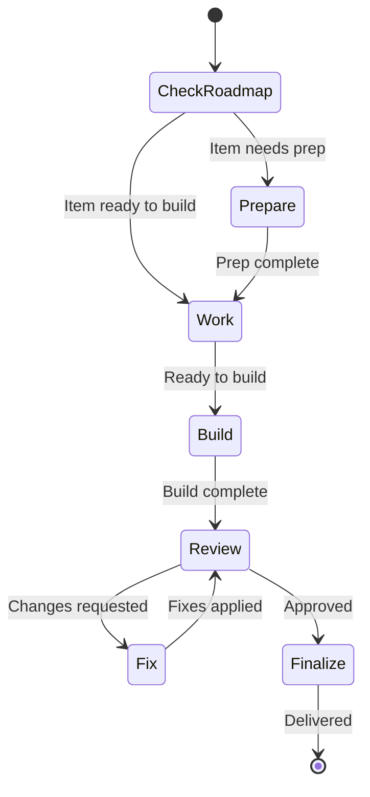
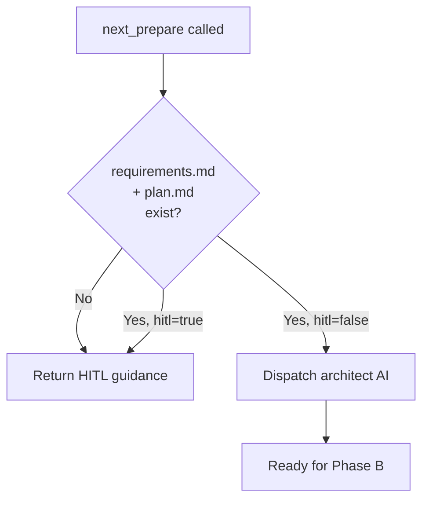
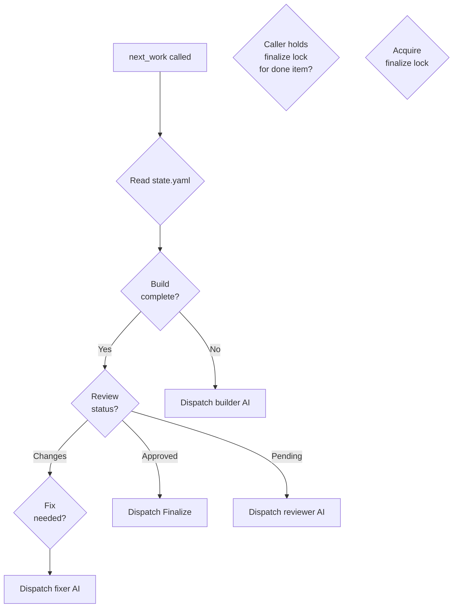
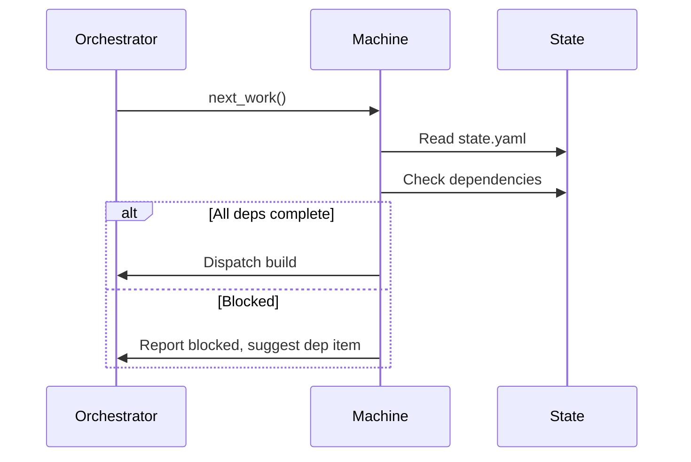

# Next Machine — Design

## Purpose

The Next Machine orchestrates complex development cycles (Phase A: Prepare, Phase B: Build/Review/Fix) without maintaining internal state.

1. **Statelessness**: It derives all work status from project artifacts:
   - `roadmap.yaml` (item discovery)
   - `requirements.md` and `implementation-plan.md` (preparation check)
   - `state.yaml` (build/review phase tracking)
2. **Phases**:
   - **Phase A (Prepare)**: HITL-heavy preparation of work items.
   - **Phase B (Work)**: Deterministic, autonomous implementation and verification.
3. **Execution**: It returns explicit instructions or tool calls for the calling AI to execute.

- Blocks claiming items with incomplete dependencies.
- Requires project files to be tracked by git for worktree accessibility.

```mermaid
stateDiagram-v2
    [*] --> CheckRoadmap
    CheckRoadmap --> Prepare: Item needs prep
    CheckRoadmap --> Work: Item ready to build
    Prepare --> Work: Prep complete
    Work --> Build: Ready to build
    Build --> Review: Build complete
    Review --> Fix: Changes requested
    Review --> Finalize: Approved
    Fix --> Review: Fixes applied
    Finalize --> [*]: Delivered
```

## Inputs/Outputs

**Inputs:**

- `todos/roadmap.yaml` - Work item registry with priorities
- `todos/{slug}/requirements.md` - Feature requirements
- `todos/{slug}/implementation-plan.md` - Technical design
- `todos/{slug}/state.yaml` - Phase tracking (build, review)
- `todos/{slug}/deferrals.md` - Identified technical debt
- `config.yml` (via `app_config.agents`) - Agent availability and strengths

**Outputs:**

- Explicit tool calls to execute (start_session, run_agent_command) with placeholders for agent/mode
- Human-in-the-loop guidance for preparation phase
- Agent selection guidance block derived from machine config and runtime availability
- Phase completion marks via mark_phase tool
- Dependency resolution via set_dependencies tool

## Invariants

- **Stateless Derivation**: All state derived from filesystem artifacts; no internal state stored.
- **Artifact Immutability**: Machine never modifies artifacts directly; delegates to workers.
- **Dependency Blocking**: Cannot claim item until all dependencies complete.
- **Phase Ordering**: Phases progress sequentially; no phase skipping.
- **Git Requirement**: All work items must be in git for worktree accessibility.
- **Finalize Serialization**: Only one finalize may run at a time across all orchestrators, enforced by the singleton integrator's lease system.
- **Conditional Prep**: Worktree prep is required on new worktree creation or prep-input drift; unchanged known-good worktrees skip prep.
- **Per-Repo+Slug Single-Flight**: Concurrent `/todos/work` calls for the same slug share one ensure/prep/sync critical section only within the same project root.
- **Conditional Sync**: Main-to-worktree sync mirrors only shared planning inputs needed for orchestration. Today that means `todos/roadmap.yaml`, copied only when content differs.
- **Phase Observability**: `/todos/work` emits per-phase timing logs with stable `NEXT_WORK_PHASE` markers.

## Primary flows

### 1. Phase A: Preparation (HITL)

```mermaid
flowchart TD
    Start[next_prepare called]
    CheckFiles{requirements.md<br/>+ plan.md<br/>exist?}
    HITL[Return HITL guidance]
    Dispatch[Dispatch architect AI]
    Done[Ready for Phase B]

    Start --> CheckFiles
    CheckFiles -->|No| HITL
    CheckFiles -->|Yes, hitl=true| HITL
    CheckFiles -->|Yes, hitl=false| Dispatch
    Dispatch --> Done
```

### 2. Phase B: Build Cycle

```mermaid
flowchart TD
    Start[next_work called]
    ReleaseLock{Caller holds<br/>finalize lock<br/>for done item?}
    CheckState{Read state.yaml}
    Build{Build<br/>complete?}
    Review{Review<br/>status?}
    Fix{Fix<br/>needed?}
    AcquireLock{Acquire<br/>finalize lock}
    Finalize[Dispatch Finalize]

    Start --> CheckState
    CheckState --> Build
    Build -->|No| DispatchBuilder[Dispatch builder AI]
    Build -->|Yes| Review
    Review -->|Pending| DispatchReviewer[Dispatch reviewer AI]
    Review -->|Changes| Fix
    Review -->|Approved| Finalize
    Fix --> DispatchFixer[Dispatch fixer AI]
```

### Worktree Prep and Sync Policy

For each `/todos/work` request, Next Machine applies deterministic prep/sync decisions:

1. **Ensure worktree exists**
   - If missing: create `trees/{slug}` and branch.
2. **Prep decision**
   - Run prep when:
     - worktree was newly created
     - prep-state marker is missing/corrupt
     - prep input digest changed (`tools/worktree-prepare.sh`, dependency manifests/lockfiles)
   - Skip prep when inputs are unchanged and previous prep succeeded.
3. **Single-flight**
   - Ensure/prep/sync is guarded by a per-repo+slug async lock.
   - Same-slug concurrent calls in the same repo wait and reuse resulting ready state.
   - Same-slug calls in different repos run independently.
4. **Sync decision**
   - `sync_main_to_worktree` compares source/destination file contents before copying.
   - The only mirrored file is `todos/roadmap.yaml`.
   - Slug todo artifacts (`state.yaml`, `requirements.md`, `implementation-plan.md`, `review-findings.md`, `dor-report.md`, etc.) are branch-owned and are not synced from main into the worktree.

### `/todos/work` Phase Logs

`next_work(...)` logs timing for major phases with a grep-stable marker:

- `NEXT_WORK_PHASE slug=<slug> phase=slug_resolution ...`
- `NEXT_WORK_PHASE slug=<slug> phase=preconditions ...`
- `NEXT_WORK_PHASE slug=<slug> phase=ensure_prepare ...`
- `NEXT_WORK_PHASE slug=<slug> phase=sync ...`
- `NEXT_WORK_PHASE slug=<slug> phase=gate_execution ...`
- `NEXT_WORK_PHASE slug=<slug> phase=dispatch_decision ...`

Each entry includes:

- `decision` (`run`, `skip`, `error`, `wait`)
- `reason` (deterministic reason code)
- `duration_ms` (phase duration)

For the worktree setup boundary specifically:

- `next_work()` emits context logs before entering the combined ensure/sync section so failures can be pinned to worktree setup vs later phases.
- Unexpected exceptions in `ensure_prepare` are surfaced as `reason=unexpected_<ExceptionType>` instead of disappearing behind a generic API 500.

### 3. Dependency Resolution

```mermaid
sequenceDiagram
    participant Orchestrator
    participant Machine
    participant State

    Orchestrator->>Machine: next_work()
    Machine->>State: Read state.yaml
    Machine->>State: Check dependencies
    alt All deps complete
        Machine->>Orchestrator: Dispatch build
    else Blocked
        Machine->>Orchestrator: Report blocked, suggest dep item
    end
```

### 4. Worker Dispatch Pattern

| Phase    | Worker Role  | Command Example                                                                  |
| -------- | ------------ | -------------------------------------------------------------------------------- |
| Prepare  | Orchestrator | `/prime-orchestrator` then route with `telec todo prepare` / `telec todo work`   |
| Build    | Builder      | `/next-build` in worktree                                                        |
| Review   | Reviewer     | `/next-review-build` - evaluate against requirements                             |
| Fix      | Fixer        | `/next-fix-review` - address findings                                            |
| Finalize | Finalizer    | `/next-finalize` - prepare and emit FINALIZE_READY (apply is orchestrator-owned) |

## Failure modes

- **Missing Roadmap**: Cannot discover work items. Returns error instructing user to create roadmap.
- **Malformed State JSON**: Cannot read phase status. Treats as pending and restarts build phase.
- **Dependency Cycle**: Circular dependencies detected. Logs error, refuses to dispatch.
- **No Selectable Agents**: All agents are disabled in `config.yml` or marked unavailable in DB. Next Machine returns a hard error. If some agents are available but degraded, it notes this in the guidance and lets the orchestrator choose whether to proceed.
- **Git Not Available**: Worktree commands fail. Machine returns error; manual git setup required.
- **Stale Artifacts**: Requirements updated but plan not regenerated. Reviewer catches mismatch; fix manually.
- **Worker Crash**: Dispatched AI never completes. Orchestrator must timeout and retry or escalate.
- **Phase Mark Failure**: mark_phase tool fails due to uncommitted changes. Worker must commit before marking.
- **Finalize Contention**: Multiple orchestrators reach finalize simultaneously. Serialized by the singleton integrator's lease; each candidate is queued and processed in order.
