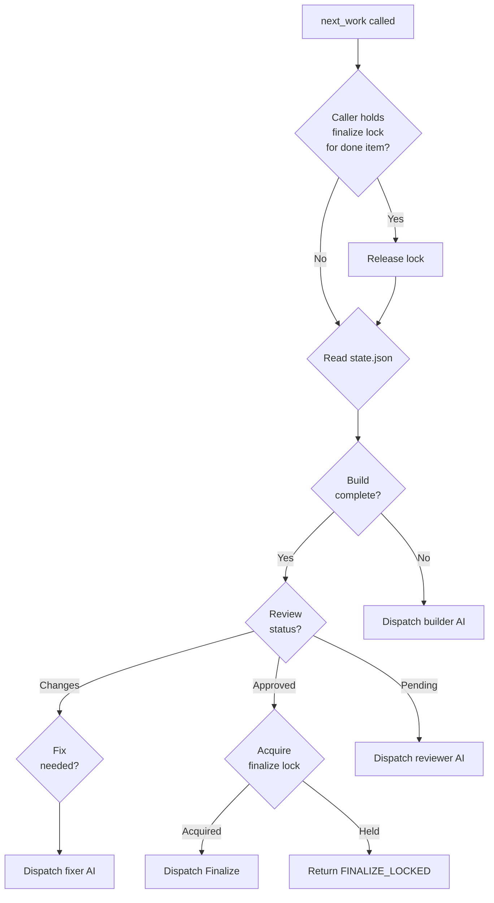

# Next Machine — Design

## Purpose

The Next Machine orchestrates complex development cycles (Phase A: Prepare, Phase B: Build/Review/Fix) without maintaining internal state.

1. **Statelessness**: It derives all work status from project artifacts:
   - `roadmap.yaml` (item discovery)
   - `requirements.md` and `implementation-plan.md` (preparation check)
   - `state.json` (build/review phase tracking)
2. **Phases**:
   - **Phase A (Prepare)**: HITL-heavy preparation of work items.
   - **Phase B (Work)**: Deterministic, autonomous implementation and verification.
3. **Execution**: It returns explicit instructions or tool calls for the calling AI to execute.

- Blocks claiming items with incomplete dependencies.
- Requires project files to be tracked by git for worktree accessibility.

## Inputs/Outputs

**Inputs:**

- `todos/roadmap.yaml` - Work item registry with priorities
- `todos/{slug}/requirements.md` - Feature requirements
- `todos/{slug}/implementation-plan.md` - Technical design
- `todos/{slug}/state.json` - Phase tracking (build, review)
- `todos/{slug}/deferrals.md` - Identified technical debt

**Outputs:**

- Explicit tool calls to execute (start_session, run_agent_command)
- Human-in-the-loop guidance for preparation phase
- Phase completion marks via mark_phase tool
- Dependency resolution via set_dependencies tool

## Invariants

- **Stateless Derivation**: All state derived from filesystem artifacts; no internal state stored.
- **Artifact Immutability**: Machine never modifies artifacts directly; delegates to workers.
- **Dependency Blocking**: Cannot claim item until all dependencies complete.
- **Phase Ordering**: Phases progress sequentially; no phase skipping.
- **Git Requirement**: All work items must be in git for worktree accessibility.
- **Finalize Serialization**: Only one finalize may run at a time across all orchestrators, enforced by a session-bound file lock (`todos/.finalize-lock`).

## Primary flows

### 1. Phase A: Preparation (HITL)

### 2. Phase B: Build Cycle

### Finalize Lock

Multiple orchestrators may reach the finalize step concurrently for different slugs. A session-bound file lock (`todos/.finalize-lock`) serializes merges to main:

- **Acquire**: `next_work()` step 9 acquires the lock with the orchestrator's `caller_session_id` before dispatching a finalize worker.
- **Release (completion)**: On re-entry, `next_work()` checks if the locked slug is done (phase=DONE or removed from roadmap) and releases only then.
- **Release (session death)**: `cleanup_session_resources()` releases the lock if the dying session holds it.
- **Release (stale)**: If the lock is older than 30 minutes, `acquire_finalize_lock()` breaks it as a safety valve.
- **Concurrency safety**: The lock file contains `session_id`; only the holding session can release it.

### 3. Dependency Resolution

### 4. Worker Dispatch Pattern

| Phase    | Worker Role  | Command Example                                                                          |
| -------- | ------------ | ---------------------------------------------------------------------------------------- |
| Prepare  | Orchestrator | `/prime-orchestrator` then route with `teleclaude__next_prepare`/`teleclaude__next_work` |
| Build    | Builder      | `/next-build` in worktree                                                                |
| Review   | Reviewer     | `/next-review` - evaluate against requirements                                           |
| Fix      | Fixer        | `/next-fix-review` - address findings                                                    |
| Finalize | Finalizer    | `/next-finalize` - merge and log                                                         |

## Failure modes

- **Missing Roadmap**: Cannot discover work items. Returns error instructing user to create roadmap.
- **Malformed State JSON**: Cannot read phase status. Treats as pending and restarts build phase.
- **Dependency Cycle**: Circular dependencies detected. Logs error, refuses to dispatch.
- **No Selectable Agents**: Fallback candidates are degraded/unavailable. Next Machine returns orchestrator guidance to call `teleclaude__mark_agent_status(...)` and retry.
- **Git Not Available**: Worktree commands fail. Machine returns error; manual git setup required.
- **Stale Artifacts**: Requirements updated but plan not regenerated. Reviewer catches mismatch; fix manually.
- **Worker Crash**: Dispatched AI never completes. Orchestrator must timeout and retry or escalate.
- **Phase Mark Failure**: mark_phase tool fails due to uncommitted changes. Worker must commit before marking.
- **Finalize Lock Contention**: Another orchestrator holds the finalize lock. Returns `FINALIZE_LOCKED` with holder info. Orchestrator waits and retries.
- **Stale Finalize Lock**: Holding session died without cleanup. Lock broken after 30 minutes by the next acquire attempt.
