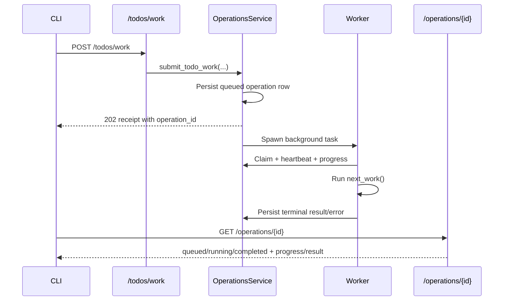

# Operation Receipts — Design

## Required reads

- @docs/project/design/architecture/next-machine.md
- @docs/project/design/architecture/daemon.md

## Purpose

- Move `telec todo work` off the request path by persisting durable operation receipts before work begins.
- Preserve the blocking CLI ergonomics by making the client poll the durable receipt instead of keeping one HTTP request open.
- Keep `next_work()` semantics unchanged while making operation creation idempotent and observable.

## Inputs/Outputs

**Inputs:**

- `POST /todos/work` submissions with caller identity, `cwd`, `slug`, and optional `client_request_id`
- `NEXT_WORK_PHASE` progress emissions from `next_work()`
- Daemon lifecycle events, especially startup and maintenance sweeps
- `GET /operations/{operation_id}` polling requests

**Outputs:**

- Durable operation rows keyed by `operation_id`
- Receipt payloads with `state`, `poll_after_ms`, `status_path`, and `recovery_command`
- Terminal `next_work()` result text or terminal error text
- Stale-state transitions for abandoned or expired operations

## Invariants

- **Persist Before Execute**: The operation row exists before background execution begins.
- **Receipt-First API**: `/todos/work` returns a durable receipt instead of awaiting `next_work()`.
- **Caller Ownership**: Non-admin callers can inspect only their own operations; admins can inspect any receipt.
- **Submit Idempotency Only**: `client_request_id` dedupes operation creation, not `next_work()` execution semantics.
- **Reattachment by Caller Context**: Matching nonterminal operations for the same caller, slug, and cwd are reused instead of duplicated.
- **Progress Mirrors Next Machine**: Durable progress fields reflect the latest `NEXT_WORK_PHASE` values without changing `next_work()` logic.
- **No Blind Replay After Restart**: Queued or running operations from a dead daemon become `stale` instead of being resumed automatically.

## Primary flows

### 1. Submission and Claim

1. `/todos/work` validates the request and hands it to `OperationsService.submit_todo_work()`.
2. The service first checks `client_request_id` dedupe for the caller, then caller-scoped reattachment for a matching nonterminal operation.
3. If no match exists, it persists a `queued` operation row and spawns one background task for that `operation_id`.
4. The worker claims the row atomically, transitions it to `running`, and starts heartbeating.

### 2. Progress and Result Retrieval

1. `next_work()` emits stable `NEXT_WORK_PHASE` markers during execution.
2. The operation runtime captures those values and persists `progress_phase`, `progress_decision`, and `progress_reason`.
3. Polling callers fetch `/operations/{operation_id}` until the operation reaches a terminal state.
4. Terminal payloads preserve the caller-facing `next_work()` result text while still surfacing durable receipt metadata.

### 3. Recovery and Restart Handling

1. If the CLI wrapper is interrupted, it can resume observation with `telec operations get <operation_id>`.
2. Re-running `telec todo work` for the same caller and matching in-flight request reattaches instead of starting duplicate work.
3. On daemon startup, leftover queued or running rows are marked `stale`.
4. The maintenance loop expires long-silent running operations whose heartbeat is older than the configured stale threshold.

## Failure modes

- **Lost Submit Response**: The durable row and caller-scoped dedupe allow the caller to recover without re-running `next_work()`.
- **Wrapper Interruption**: The CLI may stop waiting, but the receipt remains queryable through `/operations/{operation_id}` and `telec operations get`.
- **Worker Crash or Daemon Restart**: Nonterminal operations are marked `stale` so the receipt reflects abandonment instead of pretending work is still active.
- **Hung Execution**: Heartbeat expiry converts silent `running` operations into `stale` operations for observable recovery.
- **Unauthorized Inspection**: Operation lookup returns not found for callers who do not own the receipt and are not admins.
