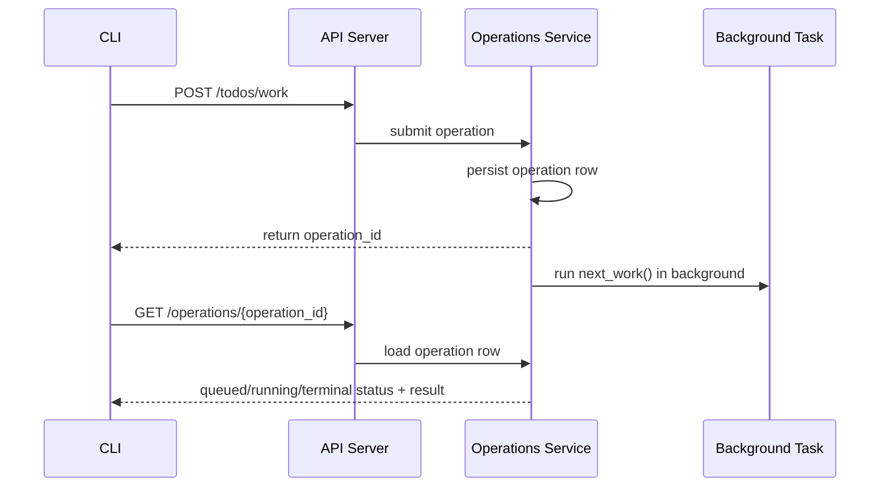

# Operation Receipts — Design

## Purpose

`telec todo work` uses a receipt-first contract instead of holding the HTTP request open
until `next_work()` finishes. The daemon persists an operation row, returns a durable
`operation_id`, and runs `next_work()` in a tracked background task. The CLI keeps the
old blocking ergonomics by polling `/operations/{operation_id}` until the operation
reaches a terminal state.

## Inputs/Outputs

**Inputs:**

- `POST /todos/work` request payload
- Caller session identity
- Optional `client_request_id` for dedupe and reattachment

**Outputs:**

- Immediate receipt containing `operation_id`
- Durable operation row with queued/running/terminal status
- Final `next_work()` result or terminal error retrievable via `GET /operations/{operation_id}`

## Invariants

- **Receipt First**: The operation row is persisted before execution begins.
- **Durable Status**: `GET /operations/{operation_id}` is the source of truth for current state and final result.
- **Caller Ownership**: Operation rows are keyed to the caller session that submitted them.
- **Scoped Visibility**: Non-admin callers may inspect only their own operations; admins may inspect any operation.
- **Safe Reattachment**: Re-running `telec todo work` with the same caller, slug, and cwd reattaches to a matching nonterminal operation instead of creating duplicate execution.
- **No Blind Replay**: Queued or running operations left behind by a daemon restart are marked `stale` instead of being resumed automatically.

## Primary flows

1. **Submission**
   - `POST /todos/work` validates input and submits an operation through the operations service.
   - The service persists the row before execution and returns a receipt immediately.
   - A background task claims the queued operation, heartbeats while running, and stores the terminal `next_work()` result or terminal error.

2. **Reattachment**
   - Submit dedupe uses `client_request_id` scoped by operation kind and caller session.
   - Re-running `telec todo work` with the same caller, slug, and cwd reattaches to a matching nonterminal operation instead of creating a second execution.

3. **Progress**
   - `next_work()` emits `NEXT_WORK_PHASE` logs.
   - The operation runtime mirrors the latest phase, decision, and reason into the durable operation row so polling callers can distinguish queued, running, and recent phase progress.

## Failure modes

- **Daemon restart during execution**: The operation is marked `stale` on startup instead of being resumed automatically.
- **Caller disconnects while polling**: The receipt remains durable; the caller can later resume polling the same `operation_id`.
- **Terminal `next_work()` failure**: The terminal error is stored on the operation row and returned via the status route.
