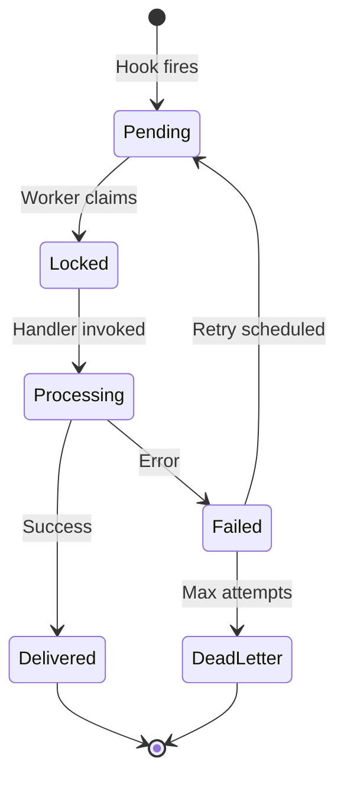
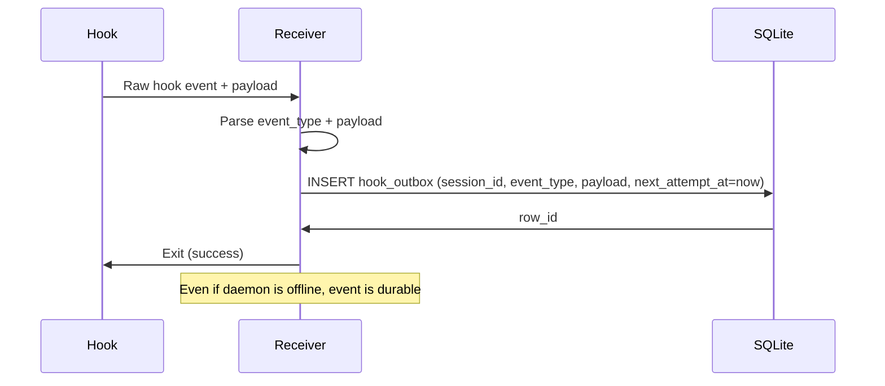
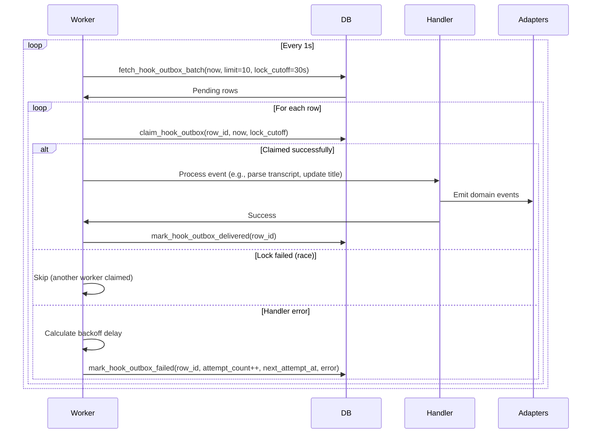

# Outbox — Design

## Required reads

- @docs/project/design/database.md
- @docs/project/spec/event-types.md

## Purpose

- Provide durable delivery semantics for agent hook events.

- hook_outbox: stores agent hook events until consumed by the daemon.

- Hook receiver inserts rows with normalized payloads.
- Daemon locks, processes, and marks rows as delivered.

- Outbox rows remain until marked delivered.
- Hook receiver always writes to hook_outbox instead of invoking daemon directly.

- Stuck rows indicate a processing failure or consumer outage.

## Inputs/Outputs

**Inputs:**

- Agent lifecycle events from agent CLI hooks (mapped to internal `event_type` values such as `session_start`, `user_prompt_submit`, `after_model`, `agent_output`, `agent_stop`, `notification`, `error`)
- Hook payloads with session metadata and event data
- Daemon polling loop triggers for batch processing

**Outputs:**

- Outbox rows persisted in SQLite hook_outbox table
- Processed events consumed and marked delivered
- Failed events with retry schedules and error messages
- Event notifications to adapters and listeners

## Invariants

- **At-Least-Once Delivery**: Every hook event is persisted before processing; daemon crash doesn't lose events.
- **Ordered Processing**: Rows processed in creation order (FIFO by created_at).
- **Exactly-Once Lock**: Each row claimed exclusively by one worker using locked_at + lock_cutoff.
- **Exponential Backoff**: Failed rows retry with increasing delays; permanent failures after max attempts.
- **Idempotent Processing**: Handlers tolerate duplicate delivery if lock expires during processing.

## Primary flows

### 1. Hook Event Lifecycle

### 2. Hook Receiver → Outbox Write

### 3. Daemon Worker Loop

### 4. Retry Backoff Schedule

| Attempt | Delay       | Cumulative Time |
| ------- | ----------- | --------------- |
| 1       | 1s          | 1s              |
| 2       | 2s          | 3s              |
| 3       | 4s          | 7s              |
| 4       | 8s          | 15s             |
| 5       | 16s         | 31s             |
| 6       | 32s         | 63s             |
| 7+      | Dead letter | —               |

### 5. Hook Event Types Processed

| Event Type           | Payload Fields (selected)                 | Action                                                                    |
| -------------------- | ----------------------------------------- | ------------------------------------------------------------------------- |
| `session_start`      | `session_id`, `transcript_path`           | Initialize/anchor headless lifecycle and capture native identity          |
| `user_prompt_submit` | `session_id`, `prompt`                    | Update last user input for session history                                |
| `after_model`        | `session_id`, `transcript_path`           | Treated as output-bearing event (currently typed as `AgentOutputPayload`) |
| `agent_output`       | `session_id`, `transcript_path`           | Process rich incremental output events                                    |
| `agent_stop`         | `session_id`, `transcript_path`, `prompt` | Complete turn handling and downstream summary/notification flow           |
| `notification`       | `session_id`, `message`                   | Relay permission/notification signals                                     |
| `error`              | `message`, `code`, `details`              | Surface hook receiver/runtime failures                                    |

## Failure modes

- **Hook Fire During Daemon Offline**: Event persisted in outbox; processed when daemon restarts. No message loss.
- **Worker Crash Mid-Processing**: Row lock expires after 30s; another worker reclaims and retries. Idempotent handlers prevent double-effect.
- **Database Lock Contention**: Multiple workers racing to claim same row. Only one succeeds; others skip cleanly.
- **Handler Permanent Failure**: Row retries 7 times over 63s, then dead-lettered. Logged for manual investigation.
- **Corrupted Payload**: Handler fails immediately; row dead-lettered after max attempts. No infinite retry loop.
- **Stale Locks**: Rows locked >30s are reclaimed. Prevents stuck rows from blocking queue indefinitely.
- **Outbox Table Growth**: Delivered rows accumulate. Periodic cleanup required (e.g., prune rows >7 days old).
