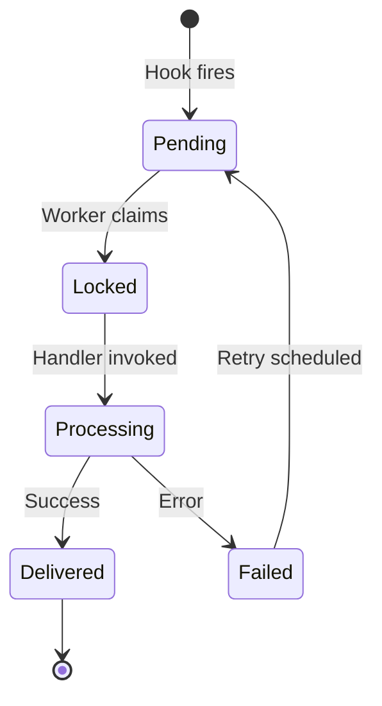
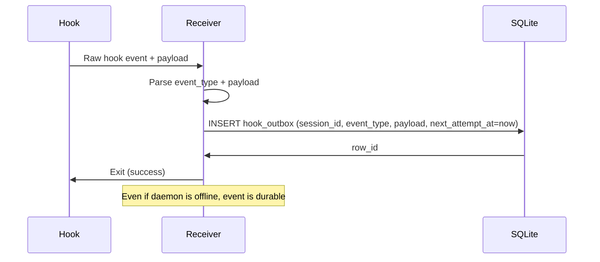

# Outbox — Design

## Required reads

- @docs/project/design/database.md
- @docs/project/spec/event-types.md

## Purpose

- Provide durable delivery semantics for agent hook events.

- hook_outbox: stores agent hook events until consumed by the daemon.

- Hook receiver inserts rows with normalized payloads.
- Daemon locks, processes, and marks rows as delivered.

- Outbox rows remain until marked delivered.
- Hook receiver always writes to hook_outbox instead of invoking daemon directly.

- Stuck rows indicate a processing failure or consumer outage.

## Inputs/Outputs

**Inputs:**

- Agent lifecycle events emitted by agent CLIs and mapped by the receiver to internal `event_type` values (`session_start`, `user_prompt_submit`, `tool_use`, `tool_done`, `agent_stop`, `notification`, `error`)
- Hook payloads with session metadata and event data
- Daemon polling loop triggers for batch processing
- Receiver forwarding is allowlisted: normalized but unhandled events (for example `session_end`) are dropped before outbox insertion.

**Outputs:**

- Outbox rows persisted in SQLite hook_outbox table
- Processed events consumed and marked delivered
- Failed events with retry schedules and error messages
- Event notifications to adapters and listeners

## Invariants

- **At-Least-Once Delivery**: Every hook event is persisted before processing; daemon crash doesn't lose events.
- **Per-Session Ordered Processing**: Rows are fetched FIFO by `created_at`, and rows for the same `session_id` are serialized by a per-session lock.
- **Exactly-Once Lock**: Each row claimed exclusively by one worker using locked_at + lock_cutoff.
- **Exponential Backoff**: Retryable failures back off exponentially and cap at the configured max delay.
- **Idempotent Processing**: Handlers tolerate duplicate delivery if lock expires during processing.
- **Control-plane hooks**: `tool_use` / `tool_done` do not directly fan out adapter output.
  Transcript polling is the output data plane.
- **Output pacing boundary**: Adapter output QoS applies at UI delivery time
  (scheduler + SDK limiter), not at outbox ingestion.
- **Bounded burst handling**: per-session in-memory queue is bounded; bursty hook classes
  are coalesced latest-wins within the current non-critical segment.
- **Critical preservation**: critical classes are never dropped; queue pressure evicts bursty
  rows first and preserves critical ordering.

## Primary flows

### 1. Hook Event Lifecycle

### 2. Hook Receiver → Outbox Write

### 3. Daemon Worker Loop

### 3a. Backpressure classification

| Class    | Event types                                                                                 | Queue policy                                             |
| -------- | ------------------------------------------------------------------------------------------- | -------------------------------------------------------- |
| critical | `session_start`, `user_prompt_submit`, `agent_stop`, `session_end`, `notification`, `error` | Never dropped; strict ordering preserved.                |
| bursty   | `tool_use`, `tool_done` (and non-critical unknowns by default)                              | Coalesced latest-wins; oldest bursty rows evicted first. |

### 4. Retry Backoff Schedule

| Attempt | Delay (default) |
| ------- | --------------- |
| 1       | 1s              |
| 2       | 2s              |
| 3       | 4s              |
| 4       | 8s              |
| 5       | 16s             |
| 6       | 32s             |
| 7+      | 60s cap         |

### 5. Hook Event Types Processed

| Event Type           | Payload Fields (selected)                             | Action                                                                                                                                                                                         |
| -------------------- | ----------------------------------------------------- | ---------------------------------------------------------------------------------------------------------------------------------------------------------------------------------------------- |
| `session_start`      | `session_id`, `transcript_path`                       | Initialize/anchor headless lifecycle and capture native identity                                                                                                                               |
| `user_prompt_submit` | `session_id`, `prompt`                                | Update last user input for session history                                                                                                                                                     |
| `tool_use`           | `session_id`, `transcript_path`                       | Control-plane activity/timing signal (no direct output fanout)                                                                                                                                 |
| `tool_done`          | `session_id`, `transcript_path`                       | Control-plane activity signal (no direct output fanout)                                                                                                                                        |
| `agent_stop`         | `session_id`, `prompt` (+ optional `transcript_path`) | Complete turn handling and downstream summary/notification flow. For Codex, transcript path may be absent initially and is resolved from `native_session_id`/filename match by daemon binding. |
| `notification`       | `session_id`, `message`                               | Relay permission/notification signals                                                                                                                                                          |
| `error`              | `message`, `code`, `details`                          | Surface hook receiver/runtime failures                                                                                                                                                         |

## Failure modes

- **Hook Fire During Daemon Offline**: Event persisted in outbox; processed when daemon restarts. No message loss.
- **Worker Crash Mid-Processing**: Row lock expires after 30s; another worker reclaims and retries. Idempotent handlers prevent double-effect.
- **Database Lock Contention**: Multiple workers racing to claim same row. Only one succeeds; others skip cleanly.
- **Non-Retryable Failure**: Event is marked delivered with an error and not retried.
- **Corrupted Payload**: JSON decode failure is marked delivered with error immediately (no retry loop).
- **Stale Locks**: Rows locked >30s are reclaimed. Prevents stuck rows from blocking queue indefinitely.
- **Outbox Table Growth**: Delivered rows accumulate. Periodic cleanup required (e.g., prune rows >7 days old).
- **Cross-process token sharing**: Outbox processing is safe, but adapter QoS pacing is process-local.
  Multiple daemons with the same Telegram token can still exceed aggregate limits without
  shared coordination (future: Redis token bucket).
