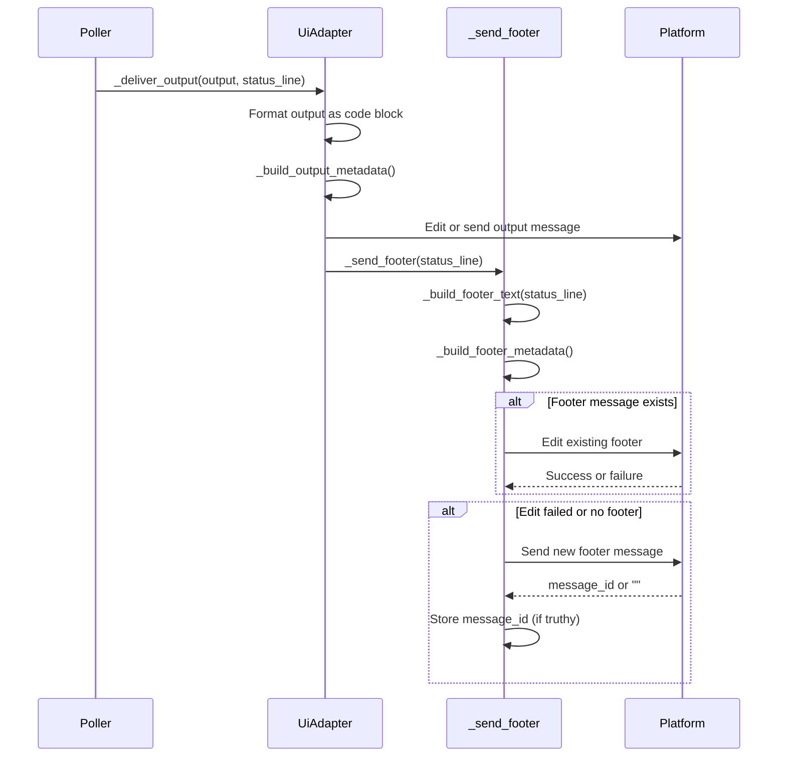
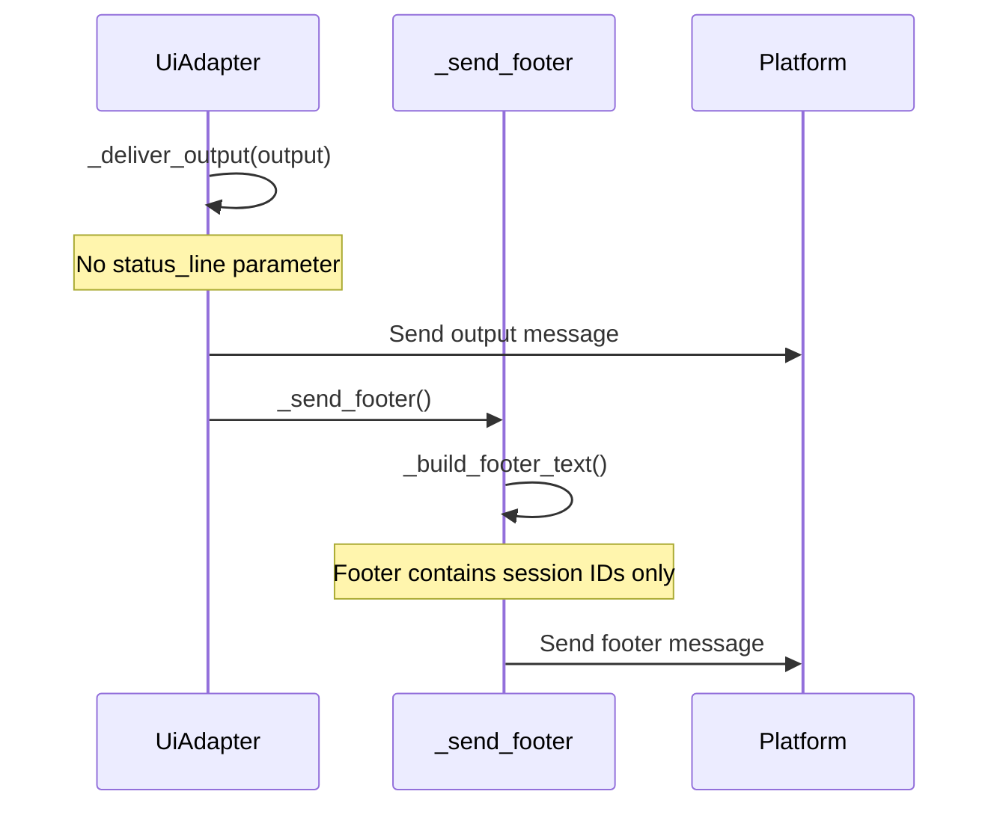

# Output Delivery — Design

## Purpose

Separate AI output from session metadata into two distinct messages with independent lifecycles. The **output message** contains only tmux output (code block). The **footer message** contains status line, session IDs, and platform-specific controls (e.g., download button on Telegram).

This separation allows output to be edited independently from metadata, prevents status information from inflating the output message byte budget, and gives platform-specific controls a stable home.

## Inputs/Outputs

**Inputs:**

- Tmux pane output (raw text from the agent's terminal)
- Status line string (agent status, timing)
- Session metadata (session IDs, agent type)
- Platform capabilities (Telegram supports download buttons; other adapters may not)

**Outputs:**

- Output message: code-block-wrapped tmux content with parse_mode metadata
- Footer message: status line + session IDs + platform controls (download button)

## Invariants

1. **Output message contains only tmux output.** No status line, no download button, no session IDs. The output message is a pure code block.

2. **Footer message contains only metadata.** Status line, session IDs, and platform-specific controls. No tmux output.

3. **Delivery chain**: `_deliver_output(status_line=)` threads the status line to `_send_footer(status_line=)`, which calls `_build_footer_text(status_line=)` to assemble the footer content.

4. **Separate metadata builders**: `_build_footer_metadata()` produces footer-specific metadata (download button on Telegram). `_build_output_metadata()` produces output-specific metadata (parse_mode). They are independent.

5. **Footer edit-or-send**: `_send_footer` tries to edit the existing footer message first. If the edit fails (message deleted, not found), it falls back to sending a new message. Callers control whether the footer is repositioned.

6. **Telegram empty string on missing topic**: `send_message` returns `""` (empty string, falsy) when `topic_id` is missing. `_send_footer` treats any falsy return as failure and skips storing the message ID.

7. **Backward compatibility**: `from_json` deserializer handles legacy `threaded_footer_message_id` field by mapping it to `footer_message_id`.

8. **Threaded output without status**: Threaded output (e.g., Gemini) calls `_deliver_output` without a status_line parameter. The footer shows session IDs only in this case.

## Primary flows

### 1. Standard output delivery

### 2. Threaded output (no status line)

## Failure modes

| Scenario                                              | Behavior                                             | Recovery                             |
| ----------------------------------------------------- | ---------------------------------------------------- | ------------------------------------ |
| Footer edit fails (message deleted)                   | Falls back to send new                               | Automatic                            |
| Telegram topic_id missing                             | `send_message` returns `""`                          | Footer skipped, no message_id stored |
| Legacy session data with `threaded_footer_message_id` | `from_json` maps to `footer_message_id`              | Transparent backward compat          |
| Output message exceeds byte budget                    | Handled by output sizing pipeline (separate concern) | See output-sizing design doc         |
