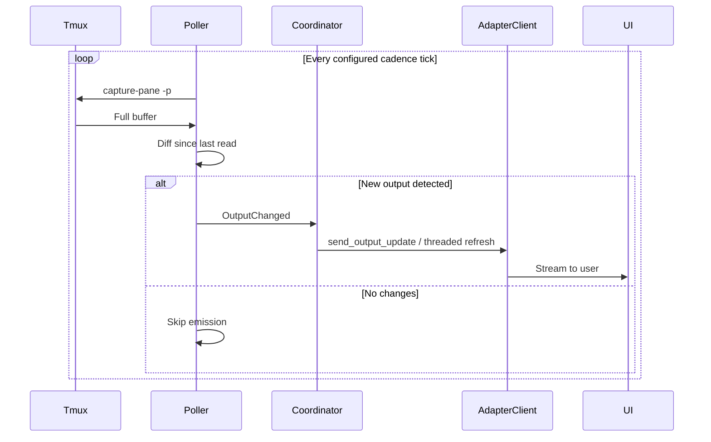
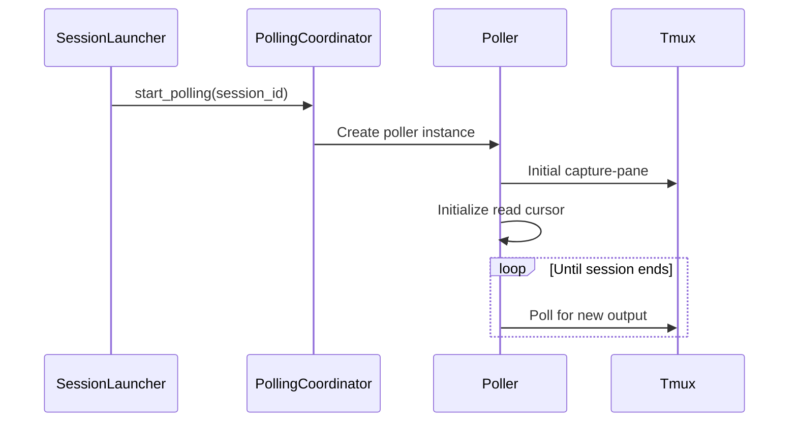
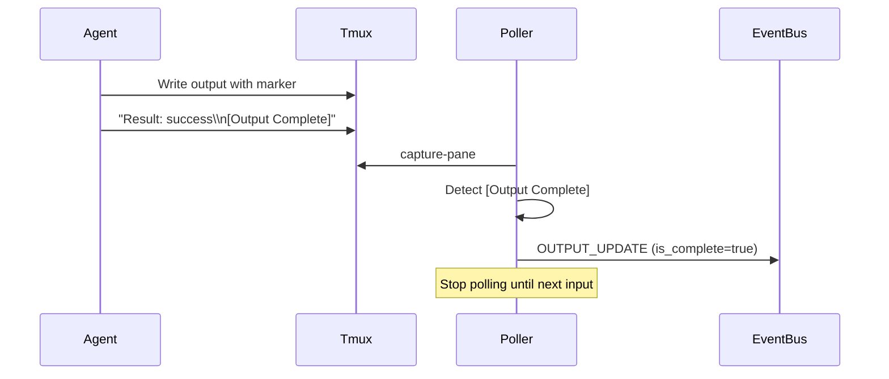

# Output Polling — Design

## Purpose

- Capture and stream real-time output from tmux panes to UI adapters without blocking the main event loop.

1. **OutputPoller**: A per-session worker that reads from the tmux output buffer.
2. **PollingCoordinator**: Manages the collection of pollers and ensures they start/stop with the session lifecycle.
3. **Single data plane**:
   - Output progression is transcript/tmux polling driven.
   - Hook `tool_use` / `tool_done` are control-plane signals only.
4. **Read**: Poller executes `tmux capture-pane`.
5. **Diff**: Full pane snapshots are compared against prior capture.
6. **Emit**: `OutputEvent` is yielded to `PollingCoordinator`.
7. **Broadcast**: `AdapterClient` routes output updates to active observers.

## Inputs/Outputs

**Inputs:**

- Tmux pane output buffer via `tmux capture-pane -p`
- Session lifecycle events (start/stop triggers)
- Immediate poll requests from command injection

**Outputs:**

- `OutputEvent` emissions with session_id, chunk, is_complete marker
- Process exit detection and final status
- Turn completion signals for AI sessions

## Invariants

- **One Poller Per Session**: Each active session has exactly one poller instance; no duplicates.
- **Poller Lifecycle Matches Session**: Poller starts when session becomes active, stops when session closes.
- **Diff-Only Emission**: Only new lines since last poll are emitted; no duplicate output.
- **Deterministic cadence**: Output cadence is config-driven (`polling.output_cadence_s`, default `1.0`).
- **No Blocking**: Polling runs in async task; never blocks main event loop or command execution.
- **Graceful Stop**: Poller cleanup completes before session marked fully closed.

## Primary flows

### 1. Poller Startup

### 2. Output Detection and Streaming

1. **Capture**: Execute `tmux capture-pane -p -t tc_{session_id}`
2. **Diff**: Compare full buffer against last read position
3. **Extract**: Only new lines appended since last poll
4. **Emit**: Send `OUTPUT_UPDATE` event with new chunk
5. **Update Cursor**: Advance read position to end of buffer

### 3. Turn Completion Detection (AI Mode)

### 4. Process Exit Detection

- Poller runs `tmux has-session -t tc_{session_id}`
- If session missing → emit OUTPUT_UPDATE with process exit status
- Mark session as closed, stop polling

## Adapter-level Output QoS

Between `AdapterClient.send_output_update` and the platform API sits an optional adapter-level QoS
scheduler (`teleclaude/adapters/qos/output_scheduler.py`). It runs per-adapter and operates in one
of three modes configured under each adapter's `qos:` section:

| Mode            | Behaviour                                                                                                                                                                |
| --------------- | ------------------------------------------------------------------------------------------------------------------------------------------------------------------------ |
| `off`           | Scheduler is bypassed; every emission goes directly to the platform API.                                                                                                 |
| `coalesce_only` | Background loop ticks at `rounding_ms` intervals; within each tick, superseded normal payloads per session are dropped (latest-only). No hard rate cap. Discord default. |
| `strict`        | Tick computed from `group_mpm`, `output_budget_ratio`, and `reserve_mpm`; dispatches ONE session per tick in round-robin order. Telegram default.                        |

### Two-layer rate control (Telegram)

1. **PTB AIORateLimiter** — transport-level: Telegram enforces per-chat limits at the API layer. PTB's
   built-in limiter queues requests and auto-retries, staying inside flood-control thresholds without
   custom sleep logic.
2. **TeleClaude OutputQoSScheduler** — product-level: coalesces stale intermediate output frames
   and paces delivery to stay within the configured group MPM budget across all concurrent sessions.

### Tuning knobs

| Config key                 | Default (Telegram) | Effect                                                        |
| -------------------------- | ------------------ | ------------------------------------------------------------- |
| `group_mpm`                | 20                 | Platform group message budget per minute.                     |
| `output_budget_ratio`      | 0.8                | Fraction of `group_mpm` reserved for output updates.          |
| `reserve_mpm`              | 4                  | Hard reservation for non-output messages (commands, footers). |
| `rounding_ms`              | 100                | Tick rounding granularity.                                    |
| `active_emitter_window_s`  | 10.0               | Window during which a session stays counted as active.        |
| `active_emitter_ema_alpha` | 0.2                | EMA smoothing factor for active session count.                |

### Multi-process caveat

`OutputQoSScheduler` is in-process only. When running multiple daemon workers, each process applies
its own budget independently. A shared Redis token-bucket is the future path for cross-process rate
enforcement — currently out of scope.

## Failure modes

- **Tmux Hangs on Capture**: Poller times out after 5s. Logs error, skips this poll cycle. Session appears frozen until next successful poll.
- **Diff Algorithm Drift**: Cursor position desync causes duplicate or missing output. Fixed by next full buffer capture or session restart.
- **Poller Task Crash**: Exception in async task. Poller stops, output streaming halts. Session remains active but frozen. Requires daemon restart.
- **Output Too Large**: Tmux buffer exceeds memory limits. Poller truncates to last N lines. Beginning of output lost.
- **Race Condition on Stop**: Poller emits output after session marked closed. Event ignored by adapters. Harmless.
- **Turn Marker Missing**: AI agent doesn't emit [Output Complete]. Poller continues streaming indefinitely. Summarization may be delayed or incomplete.
