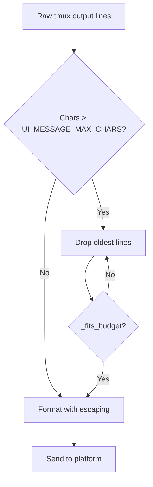
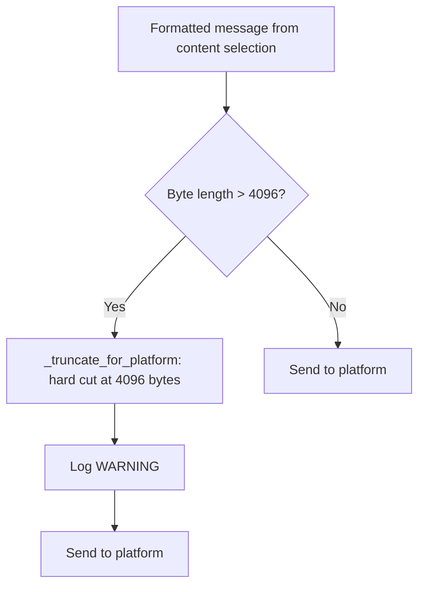

# Output Sizing — Design

## Purpose

Ensure AI output messages fit within platform message size limits (Telegram: 4096 UTF-8 bytes) while preserving the most recent and relevant content. The pipeline has two layers with distinct responsibilities at distinct locations.

## Inputs/Outputs

**Inputs:**

- Raw tmux output lines (potentially thousands of lines)
- Platform byte limit (`TELEGRAM_MAX_MESSAGE_BYTES = 4096`)
- Character budget heuristic (`UI_MESSAGE_MAX_CHARS = 3900`)

**Outputs:**

- A formatted message that fits within the platform byte limit
- Truncation indicators when content was dropped

## Invariants

1. **Two responsibilities, two locations.** Content selection lives in `ui_adapter` (`_fit_standard_output_to_limit`). Platform enforcement lives in `message_ops` (`_truncate_for_platform`). They are independent safety layers.

2. **Byte budget is the real constraint.** The character budget (`UI_MESSAGE_MAX_CHARS = 3900`) is a fast heuristic for initial selection. The actual constraint is `TELEGRAM_MAX_MESSAGE_BYTES = 4096` UTF-8 bytes. MarkdownV2 escaping inflates characters to bytes by 14-22% for Unicode-heavy tmux output.

3. **Content selection is iterative.** `_fit_standard_output_to_limit` drops tmux lines from the beginning (keeping the most recent output) and checks the BYTE budget via `_fits_budget()` after each drop. It does not rely on character count alone.

4. **Platform enforcement is a safety net.** `_truncate_for_platform` fires at `TELEGRAM_MAX_MESSAGE_BYTES` with an empty suffix `""` and logs a WARNING if it activates. If content selection worked correctly, this layer never fires. Its activation in logs indicates the content selection heuristic needs tuning.

5. **Byte check includes escaping.** `_fits_budget()` measures the byte length of the fully escaped output (after MarkdownV2 or HTML formatting), not the raw character length. This accounts for escape-induced inflation.

## Primary flows

### 1. Normal output sizing (content selection sufficient)

### 2. Safety net fires (content selection insufficient)

## Failure modes

| Scenario                              | Behavior                                       | Recovery                                              |
| ------------------------------------- | ---------------------------------------------- | ----------------------------------------------------- |
| Content selection drops all lines     | Message contains only the truncation header    | Expected for very long single-line output             |
| Safety net fires                      | Hard truncation at byte limit, WARNING logged  | Tune `UI_MESSAGE_MAX_CHARS` or escaping estimates     |
| Non-UTF8 content in tmux output       | Byte measurement still accurate (Python bytes) | No special handling needed                            |
| MarkdownV2 escaping ratio exceeds 22% | Safety net catches the overflow                | Log review; consider increasing char budget reduction |
