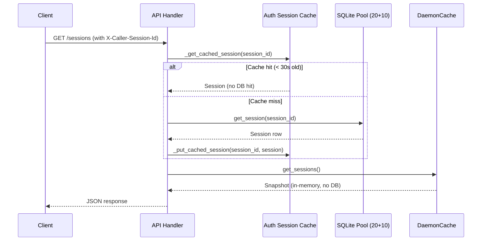
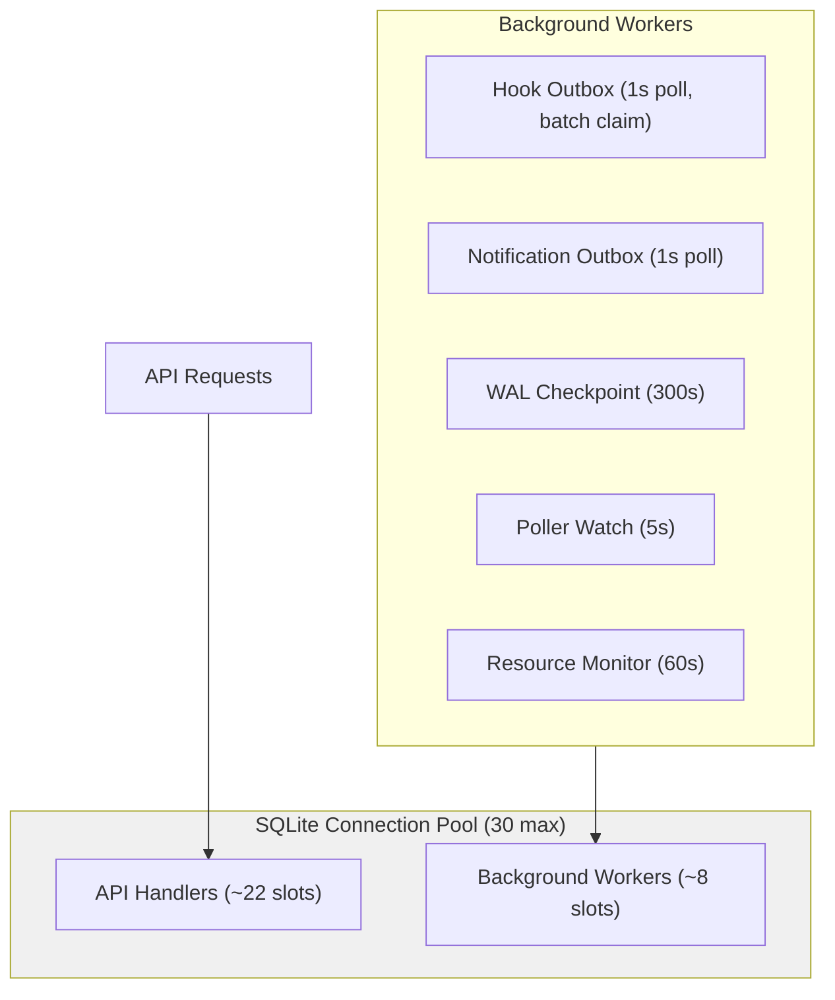

# Performance Tuning — Design

## Purpose

Document the compound bottleneck model that limits daemon throughput and the tuning decisions that address it. A single user on one laptop generating ~200 req/s can saturate the daemon — not because of any single bottleneck, but because several reinforcing pressure sources interact:

1. **Connection pool exhaustion** starves request handlers when background workers compete for slots.
2. **Synchronous event fan-out** blocks the event loop on every cache mutation.
3. **Per-request DB lookups** for authentication multiply pool pressure linearly with request rate.
4. **Missing indexes** cause full table scans on the most-queried table.
5. **Sequential outbox claims** turn batch processing into N individual DB round-trips.

These effects compound: pool starvation delays request handlers, background workers steal pool slots, and synchronous callbacks prevent the event loop from making progress on queued work.

## Inputs/Outputs

**Inputs (tuning parameters):**

| Parameter              | Location                      | Value        | Rationale                                                 |
| ---------------------- | ----------------------------- | ------------ | --------------------------------------------------------- |
| `pool_size`            | `core/db.py` engine config    | 20           | Headroom for concurrent API handlers + background workers |
| `max_overflow`         | `core/db.py` engine config    | 10           | Burst capacity (30 total connections)                     |
| `PRAGMA cache_size`    | `core/db.py` connect listener | -8000 (8 MB) | Per-connection page cache reduces disk I/O                |
| `PRAGMA busy_timeout`  | `core/db.py` connect listener | 5000 ms      | WAL writer wait before SQLITE_BUSY                        |
| `PRAGMA journal_mode`  | `core/db.py` connect listener | WAL          | Concurrent readers + single writer                        |
| `PRAGMA synchronous`   | `core/db.py` connect listener | NORMAL       | Durability vs. write throughput tradeoff                  |
| Auth session cache TTL | `api/auth.py`                 | 30 s         | Balance freshness vs. DB read elimination                 |
| Auth session cache max | `api/auth.py`                 | 256 entries  | Bounded memory; LRU eviction when full                    |
| Event loop policy      | `daemon.py` entry point       | uvloop       | 2-4x throughput for all async I/O                         |

**Outputs (observable effects):**

- Sustained throughput of ~200+ req/s from a single client without latency spiral.
- Background workers (hook outbox, notification outbox, pollers) coexist with API handlers without pool starvation.
- Cache mutations do not block the event loop.

## Invariants

### Connection Pool

- **PRAGMAs on every connection.** SQLAlchemy's `@event.listens_for(engine.sync_engine, "connect")` listener applies WAL mode, busy timeout, synchronous mode, and cache size to every pooled connection. This replaces the earlier pattern of setting PRAGMAs on a single bootstrap connection that was closed before the pool was created.
- **Pool size accounts for background workers.** The pool must have enough headroom for both API request handlers and the daemon's background workers (hook outbox, notification outbox, WAL checkpoint, poller watch). With ~5-8 background workers competing, a pool of 20+10 overflow provides ~22 slots for API handlers under peak load.

### Auth Cache

- **TTL bounds staleness.** The 30-second TTL means a session's role/identity changes take up to 30 seconds to propagate to the auth layer. This is acceptable because session identity (system_role, human_role, tmux_session_name) changes infrequently.
- **Cache is per-process.** The auth cache lives in the daemon process. There is no cross-process invalidation concern because the daemon is a single-instance process (enforced by SQLite exclusive lock).
- **Explicit invalidation on session close.** `invalidate_session_cache(session_id)` is available for callers that need immediate consistency (e.g., session close path).

### Cache Notifications

- **Non-blocking dispatch.** `DaemonCache._notify()` dispatches subscriber callbacks via `loop.call_soon()`. The caller of any cache mutation method returns immediately; subscribers execute in the next event loop iteration. This prevents a slow subscriber from blocking the coroutine that triggered the cache update.
- **Fallback for no-loop contexts.** When no event loop is running (tests, standalone scripts), subscribers are called synchronously as before.

### Database Indexes

- **Sessions table coverage.** Indexes exist on: `closed_at`, `lifecycle_status`, `last_activity DESC`, `native_session_id`, `initiator_session_id`, `computer_name`. These cover the WHERE and ORDER BY clauses used by `list_sessions`, `get_session_by_field`, `get_active_sessions`, and `get_sessions_by_title_pattern`.
- **Schema + migration parity.** New indexes are declared both in `schema.sql` (for fresh databases) and in migration `024_add_sessions_performance_indexes` (for existing databases).

### Batch Outbox Claims

- **Single round-trip per batch.** `claim_hook_outbox_batch()` issues one `UPDATE...WHERE id IN (...)` instead of N individual claims. When partial claiming occurs (some rows already locked), a follow-up SELECT verifies which rows were claimed.

### Event Loop Policy

- **uvloop with graceful fallback.** The daemon entry point uses `uvloop.run(main())` when uvloop is available, falling back to `asyncio.run(main())` on import failure. uvloop is declared as a platform-conditional dependency (`sys_platform != 'win32'`).

## Primary flows

### Hot Path: Authenticated API Request



### Background Worker Pressure Model



### Cache Mutation Notification

```mermaid
sequenceDiagram
    participant Caller as DB Event Handler
    participant Cache as DaemonCache
    participant Loop as Event Loop
    participant Sub as Cache Subscriber

    Caller->>Cache: update_session(snapshot)
    Cache->>Cache: Store in _sessions dict
    Cache->>Loop: call_soon(subscriber_callback)
    Cache-->>Caller: Returns immediately
    Note over Loop: Next iteration
    Loop->>Sub: Execute callback
    Sub->>Sub: Build DTO, spawn WS broadcast
```

## Failure modes

| Scenario                                       | Symptom                                            | Mitigation                                                                       |
| ---------------------------------------------- | -------------------------------------------------- | -------------------------------------------------------------------------------- |
| Pool exhaustion (>30 concurrent DB operations) | API requests queue, latency spikes                 | Pool size 30 provides headroom; monitor with resource_monitor                    |
| Auth cache serves stale session                | Closed session still passes auth for up to 30s     | Call `invalidate_session_cache()` on session close; TTL bounds worst case        |
| uvloop unavailable                             | Daemon runs on default asyncio loop (~2-4x slower) | Graceful fallback; uvloop is optional dependency                                 |
| Batch claim partial success                    | Some outbox rows not claimed in first pass         | Follow-up SELECT identifies claimed rows; unclaimed rows retry next poll         |
| Missing index on new column                    | Full table scan on filtered query                  | Schema.sql and migration must stay in sync; add index to both                    |
| `call_soon` callback exception                 | Subscriber error logged but does not propagate     | Each callback wrapped in try/except; errors logged, other subscribers unaffected |

## See Also

- docs/project/design/architecture/database.md — SQLite persistence and schema
- docs/project/design/architecture/daemon.md — Background workers and lifecycle
- docs/project/design/architecture/cache.md — DaemonCache snapshot layer
- docs/project/design/architecture/api-server.md — API request handling
- docs/project/design/architecture/outbox.md — Hook outbox delivery model
