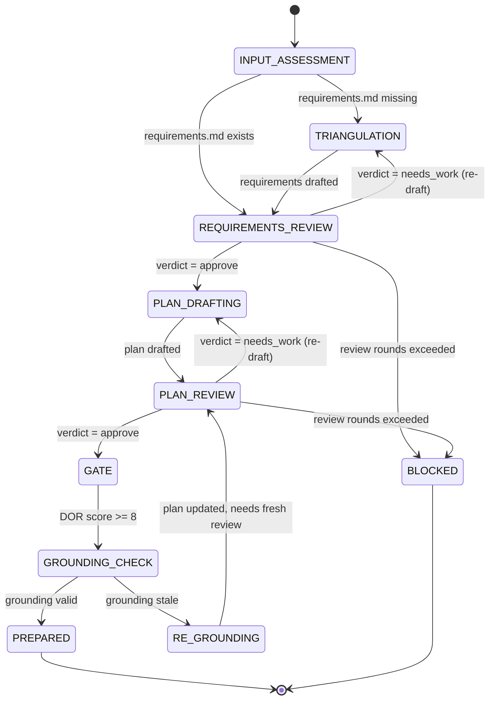
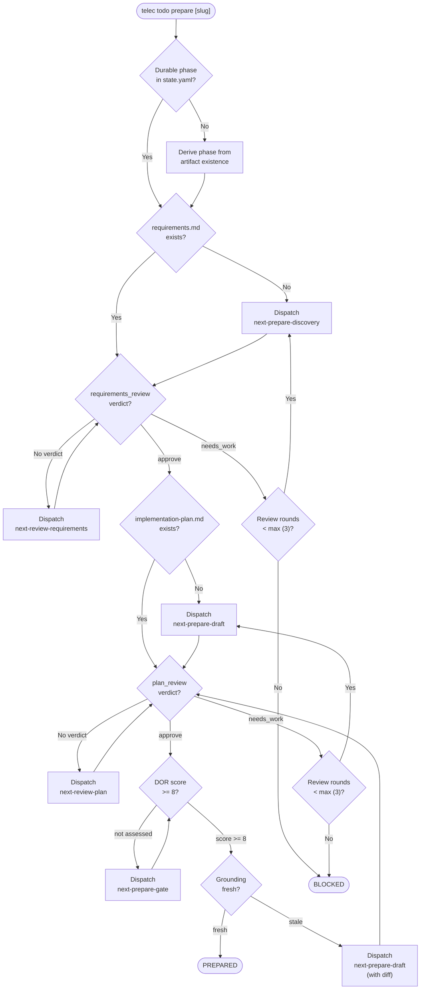
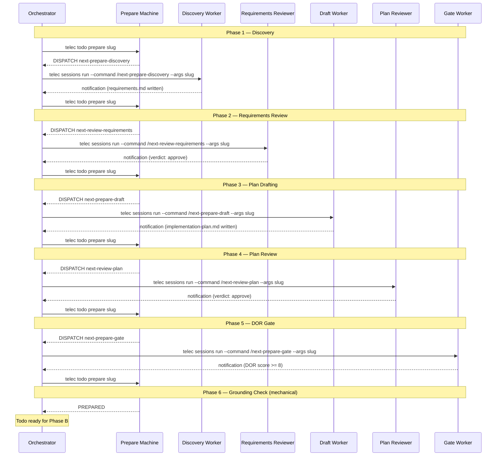
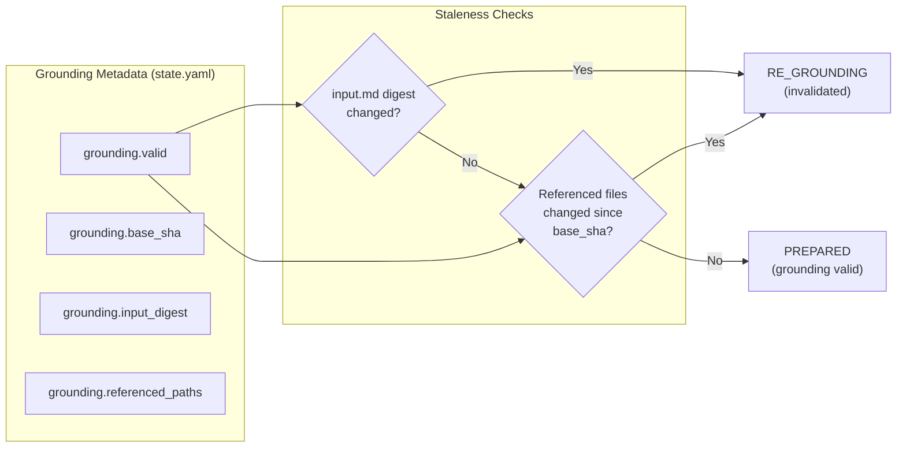

# Prepare State Machine — Design

## Purpose

The Prepare state machine transforms a human's idea (`input.md`) into a set of reviewed, approved, and grounded artifacts ready for implementation. It enforces sequential artifact production with review gates between each step — no artifact is produced until its predecessor is approved.

**Entry point:** `telec todo prepare [slug]`
**Implementation:** [`PreparePhase`](../../../../teleclaude/core/next_machine/core.py) enum (10 states)
**Terminal states:** `PREPARED` (success), `BLOCKED` (failure)

### Referenced files

| File | Purpose |
|------|---------|
| [`teleclaude/core/next_machine/core.py`](../../../../teleclaude/core/next_machine/core.py) | State machine implementation (`PreparePhase` enum, `next_prepare()`) |
| [`docs/software-development/procedure/lifecycle/prepare.md`](../../../software-development/procedure/lifecycle/prepare.md) | Prepare procedure |
| [`docs/software-development/procedure/maintenance/next-prepare.md`](../../../software-development/procedure/maintenance/next-prepare.md) | Orchestration loop procedure |
| [`docs/software-development/procedure/maintenance/next-prepare-discovery.md`](../../../software-development/procedure/maintenance/next-prepare-discovery.md) | Discovery worker procedure |
| [`docs/software-development/procedure/maintenance/next-prepare-draft.md`](../../../software-development/procedure/maintenance/next-prepare-draft.md) | Plan drafting worker procedure |
| [`docs/software-development/procedure/maintenance/next-prepare-gate.md`](../../../software-development/procedure/maintenance/next-prepare-gate.md) | DOR gate worker procedure |

### Referenced doc snippets

| Snippet ID | Content |
|------------|---------|
| `software-development/procedure/lifecycle/prepare` | Prepare phase overview |
| `software-development/procedure/maintenance/next-prepare` | Orchestration loop |
| `software-development/procedure/maintenance/next-prepare-discovery` | Discovery worker |
| `software-development/procedure/maintenance/next-prepare-draft` | Draft worker |
| `software-development/procedure/maintenance/next-prepare-gate` | DOR gate worker |
| `software-development/procedure/lifecycle/review-requirements` | Requirements review |
| `software-development/procedure/lifecycle/review-plan` | Plan review |
| `software-development/policy/definition-of-ready` | DOR gates validated by gate phase |
| `software-development/policy/preparation-artifact-quality` | Quality rules for requirements and plans |

## Inputs/Outputs

**Inputs:**

- `todos/{slug}/input.md` — human idea or requirement (entry point)
- `todos/{slug}/state.yaml` — durable phase tracking, review verdicts, grounding metadata
- `todos/roadmap.yaml` — work item registry (slug resolution)

**Outputs:**

- `todos/{slug}/requirements.md` — triangulated, reviewed, approved requirements
- `todos/{slug}/implementation-plan.md` — review-aware, rationale-rich, reviewed, approved plan
- `todos/{slug}/demo.md` — draft demonstration plan
- `todos/{slug}/dor-report.md` — gate assessment
- `todos/{slug}/state.yaml` — updated with grounding metadata and DOR verdict
- `prepare.*` lifecycle events at each phase transition

| Artifact | Created by | Reviewed by |
|----------|-----------|-------------|
| `input.md` | Human (via `/next-refine-input`) | — |
| `requirements.md` | Discovery worker (`/next-prepare-discovery`) | Requirements reviewer (`/next-review-requirements`) |
| `implementation-plan.md` | Draft worker (`/next-prepare-draft`) | Plan reviewer (`/next-review-plan`) |
| `demo.md` | Draft worker | — |
| `dor-report.md` | Gate worker (`/next-prepare-gate`) | — |

## Invariants

- **Sequential gating**: no artifact is produced until its predecessor is reviewed and approved.
- **Phase derivation**: when no durable `prepare_phase` exists in `state.yaml`, the machine derives the current phase from artifact existence on disk.
- **Review round limits**: both requirements and plan reviews are capped at `DEFAULT_MAX_REVIEW_ROUNDS` (3). Exceeding the limit transitions to `BLOCKED`.
- **Grounding freshness**: preparation is only valid if referenced files and input digest have not changed since grounding. Stale preparation triggers re-grounding.
- **Idempotent re-entry**: `telec todo prepare` is safe to call at any time — first call creates, subsequent calls verify and heal.
- **Container detection**: if the draft worker splits a todo into children, the machine treats the parent as a container and only child slugs proceed to Phase B.

## Primary flows

### State diagram

### States reference

| State | Description | Agent Action | Auto-advance |
|-------|-------------|-------------|--------------|
| `INPUT_ASSESSMENT` | Evaluate input.md, check if requirements.md exists | No | Yes — routes to TRIANGULATION or REQUIREMENTS_REVIEW |
| `TRIANGULATION` | Requirements need to be written or reworked | Yes — dispatch `/next-prepare-discovery` | No |
| `REQUIREMENTS_REVIEW` | Requirements exist, need review verdict | Yes — dispatch `/next-review-requirements` | No |
| `PLAN_DRAFTING` | Requirements approved, plan needs to be written | Yes — dispatch `/next-prepare-draft` | No |
| `PLAN_REVIEW` | Plan exists, needs review verdict | Yes — dispatch `/next-review-plan` | No |
| `GATE` | All artifacts exist and approved, run DOR validation | Yes — dispatch `/next-prepare-gate` | No |
| `GROUNDING_CHECK` | Verify freshness of artifacts against current codebase | No | Yes — routes to PREPARED or RE_GROUNDING |
| `RE_GROUNDING` | Referenced files changed since grounding, plan must update | Yes — dispatch `/next-prepare-draft` | No |
| `PREPARED` | Terminal success — todo is ready for Phase B (Work) | No | — |
| `BLOCKED` | Terminal failure — human intervention needed | No | — |

### Flow diagram

### Orchestrator loop (sequence diagram)

The orchestrator calls `telec todo prepare slug` in a loop. Each call returns an instruction block. The orchestrator dispatches the requested worker, waits for the notification, then calls again.

### Command dispatch map

Each state dispatches a specific worker command via `telec sessions run`:

| State | Command | Worker Role | Thinking Mode | Output Artifact |
|-------|---------|-------------|---------------|-----------------|
| `TRIANGULATION` | `/next-prepare-discovery` | Architect | `slow` | `requirements.md` |
| `REQUIREMENTS_REVIEW` | `/next-review-requirements` | Reviewer | `slow` | verdict in `state.yaml` |
| `PLAN_DRAFTING` | `/next-prepare-draft` | Architect | `slow` | `implementation-plan.md`, `demo.md` |
| `PLAN_REVIEW` | `/next-review-plan` | Reviewer | `slow` | verdict in `state.yaml` |
| `GATE` | `/next-prepare-gate` | Assessor | `slow` | `dor-report.md`, DOR score in `state.yaml` |
| `RE_GROUNDING` | `/next-prepare-draft` | Architect | `slow` | Updated `implementation-plan.md` |

### Grounding system

Grounding tracks whether the preparation artifacts are still valid relative to the current codebase. It is checked as the final step before declaring PREPARED.

Invalidation triggers:
- `input.md` SHA-256 digest changed since last grounding
- Files referenced in the implementation plan changed since `base_sha`
- External automation detects file path overlap after an integration delivery (`telec todo prepare --invalidate-check`)

### Lifecycle events

| Event | Emitted When |
|-------|-------------|
| `prepare.input_refined` | Input refined by human |
| `prepare.discovery_started` | Discovery worker dispatched |
| `prepare.requirements_drafted` | `requirements.md` written |
| `prepare.requirements_approved` | Requirements review verdict = approve |
| `prepare.plan_drafted` | `implementation-plan.md` written |
| `prepare.plan_approved` | Plan review verdict = approve |
| `prepare.grounding_invalidated` | Grounding check found stale artifacts |
| `prepare.regrounded` | Re-grounding completed, plan updated |
| `prepare.completed` | Terminal PREPARED state reached |
| `prepare.blocked` | Terminal BLOCKED state reached |

## Failure modes

- **Missing `input.md`**: BLOCKED — human must provide input via `/next-refine-input`.
- **Review round limit exceeded**: BLOCKED after 3 rounds — escalate to human with accumulated findings.
- **Discovery worker crash**: orchestrator retries once, then BLOCKED with error context.
- **Grounding never stabilizes**: each re-grounding triggers a fresh plan review. Persistent churn means the codebase is changing faster than the plan can track — manual intervention needed.
- **Superseded todo**: BLOCKED — todo has been replaced by another work item.
- **Container split**: draft worker splits scope into children. Machine detects via `breakdown.todos` and treats the parent as a container — only children proceed to Phase B.
