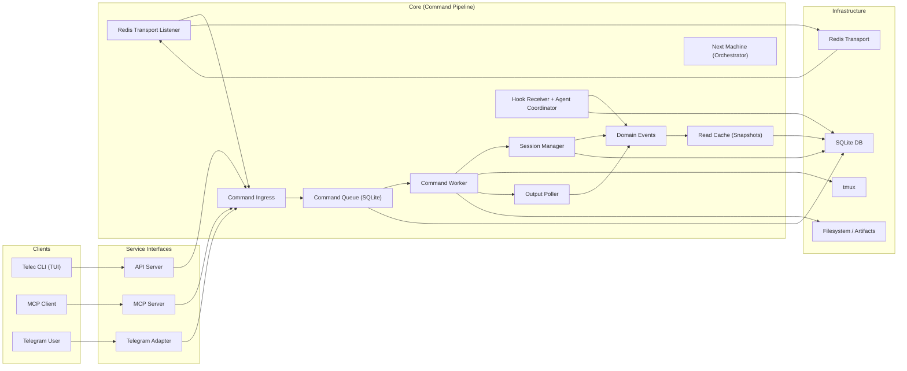
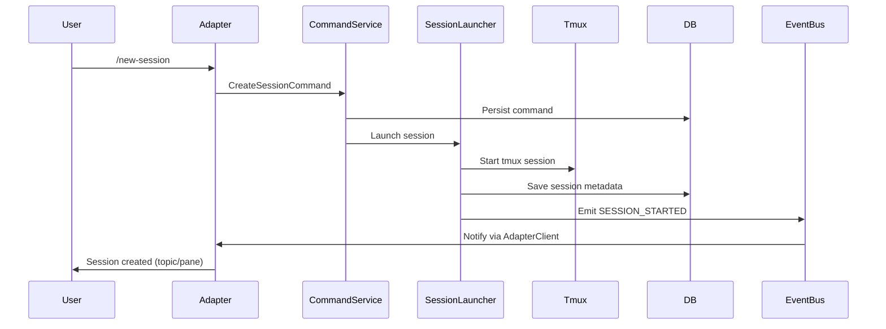
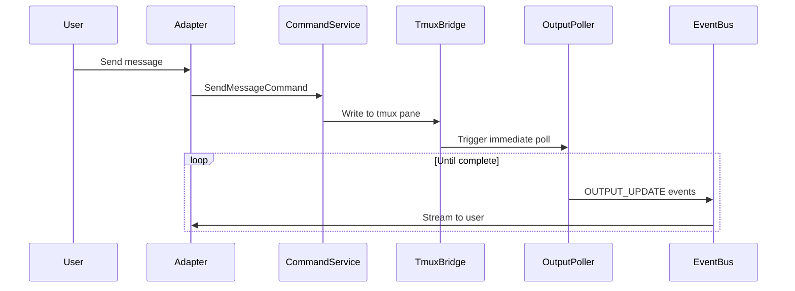
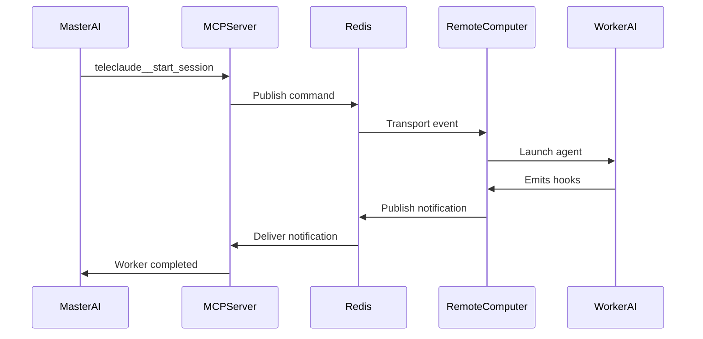
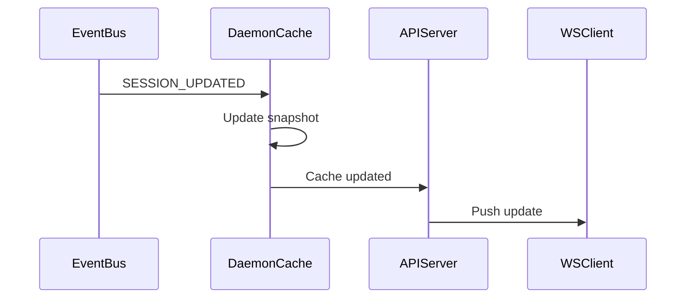

# System Overview — Design

## Purpose

TeleClaude acts as a "dumb pipe" terminal bridge between UI adapters (Telegram, TUI, MCP) and tmux execution environments.

1. **Service Interfaces**:
   - **Telegram Adapter**: Normalizes chat interactions.
   - **MCP Server**: Stdio-based interface for AI agents.
   - **API Server**: Resource-first REST/WS interface for TUIs.
2. **Core Pipeline**:
   - **Command Ingress**: Normalizes all inputs into Command objects.
   - **Command Queue**: SQLite-backed durable execution.
   - **Session Manager**: Manages tmux lifecycles and process mapping.
3. **Execution Layer**:
   - **tmux**: The runtime for all terminal sessions.
   - **Output Poller**: Streams real-time updates from tmux to domain events.
4. **Orchestration**:
   - **Next Machine**: Stateless state machine for complex project-based workflows.
   - **Agent Coordinator**: Single source of truth for routing agent lifecycle hooks.

## Inputs/Outputs

**Inputs:**

- User commands from UI adapters (Telegram, TUI, MCP)
- Redis transport messages from remote computers
- Agent lifecycle hooks via hook receiver
- Tmux output streams
- File system artifacts (requirements, plans, transcripts)

**Outputs:**

- Tmux session creation and input delivery
- Adapter feedback (Telegram messages, API responses, MCP tool results)
- Domain events (session_started, session_closed, output_update)
- Cached snapshots (sessions, projects, todos, computers)
- Persistent database records (sessions, commands, hooks)

## Invariants

- **Single Database**: One SQLite database per repository root; no file duplication or sharding.
- **Command Idempotency**: Commands can be replayed safely; duplicate execution is prevented via queue tracking.
- **Event-Driven Updates**: All cache and adapter updates are triggered by domain events, never by polling state.
- **Session Ownership**: Each session has exactly one owning adapter that created it; other adapters can observe but not modify.
- **Decoupled Adapters**: Core logic never imports adapter-specific code; all communication via Protocols.
- **Durable Execution**: Commands and hook events persist to SQLite queue/outbox tables before processing; restarts recover pending work.

## Primary flows

### 1. New Session Creation

### 2. Message to Session

### 3. AI-to-AI Delegation (MCP)

### 4. Cache Refresh & WS Push

## Failure modes

- **Interface Startup Failure**: Required interface startup failures (adapter/API/MCP) fail daemon startup rather than silently running in partial mode.
- **Tmux Process Death**: If tmux dies unexpectedly, OutputPoller detects exit and marks session as failed. Cleanup may be incomplete.
- **Redis Unavailable**: Remote execution fails gracefully. Local operations continue. Heartbeat detection resumes when Redis recovers.
- **SQLite Lock Contention**: Rare under normal load. Commands queue and retry. Long locks indicate resource exhaustion.
- **Hook Delivery Failure**: Hooks persist to outbox. Daemon restart processes undelivered hooks. Late delivery can cause stale notifications.
- **Cache Staleness**: Clients receive stale data until TTL expires or digest changes. Background refresh updates cache asynchronously.
- **Outbox Accumulation**: If command execution stalls, outbox grows indefinitely. Manual intervention required to clear stuck commands.
