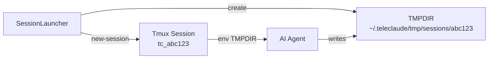
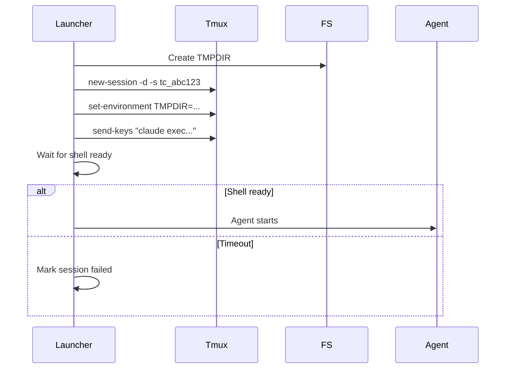
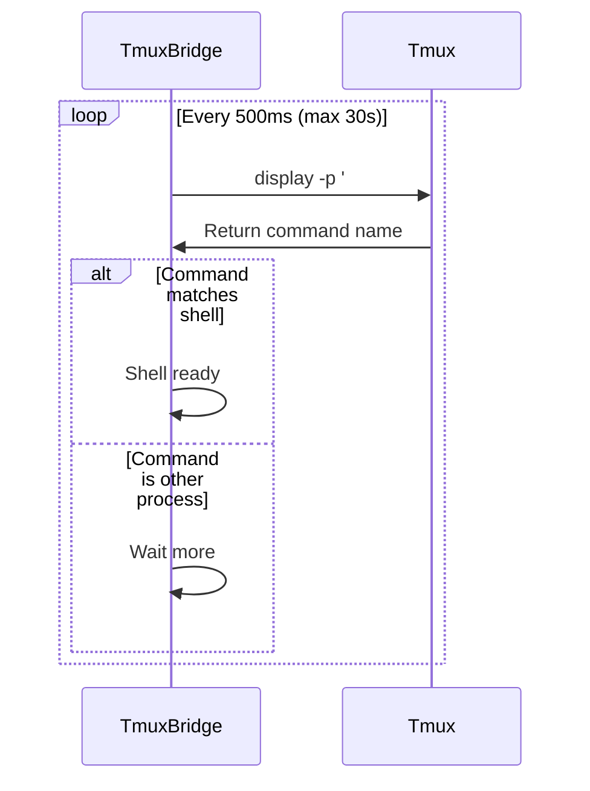

# Tmux Management — Design

## Purpose

Describe how TeleClaude manages tmux sessions and input injection.

- Session names are derived from session_id with a stable prefix.
- Each session gets a dedicated TMPDIR to avoid filesystem watcher issues.
- tmux commands enforce timeouts to prevent hangs.
- Session tmp directories are created under ~/.teleclaude/tmp/sessions by default.
- Shell readiness is determined by comparing the tmux command to the user shell.

## Inputs/Outputs

**Inputs:**

- Session creation command (agent type, project_path, title, message)
- User messages to inject into pane
- Control sequences (Ctrl-C, Ctrl-D)

**Outputs:**

- Tmux session named `tc_{session_id[:8]}`
- Per-session TMPDIR at `~/.teleclaude/tmp/sessions/{session_id}`
- Shell-ready signal detection
- Session output captured via polling

## Invariants

- **Stable Session Names**: Tmux session name derived deterministically from session_id; never changes.
- **Unique TMPDIR**: Each session gets isolated temp directory to prevent cross-session interference.
- **Timeout Enforcement**: All tmux commands have 30s timeout to prevent daemon hangs.
- **Shell Readiness Wait**: Input injection waits for shell prompt before proceeding.
- **Cleanup on Close**: TMPDIR and tmux session both destroyed when session closes.

## Primary flows

### 1. Session Creation

### 2. Input Injection

1. **Wait for Ready**: Check tmux pane command vs shell command
2. **Send Keys**: Use `tmux send-keys -l -t tc_{session_id}` for literal text
3. **Submit**: Send Enter key to submit command
4. **Trigger Poll**: Immediately poll output to capture response

### 3. Shell Readiness Detection

### 4. Cleanup

1. **Kill Session**: `tmux kill-session -t tc_{session_id}`
2. **Delete TMPDIR**: `rm -rf ~/.teleclaude/tmp/sessions/{session_id}`
3. **Final Poll**: Capture remaining output before closure
4. **Mark Closed**: Update database status

## Failure modes

- **Tmux Not Installed**: Session creation fails immediately. User sees error. No recovery without tmux installation.
- **Shell Readiness Timeout**: Agent starts but shell never ready. Input injection waits 30s then fails. Session marked failed.
- **TMPDIR Creation Failure**: Permissions or disk space issue. Session creation aborted. No partial state.
- **Zombie Process**: Tmux session killed but agent process survives. Orphaned process consumes resources. Requires manual cleanup.
- **Command Timeout**: Tmux command hangs for >30s. Command aborted, session may be in inconsistent state. Restart required.
- **Pane Not Found**: Input injection fails because pane already closed. Returns error but doesn't crash daemon.
- **TMPDIR Conflict**: Multiple sessions with same ID prefix (first 8 chars) collide. Extremely rare. Sessions interfere with each other's temp files.
