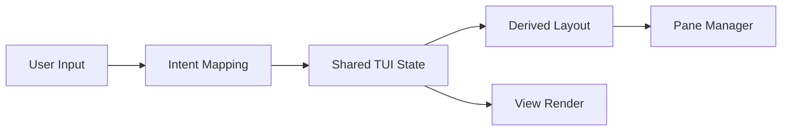
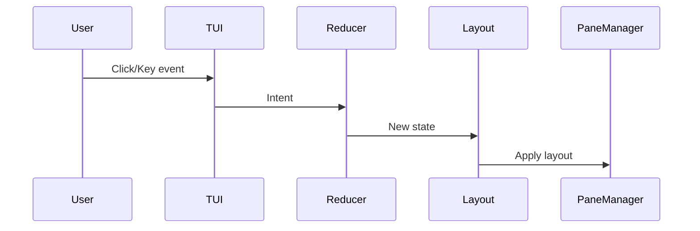
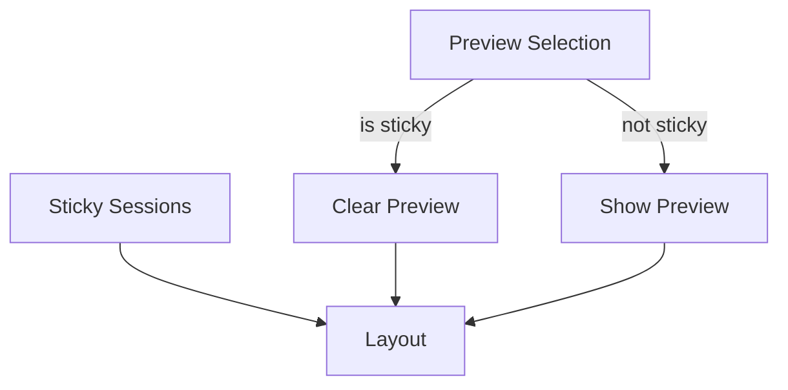

# Tui State Layout — Design

## Required reads

- @docs/project/design/system-overview.md
- @docs/project/design/ui-adapter.md
- @docs/project/design/tmux-management.md

## Purpose

Define the single source of truth for TUI state and deterministic pane layout derived from it, so session panes remain stable across tabs and all view interactions share one state model. The TUI is a local UI client of the API server; it owns its view state and must not mutate core daemon state directly. Applies to all TUI views in `teleclaude/cli/tui/views/` (Sessions, Preparation) and shared UI components (tab bar, modals, widgets) which emit intents but do not own state.

## Inputs/Outputs

**Inputs:**

- Mouse/keyboard events from the TUI runtime
- Session list updates from the API cache
- Focus changes (computer/project)
- Persisted sticky state from `~/.teleclaude/tui_state.json`

**Outputs:**

- Deterministic pane layout (active preview + sticky panes)
- View render data (selection, collapse state, badges)

## Invariants

- **Single State Object**: All TUI interactions mutate a single shared state object.
- **Derived Layout**: Pane layout is computed from state only; no hidden child or active pane fields.
- **Stable Panes Across Tabs**: Switching tabs must not hide or reflow panes.
- **No View-Local Pane Calls**: Views emit intents only; layout is applied centrally.
- **Sticky Is Authoritative**: Sticky panes persist until explicitly removed.
- **Local-Only State**: TUI state is local UI state; core session state remains owned by the daemon.

### State model

- `selection`: currently selected item
- `preview`: `{ session_id, show_child } | null`
- `sticky`: list of `{ session_id, show_child }`
- `collapsed`: set of collapsed session ids
- `focus`: computer/project focus stack
- `scroll`: scroll offset and window bounds

## Primary flows

### 1. Input to Layout

### 2. Preview vs Sticky Resolution

### Reducer architecture

#### Intent set

- `SelectItem(session_id, source)`
- `SetPreview(session_id, show_child)`
- `ClearPreview()`
- `ToggleSticky(session_id, show_child)`
- `Collapse(session_id)` / `Expand(session_id)`
- `ExpandAll()` / `CollapseAll()`
- `FocusComputer(name)` / `FocusProject(path)` / `FocusBack()`
- `SyncSessions(sessions)` (refresh session list + prune state)
- `SyncProjects(projects)` (refresh projects list)
- `SelectTodo(todo_id)` / `SelectTodoGroup(group_id)`
- `ToggleTodo(todo_id)` / `SetTodoStatus(todo_id, status)`
- `FilterTodos(filter_state)` (status, owner, scope, search)
- `SyncTodos(todos)` (refresh todos list + prune state)
- `ExpandTodo(todo_id)` / `CollapseTodo(todo_id)`
- `StartSession(project_path)` (sessions view: new session on project)
- `ToggleProjectStickySessions(project_path)` (sessions view: open/close previews)
- `RestartSession(session_id)` / `KillSession(session_id)`
- `PrepareProject(project_path)` (prep view: start session modal)
- `PrepareTodo(todo_id)` / `StartWork(todo_id)`
- `ViewFile(file_id)` / `EditFile(file_id)`
- `OpenFilePane(cmd)` / `CloseFilePane()`
- `SelectTab(view_id)`

#### Reducer contract

- The reducer is the only place that mutates `TuiState`.
- Views emit intents; they do not mutate state or call pane layout directly.
- Every reducer update is followed by layout derivation + apply.
- Exception handling (confirmation modals, missing tmux sessions, or missing files) is handled before emitting intents; reducer remains pure.

#### Layout derivation

- `active_session_id = preview.session_id` if preview set, else `null`
- `child_session_id = child_of(preview.session_id)` **only if** `preview.show_child`
- `sticky_session_ids = [s.session_id for s in sticky]`
- If `preview.session_id` is sticky, reducer clears preview (no duplication)

### Interaction mapping (Sessions)

- Single click on session line: `SetPreview(session_id, show_child=True)`
- Double click on session title line: `ToggleSticky(session_id, show_child=True)`
- Double click on session ID line: `ToggleSticky(session_id, show_child=False)`
- Enter on session: `SetPreview(session_id, show_child=True)`
- Enter on project: `StartSession(project_path)`
- `a` on project: `ToggleProjectStickySessions(project_path)`
- `R` on session: `RestartSession(session_id)`
- `k` on session (after confirm): `KillSession(session_id)`

### Interaction mapping (Preparation)

- Enter on computer: `FocusComputer(name)`
- Enter on project: `PrepareProject(project_path)`
- Enter on todo READY: `StartWork(todo_id)`
- Enter on todo not READY: `ExpandTodo(todo_id)`
- Enter on file: `ViewFile(file_id)`
- `p` on todo: `PrepareTodo(todo_id)`
- `s` on todo READY: `StartWork(todo_id)`
- `v` on file: `ViewFile(file_id)`
- `e` on file: `EditFile(file_id)`
- `+`/`-`: `ExpandAll()` / `CollapseAll()`

### Navigation, modals, and edge cases

#### Navigation intents

- `MoveUp()` / `MoveDown()` (arrow keys)
- `PageUp()` / `PageDown()` (if supported by runtime)
- `ScrollTo(index)` (mouse wheel or programmatic selection)
- `SelectIndex(index, source)` where `source = click | arrow`
- `FocusBack()` on Escape/Left when no collapse action applies

#### Modal intents

- `ConfirmKill(session_id)` → `KillSession(session_id)` on accept
- `StartSessionModal(project_path)` → `StartSession(project_path)` on accept
- `StartPrepareModal(project_path)` → `PrepareProject(project_path)` on accept
- `ModalCancelled()` (no state change)

#### Edge cases and exceptions

- **Selection effects**: selection by click may trigger preview; selection by arrow requires Enter.
- **Missing tmux session**: intent still emitted; side-effect handler reports error and leaves state unchanged.
- **Missing file**: `ViewFile/EditFile` ignored with user notice; state unchanged.
- **Sticky + Preview conflict**: reducer clears preview when sticky is set for same session.
- **Tab switching**: `SelectTab(view_id)` must not alter preview or sticky.

## Failure modes

- **Hidden Panes on Tab Switch**: Indicates layout is still tied to view switching, not state.
- **Child Pane Persists**: Indicates derived layout is bypassed by stale child fields.
- **Sticky Drift**: Indicates state is split across views or layout is not centrally applied.
