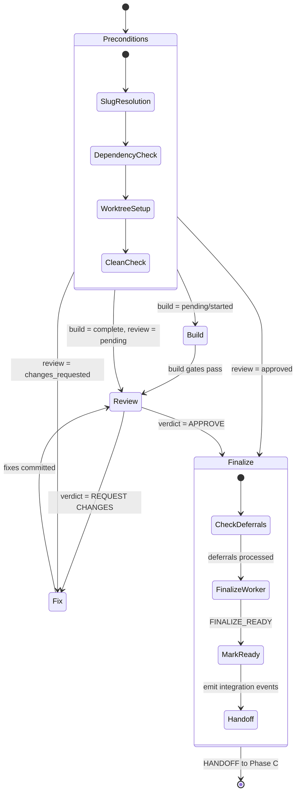
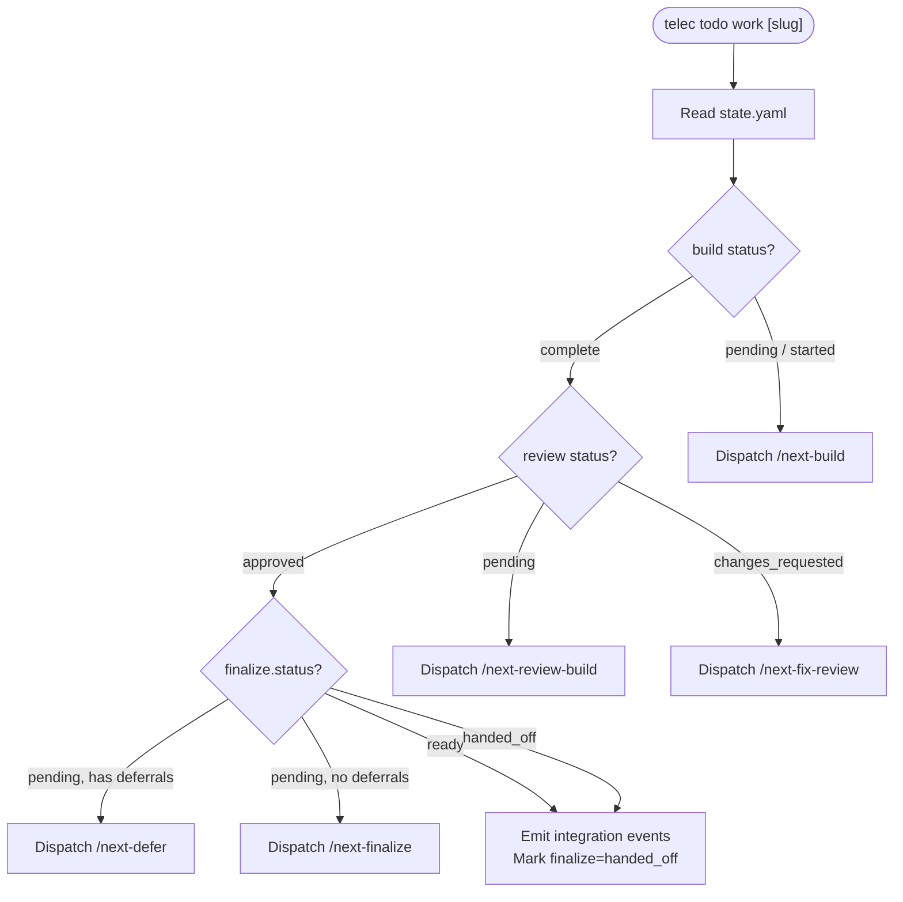
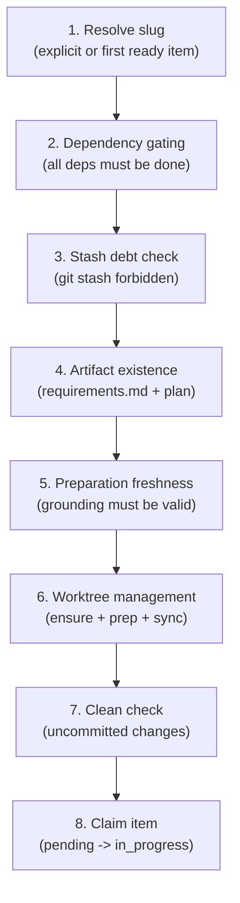
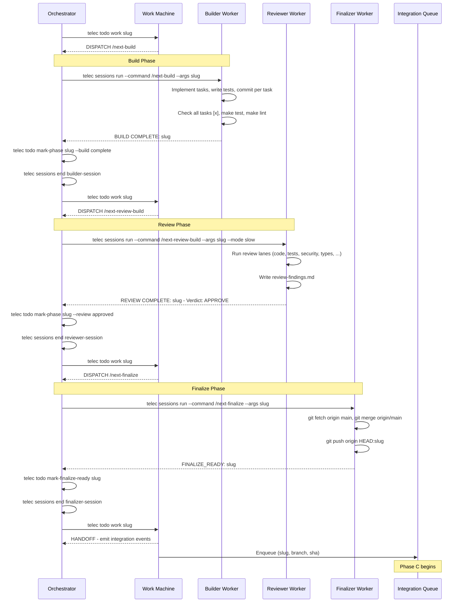
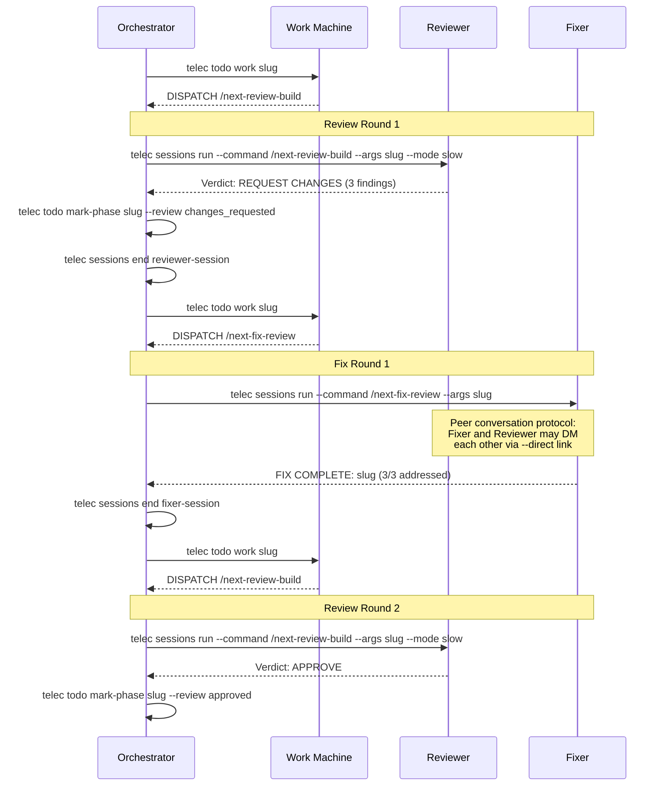

# Work State Machine — Design

## Purpose

The Work state machine routes implementation through four sub-phases: **Build → Review → Fix → Finalize**. Unlike the Prepare machine which has an explicit phase enum, the Work machine derives its routing decision from the combination of `build` and `review` status fields in `state.yaml`.

**Entry point:** `telec todo work [slug]`
**Implementation:** [`next_work()`](../../../../teleclaude/core/next_machine/core.py)
**Terminal outputs:** `COMPLETE`, `NO_READY_ITEMS`, `HANDOFF` (to integration)

### Referenced files

| File | Purpose |
|------|---------|
| [`teleclaude/core/next_machine/core.py`](../../../../teleclaude/core/next_machine/core.py) | State machine implementation (`next_work()`) |
| [`docs/software-development/procedure/lifecycle/build.md`](../../../software-development/procedure/lifecycle/build.md) | Build procedure |
| [`docs/software-development/procedure/lifecycle/review.md`](../../../software-development/procedure/lifecycle/review.md) | Review procedure |
| [`docs/software-development/procedure/lifecycle/fix-review.md`](../../../software-development/procedure/lifecycle/fix-review.md) | Fix review procedure |
| [`docs/software-development/procedure/lifecycle/finalize.md`](../../../software-development/procedure/lifecycle/finalize.md) | Finalize procedure |
| [`docs/general/procedure/orchestration.md`](../../../general/procedure/orchestration.md) | Orchestration loop procedure |

### Referenced doc snippets

| Snippet ID | Content |
|------------|---------|
| `software-development/procedure/lifecycle/build` | Build phase — implement plan, commit per task |
| `software-development/procedure/lifecycle/review` | Review phase — parallel lanes, structured findings |
| `software-development/procedure/lifecycle/fix-review` | Fix phase — address findings, peer conversation |
| `software-development/procedure/lifecycle/finalize` | Finalize — two-stage: worker prepare, orchestrator apply |
| `general/procedure/orchestration` | Orchestration loop and dispatch rules |
| `software-development/policy/definition-of-done` | Quality gates for completion |
| `software-development/policy/testing` | Pre-commit quality gates |

## Inputs/Outputs

**Inputs:**

- `todos/{slug}/requirements.md` — feature requirements (from Phase A)
- `todos/{slug}/implementation-plan.md` — technical design with task checkboxes (from Phase A)
- `todos/{slug}/state.yaml` — build/review status, finalize state, review rounds
- `todos/{slug}/quality-checklist.md` — build and review gate checkboxes
- `todos/roadmap.yaml` — slug resolution and dependency graph
- Worktree at `trees/{slug}/` — isolated git branch for implementation

**Outputs:**

- Code changes, tests, and commits (build)
- `todos/{slug}/review-findings.md` — structured findings with severity and verdict (review)
- `todos/{slug}/deferrals.md` — out-of-scope work identified during build (optional)
- Integration handoff events (`branch.pushed`, `deployment.started`)
- Updated `state.yaml` with phase progression

### State YAML structure

```yaml
phase: in_progress              # pending | in_progress | done
build: pending                  # pending | started | complete
review: pending                 # pending | approved | changes_requested
deferrals_processed: false

finalize:
  status: pending               # pending | ready | handed_off
  branch: my-feature
  sha: abc123...
  ready_at: 2026-03-09T10:00:00+00:00
  worker_session_id: sess-xyz
  handed_off_at: null
  handoff_session_id: null

review_round: 0                 # counter for review iterations
max_review_rounds: 3            # limit (configurable)
review_baseline_commit: ""      # SHA for incremental review scope

unresolved_findings: []         # R1-F1, R1-F2, ...
resolved_findings: []           # R1-F1, R1-F2, ...
```

## Invariants

- **Routing from state**: all routing decisions derive from `build` and `review` fields in `state.yaml`. No internal state.
- **Build gates before review**: `make test` and `telec todo demo validate <slug>` must pass before dispatching a reviewer.
- **Artifact verification**: mechanical checks at phase boundaries (tasks checked, commits exist, findings substantive).
- **Stale approval guard**: if new commits exist between `review_baseline_commit` and current HEAD, the machine resets `review=pending` to force a fresh review.
- **Review round limit**: after `max_review_rounds` (default 3) iterations, the machine returns `REVIEW_ROUND_LIMIT` for orchestrator decision instead of looping.
- **Finalize serialization**: only one finalize may run at a time; the integration queue serializes delivery.
- **Stash prohibition**: git stash is forbidden in all agent workflows. The machine checks for stash debt.

## Primary flows

### State diagram



### Routing logic

The machine reads `state.yaml` and routes based on `build` and `review` status:



### Precondition checks

Before routing to any sub-phase, the Work machine runs these checks in order:



### Happy path (sequence diagram)



### Review/fix loop (sequence diagram)

When the reviewer requests changes, the machine dispatches a fixer. The fixer and reviewer may communicate directly via peer conversation protocol.



### Command dispatch map

| Sub-Phase | Command | Worker Role | Thinking Mode | Output |
|-----------|---------|-------------|---------------|--------|
| Build | `/next-build` | Builder | `med` | Code, tests, commits |
| Build (bug) | `/next-bugs-fix` | Builder | `med` | Bug fix, investigation |
| Review | `/next-review-build` | Reviewer | `slow` (mandatory) | `review-findings.md`, verdict |
| Fix | `/next-fix-review` | Fixer | `med` | Fix commits |
| Deferrals | `/next-defer` | Orchestrator | — | New todos from deferrals |
| Finalize | `/next-finalize` | Finalizer | `med` | Branch pushed, FINALIZE_READY |

### Lifecycle events

| Event | Emitted When |
|-------|-------------|
| `build.started` | Builder worker dispatched |
| `build.complete` | Build phase marked complete |
| `review.started` | Reviewer worker dispatched |
| `review.approved` | Review verdict = APPROVE |
| `review.changes_requested` | Review verdict = REQUEST CHANGES |
| `branch.pushed` | Finalize worker pushed branch |
| `deployment.started` | Integration handoff initiated |

## Failure modes

- **No ready items in roadmap**: returns `NO_READY_ITEMS` — run prepare first.
- **Dependency not satisfied**: returns `BLOCKED` with dependency information.
- **Stash debt detected**: hard error — git stash is forbidden in agent workflows.
- **Missing preparation artifacts**: returns `NO_READY_ITEMS` — run `telec todo prepare` first.
- **Stale preparation grounding**: returns instruction to re-run prepare before building.
- **Worker crash**: orchestrator retries once, then escalates with context.
- **Review round limit exceeded**: returns `REVIEW_ROUND_LIMIT` for orchestrator decision — approve with documented follow-up for non-critical residual items, or escalate if unresolved critical findings remain.
- **Build gates fail**: re-dispatches builder to fix the issue before review.
- **State repair**: auto-repairs inconsistent state (e.g., `review=approved` + `build != complete` → repair to `build=complete`; `review=approved` with stale baseline → reset `review=pending`).
