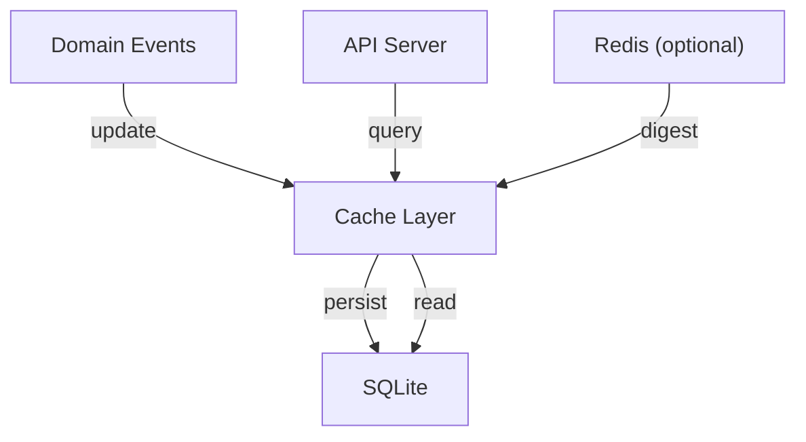
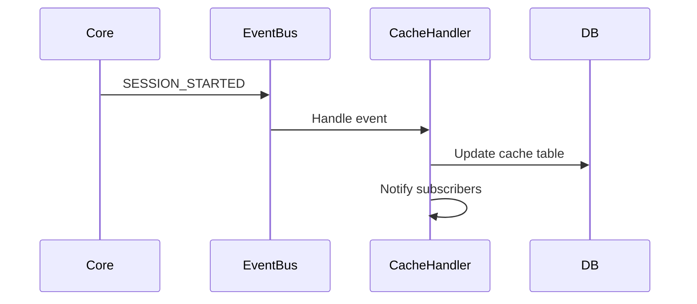
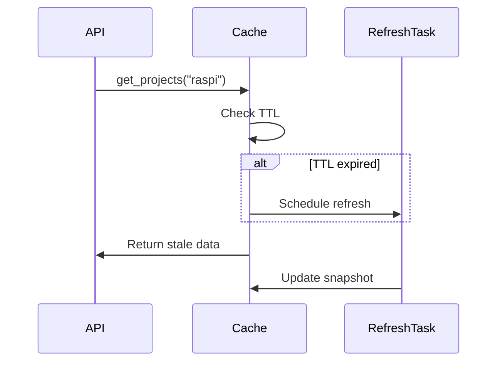
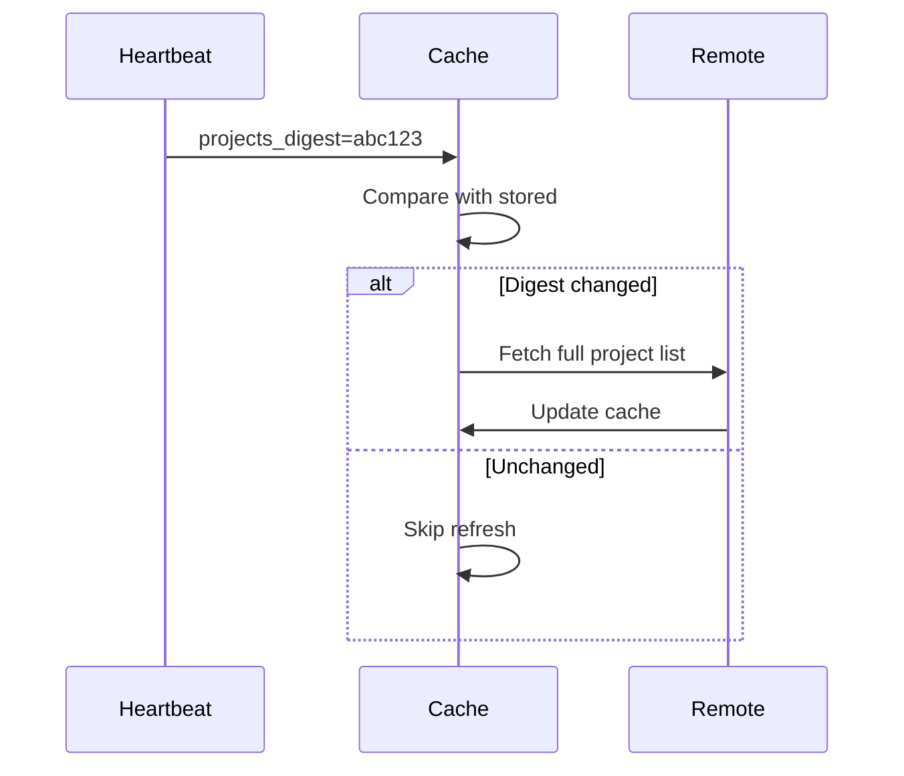

# Cache — Design

## Required reads

- @docs/project/design/cache-system.md

## Purpose

Provide instant, cached reads for API and remote data views.

- Serve cached data immediately; schedule refresh when TTL expires.
- Use per-computer digest/version fields to trigger refresh for projects and todos.
- Sessions are updated by events rather than TTL polling.
- Cache is read-only and not the source of truth.
- Stale data can be served to keep APIs responsive.

## Inputs/Outputs

**Inputs:**

- Domain events (SESSION_STARTED, SESSION_CLOSED, COMPUTER_UPDATED, etc.)
- Heartbeat messages with project/todo digests
- Local database queries for session state
- Remote refresh triggers from digest changes

**Outputs:**

- JSON snapshots stored in cache table
- Notifications to API subscribers
- Background refresh task scheduling

## Invariants

- **Always Serve Immediately**: Never block API calls waiting for refresh; return stale if needed.
- **Event-Driven Sessions**: Session cache updates only via events, not TTL polling.
- **Digest Validation**: Projects/todos refresh only when digest changes, not every heartbeat.
- **Single Snapshot Per Key**: Each cache key has one snapshot; updates replace atomically.
- **TTL Independence**: TTL controls refresh cadence, but stale data still served until refresh completes.

## Primary flows

### 1. Event-Driven Cache Update

### 2. TTL-Based Refresh Trigger

### 3. Digest-Based Invalidation

### 4. Cache Policy Table

| Resource    | Scope        | TTL | Update Trigger       |
| ----------- | ------------ | --- | -------------------- |
| Computers   | Global       | 60s | TTL + Heartbeat      |
| Projects    | Per-computer | 5m  | TTL + Digest change  |
| Todos       | Per-project  | 5m  | TTL + Digest change  |
| Sessions    | Per-computer | ∞   | Events only (no TTL) |
| Agent Avail | Global       | 30s | TTL only             |

## Failure modes

- **Cache Not Warmed**: API returns empty arrays until warmup completes. Daemon startup blocks adapters until cache ready.
- **Stale Data Window**: Clients see old data between TTL expiration and refresh (typically <1s). Acceptable for non-critical reads.
- **Digest Collision**: Two states hash to same value. Next TTL refresh corrects. Extremely rare.
- **Refresh Task Queue**: Slow refresh accumulates tasks. Monitor queue depth; indicates resource saturation.
- **Event Loss**: Cache update event lost due to crash. Next TTL refresh corrects. Sessions may show stale status temporarily.
- **SQLite Lock**: Concurrent cache writes block. Rare under normal load. High frequency indicates too many updates.
