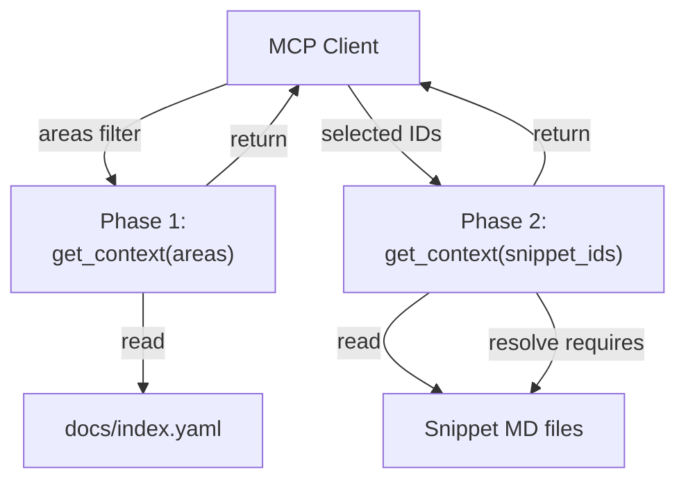
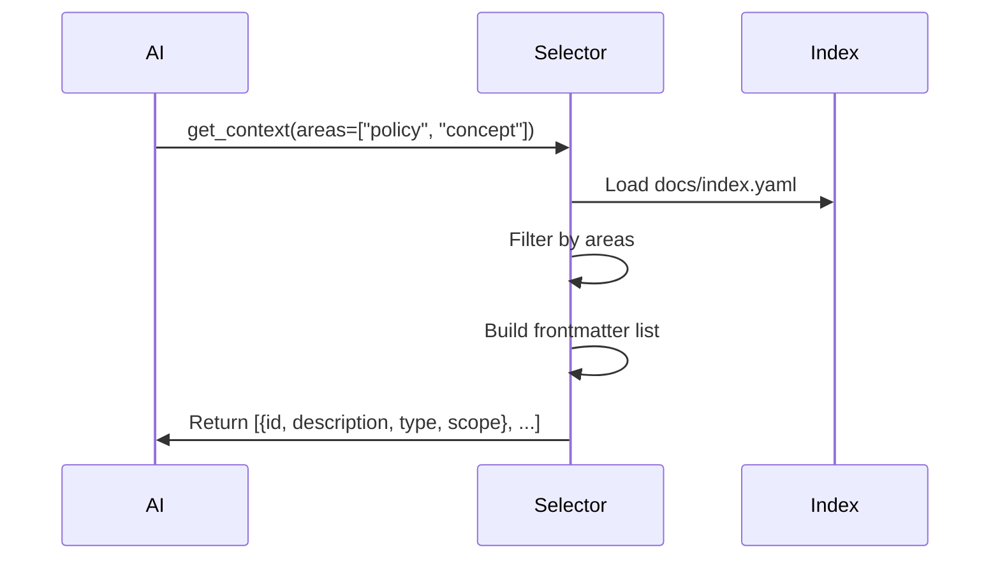
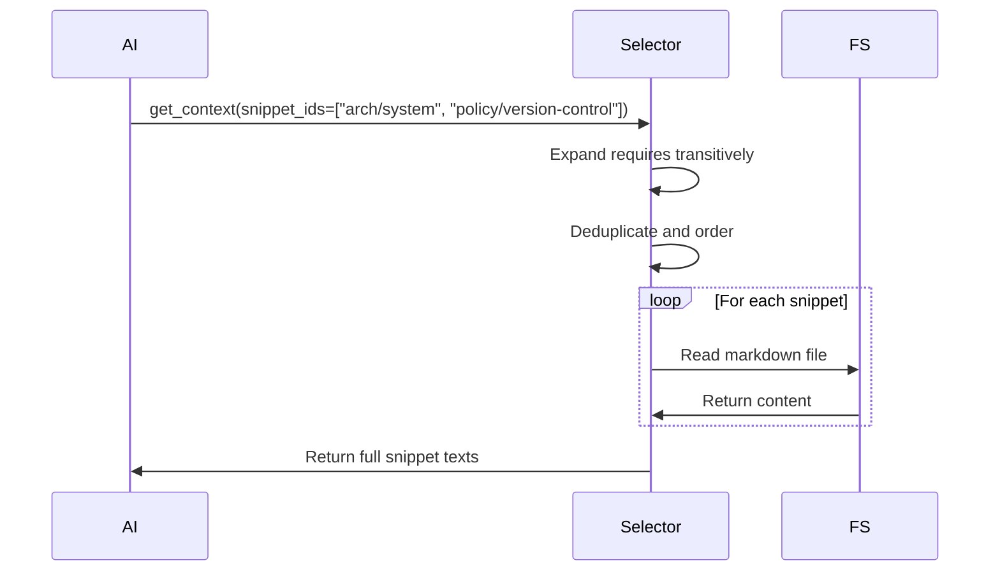

# Context Selection — Design

## Required reads

- @docs/project/design/context-index.md

## Purpose

- Select relevant documentation docs for a given request.

- Selected IDs must exist in the snippet index.
- Requires dependencies are always expanded before output.

- Build snippet metadata from docs and global docs.
- Return a filtered index (frontmatter only) when no IDs are provided.
- Accept selected snippet IDs from the caller and resolve requires dependencies.
- Order by scope priority (global -> domain -> project).
- Persist selected IDs per session to avoid repeated context churn.



## Inputs/Outputs

**Inputs:**

- **Phase 1**: Optional `areas` array (taxonomy type filter: principle, concept, policy, procedure, design, spec)
- **Phase 2**: `snippet_ids` array of selected snippets to retrieve
- Caller session ID for context persistence
- Project working directory

**Outputs:**

- **Phase 1**: Index listing (ID, description, type, scope) - frontmatter only
- **Phase 2**: Full snippet content with resolved requires dependencies
- Ordered by scope priority: global → domain → project

## Invariants

- **Two-Phase Protocol**: Always phase 1 (index) first, then phase 2 (content).
- **Requires Expansion**: All transitive dependencies included automatically; caller never manually resolves requires.
- **Scope Ordering**: Global snippets before domain before project; stable deterministic order.
- **Duplicate Prevention**: Each snippet ID appears exactly once in output even if required multiple times.

## Primary flows

### 1. Phase 1: Index Retrieval (Discovery)



### 2. Phase 2: Content Retrieval with Requires Resolution



#### Baseline Filtering (Optional)

By default, all snippets including baseline are shown in the phase-1 index.
`get_context` supports `baseline_only=true` to filter TO only baseline snippets
(those referenced in `baseline.md` manifests). This focused view is useful for
authoring/editing baseline content.

### 3. Requires Expansion Algorithm

```python
def expand_requires(snippet_id, visited=set()):
    if snippet_id in visited:
        return  # Prevent cycles
    visited.add(snippet_id)

    snippet = load_snippet(snippet_id)
    for required_id in snippet.requires:
        expand_requires(required_id, visited)

    yield snippet
```

### 4. Scope Priority Ordering

| Scope   | Priority | Rationale                                   |
| ------- | -------- | ------------------------------------------- |
| global  | 1        | Foundational policies apply universally     |
| domain  | 2        | Domain-specific rules constrain projects    |
| project | 3        | Project details reference global foundation |

## Failure modes

- **Snippet Not Found**: Requested ID not in index. Returns error with missing ID list. Client must re-select.
- **File Read Error**: Snippet in index but file missing/unreadable. Skipped with warning. Partial results returned.
- **Invalid ID Format**: Malformed snippet ID. Rejected immediately with error.
- **Index Not Found**: `docs/index.yaml` missing. Returns empty result with error message. Agent cannot proceed.
- **Context Too Large**: Expanded content exceeds AI context window. No automatic truncation. Client must reduce selection.
- **Session Context Loss**: Persisted IDs not found in index after regeneration. Falls back to phase 1 discovery.
