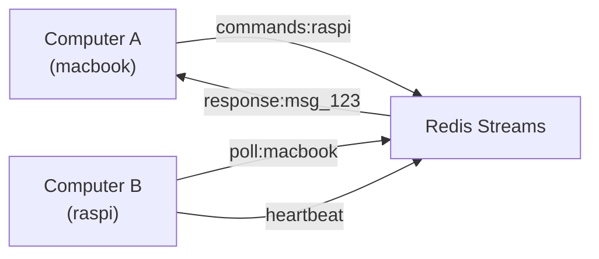
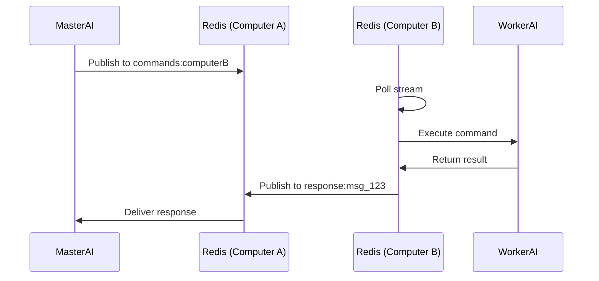
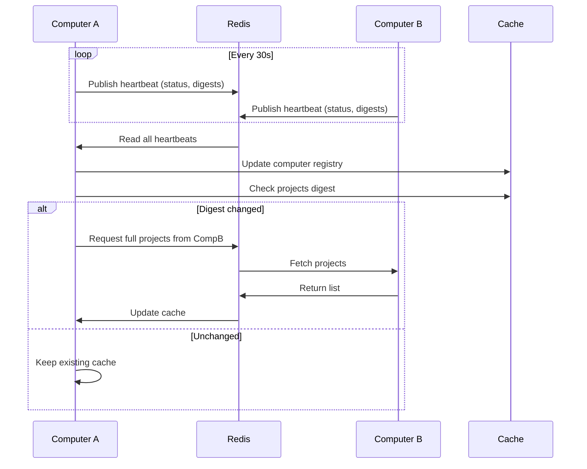

# Redis Transport — Design

## Required reads

- @docs/project/design/adapter-client.md
- @docs/project/design/cache.md
- @docs/project/spec/event-types.md

## Purpose

- Provide reliable cross-computer messaging and responses between TeleClaude daemons.

- Each computer polls a Redis stream named for its computer identity.
- Requests are answered on output:{message_id} streams for one-shot responses.
- Heartbeats maintain a registry of online computers with TTL-based expiry.
- Project and todo digests trigger cache refresh on peers.

- Redis transport implements RemoteExecutionProtocol for request/response.
- Redis transport never performs UI messaging.
- Redis is optional; Telegram multi-computer operation does not require it.

## Inputs/Outputs

**Inputs:**

- Commands on `commands:{computer_name}` streams from remote peers
- Heartbeat messages with computer status, projects digest, todos digest
- Response streams `response:{message_id}` for request/reply pattern

**Outputs:**

- Command responses published to caller's response stream
- Heartbeat broadcasts every 30s with system stats and digest fingerprints
- Cache invalidation triggers when digests change

## Invariants

- **Optional Dependency**: Redis is never required for local operations or Telegram multi-computer operation.
- **Stream Per Computer**: Each computer polls exactly one command stream named after its computer identity.
- **One-Shot Responses**: Response streams are created per-message and auto-expire after TTL.
- **Heartbeat TTL**: Computer registry entries expire after 60s without heartbeat; marks computer offline.
- **Digest-Driven Refresh**: Projects/todos cache refreshes only when heartbeat digest changes, not on every beat.
- **Single Connection Lifecycle**: Redis connection is managed by one reconnect loop; all tasks wait on readiness.

## Primary flows

### 1. Cross-Computer Command Execution

### 2. Heartbeat and Discovery

### 3. Digest-Based Cache Invalidation

| Component | Heartbeat Field      | Cache Action                    |
| --------- | -------------------- | ------------------------------- |
| Projects  | `projects_digest`    | Refresh if changed              |
| Todos     | `todos_digest`       | Refresh if changed              |
| Sessions  | N/A                  | Event-driven only (no digest)   |
| Stats     | `cpu`, `mem`, `disk` | Update immediately on heartbeat |

### 4. Stream Cleanup

- Command streams: Trimmed to max 10,000 messages (MAXLEN ~10000 APPROXIMATE)
- Response streams: Auto-expire after 1 hour (TTL)
- Heartbeat entries: Redis key expiry after 60s

## Failure modes

- **Redis Unavailable**: Daemon starts without Redis transport. Cross-computer commands fail. Local and Telegram operations unaffected.
- **Network Partition**: Computer heartbeats stop arriving. Registry marks computer offline after TTL. Commands to partitioned computer timeout.
- **Stream Accumulation**: If consumer lags, streams grow beyond MAXLEN. Oldest messages trimmed. Commands may be lost if not processed in time.
- **Response Stream Collision**: Extremely rare. Two messages with same ID overwrite response stream. Mitigated by UUID message IDs.
- **Digest False Positive**: Digest unchanged but content actually changed. Next TTL-based refresh corrects it (max 5min delay).
- **Heartbeat Storm**: Many computers restart simultaneously and publish heartbeats. Redis handles gracefully; cache refresh tasks may queue.
- **Reconnect Storm Prevention**: Redis reconnects are serialized; tasks wait on readiness to avoid connection floods.
- **Stale Registry**: Computer dies without sending offline heartbeat. Registry shows online until TTL expires (max 60s stale window).
