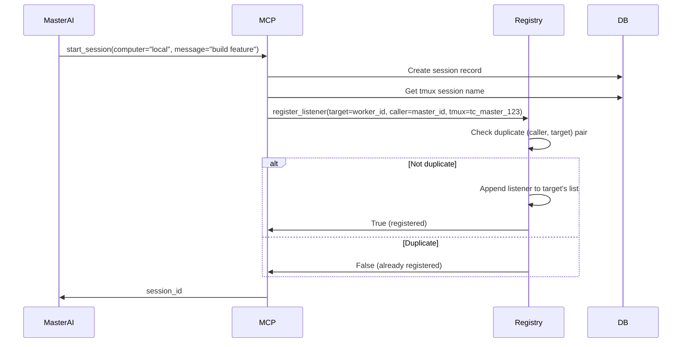
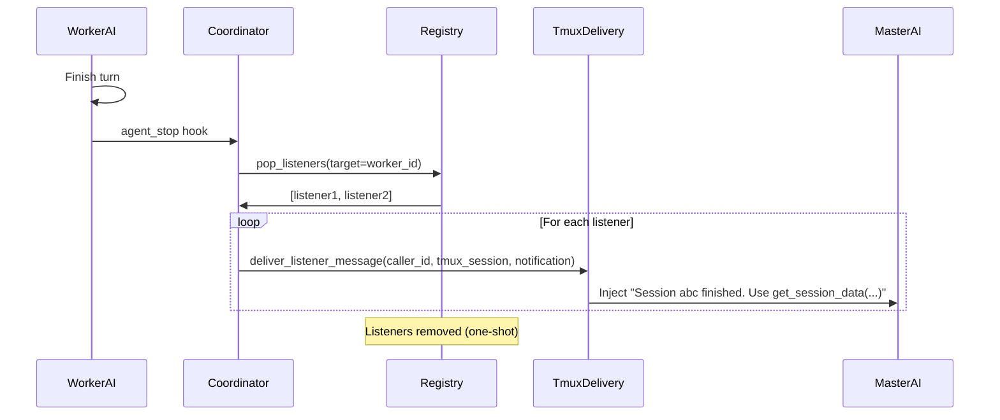
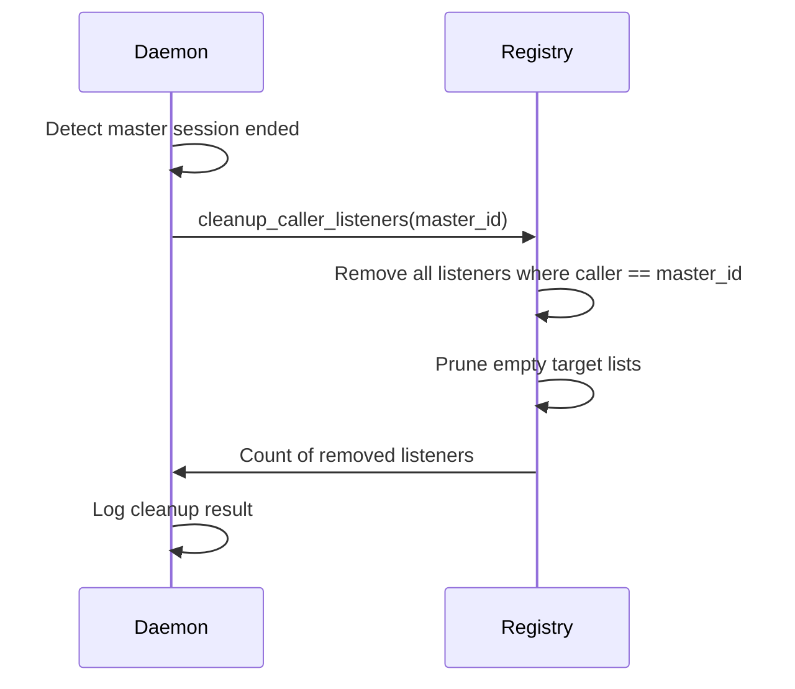
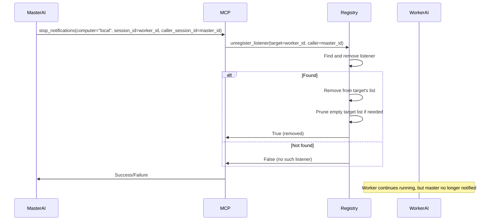
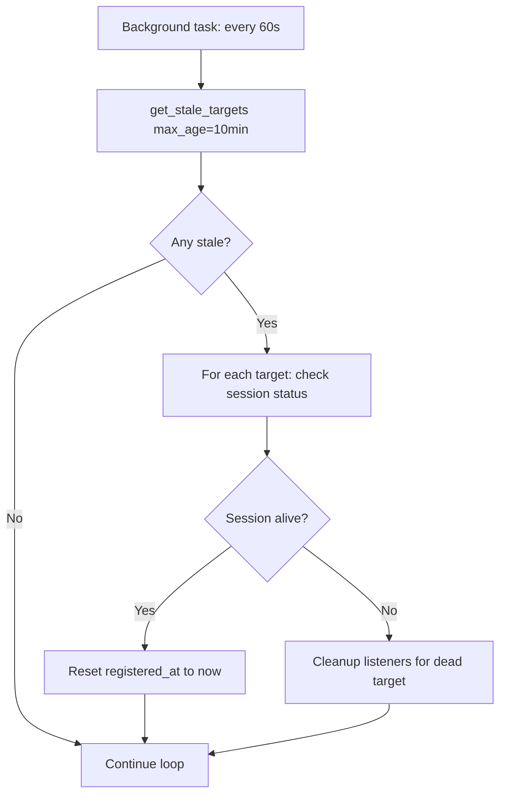

# Session Listeners — Design

## Purpose

Allow AI sessions to wait on other sessions and receive stop notifications.

- Callers register a one-shot listener per target session.
- Stop events pop listeners and inject a notification into caller tmux sessions.
- Listeners are cleaned up when callers end or unsubscribe.
- Only one listener per caller-target pair.
- Listeners are in-memory and not persisted across daemon restarts.
- Daemon restarts drop listeners; callers must re-register.

## Inputs/Outputs

**Inputs:**

- Listener registration requests from MCP tools (start_session, send_message, run_agent_command)
- Session stop events from agent_coordinator
- Session input_request events from agent parsers
- Unsubscribe requests via stop_notifications MCP tool
- Cleanup triggers when caller sessions end

**Outputs:**

- In-memory listener registry (target_session_id → list of listeners)
- Injected notification messages to caller tmux sessions
- Listener removal confirmations
- Health check alerts for stale listeners (>10min old)

## Invariants

- **One-Shot Delivery**: Listeners fire once on stop event, then auto-removed.
- **In-Memory Only**: Listeners not persisted; daemon restart drops all registrations.
- **Deduplication by Caller**: Only one listener per (caller, target) pair; duplicates ignored.
- **Multiple Callers Allowed**: Many callers can listen to same target (e.g., 4 AIs waiting for a dependency).
- **Caller Cleanup**: All listeners registered by a caller are removed when caller session ends.

## Primary flows

### 1. Listener Registration Flow



### 2. Stop Event Notification



### 3. Caller Session Cleanup



### 4. Listener Registry Data Structure

```python
# In-memory storage
_listeners: dict[str, list[SessionListener]] = {
    "worker-session-123": [
        SessionListener(
            target_session_id="worker-session-123",
            caller_session_id="master-session-456",
            caller_tmux_session="tc_master_456",
            registered_at=datetime(2025, 1, 25, 10, 30)
        ),
        SessionListener(
            target_session_id="worker-session-123",
            caller_session_id="master-session-789",
            caller_tmux_session="tc_master_789",
            registered_at=datetime(2025, 1, 25, 10, 31)
        )
    ]
}
```

### 5. Notification Message Templates

| Event Type    | Message Format                                                                                                                |
| ------------- | ----------------------------------------------------------------------------------------------------------------------------- |
| Stop          | `Session {id} on {computer} "{title}" finished its turn. Use teleclaude__get_session_data(computer='{c}', session_id='{id}')` |
| Input Request | `Session {id} on {computer} needs input: {message} Use teleclaude__send_message(computer='{c}', session_id='{id}', ...)`      |

### 6. Unsubscribe Flow (stop_notifications)



### 7. Stale Listener Health Check



## Failure modes

- **Daemon Restart**: All listeners lost. Callers must re-register. No automatic recovery.
- **Caller Session Crash**: Cleanup hook may not fire. Listeners remain until stale health check (10min) or daemon restart.
- **Target Never Stops**: Listener waits indefinitely. Stale check logs warning after 10min but keeps listener active.
- **Notification Injection Fails**: Tmux session not found or unresponsive. Logged but listener removed (one-shot semantics preserved).
- **Duplicate Registration**: Silently ignored. Caller receives False but no error. Prevents listener leaks.
- **Concurrent Pop**: Two events fire for same target. First pop succeeds, second returns empty list. No crash.
- **Memory Growth**: Listeners accumulate if callers don't clean up. Bounded by active session count \* max dependencies.
- **Race on Cleanup**: Caller ends while target fires stop event simultaneously. Both operations succeed; no corruption.
