# Ui Adapter — Design

## Required reads

- @docs/project/policy/ux-message-cleanup.md

## Purpose

Responsibilities

- Normalize user commands and messages into daemon events.
- Render session output and feedback according to UX cleanup rules.
- Manage topics or channels for per-session organization.
- Preserve session affinity (route feedback back to the last input origin).

Boundaries

- No cross-computer orchestration responsibilities.
- No domain policy decisions; UI is translation and presentation only.

Invariants

- UI adapters do not mutate core state directly.
- Cleanup rules are enforced consistently for each session.

## Inputs/Outputs

**Inputs:**

- User commands (text, slash commands, button clicks)
- Voice messages (audio files requiring transcription)
- File uploads (documents, images, media)
- Domain events from EventBus (SESSION_UPDATED, TURN_COMPLETE, MESSAGE_SENT)
- Command results from CommandService

**Outputs:**

- Formatted UI messages (output, feedback, notices)
- Output message edits (in-place updates for streaming content)
- Channel/topic title updates with status emoji
- Message deletions per UX cleanup rules
- Platform-specific UI elements (buttons, inline keyboards, formatted text)

## Invariants

- **Read-Only Core State**: UI adapters never mutate session, database, or domain state directly; all writes via commands.
- **Platform-Agnostic Commands**: User actions normalized to command objects (CreateSessionCommand, SendMessageCommand); platform details in metadata only.
- **Consistent Cleanup Rules**: pending_deletions enforced uniformly across all UI adapters; trigger conditions identical.
- **Single Output Message**: One persistent output message per session, edited repeatedly; message_id tracked in adapter_metadata namespace.
- **Session Affinity**: Feedback routed to last_input_origin; user sees responses in the adapter they sent from.
- **Origin Semantics**: last_input_origin uses InputOrigin values (telegram, redis, api, hook, mcp). Non-UI origins (api/hook/mcp) are treated as originless and broadcast to all UI adapters.

## Primary flows

### 1. Adapter Registration & Event Subscription

### 2. Output Message Lifecycle

### 3. User Input Normalization

### 4. UX Cleanup Rule Enforcement

### 5. Output Rendering Flow

### 6. Session Title Synchronization

### 7. Voice Message Processing

| Step | Actor     | Action                                  |
| ---- | --------- | --------------------------------------- |
| 1    | User      | Sends voice message                     |
| 2    | Platform  | Downloads audio file to /tmp            |
| 3    | UiAdapter | Sends "🎤 Transcribing..." notice       |
| 4    | TTS       | Transcribes audio via Whisper API       |
| 5    | UiAdapter | Sends transcribed text to session       |
| 6    | UiAdapter | Sends "🎤 Sent: {text}" feedback        |
| 7    | UiAdapter | Deletes voice message per cleanup rules |

### 8. File Upload Flow

```mermaid
sequenceDiagram
    participant User
    participant Platform
    participant UiAdapter
    participant TmpFS
    participant AI

    User->>Platform: Upload document
    Platform->>UiAdapter: File update event
    UiAdapter->>Platform: Download file
    Platform->>TmpFS: Save to /tmp/{session_id}/{filename}
    UiAdapter->>AI: Send message with file_path
    UiAdapter->>User: "📎 Sent file: {filename}"
```

## Failure modes

- **Output Message Deleted by User**: Next edit fails. Adapter logs error, clears stale message_id, sends new message on next update.
- **Platform API Timeout**: Edit or send times out. Logged; polling retries next cycle. Output may be stale for 200ms.
- **Rate Limit Exceeded**: Platform rejects edit due to frequency. Adapter skips edit, accumulates diff, retries next cycle.
- **Session Channel Not Found**: Platform returns 404 on edit. Adapter clears metadata, recreates channel on next event.
- **Unauthorized User**: Message from non-whitelisted user. Silently ignored; no command execution or feedback.
- **Cleanup Message Already Deleted**: pending_deletions references deleted message. Delete fails gracefully; row cleared.
- **Feedback Routing Failure**: last_input_origin adapter offline. Feedback not delivered; logged. User sees nothing.
- **Voice Transcription Failure**: TTS API down or audio format unsupported. User sees error notice; voice message not deleted.
- **File Download Failure**: Platform API error during download. User sees error feedback; no file sent to AI.
- **Multiple Adapters Active**: User sends from Telegram, expects response in WhatsApp. Feedback routed to Telegram (last_input_origin). Expected behavior.
